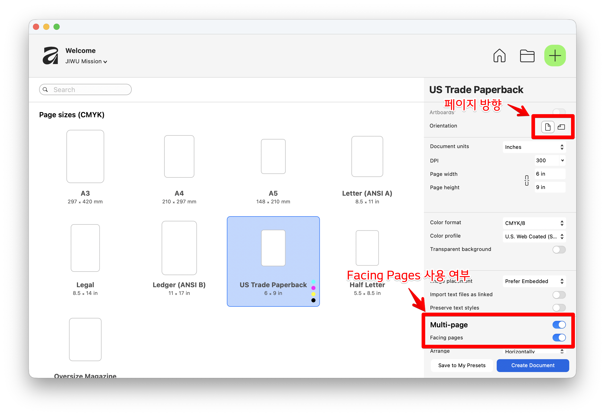
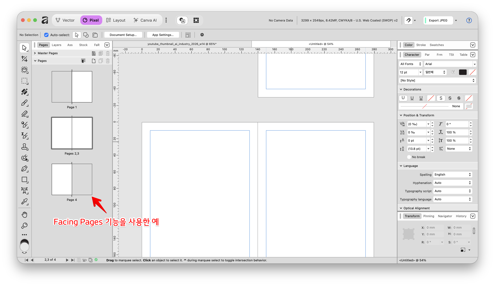
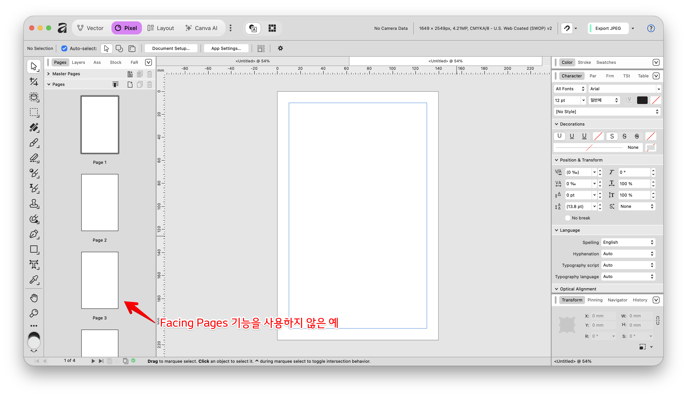

Affinity Studio v3의 레이아웃 스튜디오(Layout Studio)에서 책이나 교회 주보를 제작할 때, 'Facing Pages(마주보기 페이지/스프레드)' 기능의 사용 여부와 출력 환경에 따른 장단점을 비교해 드립니다. 특히 가정용 프린터를 사용할 경우 '소책자(Booklet)' 기능 유무에 따라 접근법을 달리 해야 합니다.

---

### 1. 디자인 작업 단계에서의 장단점

**Facing Pages (마주보기 페이지) 사용 시**

- **장점:** 
  - 실제 책이나 주보가 인쇄되어 반으로 접혔을 때 독자가 보게 될 **'펼친 면'을 화면에서 그대로 보면서 작업**할 수 있습니다. 
  - 양쪽 페이지에 걸쳐 이어지는 디자인이나 이미지 배치를 할 때 매우 직관적이며, 책자 및 잡지 레이아웃의 표준적인 방식입니다.
  - 왼쪽과 오른쪽의 머릿말이나 페이지 넘버의 위치를 별도로 사용할 수 있습니다.
- **단점:** 
  - 문서의 첫 페이지(표지)와 마지막 페이지(뒷면)가 단독으로 떨어져 있고, 내지만 마주 보게 되므로 초보자에게는 전체 페이지 구조가 다소 헷갈릴 수 있습니다.
  - 좁은 모니터에서는 페이지를 이동하며 편집할 때 좌우스크롤을 하면서 확인해야 해서 불편할 수 있습니다. 

**Facing Pages 미사용 (단일 페이지) 시**

- **장점:** 
  - 각 페이지가 독립적으로 존재하여 문서 구조가 직관적이고 단순해지므로 **초보자에게 유리**합니다.
  - 상하스크롤만으로 페이지간 이동이 가능합니다. 작은 모니터에서 편집 시 유리합니다.
- **단점:** 
  - 출력 후 펼쳤을 때 좌우 페이지의 디자인 조화나 균형을 작업 화면에서 한눈에 파악하기 어렵습니다.
  - 디자인 레이아웃이 단순해질 수 있습니다.

---

### 2. 인쇄소에서 전문 인쇄 작업을 할 때

- **권장 워크플로:** **디자인은 Facing Pages로, 출력은 단일 페이지(Single Pages)로**
- **이유:** 인쇄소는 자체적인 하리꼬미(Imposition, 터잡기) 소프트웨어를 사용하여 커다란 전지에 페이지를 자동으로 배열합니다. 작업자가 임의로 두 페이지를 하나로 붙여서(Spread) 보내면 인쇄소의 작업 공정과 충돌할 수 있으므로, 각 페이지가 1장씩 분리된 **PDF(Press Ready)** 형식으로 내보내야 합니다. (단, 재단 여백을 위한 Bleed(도련)는 반드시 포함해야 합니다).

---

### 3. 가정용 프린터로 작업할 때 (Booklet 기능 중심)

가정용 프린터로 주보를 출력하여 반으로 접어 사용할 경우, 프린터가 **소책자(Booklet)** 인쇄를 지원하는지에 따라 작업 방식이 크게 달라집니다.

### 🔍 내 프린터에 '소책자(Booklet)' 기능이 있는지 확인하는 방법

1. 인쇄 메뉴(`Ctrl/Cmd + P` 또는 `File > Print`)를 엽니다.
2. **'프린터 속성(Properties)'** 또는 **'설정(Preferences)'** 버튼을 클릭하여 프린터 드라이버 창으로 진입합니다.
3. '페이지 레이아웃(Page Layout)', '마무리(Finishing)', 또는 '양면 인쇄(Duplex/Two-sided)' 탭을 살펴봅니다.
4. 해당 메뉴 안에 **'소책자 인쇄(Booklet)'** 또는 **'책자 만들기'** 옵션이 있다면 이 기능을 지원하는 프린터입니다.

### 🖨️ 케이스 A: 소책자(Booklet) 기능이 **있는** 프린터일 경우

- **작업 방식:** Affinity에서 **Facing Pages를 켜고** 일반적인 책처럼 1, 2, 3, 4 페이지 순서대로 자연스럽게 디자인합니다.
- **장점:** 디자인 화면과 실제 결과물이 일치하여 시각적으로 작업하기 편합니다. 인쇄 시 소책자 옵션만 체크하면, 프린터 드라이버가 자동으로 표지(4-1쪽)와 내지(2-3쪽) 순서를 계산하여 양면으로 알맞게 찍어줍니다.
- **단점:** 기기 모델이나 용지 급지 방식에 따라 앞뒷면의 핀트(위치)나 여백이 미세하게 어긋날 수 있으며, 프린터 드라이버 설정이 익숙하지 않으면 출력 시 오류를 겪을 수 있습니다.

### 🖨️ 케이스 B: 소책자(Booklet) 기능이 **없거나**, 수동으로 통제하고 싶을 경우 (초보자 권장)

- **작업 방식:** **Facing Pages 옵션을 끄고**, A4나 Letter 사이즈 용지를 가로(Landscape)로 눕힌 단일 페이지를 생성합니다. 이후 가이드 매니저(Guides Manager)를 사용해 **용지 한 장을 2단(Columns)으로 나누어 직접 스프레드를 디자인**합니다.
  - *첫 번째 페이지 (겉면):* 왼쪽 단에 뒷면(4면), 오른쪽 단에 표지(1면) 배치
  - *두 번째 페이지 (안쪽 면):* 왼쪽 단에 내지 좌측(2면), 오른쪽 단에 내지 우측(3면) 배치
- **장점:** 프린터의 고급 기능에 의존할 필요가 없습니다. 일반적인 수동 양면 인쇄만으로도 앞뒤가 완벽하게 맞아떨어지는 주보를 아주 쉽고 직관적으로 인쇄할 수 있습니다.
- **단점:** 머릿속으로 접혔을 때의 페이지 순서를 미리 계산해서 텍스트와 이미지를 배치해야 하는 번거로움이 있습니다.

---

### 💡 최종 요약

**전문 인쇄소**에 맡긴다면 시각적 완성도를 위해 **Facing Pages를 켜고 작업**하는 것이 좋습니다. 반면, **가정용 프린터**로 직접 출력해야 한다면 프린터의 '소책자' 기능 유무를 먼저 확인하세요. 기능이 없다면 **Facing Pages를 끄고 가로 용지를 2단으로 나누어 직관적으로 작업하는 방식**이 인쇄 실패를 줄이는 가장 확실한 워크플로입니다.
