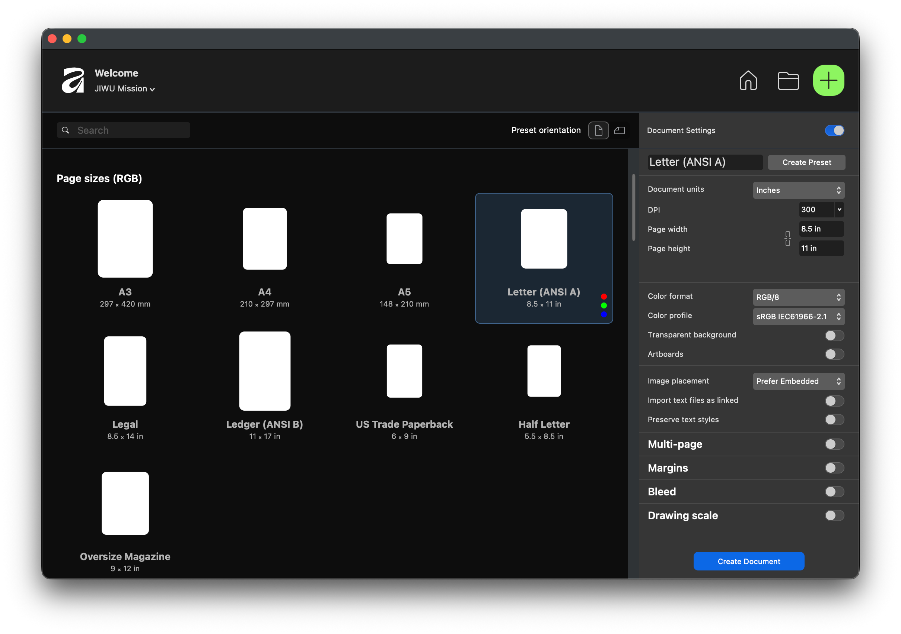

# Affinity Studio v3 by Canva - 새 문서 만들기 설정 완벽 가이드

Affinity Studio에서 새 프로젝트를 시작할 때 가장 먼저 마주하게 되는 것이 바로 '새 문서 만들기' 대화상자입니다. 이 설정들을 제대로 이해하고 활용하면 작업의 효율성을 크게 높일 수 있습니다. 오늘은 각 설정 옵션에 대해 자세히 알아보겠습니다.

## 📄 문서 유형 (Document Type)

Affinity Studio는 세 가지 주요 문서 유형을 제공합니다:

- **New Document (일반 문서):** 가장 기본적인 문서 유형으로, 일러스트레이션, 그래픽 디자인 등 다양한 용도로 사용됩니다.
- **New Web Document (웹 문서):** 웹 디자인에 최적화된 문서로, 픽셀 단위와 RGB 컬러 모드가 기본 설정됩니다.
- **New Print Project (인쇄 프로젝트):** 인쇄물 제작을 위한 문서로, CMYK 컬러 모드와 블리드 설정이 포함됩니다.

## 📐 페이지 크기 (Page Size)

용도에 맞는 적절한 페이지 크기를 선택하는 것이 중요합니다:

- **프리셋 크기:** A4, A3, Letter, Legal 등 표준 용지 규격이 미리 설정되어 있습니다.
  - **주의:** 미국 표준 용지는 보통 **Letter**(8.5×11 in), 한국/국제 표준은 **A4**(210×297 mm)입니다.
  - 두 규격은 **크기가 서로 다르므로**, 인쇄/출력 목적이라면 국가(또는 인쇄소) 기준에 맞춰 프리셋을 선택하세요.
- **사용자 정의 크기:** 특정 크기가 필요한 경우 폭과 높이를 직접 입력할 수 있습니다.
- **방향:** 세로(Portrait) 또는 가로(Landscape) 방향을 선택할 수 있습니다.

팁: 소셜 미디어 콘텐츠를 제작한다면 Instagram Post (1080x1080px), Facebook Cover (1200x630px) 등의 프리셋을 활용하세요.

## 🎨 컬러 모드 (Color Format)

작업의 최종 출력 매체에 따라 적절한 컬러 모드를 선택해야 합니다:

- **RGB (Red, Green, Blue):** 디지털 디스플레이용으로 적합합니다. 웹사이트, 앱, 디지털 광고 등에 사용하세요.
- **CMYK (Cyan, Magenta, Yellow, Black):** 인쇄물 제작 시 필수입니다. 명함, 포스터, 브로셔 등 물리적 출력물에 사용하세요.
- **Grayscale:** 흑백 인쇄물이나 단색 디자인에 적합합니다.

**중요:** 컬러 모드는 나중에 변경할 수 있지만, 초기 설정이 올바르면 색상 관리가 훨씬 수월합니다.

## 📏 단위 (Units)

작업 환경에 맞는 측정 단위를 선택하세요:

- **픽셀 (px):** 디지털 디자인, 웹 디자인, UI/UX 작업에 가장 적합합니다.
- **밀리미터 (mm) / 센티미터 (cm):** 인쇄물 디자인에 주로 사용되며, 국제 표준입니다.
- **인치 (in):** 미국 표준으로, 일부 인쇄 작업에서 선호됩니다.
- **포인트 (pt):** 타이포그래피와 편집 디자인에서 주로 사용됩니다.

## 📄 페이지 설정 (Page Setup)

### 페이지 수 (Number of Pages)

다중 페이지 문서를 만들 수 있습니다:

- 브로셔나 카탈로그처럼 여러 페이지가 필요한 프로젝트의 경우 초기 페이지 수를 설정할 수 있습니다.
- 나중에 언제든지 페이지를 추가하거나 삭제할 수 있으니 걱정하지 마세요.

### 멀티 페이지 (Multi-Page)

멀티 페이지 문서를 만들 때 필요한 핵심 옵션들입니다.

- **Facing Pages:** 책이나 잡지처럼 마주보는 페이지(스프레드) 형태로 구성합니다.
  - **체크하지 않음:** 각 페이지가 독립적으로 표시됩니다.
  - **체크함:** 좌우가 짝을 이루는 펼침(스프레드) 구조로 표시됩니다.
- **페이지 수 (Number of Pages):** 문서의 초기 페이지 수를 설정합니다.
  - 브로셔, 카탈로그처럼 여러 페이지가 필요한 경우에 유용합니다.
  - 나중에 언제든지 페이지를 추가하거나 삭제할 수 있습니다.
- **마스터 페이지 (Master Page):** 반복되는 요소(페이지 번호, 머리말/꼬리말, 공통 그리드 등)를 공통 템플릿처럼 관리합니다.
  - 전체 페이지에 일관된 레이아웃을 적용할 때 유용합니다.

## 🖼️ 아트보드 (Artboards)

아트보드는 하나의 문서 내에서 여러 디자인을 독립적으로 관리할 수 있게 해줍니다:

- **Create Artboard:** 이 옵션을 활성화하면 캔버스에 아트보드가 생성됩니다.
- **사용 예시:** 여러 버전의 로고, 다양한 크기의 소셜 미디어 포스트, 앱의 여러 화면 등을 하나의 문서에서 관리할 수 있습니다.
- **아트보드 개수:** 필요한 만큼 아트보드를 추가할 수 있습니다.

## 📐 마진 (Margins)

마진은 페이지의 가장자리에서 내용이 시작되는 지점까지의 거리입니다:

- **용도:** 텍스트나 중요한 요소가 페이지 가장자리에 너무 가까이 배치되는 것을 방지합니다.
- **설정 방법:** 상단, 하단, 좌측, 우측 마진을 각각 설정할 수 있습니다.
- **권장 사항:** 인쇄물의 경우 최소 10mm 이상의 마진을 권장합니다.
- **가이드 표시:** 마진은 작업 중 가이드 라인으로 표시되며, 실제 출력물에는 나타나지 않습니다.

## ✂️ 블리드 (Bleed)

블리드는 인쇄물 제작 시 매우 중요한 설정입니다. 하지만 프린터로 출력할 경우에는 신경쓸 필요가 없습니다.

### 블리드란?

재단선 바깥쪽으로 확장되는 디자인 영역으로, 인쇄 후 재단 과정에서 발생할 수 있는 오차를 방지합니다.

### 블리드 설정 방법

- **표준 블리드:** 일반적으로 3mm를 사용합니다.
- **대형 인쇄물:** 포스터나 배너의 경우 5mm 이상을 권장합니다.
- **디지털 전용:** 웹이나 화면용 디자인에는 블리드가 필요하지 않습니다.

### 블리드 작업 팁

- 배경 이미지나 색상을 블리드 영역까지 확장하세요.
- 중요한 텍스트나 로고는 재단선 안쪽 안전 영역에 배치하세요.
- 블리드 영역은 빨간색 가이드 라인으로 표시됩니다.

## 🔧 DPI / 해상도 (Resolution)

해상도는 이미지의 선명도를 결정합니다:

- **72 DPI:** 웹 및 화면 표시용으로 적합합니다. 파일 크기가 작아 로딩이 빠릅니다.
- **150 DPI:** 간단한 인쇄물이나 대형 포스터에 사용됩니다.
- **300 DPI:** 고품질 인쇄물의 표준입니다. 명함, 브로셔, 잡지 등에 필수입니다.
- **600 DPI 이상:** 미세한 디테일이 필요한 전문 인쇄물에 사용됩니다.

**주의:** 해상도가 높을수록 파일 크기가 커지므로, 용도에 맞는 적절한 해상도를 선택하세요.

## 💾 투명 배경 (Transparent Background)

문서의 배경 처리 방식을 결정합니다:

- **체크하지 않음:** 흰색 배경이 기본으로 설정됩니다.
- **체크함:** 투명한 배경으로 시작합니다. 로고, 아이콘, PNG 이미지 제작 시 유용합니다.

## 📋 프리셋 저장 (Save as Preset)

자주 사용하는 설정 조합을 프리셋으로 저장하세요:

- 동일한 설정을 반복적으로 사용할 때 시간을 절약할 수 있습니다.
- 예: "Instagram Post", "명함 인쇄용", "웹 배너" 등의 이름으로 저장하세요.
- 저장된 프리셋은 다음에 새 문서를 만들 때 빠르게 불러올 수 있습니다.

## ✅ 실전 활용 예시

### 📱 소셜 미디어 포스트

- 크기: 1080 x 1080 px (Instagram) 또는 1200 x 630 px (Facebook)
- 컬러: RGB
- 단위: 픽셀
- 해상도: 72 DPI
- 블리드: 불필요

### 🖨️ 명함 디자인

- 크기: 90 x 50 mm (한국 표준) 또는 85 x 55 mm (국제 표준)
- 컬러: CMYK
- 단위: 밀리미터
- 해상도: 300 DPI
- 블리드: 3mm
- 마진: 5mm (안전 영역)

### 🎨 포스터 제작

- 크기: A3 (297 x 420 mm) 또는 사용자 정의
- 컬러: CMYK
- 단위: 밀리미터
- 해상도: 300 DPI
- 블리드: 5mm
- 마진: 10mm

### 💻 웹 디자인

- 크기: 1920 x 1080 px (Full HD) 또는 필요에 따라 조정
- 컬러: RGB
- 단위: 픽셀
- 해상도: 72 DPI
- 아트보드: 활성화 (여러 화면 디자인)

## 🎯 마무리 팁

- **프로젝트 시작 전 확인:** 클라이언트나 인쇄소의 요구사항을 미리 확인하세요.
- **설정 변경:** 대부분의 설정은 작업 중에도 변경 가능하지만, 컬러 모드와 해상도는 초기에 올바르게 설정하는 것이 좋습니다.
- **테스트 인쇄:** 중요한 프로젝트는 소량 테스트 인쇄를 통해 결과를 확인하세요.
- **템플릿 활용:** Affinity Studio는 다양한 템플릿을 제공하므로, 처음 시작할 때 참고하세요.

이제 Affinity Studio v3의 새 문서 설정을 완벽하게 이해하셨을 것입니다. 각 프로젝트의 목적에 맞는 올바른 설정으로 시작하면, 작업 효율이 크게 향상되고 최종 결과물의 품질도 보장됩니다. 다음 강좌에서는 실제 도구 사용법에 대해 알아보겠습니다! 🚀
