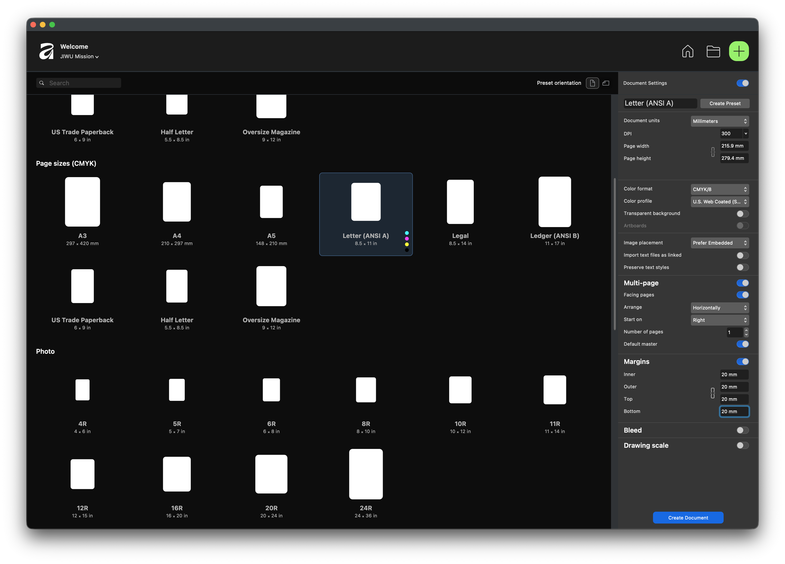
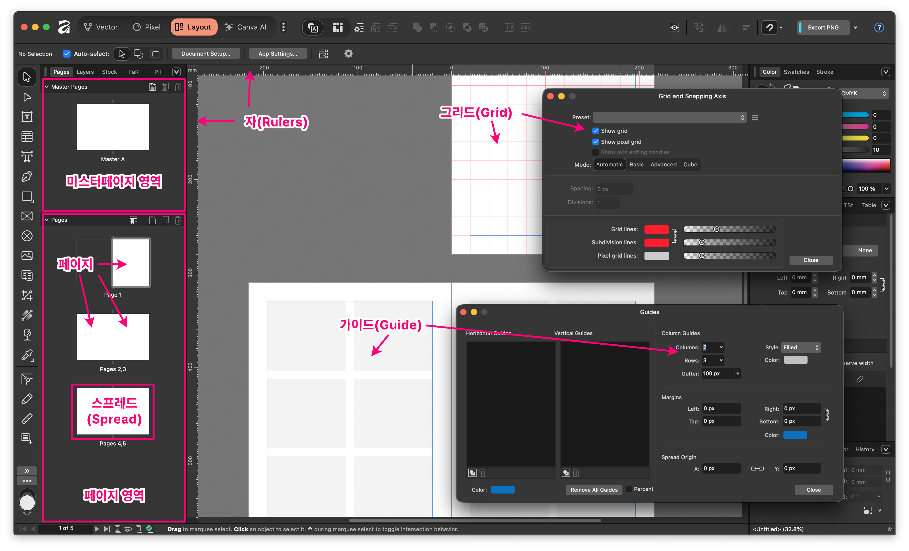
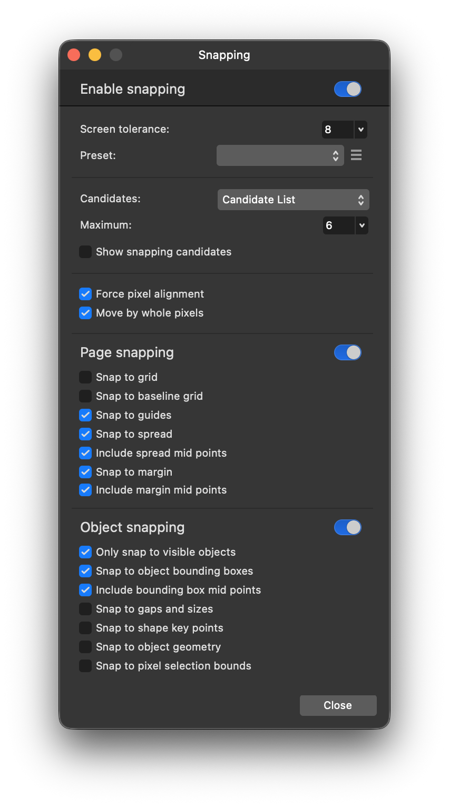
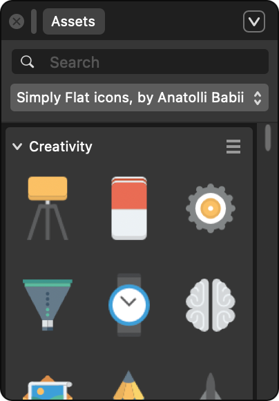
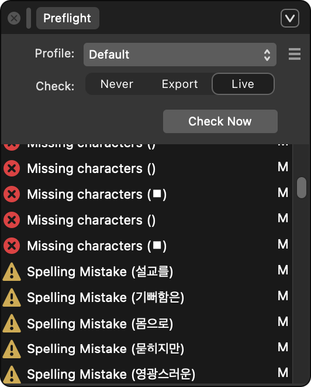
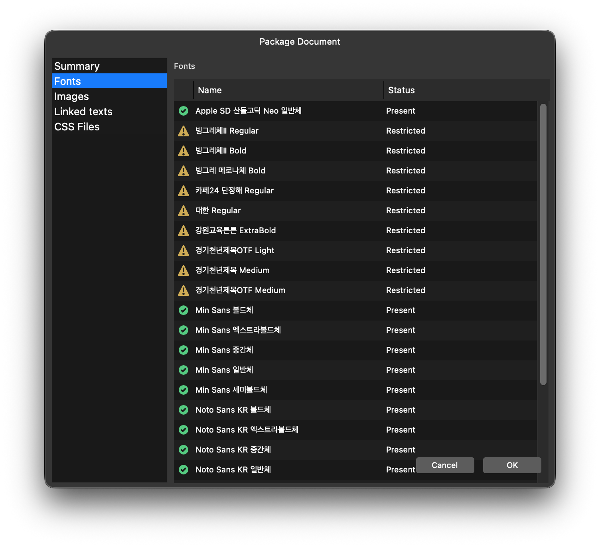

# Affinity by Canva v3: 문서 세팅 및 레이아웃 가이드

성공적인 디자인 프로젝트는 정확한 문서 설정에서 시작됩니다. 본 가이드는 Affinity Publisher를 중심으로 레이아웃 작업을 최적화하는 방법과 도구들을 설명합니다.

## 1. 프로젝트 시작: 문서 초기 설정 (Document Setup)

새 문서를 만들 때(`Ctrl/Cmd + N`) 설정해야 할 핵심 항목들입니다. 이전 문서를 참고하세요.

### ① 페이지 구성 및 면지 (Facing Pages)

- **Facing Pages:** 책이나 잡지처럼 좌우 페이지가 마주 보는 형태를 만들 때 활성화합니다.
- **Start on:** 첫 페이지가 오른쪽(표지)에서 시작할지, 왼쪽에서 시작할지 결정합니다.

### ② 여백(Margins) 및 도련(Bleed)

- **Margins:** 텍스트와 주요 그래픽 요소가 배치될 '안전 구역'입니다. 시각적 안정감을 위해 사방에 적절한 값을 입력합니다.
- **Bleed:** 인쇄물 제작 시 필수적입니다. 종이가 잘려나가는 오차를 대비해 배경색이나 이미지를 문서 경계 밖으로 3~5mm 더 연장하는 영역입니다.

### ③ 컬러 프로필 (Color Space)

- **CMYK:** 인쇄용 목적(잡지, 브로슈어 등).
- **RGB:** 화면용 목적(E-book, 웹 게시용).

## 2. 일관성을 위한 도구: 마스터 페이지 (Master Pages)

수백 페이지의 문서에서도 통일감을 유지해 주는 핵심 기능입니다.

- **용도:** 페이지 번호, 로고, 섹션 제목, 배경 그리드 등 모든 페이지에 반복되는 요소를 배치합니다.
- **사용법:** `Master Pages` 패널에서 마스터를 생성한 뒤, 일반 페이지에 드래그하여 적용합니다.
- **효과:** 마스터 페이지에서 수정한 내용은 해당 마스터가 적용된 모든 페이지에 즉시 반영됩니다.

## 3. 정교한 배치를 돕는 레이아웃 도구

### ① 가이드 및 격자 (Guides & Grids)

- **Rulers (자):** `Ctrl/Cmd + R`로 활성화하며, 자에서 클릭 드래그하여 임의의 가이드라인을 끌어올 수 있습니다.
- **Guides Manager:** 정확한 수치로 가이드를 생성하거나, 단(Column) 가이드를 만들어 다단 레이아웃을 구성할 때 사용합니다.
- **Baseline Grid (기초 선 그리드):** 텍스트의 줄 간격을 일정하게 맞춰주어 페이지 간의 수평 정렬을 완벽하게 유지합니다.

### ② 스내핑 (Snapping)

- 자석 아이콘을 클릭하여 활성화합니다. 개체를 이동할 때 다른 개체의 중앙, 모서리, 가이드라인 등에 딱 붙게 해주어 오차 없는 배치를 가능하게 합니다.

### ③ 에셋 패널 (Assets Panel)

- 반복해서 사용하는 로고, 아이콘, 서명, UI 요소 등을 저장해두고 필요할 때마다 꺼내 쓸 수 있는 보관함입니다.

## 4. 최종 점검 및 내보내기

### ① 프리플라이트 (Preflight)

- 작업 중에 실시간으로 오류를 감지합니다. (예: 저해상도 이미지, 텍스트 넘침, 유실된 폰트 등)
- 인쇄소에 넘기기 전 하단 상태바의 초록/빨간불을 반드시 확인하세요.

### ② 패키지 (Package)

- `File > Package` 기능을 통해 사용된 모든 폰트, 이미지, 문서를 하나의 폴더로 묶어줍니다. 다른 컴퓨터에서 작업하거나 인쇄소에 파일을 전달할 때 필수입니다.

## 5. 실전 레이아웃 팁

1. **시각적 계층 구조:** 중요한 정보일수록 폰트 크기, 굵기, 색상을 통해 눈에 띄게 배치하세요.
2. **여백의 미:** 모든 공간을 채우려 하지 말고, 적절한 여백을 두어 독자의 시선이 편안하게 흐르도록 유도하세요.
3. **그리드 시스템 활용:** 가이드 매니저를 통해 3단 혹은 4단 그리드를 먼저 설정하고 작업을 시작하면 결과물의 완성도가 크게 높아집니다.
