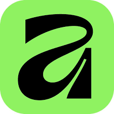

### 캔버스 툴 일람 · 카테고리별 상세 사용법(스크린샷 기준)

- 표기 규칙: [단축키] · 핵심 기능 → 실무 팁 순. 맥 기준 표기입니다.(Win은 Ctrl=Cmd, Alt=Option)

### General

- View Tool [H] · 캔버스 패닝 → Space 누른 채 드래그로 임시 사용. 확대 상태 점검에 필수.
- Zoom Tool [Z] · 클릭 확대, Alt=축소 → 마우스휠+Cmd로 연속 줌. Cmd+1=실제 픽셀.
- Color Picker [I] · 화면 색 샘플 → Alt 클릭 즉시 전경/배경에 적용. 샘플 크기 변경.
- Move Tool [V] · 선택/이동/스케일/회전 → Shift 축 고정, Alt 중심 기준, Enter로 수치 입력.
- Style Picker · 선택 객체의 선/면/효과 복사 → 여러 객체에 드래그 도포하면 일괄 적용.
- View Options · 격자/가이드/스냅 제어 → 상단 자석 아이콘에서 세부 스냅 개별 on/off.

### Vector

- Pen [P] · 베지어 경로 작성 → 클릭 직선, 드래그 곡선. Alt로 한쪽 핸들. 시작점 재클릭 폐합.
- Pencil [N] · 자유곡선 스케치 → Stabilizer로 떨림 보정. 기존 경로 이어 그리기.
- Node [A] · 노드/핸들 편집 → 스마트/샤프/스무스 전환, Join/Break로 경로 수정.
- Corner [C] · 코너 가공(Round/Chamfer/Cat) → 드래그 반경, 상단에서 타입·반경 잠금.
- Shape Tools(M/U) · 사각/원/다각형/스타 → Shift 정비율, Alt 중심, 속성에서 코너·변 수.
- Shape Builder [W] · 겹친 도형 합치기/빼기/교차 → 드래그로 결합, Alt 드래그 제거.
- Contour [O] · 평행 오프셋(외곽 두께) → Join/Cap/Miter 제어. 커팅/인쇄 전 Expand 권장.
- Path Brush [B] · 스트로크에 브러시 프로파일 → 브러시 편집기로 끝·압력 커브 조정.
- Stroke Width Tool · 가변폭 핀 추가 → 레터링 획 리듬. 핀 더블클릭 삭제.
- Fill(Gradient) [G] · 선형/원형/타원/원추 → 캔버스 핸들에서 스톱 추가·색상·불투명도 조절.
- Transparency [Y] · 투명 그라데이션 → 검정=투명, 흰색=불투명. 블렌드 모드 병행.
- Color/Style Set · Set Fill/Stroke/X,/ → X 전경/배경 전환, /=채우기 제거.
- Knife [K] · 경로 절단·분할 → 닫힌 도형 파츠 제작, 직선/자유형 컷.
- Vector Flood Fill [G 그룹] · 닫힌 영역 면 생성 → Gap tolerance로 미세 틈 무시.
- Measure/Area · 거리·각/면적 계산 → 출력물 규격 점검.

### Text

- Artistic Text [T] · 제목/한 줄 텍스트 → 경로 따라 흐르게 가능. 글자 수치는 Character 패널.
- Frame Text [T 그룹] · 본문 상자 텍스트 → 프레임 링크로 흘림. 컬럼/거터/인세트 설정.
- Text on a Path · 경로에 텍스트 배치 → 시작/끝 핸들로 위치 조절, 정렬/오프셋 설정.

### Shape(도형/크롭)

- Rectangle/Ellipse/Polygon/Star · 기본 도형 → 속성 패널에서 코너/변/내각 수치 조정.
- Vector Crop · 비파괴 크롭 → 프레임/벡터 표시 영역만 잘라내기. 마스크보다 빠름.

### Photo(픽셀 보정)

- Paint Brush [B] · 일반 페인팅 → [, ] 크기. Alt=스포이드. 새 빈 레이어 권장.
- Paint Mixer · 색을 섞어 바름 → Load/Wet로 물감·번짐 제어. 피부 블렌딩 자연스러움.
- Color Replacement [R] · 색만 교체 → Fuzziness, Sampling(연속/고정) 조절.
- Flood Fill [G] · 동일 색 영역 채우기 → Tolerance, Contiguous로 범위 제어.
- Clone [S] · 소스 Alt 클릭 → 대상 복제. Aligned/Current & Below.
- Inpainting/Healing/Patch/Blemish [J] · 결점·객체 제거 → 크기는 주변 텍스처 기준으로.
- Selection Brush/Flood Select [W] · 칠해서/색으로 선택 → Refine로 머리카락 엣지 보정.
- Marquee/Lasso [M/L] · 기본 선택 → Feather/Anti-alias, Add/Subtract 단축 숙지.
- Object Selection · AI 객체 선택 → 초기 마스크 생성에 최적.
- Blur/Sharpen/Median/Smudge · 국부 블러/선명/노이즈/믹스 → 과용 주의, Flow 낮게.
- Dodge/Burn/Sponge [O] · 밝게/어둡게/채도 → 5–10%로 빌드업. 50% 회색 레이어 비파괴.
- Perspective/Mesh Warp · 원근/격자 왜곡 → 라이브 필터 사용 시 수정 가능.
- Crop [C] · 캔버스/레이어 크롭 → Rule of Thirds·Golden Ratio 가이드.

### Painting(페인팅 추가)

- Brush Studio · 브러시 엔진 커스텀 → Spacing/Jitter/Dynamics, 압력 커브 저장.
- Nozzle/Texture · 패턴·텍스처 브러시 → 그레인/스케터로 질감 강화.

### Effects(효과)

- Gaussian/Depth of Field/Bokeh/Glow 등 라이브 필터 → 레이어로 추가하여 비파괴. 마스크로 국부 적용.
- Noise/Sharpen/Denoise · 품질 향상 → 고주파·저주파 분리 보정과 병행.
- Vignette/Zoom Blur · 시선 유도 → 중심/강도 수치 미세 조정.

### Export(내보내기)

- Export Persona/Export Slices · 포맷별 아트보드·슬라이스 추출 → 파일명 규칙, @2x 등 배율 프리셋.
- PDF/PNG/SVG 설정 · 색상 프로필/압축/텍스트 아웃라인화 여부 점검.

### Canvas AI

- Text to Image · 프롬프트로 생성 → 스타일·비율·Seed 고정. 네거티브 프롬프트 병행.
- Image to Image · 원본 구도 유지/변형 → Strength로 충실도 조절.
- Inpainting/Outpainting · 부분 재생성/확장 → 마스크 경계 Refine.
- AI Enhance/Upscale/Background Removal/Style Transfer → 품질 향상·배경 제거·스타일화.
- AI Selection Brush/Smart Lasso/Mask Refiner · 선택·마스크 정제.
- Batch Generate/Action Recorder · 대량 생성·반복 자동화.

---

> 💡 응용: 스크린샷의 버튼 순서를 그대로 따랐습니다. 각 항목은 1줄 요약이므로, 필요 시 세부 예제와 단축키 표를 각 카테고리 아래에 확장해 드릴 수 있습니다.

### Vector Studio Tools 사용법

- 참고: 대괄호 안은 기본 단축키. 옵션은 맥 기준(Windows는 Ctrl=Cmd, Alt=Option 동등)입니다.

### 1) 선택·이동

- Move Tool [V]
  - 객체/아트보드 선택·이동·스케일·회전. 드래그 핸들로 변형.
  - Shift: 축 고정. Alt: 중심 기준. Enter 또는 상단 Transform 패널에서 수치 입력.
  - 더블 클릭으로 그룹 내부(격리 모드) 진입.
- Node Tool [A]
  - 경로 노드와 베지어 핸들 편집. 직선↔곡선 전환, 노드 타입(스마트/샤프/스무스) 변경.
  - 드래그 박스로 다중 노드 선택 → 상단 Convert/Join/Break 등 명령 사용.
  - Pen으로 닫힌 뒤 A로 미세 수정하는 흐름이 일반적.
- Point Transform Tool [F]
  - 임의 피벗 포인트를 찍고 해당 점 기준 스케일·회전·기울이기.
  - 글자 일부 왜곡, 라벨 원근 맞추기에 유용. Shift로 각도 스냅.

### 2) 그리기·모양

- Pen Tool [P]
  - 클릭=직선 세그먼트. 드래그=곡선. 시작점 재클릭=폐합.
  - Alt 드래그: 한쪽 핸들만 조정해 코너 생성. Cmd(Ctrl)로 임시 Move/Node 전환.
- Pencil Tool [N]
  - 자유곡선 스케치. Stabilizer로 흔들림 보정. Edit mode로 기존 경로 이어 그리기.
- 기본 도형 툴(M, U 그룹)
  - 사각/원/다각형/스타 등. Shift=정비율. Alt=중심 기준. 도형 속성 패널에서 코너 라운드, 변 수, 내각 조절.
- Corner Tool [C]
  - 선택 노드의 코너를 라운드/챔퍼/캣 등으로 가공. 드래그로 반경 조절, 상단에서 타입 변경.
- Shape Builder Tool [W]
  - 겹친 도형을 드래그로 합치기(Add)·빼기(Subtract)·교차(Intersect).
  - Alt 드래그=제거. 아이콘 합성에 빠름.
- Contour Tool [O]
  - 경로 안팎으로 평행 오프셋을 만들어 외곽선 두께를 부여. Join/Cap/Miter로 모서리 제어.
- Path Brush Tool [B]
  - 스트로크에 브러시 프로파일 적용(거친 질감·칼리 등). 브러시 편집기로 모양 수정.
- Stroke Width Tool
  - 경로 지점별 가변 폭 핀 추가. 선화·레터링에서 얇→굵 리듬 생성.

### 3) 채우기·투명·스타일

- Fill Tool(Gradient) [G]
  - 선형/원형/타원/원추 그라데이션. 캔버스 핸들에서 색 스톱 추가·삭제. 노이즈, 반복 옵션 지원.
- Transparency Tool [Y]
  - 객체 투명도 그라데이션. 검정=투명, 흰색=불투명 개념. 블렌드 모드와 병행.
- Color Picker Tool [I]
  - 캔버스 색 샘플. Alt 누른 채 클릭하면 즉시 채우기/선에 적용. 샘플 크기 1x/3x/5x 선택.
- Style Picker Tool
  - 선택한 객체의 선/채우기/효과/그라데이션을 다른 객체에 복사.
- Set Fill / Set Stroke / Set Fill None [/]
  - 좌하단 스와치 제어. X로 전경/배경 스와치 교환. /로 채우기 제거.

### 4) 텍스트·이미지

- Artistic Text Tool [T]
  - 한 줄·타이틀용. 드래그로 크기 지정. 경로에 붙여 곡선을 따라 흐르게 가능.
- Frame Text Tool [T 그룹]
  - 본문 상자 텍스트. 프레임 크기 기준 줄바꿈. 프레임 간 링크로 흘림 배치.
- Place Tool
  - 이미지·PDF·SVG 배치. 클릭=원본 크기, 드래그=프레임 크기 배치. SVG는 커브로 변환해 편집 가능.
- Vector Crop Tool
  - 래스터·벡터 모두 비파괴 크롭. 마스크보다 빠르게 영역 트리밍.

### 5) 편집·측정·뷰

- Knife Tool [K]
  - 경로 절단. 직선/자유형. 닫힌 도형을 분할해 파츠 제작.
- Measure Tool
  - 거리·각도 측정. 가이드 계획 및 규격 점검.
- Hand Tool [H]
  - 캔버스 이동. Space로 임시 전환.
- Zoom Tool [Z]
  - 클릭 확대. Alt=축소. 마우스휠+Cmd(Ctrl) 지원.
- Area Tool
  - 면적·둘레 계산으로 출력물 규격 확인.

### 6) 채우기 자동화

- Vector Flood Fill Tool [G 그룹]
  - 닫힌 선 내부를 인식해 "새 면"을 생성·채우기. 라인아트 색분할에 최적.
  - Gap tolerance로 미세한 틈 무시 채우기.

### 7) 조합 팁

- Flood Fill vs Shape Builder
  - Flood Fill은 시각적 닫힘을 면으로 생성. Shape Builder는 기존 경로 조합 중심.
- Stroke Width + Path Brush
  - 브러시 질감 위에 가변폭으로 손맛 강화. 핀은 나중에 언제든 수정.
- Contour 후 Expand Stroke
  - 인쇄·레이저커팅 전 외곽선을 커브로 실체화해 예기치 않은 렌더 오류 예방.

### 8) 정렬·스냅·정밀 입력

- 상단 자석 아이콘으로 스냅 활성화. 노드/세그먼트/픽셀 그리드 스냅 개별 제어.
- Transform 패널에서 X/Y, W/H, 회전 각도 수치 입력. Alignment/Distribute로 정렬·간격 균등.

### Vector Studio Tools 표 요약

| 분류 | 도구 | 단축키 | 핵심 기능 | 자주 쓰는 팁 |
| --- | --- | --- | --- | --- |
| 선택·이동 | Move | V | 선택, 이동, 스케일, 회전 | Shift 축 고정, Alt 중심 기준 |
| 선택·이동 | Node | A | 노드·핸들 편집 | 드래그 박스로 다중 노드 선택 |
| 선택·이동 | Point Transform | F | 피벗 기준 변형 | 글자 개별 기울이기 |
| 그리기 | Pen | P | 베지어 경로 작성 | Alt로 한쪽 핸들만 조정 |
| 그리기 | Pencil | N | 자유곡선 스케치 | Stabilizer로 매끄럽게 |
| 모양 | Rectangle/Shape | M/U | 기본 도형 생성 | Shift 정비율, Alt 중심 기준 |
| 모양 | Corner | C | 코너 라운드/챔퍼/캣 | 노드 근처 드래그로 반경 |
| 조합 | Shape Builder | W | 합치기/빼기/교차 | Alt 드래그로 제거 |
| 외곽 | Contour | O | 평행 오프셋 | Join/Cap/Miter 제어 |
| 선 표현 | Path Brush | B | 브러시 프로파일 스트로크 | 브러시 편집기로 형태 수정 |
| 선 표현 | Stroke Width | - | 가변폭 조절 | 핀으로 얇→굵 리듬 |
| 색/투명 | Fill(Gradient) | G | 그라데이션 채우기 | 캔버스 핸들로 스톱 편집 |
| 색/투명 | Transparency | Y | 투명도 그라데이션 | 블렌드 모드와 병행 |
| 색/스타일 | Color Picker | I | 색 샘플 | Alt 클릭 즉시 적용 |
| 색/스타일 | Style Picker | - | 스타일 복사 | 여러 객체에 일괄 적용 |
| 텍스트 | Artistic Text | T | 타이틀/한 줄 텍스트 | 경로 따라 흐르기 지원 |
| 텍스트 | Frame Text | T 그룹 | 본문 상자 텍스트 | 프레임 링크 가능 |
| 배치/크롭 | Place | - | 이미지·PDF·SVG 배치 | 클릭 원본·드래그 프레임 |
| 배치/크롭 | Vector Crop | - | 비파괴 크롭 | 마스크보다 간편 |
| 편집 | Knife | K | 경로 절단 | 분할로 파츠 제작 |
| 측정/뷰 | Measure / Hand / Zoom | - / H / Z | 거리각도 / 이동 / 확대 | Space로 Hand 임시 전환 |
| 계산 | Area | - | 면적·둘레 계산 | 출력물 규격 점검 |
| 자동 채우기 | Vector Flood Fill | G 그룹 | 닫힌 영역 면 생성 | Gap tolerance로 틈 무시 |

### 실습: 단계별 예제 3가지

1) 아이콘 합성(Shape Builder 중심)

- 목표: 간단한 말풍선-하트 아이콘 제작
- 단계
  1. 원, 사각형, 삼각형으로 기본 형태 배치(M/U 그룹).
  2. Corner Tool로 모서리 라운드 값 조절.
  3. 겹치는 부분을 Shape Builder[W]로 합치기/빼기.
  4. Contour[O]로 외곽선 두껍게 → 필요 시 Expand Stroke.
  5. Fill[G]로 그라데이션, Transparency[Y]로 하이라이트.

2) 손맛 나는 레터링(Stroke Width + Path Brush)

- 목표: 글자 'CCUMGOL' 붓 느낌 스트로크
- 단계
  1. Artistic Text[T]로 텍스트 → Convert to Curves.
  2. Path Brush[B]에서 칼리그래피 브러시 적용.
  3. Stroke Width Tool로 획의 굵기 리듬 배치.
  4. Contour로 외곽 강조선 추가 또는 그림자.
  5. Style Picker로 다른 단어에 스타일 복사.

3) 라인아트 색분할(Vector Flood Fill)

- 목표: 스캔한 스케치를 빠르게 채색할 면 생성
- 단계
  1. Place로 스케치 배치 후 Multiply.
  2. Pen/Pencil로 라인 정리 또는 기존 선 활용.
  3. Vector Flood Fill로 영역별 면 생성, 팔레트로 색 지정.
  4. Transparency로 광량 그라데이션 추가.
  5. 필요시 Vector Crop/마스크로 트리밍.

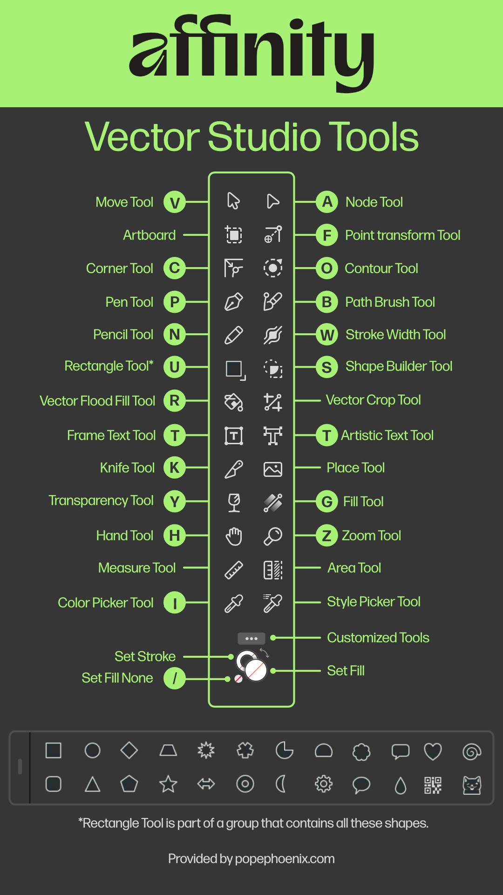

### Pixel Studio Tools 설명

- 전제: Pixel Persona는 레이어의 래스터(픽셀) 편집을 담당합니다. 모든 브러시·보정은 현재 선택된 레이어와 마스크에 적용됩니다. 샘플링 옵션(Current Layer / Current & Below / All Layers)과 브러시 흐름(Flow)·불투명도(Opacity)·경도(Hardness)를 수시로 확인하세요.

### 1) 그리기·보정 브러시

- Paint Brush Tool [B]
  - 일반 페인팅. 크기 [,], 경도 Shift+[ / ]. Alt 드래그로 스포이드. 새 레이어 위에 페인팅 권장.
  - 브러시 엔진: Spacing, Jitter, Dynamics로 압력·틸트 응답 설정.
- Paint Mixer Brush
  - 오일페인팅처럼 색을 섞어 바릅니다. "Load"로 붓에 물감 적재, "Wet"로 번짐량 제어.
  - 사진 리터치에서 피부 톤 블렌딩에 자연스럽게 사용.
- Color Replacement Brush [R]
  - 명도·채도 유지하면서 색상만 교체. Fuzziness로 허용 오차, Sampling(연속/한 점) 조절.
  - 로고 색 변환, 의상 컬러 교체에 유용.
- Adjustment Brush Tool
  - 라이브 조정 레이어의 마스크를 브러시로 칠하듯 적용/제거. 노출·색상 등 국부 보정.
- Filter Brush Tool [N]
  - 라이브 필터(가우시안 블러, 언샵 등)를 선택 영역에 칠해가며 적용.
- Undo Brush Tool [U]
  - 히스토리 단계의 이전 상태를 브러시로 되돌립니다. 영역별 되돌리기.
- Erase Brush Tool [E]
  - 픽셀 삭제. 레이어 마스크 사용 시 비파괴로 투명화. Protect Alpha로 불투명 픽셀만 보존.
- Background Erase Brush [E]
  - 브러시 중앙의 샘플 색상과 유사한 배경만 지움. 배경 제거 시 머리카락 디테일에 강력.
- Flood Erase Tool [E]
  - 같은 색 영역을 한 번에 지움. Tolerance와 Contiguous로 범위 제어.
- Clone Brush Tool [S]
  - Alt 클릭으로 소스 지정 → 대상에 복제. Aligned로 연속 추적, Current & Below로 다층 참조.

### 2) 복원·결점 제거

- Inpainting Brush [J]
  - 대상 위를 칠하면 자동으로 주변을 분석해 채움(Content-Aware). 지우개 자국·먼지 제거.
- Healing Brush [J]
  - 소스를 샘플링해 결점 위에 칠하면 질감은 보존하고 색·명암을 주변과 블렌딩.
- Patch Tool [J]
  - 선택 영역을 다른 깨끗한 영역으로 끌어다 덮어 복원. 변형과 톤 매칭 포함.
- Blemish Removal [J]
  - 클릭 한 번으로 작은 잡티 제거. 반경만 조절하면 빠른 일괄 정리 가능.
- Red Eye Removal [J]
  - 눈동자 부위 드래그 → 적목 자동 교정. 다큐·행사 사진에 유용.

### 3) 스머지·샤픈·톤 도구

- Pixel Tool [Y]
  - 1픽셀 단위 픽셀 아트용 연필. Anti-aliasing 끄고 정수 배 줌에서 작업.
- Blur Brush
  - 선택 부위를 국소적으로 블러. 가장자리 부드럽게, 뷰티 보정 과용 주의.
- Sharpen Brush
  - 경계만 선명화. Protect Details 활성화 권장, 노이즈 증폭 주의.
- Median Brush
  - 소금후추 노이즈 제거에 강함. 피부 포어를 지나치게 지우지 않도록 Flow 낮게.
- Smudge Brush
  - 픽셀을 밀어 섞음. 머리카락 흐름 보정, 페인트 스머징.
- Sponge Brush [O 그룹]
  - 채도 조절(포화/감산). 비파괴를 원하면 조정 레이어의 마스크에 칠하기.
- Dodge Brush [O]
  - 밝게. 범위(Shadow/Mid/Highlight)와 노출 제어. D&B 리터치 시 소프트 라운드 브러시.
- Burn Brush [O]
  - 어둡게. Dodge와 페어로 볼륨 표현. 5–10% 노출로 여러 번 빌드업.

### 4) 선택·채우기

- Freehand Selection [L]
  - 올가미. Feather, Anti-alias로 모서리 제어. Add/Subtract/Intersect 모드 단축키 사용.
- Elliptical / Rectangular / Row / Column Marquee [M]
  - 기본 선택 도구. 행(Row)/열(Column)은 1픽셀 폭·높이 선택으로 인터레이스 수정에 활용.
- Selection Brush Tool [W]
  - 칠해서 선택. 자동 가장자리 감지. Alt로 빼기. 머리카락은 Refine로 개선.
- Flood Select Tool [W]
  - 색 유사 영역을 자동 선택. 로고, 단색 배경 분리에 빠름.
- Selection Sample Color Tool
  - 스포이드로 색 범위 선택. 피부 톤 등 특정 색대 선택 후 조정 레이어 적용.
- Object Selection Tool
  - AI로 객체 경계 탐지. 한 번 드래그로 피사체 선택, 마스크 생성 시작점으로 좋음.
- Flood Fill Tool [G]
  - 페인트 통. 닫힌 영역을 지정 색으로 채움. 레이어 모드와 Tolerance로 결과 조절.

### 5) 변형·원근·크롭

- Crop Tool [C]
  - 캔버스/레이어 크롭. Rule of Thirds, Golden Ratio 가이드. 비파괴 크롭 옵션 확인.
- Perspective Tool
  - 4점 원근 보정. 간판·문서 스캔 바로잡기. "Live" 필터로 적용하면 수정 가능.
- Mesh Warp Tool
  - 격자 변형으로 왜곡 보정·형상 수정. 인물 왜곡 최소화는 저밀도 그리드 추천.

### 6) 색·스트로크 설정

- Set Fill / Set Stroke / Set Fill None [/]
  - 좌하단 스와치 제어. X로 전경↔배경 전환. /로 채우기 제거.
- Set Stroke
  - 현재 브러시/도형의 스트로크 색·굵기 지정. 픽셀 페인팅에는 일반적으로 비활성.
- Set Fill
  - 페인트·채우기 도구의 전경색 설정. HSL/HEX 입력 지원.

### 7) 팁과 워크플로

- 비파괴 편집
  - 원본 레이어 잠금. 새 빈 레이어에 Clone/Heal. 조정 레이어+마스크로 국부 보정.
- 가장자리 정교화
  - Selection Brush → Refine: Feather 0.5–1px, Ramp로 헤일로 제거, Matte Edges로 머리결 개선.
- D&B(닷지앤번)
  - 50% 회색 레이어(Overlay) 위에 Dodge/Burn 브러시로 형태 강조. 혹은 커브 조정 마스크.
- 색 보정 루틴
  - White Balance → Exposure → Contrast(토널) → HSL(색상) → Local retouch. 순서 유지.
- 픽셀 아트
  - Pixel Tool + 최근접 보간, 스냅 투 전체 픽셀, 정수 배율 뷰에서 편집.

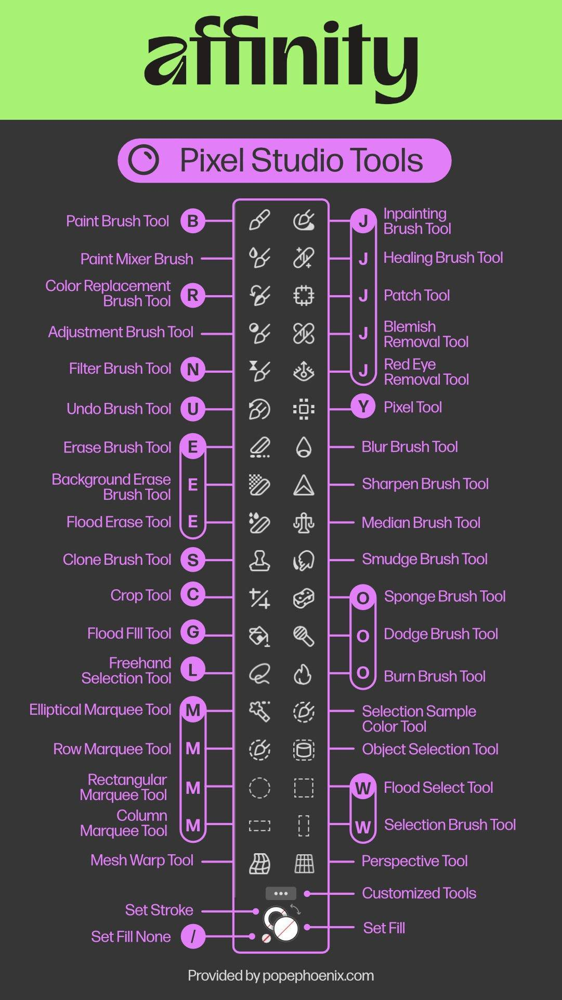

### Layout Studio Tools 사용법

- 전제: Layout Persona는 출판/레이아웃 작업 중심입니다. 텍스트 프레임, 픽처 프레임, 표, 데이터 병합 등 페이지 구성에 특화되어 있습니다. 아래는 도구별 사용법과 단축키, 실무 팁입니다. 대괄호 안은 기본 단축키입니다.

### 1) 선택·기본 조작

- Move Tool [V]
  - 모든 객체(텍스트 프레임, 픽처 프레임, 표 등)를 선택, 이동, 스케일, 회전.
  - Shift: 축 고정. Alt: 중심 기준 변형. 방향키로 1px(또는 환경설정 단위) 미세 이동.
- View Tool [H]
  - 캔버스 패닝. Space 로 임시 전환. 프레젠테이션/교정 시 오작동 방지용.
- Zoom Tool [Z]
  - 클릭 확대, Alt 클릭 축소. 드래그 박스로 영역 확대. Cmd/Ctrl+1..8로 프리셋 확대 비율.
- Customized Tools
  - 툴바 하단의 점 3개 메뉴에서 자주 쓰는 도구 세트를 커스터마이즈. 퍼블리싱 작업형 프리셋 추천: Move, Text Frame, Artistic Text, Picture Frame, Rectangle, Table, Node, Pen, Transparency, Color Picker, Fill.

### 2) 텍스트

- Text Frame Tool (프레임 텍스트) [T]
  - 본문·기사용 상자 텍스트. 드래그로 프레임 생성 → 글꼴, 자간, 단락 스타일 적용.
  - 프레임 우측 하단 빨간 더블화살표 = 오버플로우. 다른 프레임 클릭해 연결(흘림) 배치.
  - 컬럼 수, 거터, 인세트(여백) 설정으로 신문형 레이아웃 구성.
- Artistic Text Tool [T]
  - 제목·표제·한 줄 장식 텍스트. 크기를 자유롭게 변형, 문자 효과(테두리, 그림자) 적용 용이.
  - 경로에 붙여 곡선을 따라 흐르게 할 수 있음. 제목을 곡선 배치할 때 활용.
- Table Tool [T 그룹]
  - 표 삽입. 행/열 추가, 머리행 스타일, 셀 병합, 테이블 스타일 프리셋 적용.
  - 탭으로 셀 이동, Option+드래그로 행/열 복제. CSV 붙여넣기 지원.
- Data Merge Layout Tool
  - 스프레드시트(CSV) 필드를 플레이스홀더로 배치해 다량의 전단/명찰 자동 생성.
  - 텍스트 프레임과 픽처 프레임에 각각 텍스트, 이미지 필드를 바인딩. 프리뷰로 검수 후 생성.

### 3) 이미지·프레임

- Place Tool
  - 이미지, PDF, SVG 배치. 클릭=원본 크기 배치, 드래그=프레임 크기 지정.
  - 링크(연결)로 배치 시 문서 용량 절감, 리소스 관리 패널에서 누락 파일 재링크.
- Picture Frame Rectangle Tool [K]
  - 사각형 이미지 프레임 생성. Place 로 이미지를 넣으면 프레임-콘텐츠가 분리되어 비파괴 크기 조절.
  - 프레임 맞춤 옵션: 채우기(Fill), 맞춤(Fit), 늘이기(Stretch). 프레임만/이미지만 선택 전환은 컨트롤 핸들 클릭.
- Picture Frame Ellipse Tool [K]
  - 타원형 이미지 프레임. 원형 아바타, 둥근 컷아웃 제작에 사용.
- Vector Crop Tool
  - 프레임이나 벡터 객체의 표시 영역만 비파괴로 자르기. 마스크보다 빠르고 직관적.

### 4) 도형·그리기

- Rectangle Tool [U]
  - 기본 도형 사각형. Shift=정사각형, Alt=중심 기준. 코너 라운드 값을 속성에서 조절.
- Node Tool [A]
  - 프레임 또는 도형의 노드 편집, 코너 타입 변경. 텍스트 프레임도 노드로 변형 가능.
- Pen Tool [P]
  - 베지어 경로 작성. 아이콘/장식 선 그리기. 닫힌 경로는 도형처럼 채우기·스트로크 적용.

### 5) 색·투명·스타일

- Fill Tool (Gradient) [G]
  - 선형·원형·타원·원추 그라데이션 채우기. 텍스트/프레임/도형 모두 적용 가능.
- Transparency Tool [Y]
  - 투명도 그라데이션. 사진 위 타이포 대비 확보, 이미지 페이드 처리에 유용.
- Color Picker Tool [I]
  - 화면 색상 샘플. Alt 클릭 시 즉시 채우기/선 색에 반영. 스와치 패널과 연동.
- Style Picker Tool
  - 선택 객체의 선·채우기·효과·그라데이션을 다른 객체에 복사. 헤더·캡션 스타일 일관화.
- Set Fill / Set Stroke / Set Fill None [/]
  - 좌하단 스와치 제어. X로 전경/배경 전환. / 로 채우기 제거. 인쇄물은 CMYK 또는 스팟컬러 관리.

### 6) 보기·검토

- View Tool [H]와 미리보기
  - 실제 출력 느낌을 보려면 View 메뉴에서 가이드/격자 숨기기, 오버프린트 미리보기 점검.
- Zoom & Navigator
  - 본문 검수는 200–300%에서 자간·인쇄 결함 확인, 전체 밸런스는 50–100%에서 확인.

### 7) 워크플로 팁

- 텍스트 체계화: 문자/단락/객체 스타일을 먼저 정의 → 페이지 전체에 스타일로 적용해 유지보수.
- 프레임 그리드: 마스터 페이지에 컬럼과 베이스라인 그리드 설정 후 스냅 활성화.
- 이미지 품질: 링크 배치 + 리소스 패널에서 해상도 경고 확인. 인쇄는 300dpi 권장.
- 여백과 안전영역: 재단선을 고려해 블리드 설정(일반적으로 3mm). 중요한 텍스트는 안전영역 안에.
- 데이터 병합: 필드명에 공백·한글 혼용 시 CSV UTF-8 인코딩으로 저장, 누락 이미지 경로는 절대경로 지양.

### Layout Studio Tools 요약

- 텍스트: Text Frame[T] 본문 상자, 링크로 흘림. Artistic Text[T] 제목·한 줄.
- 이미지: Picture Frame 사각/타원[K]에 Place로 배치, Fit/Fill로 맞춤. Vector Crop으로 비파괴 크롭.
- 도형/경로: Rectangle[U] 기본 도형, Pen[P] 경로, Node[A] 노드 편집.
- 색/투명/스타일: Fill/Gradient[G] 채우기. Transparency[Y] 페이드. Color Picker[I] 샘플. Style Picker로 일괄 복사. Set Fill/Stroke/X, / 스와치 제어.
- 보기/조작: Move[V] 선택·변형. Zoom[Z] 확대축소. View[H] 패닝. Customized Tools로 툴바 구성.

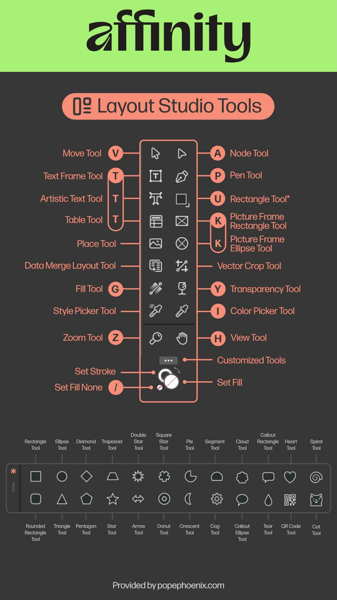

## Retouching Studio Tools

Retouching Studio는 사진 보정·복원·뷰티 레터칭에 특화된 스튜디오입니다. 피부 결점 제거, 클로닝, 힐링, 붓 도구, 페인팅, 패치, 리퀴파이 등 세밀한 픽셀 편집이 가능합니다.

## 1. Retouching Studio 핵심 툴

### 1) 클로닝·힐링

- Clone Brush Tool [C]
  - 소스 영역을 Alt+클릭으로 지정 후, 대상 영역에 페인팅해 복사.
  - 텍스처·패턴 복제에 유용. 정렬 모드(Aligned)로 소스-타겟 상대 위치 유지 가능.
  - 브러시 경도(Hardness), 불투명도(Opacity), 흐름(Flow) 조절로 자연스러운 블렌딩.
- Healing Brush Tool [J]
  - Clone과 유사하지만 대상 영역의 색상·톤과 자동 블렌딩.
  - 피부 결점, 주름, 작은 흠집 제거에 최적. 소스는 Alt+클릭, 타겟에 페인트.
  - 정렬 모드, 샘플 소스(현재 레이어/모든 레이어) 선택 가능.
- Patch Tool
  - 영역 선택 후 드래그해 다른 영역의 텍스처로 대체. 큰 결점·객체 제거에 강력.
  - 소스 모드: 선택 영역을 드래그한 곳으로 교체. 대상 모드: 선택 영역이 드래그한 곳으로 덮어짐.
  - 자연스러운 경계 블렌딩. 배경 정리, 인물 보정에 활용.
- Blemish Removal Tool
  - 작은 점·여드름·잡티를 클릭 한 번으로 즉시 제거. 주변 텍스처와 자동 블렌딩.
  - 브러시 크기만 조절하면 빠르게 뷰티 레터칭 가능. 반복 작업에 효율적.

### 2) 페인팅·그리기

- Paint Brush Tool [B]
  - 픽셀 레이어에 직접 페인팅. 디지털 페인팅, 일러스트레이션, 텍스처 추가에 사용.
  - 브러시 종류: 하드/소프트 라운드, 텍스처, 스캐터, 미디어(수채·오일) 등 다양.
  - 압력 감응(펜 태블릿) 지원. 불투명도, 흐름, 경도, 블렌딩 모드 조절.
- Pixel Tool [P]
  - 직선·곡선 경로에 브러시 스트로크 적용. 정밀한 선 그리기, 패턴 배치.
  - 베지어 경로 그린 후 스트로크 속성에서 브러시·폭·압력 설정.
- Erase Brush Tool [E]
  - 픽셀 레이어에서 브러시로 지우기. 불투명도 조절로 부분 투명화 가능.
  - 마스크 대신 빠른 삭제, 배경 정리, 엣지 다듬기에 사용.
- Flood Fill Tool [F]
  - 동일 색상 영역을 클릭 한 번으로 채우기. 허용 오차(Tolerance) 조절로 범위 제어.
  - 인접 픽셀만/전체 레이어 채우기 선택. 평면 컬러 배경, 선화 채색에 유용.

### 3) 선명도·블러

- Sharpen Brush Tool
  - 브러시로 드래그한 영역의 엣지 선명도 증가. 눈동자, 머리카락, 디테일 강조.
  - 과도하면 노이즈 발생 → 강도(Strength) 낮춰 여러 번 적용 권장.
- Blur Brush Tool
  - 브러시로 드래그해 부분 블러. 배경 흐리기, 피부 질감 부드럽게, 선택적 초점 효과.
  - 강도, 브러시 크기 조절. 빠른 보케·포트레이트 소프트닝 가능.
- Smudge Tool
  - 페인트를 문지르듯 픽셀을 밀어 흐리게. 연기, 머리카락 흐름, 드로잉 블렌딩에 활용.
  - 강도 낮춰 자연스러운 그라데이션, 높이면 극적인 왜곡 효과.

### 4) 톤·색상 조정

- Dodge Brush Tool [O]
  - 브러시로 드래그한 영역을 밝게(노출 증가). 하이라이트 살리기, 눈빛 강조.
  - 범위: 하이라이트/미드톤/섀도우 선택. 노출(Exposure) 강도 조절.
- Burn Brush Tool [O]
  - 브러시로 드래그한 영역을 어둡게(노출 감소). 윤곽 강조, 섀도우 심화.
  - 범위, 노출 강도 조절. Dodge와 함께 사용해 입체감·조명 효과 연출.
- Sponge Tool [O]
  - 브러시로 채도(Saturation)를 증가 또는 감소. 피부 톤 자연스럽게, 배경 채도 낮춰 인물 강조.
  - 모드: 채도 증가(Saturate) / 채도 감소(Desaturate). 흐름(Flow) 조절로 점진적 변화.
- Red Eye Removal Tool
  - 플래시 촬영 시 적목 현상 클릭으로 자동 보정. 눈동자 영역 클릭 → 적색 제거, 자연스러운 동공 색 복원.
  - 브러시 크기, 어두움 강도 조절. 동물 눈 반사도 수동으로 보정 가능.

### 5) 왜곡·리퀴파이

- Liquify Persona (독립 페르소나)
  - 픽셀을 유동적으로 밀고 당겨 형태 변형. 얼굴 윤곽, 체형 보정, 창의적 왜곡.
  - 도구: Push, Twirl(회전), Pinch(좁히기), Turbulence(난류), Reconstruct(복원).
  - Freeze Mask로 보호 영역 지정 후 나머지만 변형. 프리뷰 실시간 확인, 재설정 가능.
- Free Transform Tool (Retouching 내)
  - 선택 영역 또는 레이어를 회전·크기 조절·왜곡. Cmd+T로 빠른 접근.
  - 모드: 자유 변형, 원근, 뒤틀기(Warp). 대상을 끌어 자유롭게 변형.

### 6) 선택·마스킹

- Selection Brush Tool [W]
  - 브러시로 드래그해 선택 영역 추가·제거. 복잡한 형태(머리카락, 나무) 선택에 유리.
  - 모드: 추가(Add), 빼기(Subtract), 교차(Intersect). 경도·크기 조절로 엣지 정밀 제어.
- Flood Select Tool [W]
  - 클릭한 색상 영역을 허용 오차 범위 내에서 자동 선택. 단색 배경, 하늘 선택에 빠름.
  - 인접 픽셀만/전체 레이어 선택 옵션. 선택 후 마스크 또는 조정 레이어 적용.
- Refine Selection
  - 선택 경계를 세밀하게 다듬기. 브러시로 엣지 영역을 칠하면 AI가 자동으로 머리카락·모피 분리.
  - 출력: 선택 영역, 마스크, 새 레이어. 배경 제거, 합성 전처리에 필수.

### 7) 기타 유틸리티

- View Tool [H]
  - Space 키 누른 채 드래그로 캔버스 이동. 확대 상태에서 작업 영역 빠르게 탐색.
- Zoom Tool [Z]
  - 클릭=확대, Alt+클릭=축소. 드래그로 영역 확대. 100% 보기로 픽셀 정확도 검수.
- Color Picker Tool [I]
  - 화면 색상 샘플. Alt 클릭 시 전경/배경 색 즉시 설정. 피부톤 추출, 색 일치 작업에 활용.

### 8) 워크플로 팁

- 비파괴 편집: 조정 레이어 + 마스크로 원본 보존. 클론·힐링은 별도 빈 레이어에 작업(Sample: All Layers).
- 브러시 커스터마이징: 브러시 스튜디오에서 경도, 간격, 압력 커브 조정. 자주 쓰는 설정 프리셋 저장.
- 레이어 구조: 원본 → 클론/힐링 레이어 → Dodge/Burn 레이어 → 최종 조정 레이어로 단계별 분리.
- 빠른 키: C(클론), J(힐링), B(페인트), E(지우개), W(선택), O(Dodge/Burn/Sponge 전환).
- Liquify 주의: 과도한 변형은 부자연스러움. Freeze Mask로 배경·의류 보호, 얼굴만 미세 조정.
- 색상 정확도: 프로파일(sRGB/Adobe RGB) 확인, 모니터 캘리브레이션. 인쇄물은 CMYK 프리뷰 점검.

### Retouching Studio Tools 요약

- 클로닝·힐링: Clone[C] 텍스처 복사. Healing[J] 자동 블렌딩. Patch 큰 영역 교체. Blemish 클릭 제거.
- 페인팅: Paint Brush[B] 직접 그리기. Pixel[P] 경로 스트로크. Erase[E] 지우기. Flood Fill[F] 영역 채우기.
- 선명·블러: Sharpen 엣지 강조. Blur 부분 흐림. Smudge 픽셀 밀기.
- 톤·색상: Dodge[O] 밝게. Burn[O] 어둡게. Sponge[O] 채도 조절. Red Eye 적목 제거.
- 왜곡: Liquify Persona로 유동 변형(Push, Twirl, Pinch, Reconstruct). Free Transform으로 회전·왜곡.
- 선택·마스킹: Selection Brush[W] 브러시 선택. Flood Select[W] 색상 선택. Refine Selection으로 엣지 다듬기.
- 보기: View[H] 이동. Zoom[Z] 확대/축소. Color Picker[I] 색상 샘플.

### Affinity Studio - Canvas AI Studio Tools

### Canvas AI Studio 개요

Canvas AI Studio는 Affinity Studio 내에서 AI 기반 이미지 생성 및 편집을 수행하는 독립 환경입니다. 텍스트 프롬프트로 이미지를 생성하거나, 기존 이미지를 AI로 확장·변형·스타일화할 수 있습니다. 주요 도구들은 생성, 편집, 선택, 페인팅 등으로 분류됩니다.

### 1) AI 이미지 생성 도구

- Text to Image
  - 텍스트 프롬프트 입력 → AI가 새 이미지 생성. 스타일(사실적, 일러스트, 추상 등), 종횡비, 해상도 설정.
  - 사용법: 프롬프트 창에 설명 입력(예: "sunset over mountains, oil painting style") → Generate 클릭 → 여러 결과 중 선택.
  - 반복 생성(Iterations)으로 다양한 변형 확인. Seed 값 고정 시 유사 결과 재생성 가능.
  - 팁: 구체적 형용사·색상·분위기 명시로 정확도 향상. 네거티브 프롬프트로 원치 않는 요소 배제.
- Image to Image
  - 기존 이미지를 참조해 새 이미지 생성. 레이아웃·구도 유지하며 스타일 변경.
  - 사용법: 참조 이미지 업로드 → 프롬프트 입력(예: "make it a watercolor painting") → 강도(Strength) 조절(낮을수록 원본 충실).
  - Strength 0.3~0.5: 색감·질감만 변경. 0.7~1.0: 구도 유지하며 대폭 재해석.
  - 활용: 스케치 → 완성 렌더링, 사진 → 일러스트 전환, 콘셉트 아트 변형.
- Inpainting
  - 선택 영역만 AI로 재생성. 배경 제거, 객체 교체, 불필요한 요소 삭제.
  - 사용법: 브러시로 편집 영역 마스크 → 프롬프트 입력(예: "replace with a tree") → Generate.
  - 마스크 크기·정확도가 결과 좌우. 경계 블렌딩 자동 처리, 주변 컨텍스트 반영.
  - 팁: 큰 객체 제거 시 주변 텍스처 충분히 포함. 여러 번 생성해 최적 결과 선택.
- Outpainting
  - 캔버스 밖으로 이미지 확장. AI가 원본 스타일·조명 유지하며 추가 영역 생성.
  - 사용법: 캔버스 크기 늘림 → 빈 영역 선택 → 프롬프트(예: "continue the landscape") → Generate.
  - 원본 엣지와 자연스럽게 블렌딩. 여러 방향으로 순차 확장 가능.
  - 활용: 크롭된 사진 복원, 파노라마 확장, 배경 넓히기.

### 2) AI 편집·향상 도구

- AI Upscale
  - 저해상도 이미지를 고해상도로 업스케일(2x, 4x). 디테일·선명도 AI로 복원.
  - 사용법: 이미지 선택 → Upscale 배율 선택 → Generate. 노이즈·압축 아티팩트 자동 제거.
  - 사진, 일러스트, 텍스처 모두 지원. 출력물 인쇄, 대형 디스플레이용 해상도 확보.
  - 한계: 극도로 흐릿한 원본은 AI 추측 결과 부정확할 수 있음. 원본 디테일 많을수록 효과 좋음.
- Style Transfer
  - 참조 이미지 스타일을 대상 이미지에 적용. 유화, 수채화, 만화풍 등 변환.
  - 사용법: 콘텐츠 이미지 + 스타일 이미지 업로드 → 강도 조절 → Generate.
  - 강도 낮음: 색조만 변경. 강도 높음: 질감·붓터치까지 전면 적용.
  - 활용: 사진을 특정 화가 스타일로 재현, 브랜드 비주얼 통일, 창의적 아트워크.
- AI Enhance
  - 이미지 전반 품질 향상. 노이즈 제거, 색상 보정, 대비·선명도 자동 최적화.
  - 사용법: 이미지 선택 → Enhance 클릭. AI가 사진 특성 분석 후 자동 조정.
  - 저조도 사진, 오래된 스캔 이미지, 웹 압축 이미지 복원에 효과적.
  - 팁: Enhance 후 수동 조정 레이어로 미세 조정. 과도한 샤프닝 방지.
- Background Removal
  - 피사체와 배경 자동 분리. 클릭 한 번으로 투명 배경 생성.
  - 사용법: 이미지 선택 → Remove Background → AI가 엣지 검출·마스킹 자동 수행.
  - 머리카락, 모피, 반투명 객체도 정밀 처리. 결과 마스크 수동 편집 가능(Refine 도구).
  - 활용: 전자상거래 제품 사진, 합성 소스 준비, 프레젠테이션 배경 제거.

### 3) 선택·마스킹 도구

- AI Selection Brush
  - 브러시로 드래그해 AI가 객체 경계 자동 인식·선택. 복잡한 형태도 빠르게 선택.
  - 사용법: 객체 대략 칠하기 → AI가 엣지 스냅 → 추가/제거 모드로 조정.
  - Refine Edge 옵션으로 머리카락·투명 영역 세밀 조정. 선택 후 마스크·조정 레이어 적용.
  - 팁: 명확한 경계선 있는 객체에 효과 극대화. 배경 단순할수록 정확도 상승.
- Smart Lasso
  - 클릭으로 경로 지정 → AI가 경계 따라 자동 선택. 매뉴얼 제어와 AI 보조 결합.
  - 사용법: 객체 엣지 클릭·클릭 → AI가 사이 경로 자동 연결. 더블클릭으로 선택 완료.
  - Magnetic 모드: 고대비 엣지 자동 스냅. Freehand 모드: 수동 경로 그리기.
  - 활용: 기하학적 객체, 명확한 윤곽선 선택. 세밀한 제어 필요 시 Manual Lasso 병행.
- Mask Refiner
  - 기존 마스크 경계 AI로 정제. 머리카락, 모피, 유리 같은 어려운 엣지 처리.
  - 사용법: 마스크 레이어 선택 → Refine 브러시로 경계 영역 칠하기 → AI가 디테일 추출.
  - Output: 새 마스크, 알파 채널, 별도 레이어. 배경 색상 프리뷰로 결과 검증.
  - 팁: 경계 너비(Width) 조절로 블렌딩 범위 설정. 여러 번 반복 가능.

### 4) AI 페인팅·드로잉 도구

- AI Paint Brush
  - 브러시 스트로크를 AI가 자동 향상. 자연스러운 질감·그라데이션 생성.
  - 사용법: 브러시 선택 → 캔버스에 드래그 → AI가 실시간으로 스트로크 보정·블렌딩.
  - 모드: 유화(Oil), 수채화(Watercolor), 에어브러시(Airbrush). 압력·속도 반영.
  - 활용: 디지털 페인팅, 콘셉트 스케치 마무리, 텍스처 레이어 추가.
- Smart Fill
  - 선택 영역을 주변 컨텍스트 기반 AI로 채우기. Content-Aware Fill.
  - 사용법: 영역 선택 → Smart Fill 클릭 → AI가 주변 텍스처·패턴 분석 후 자연스럽게 채움.
  - 불필요한 객체 제거, 빈 공간 채우기, 패턴 확장에 효과적.
  - 팁: 샘플 영역 충분히 확보. 복잡한 배경은 Inpainting과 병행.
- Texture Generator
  - 텍스트 프롬프트로 타일 가능한 텍스처 생성. 나무, 돌, 천, 금속 등.
  - 사용법: 프롬프트 입력(예: "worn brick wall") → 해상도·타일링 옵션 설정 → Generate.
  - Seamless 옵션으로 반복 패턴 자동 생성. 3D 모델링, 배경 디자인, 패턴 채우기 활용.
  - 팁: "tileable", "seamless" 키워드 명시로 연속 패턴 보장.

### 5) 프롬프트 관리·설정

- Prompt Library
  - 자주 쓰는 프롬프트 저장·관리. 카테고리별 정리, 태그 검색.
  - 사용법: 프롬프트 작성 후 Save → 이름·태그 지정. 재사용 시 Library에서 로드.
  - 팀 협업 시 프롬프트 공유, 스타일 일관성 유지. 변형 버전 히스토리 관리.
- Negative Prompts
  - 생성 결과에서 제외할 요소 명시. "blur", "distorted", "low quality" 등.
  - 사용법: Negative Prompt 필드에 입력 → AI가 해당 특성 회피.
  - 팁: 원치 않는 색상, 스타일, 객체 명시. 긍정 프롬프트와 균형 유지.
- Advanced Settings
  - Seed: 난수 고정으로 동일 프롬프트 재현. Guidance Scale: 프롬프트 충실도 조절(높을수록 정확, 낮을수록 창의적).
  - Steps: 생성 반복 횟수(높을수록 디테일, 시간 증가). Sampler: 알고리즘 선택(DPM++, Euler 등).
  - 사용법: 기본값으로 시작 → 결과 불만족 시 점진적 조정. 로그 저장으로 최적 설정 추적.

### 6) 레이어·합성 도구

- AI Layer Blend
  - 여러 레이어를 AI로 자연스럽게 합성. 색조, 조명, 엣지 자동 매칭.
  - 사용법: 합성 대상 레이어 선택 → Blend 클릭 → AI가 색상·밝기 조화, 그림자 생성.
  - 수동 블렌딩 모드(Multiply, Screen 등)와 병행 가능. 포토몽타주, 합성 작업 시간 단축.
- Lighting Adjustment
  - AI가 이미지 조명 방향·강도 분석 후 새 광원 추가 또는 조정.
  - 사용법: 광원 위치 지정 → 색온도·강도 설정 → AI가 그림자·하이라이트 자동 렌더링.
  - 활용: 합성 소스 조명 통일, 스튜디오 조명 시뮬레이션, 시간대 변경(낮→밤).
- Depth Map Generator
  - 2D 이미지에서 깊이 맵 생성. 3D 효과, 피사계 심도, 시차 효과 적용 기반.
  - 사용법: 이미지 선택 → Generate Depth Map → AI가 전경·배경 구분, 흑백 깊이 맵 출력.
  - 활용: 뒤늦은 배경 블러, 3D 변환, VFX 합성 마스크.

### 7) 배치·자동화 도구

- Batch Generate
  - 여러 프롬프트 또는 Seed로 대량 이미지 생성. 변형 탐색, A/B 테스트.
  - 사용법: 프롬프트 리스트 입력 → 생성 수량 설정 → Generate All. 결과 그리드 뷰로 비교.
  - 팁: 변수 태그(예: [color], [style]) 사용해 자동 치환. 최적 결과 선택 후 추가 작업.
- Action Recorder
  - 반복 작업 자동화. AI 생성 → 조정 → 내보내기 과정 녹화·재생.
  - 사용법: Record 시작 → 작업 수행 → Stop. 저장 후 다른 이미지에 Apply.
  - 활용: 동일 스타일 여러 이미지 일괄 처리, 워크플로 표준화, 팀 작업 공유.

### 8) 워크플로 팁

- 반복 생성: 한 프롬프트로 여러 결과 생성 → 최적 선택. Seed 고정으로 미세 조정 반복.
- 계층 구조: AI 생성 레이어 → 수동 조정 레이어 → 최종 합성. 원본 보존, 언제든 재생성 가능.
- 프롬프트 엔지니어링: 구체적 명사·형용사 사용. 스타일 키워드(예: "cinematic", "studio lighting") 명시.
- 참조 이미지 활용: Image to Image, Style Transfer에 고품질 참조 제공. 해상도 높을수록 결과 정밀.
- 마스크 정확도: Inpainting·Outpainting 시 경계 명확히. Refine 도구로 엣지 다듬기.
- 모델 선택: 사실적 이미지=포토리얼 모델, 일러스트=아트 모델. 설정에서 모델 전환 가능.
- 하드웨어 고려: GPU 메모리 부족 시 해상도·Steps 낮춤. 배치 크기 조절로 안정성 확보.
- 저작권·윤리: 생성 이미지 상업 사용 전 라이선스 확인. 특정 아티스트 스타일 무단 모방 자제.

### Canvas AI Studio Tools 요약

- 생성: Text to Image, Image to Image, Inpainting(부분 재생성), Outpainting(확장).
- 향상: AI Upscale(고해상도화), Style Transfer(스타일 적용), AI Enhance(품질 향상), Background Removal(배경 제거).
- 선택: AI Selection Brush(자동 엣지 인식), Smart Lasso(AI 보조 경로), Mask Refiner(마스크 정제).
- 페인팅: AI Paint Brush(스트로크 향상), Smart Fill(컨텍스트 채우기), Texture Generator(텍스처 생성).
- 프롬프트: Prompt Library(재사용), Negative Prompts(배제 요소), Advanced Settings(Seed, Steps, Sampler).
- 합성: AI Layer Blend(자동 합성), Lighting Adjustment(조명 조정), Depth Map Generator(깊이 맵).
- 자동화: Batch Generate(대량 생성), Action Recorder(작업 자동화).

### Affinity Studio 개요

Affinity Studio는 Canva가 2024년 3월 Affinity(Serif)를 인수한 후, 2025년 10월 29일에 새로 출시된 통합 디자인 앱입니다. 기존 Affinity Suite(Photo, Designer, Publisher)의 기능을 하나의 앱으로 재설계하여 사진 편집, 벡터 디자인, 페이지 레이아웃을 결합했습니다. 이 앱은 무료로 제공되며, Canva의 AI 도구(예: 생성적 채우기, 배경 제거)를 프리미엄 사용자에게 통합합니다. Affinity Studio의 툴은 Vector(Pixel), Photo, Shape 등 카테고리로 나뉘며, 비파괴 편집, RAW 처리, 데이터 머지, AI 통합이 주요 특징입니다. 아래는 제공된 툴 목록을 카테고리별로 정리한 내용으로, 공식 문서와 릴리스 노트에 기반합니다. 일부 툴의 세부 사용법은 기존 Affinity V2와 유사하나, 새 버전에서 통합 및 AI 강화가 적용되었습니다. 모르는 세부 사항(예: 특정 툴의 미공개 업데이트)은 모른다고 명시했습니다.

### General 카테고리

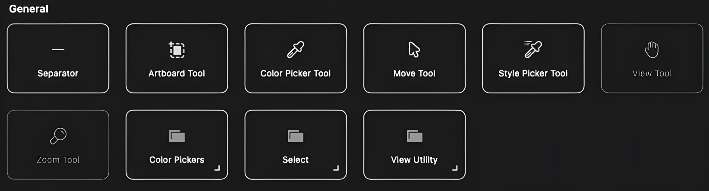

기본 탐색 및 편집 도구. 문서 이동, 색상 선택 등에 사용됩니다.

| 도구 이름 | 사용법 | 사용 예 |
| --- | --- | --- |
| Artboard Tool | 여러 아트보드를 생성/관리. 크기 조정, 이동 가능. Affinity Studio의 통합 환경에서 다중 레이아웃 지원. | 포스터 여러 버전 관리. |
| Color Picker Tool | 이미지에서 색상 샘플링. 클릭-드래그로 정밀 선택, 색상 패널 저장. | 사진 색상 추출 후 적용. |
| Move Tool | 레이어 선택/이동/회전/크기 조정. Shift로 방향 제한. | 객체 재배치. |
| Style Picker Tool | 객체 스타일(색상, 스트로크) 샘플링 후 적용. | 스타일 복사. |
| View Tool | 문서 패닝. Spacebar로 임시 활성. | 확대하며 검사. |
| Zoom Tool | 확대/축소. 슬라이더로 레벨 설정. | 세밀 편집. |

### Vector 카테고리

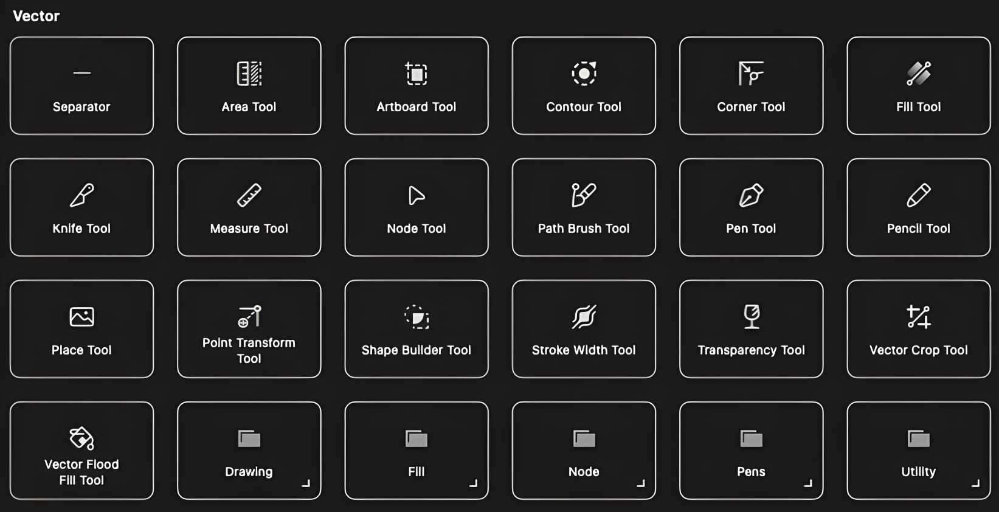

벡터 그래픽 편집. 경로, 모양 다루기. 새 버전에서 이미지 트레이스 강화.

| 도구 이름 | 사용법 | 사용 예 |
| --- | --- | --- |
| Area Tool | 영역 선택/측정. 벡터 객체 영역 계산 (세부 업데이트 모름). | 객체 영역 확인. |
| Artboard Tool | (General 중복) 아트보드 관리. | 다중 디자인. |
| Corner Tool | 벡터 코너 라운딩. 반경 조정. | 사각형 둥글게. |
| Contour Tool | 객체 윤곽선 추가/조정. 오프셋 설정. | 테두리 두께 변형. |
| Crop Tool | 문서/이미지 자르기. 비율 유지. | 가장자리 제거. |
| Knife Tool | 벡터 객체 자르기. 자유/직선 모드. | 모양 분할. |
| Measure Tool | 거리 측정. 단위 설정. | 객체 간 거리. |
| Node Tool | 노드 추가/삭제/이동. 곡선 편집. | 경로 조정. |
| Path Tool | 경로 그리기 (Pen Tool 확장). | 커스텀 경로. |
| Pen Tool | 직선/곡선 벡터 경로. 베지어 핸들. | 아웃라인 트레이스. |
| Pencil Tool | 자유형 벡터 라인. 스무딩 적용. | 손그림 드로잉. |
| Place Image Tool | 이미지 배치. 링크/임베드. | 외부 이미지 삽입. |
| Point Transform Tool | 포인트 기반 변형. 회전/스케일. | 포인트 중심 변형. |
| Shape Builder Tool | 모양 합치기/빼기. 불린 연산. | 복잡 모양 생성. |
| Stroke Width Tool | 스트로크 너비 조정. 압력 프로필. | 선 두께 변형. |
| Transparency Tool | 투명도 그라데이션. 마스크 적용. | 페이드 효과. |
| Vector Crop Tool | 벡터 클리핑. 마스크 생성. | 객체 자르기. |

### Text 카테고리

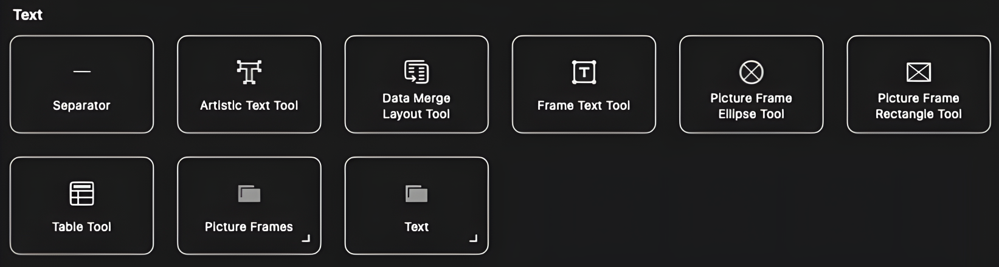

텍스트 편집. 고급 타이포그래피 지원.

| 도구 이름 | 사용법 | 사용 예 |
| --- | --- | --- |
| Artistic Text Tool | 예술적 텍스트 추가. 폰트/스타일/경로 따라. | 타이틀 디자인. |
| Data Merge Layout Tool | 데이터 머지 레이아웃. CSV 등 병합. | 카탈로그 생성. |
| Frame Text Tool | 프레임 내 텍스트. 흐름 연결. | 기사 레이아웃. |
| Picture Frame Ellipse Tool | 타원 프레임에 이미지 배치. | 타원 이미지 홀더. |
| Picture Frame Rectangle Tool | 사각 프레임에 이미지. | 사각 홀더. |
| Table Tool | 테이블 생성. 셀 병합/스타일. | 데이터 테이블. |

### Shape 카테고리

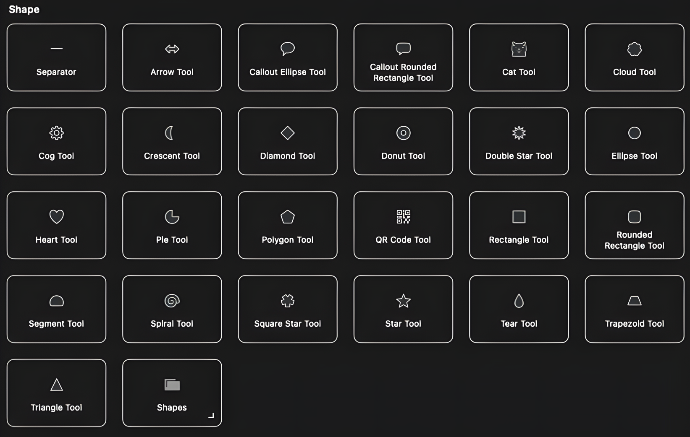

기본 모양 생성. 파라미터 조정 가능.

| 도구 이름 | 사용법 | 사용 예 |
| --- | --- | --- |
| Arrow Tool | 화살표. 머리/꼬리 커스텀. | 방향 표시. |
| Callout Ellipse Tool | 타원 콜아웃. 텍스트 삽입. | 스피치 버블. |
| Callout Rounded Rectangle Tool | 둥근 사각 콜아웃. | 대화 상자. |
| Cat Tool | 고양이 모양 (재미 요소). | 일러스트. |
| Cloud Tool | 구름. 포인트 수 조정. | 배경. |
| Cog Tool | 톱니바퀴. 치아 수 설정. | 기계 아이콘. |
| Crescent Tool | 초승달. 곡률 조정. | 달 모양. |
| Diamond Tool | 다이아몬드. | 아이콘. |
| Donut Tool | 도넛. 구멍 크기. | 링. |
| Double Star Tool | 더블 스타. 포인트 수. | 복잡 별. |
| Ellipse Tool | 타원/원. | 로고. |
| Heart Tool | 하트. | 아이콘. |
| Pie Tool | 파이. 각도 설정. | 차트. |
| Polygon Tool | 다각형. 변 수. | 패턴. |
| QR Code Tool | QR 생성. 데이터 입력. | 링크. |
| Rectangle Tool | 사각형. | 프레임. |
| Rounded Rectangle Tool | 둥근 사각. 반경. | 버튼. |
| Segment Tool | 세그먼트. | 부분 원. |
| Spiral Tool | 나선. 턴 수. | 패턴. |
| Square Star Tool | 사각 별. | 선버스트. |
| Star Tool | 별. 포인트/반경. | 효과. |
| Tear Tool | 눈물. | 드롭. |
| Trapezoid Tool | 사다리꼴. | 배경. |
| Triangle Tool | 삼각형. | 사인. |

### Photo 카테고리

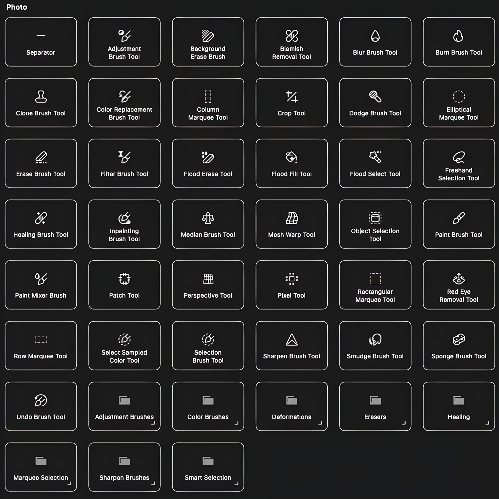

사진 리터치. RAW 편집, 스택, 배치 처리 지원.

| 도구 이름 | 사용법 | 사용 예 |
| --- | --- | --- |
| Adjustment Brush Tool | 영역별 조정(밝기 등). 마스크. | 부분 밝기. |
| Background Brush Tool | 배경 지우기. AI 강화 가능. | 배경 제거. |
| Blemish Removal Tool | 결함 제거. 샘플링. | 피부 잡티. |
| Blur Brush Tool | 블러 적용. 강도 조정. | 배경 소프트. |
| Burn Brush Tool | 어둡게. 범위(섀도우 등). | 하이라이트 다크. |
| Clone Brush Tool | 영역 복제. 소스 설정. | 결함 커버. |
| Color Replacement Brush Tool | 색상 교체. 허용 범위. | 색 변경. |
| Crop Tool | (Vector 중복) 자르기. | 크롭. |
| Dodge Brush Tool | 밝게. 범위. | 섀도우 밝힘. |
| Elliptical Marquee Tool | 타원 선택. 페더. | 원형 영역. |
| Erase Brush Tool | 지우기. 투명도. | 객체 제거. |
| Filter Brush Tool | 필터 영역 적용. | 부분 필터. |
| Flood Fill Tool | 채우기. 허용치. | 영역 채움. |
| Flood Select Tool | 비슷한 색 선택. | 하늘 선택. |
| Freehand Selection Tool | 자유 선택. | 불규칙 영역. |
| Healing Brush Tool | 텍스처 머지. | 주름 제거. |
| Inpainting Tool | 주변 채움. AI 지원. | 복원. |
| Median Brush Tool | 노이즈 제거. | 그레인 감소. |
| Mesh Warp Tool | 그리드 왜곡. | 얼굴 왜곡. |
| Object Selection Tool | 객체 자동 선택. AI 강화. | 주제 선택. |
| Paint Mixer Brush Tool | 색상 믹스. 습식 효과. | 페인트. |
| Patch Tool | 패치 교체. | 스카 제거. |
| Perspective Tool | 원근 교정. 그리드. | 건물 수정. |
| Pixel Tool | 픽셀 드로잉. | 픽셀 아트. |
| Rectangular Marquee Tool | 사각 선택. | 사각 영역. |
| Red Eye Removal Tool | 적안 제거. | 플래시 수정. |
| Row Marquee Tool | 행 선택. | 행 기반. |
| Select Sampled Color Tool | 샘플 색 선택. | 색상 기반. |
| Selection Brush Tool | 브러시 선택. | 브러싱 영역. |
| Sharpen Brush Tool | 선명도 증가. | 눈 선명. |
| Smudge Brush Tool | 스머지. | 블렌드. |
| Sponge Brush Tool | 채도 조정. | 색 강도. |
| Undo Brush Tool | 변경 되돌리기. | 원본 복원. |

### Painting 카테고리

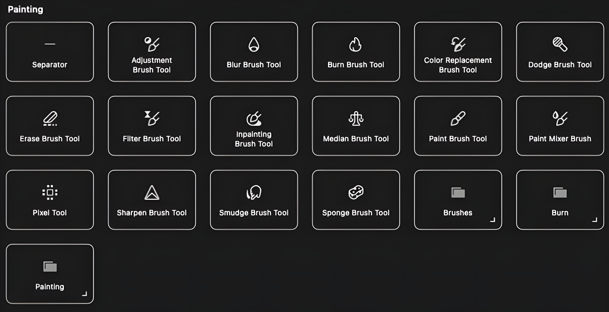

페인팅 브러시. Photo와 중복 많음.

| 도구 이름 | 사용법 | 사용 예 |
| --- | --- | --- |
| Adjustment Brush Tool | (Photo 중복) 영역 조정. | 밝기. |
| Blur Brush Tool | (Photo 중복) 블러. | 에지. |
| Burn Brush Tool | (Photo 중복) 다크닝. | 깊이. |
| Color Replacement Brush Tool | (Photo 중복) 교체. | 스카이. |
| Dodge Brush Tool | (Photo 중복) 브라이트닝. | 강조. |
| Erase Brush Tool | (Photo 중복) 지우기. | 제거. |
| Filter Brush Tool | (Photo 중복) 필터. | 영역. |
| Median Brush Tool | (Photo 중복) 노이즈. | 감소. |
| Paint Brush Tool | 스트로크 페인팅. 브러시 설정. | 텍스처. |
| Paint Mixer Brush Tool | (Photo 중복) 믹스. | 블렌드. |
| Sharpen Brush Tool | (Photo 중복) 샤프닝. | 강화. |
| Smudge Brush Tool | (Photo 중복) 스머지. | 아트. |
| Sponge Brush Tool | (Photo 중복) 채도. | 향상. |
| Brushes | 브러시 선택. 커스텀. | 다양. |
| Burn | 번 효과 그룹 (세부 모름). | 다크닝. |

### Effects 카테고리

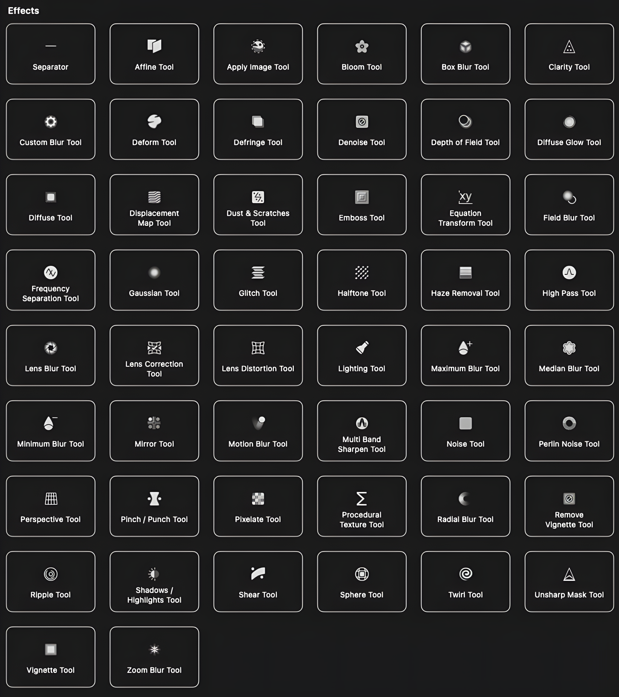

효과/필터. 일부 AI 통합. 세부 툴 많아, 공식 릴리스에 기반한 설명.

| 도구 이름 | 사용법 | 사용 예 |
| --- | --- | --- |
| Affine Tool | 아핀 변형. 회전/스큐. | 왜곡. |
| Apply Image Tool | 이미지 적용. 블렌드. | 레이어. |
| Bloom Tool | 블룸. 빛 번짐. | 글로우. |
| Box Blur Tool | 박스 블러. | 부드러움. |
| Clarity Tool | 선명도. | 강조. |
| Custom Blur Tool | 커스텀 블러. | 정의. |
| Defringe Tool | 프린지 제거. | 에지. |
| Dehaze Tool | 헤이즈 제거. | 안개. |
| Depth of Field Tool | 피사체 깊이. | 초점. |
| Diffuse Glow Tool | 디퓨즈 글로우. | 부드러움. |
| Diffuse Tool | 디퓨즈. 픽셀 퍼뜨림. | 효과. |
| Displacement Tool | 디스플레이스먼트. | 텍스처. |
| Dust & Scratches | 먼지/스크래치 제거. | 복원. |
| Emboss Tool | 엠보스. 3D. | 텍스처. |
| Equation Tool | 방정식 변형. | 수학적. |
| Field Blur Tool | 필드 블러. | 깊이. |
| Frequency Separation Tool | 주파수 분리. | 피부. |
| Gaussian Blur Tool | 가우시안. | 블러. |
| Glitch Tool | 글리치. | 오류. |
| Halftone Tool | 하프톤. | 인쇄. |
| Haze Removal Tool | 헤이즈. | 클린. |
| High Pass Tool | 하이 패스. | 에지. |
| Lens Blur Tool | 렌즈 블러. 보케. | 효과. |
| Lens Correction Tool | 렌즈 교정. | 왜곡. |
| Lens Distortion Tool | 왜곡. | 배럴. |
| Lightning Tool | 라이트닝. | 조명. |
| Maximum Blur Tool | 맥시멈. | 극단. |
| Median Blur Tool | 미디언. | 노이즈. |
| Minimum Tool | 미니멈. | 다크닝. |
| Motion Blur Tool | 모션. | 움직임. |
| Multi Band Tool | 멀티 밴드 (세부 모름). | 색상. |
| Noise Tool | 노이즈 추가. | 그레인. |
| Perlin Noise Tool | 펄린. | 텍스처. |
| Pinch/Punch Tool | 핀치/펀치. | 왜곡. |
| Pixelate Tool | 픽셀레이트. | 모자이크. |
| Posterize Tool | 포스터라이즈. | 색상 감소. |
| Radial Blur Tool | 래디얼. | 스핀. |
| Ripple Tool | 리플. | 물결. |
| Shadows / Highlights | 섀도우/하이라이트. | 레인지. |
| Shear Tool | 시어. | 기울기. |
| Sphere Tool | 스피어. | 구형. |
| Twirl Tool | 트월. | 회전. |
| Unsharp Mask Tool | 언샤프. | 선명. |
| Vignette Tool | 비네트. | 에지. |
| Zoom Blur Tool | 줌. | 효과. |

### Export 카테고리

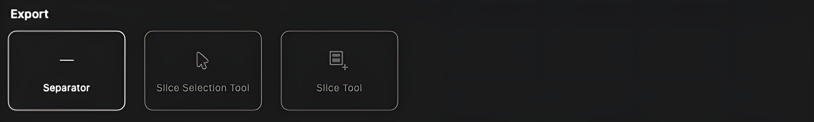

내보내기.

| 도구 이름 | 사용법 | 사용 예 |
| --- | --- | --- |
| Slice Selection Tool | 슬라이스 선택. | 영역 선택. |
| Slice Tool | 슬라이스 생성. 웹 최적화. | 그래픽 분할. |

### Canvas AI 카테고리

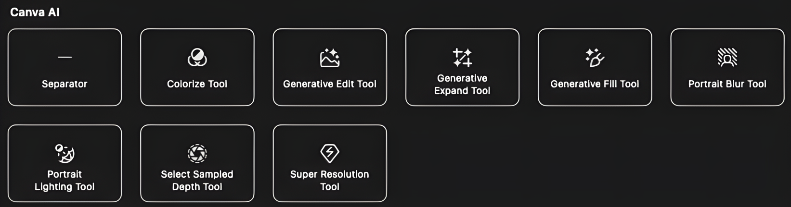

Canva AI 통합. 프리미엄 사용자 대상: 생성적 편집, 배경 제거 등.

| 도구 이름 | 사용법 | 사용 예 |
| --- | --- | --- |
| Color Tool | 흑백 컬러화. AI 기반. | 오래된 사진. |
| Generative Edit Tool | 생성적 편집/배경 제거. 프롬프트 입력. | 배경 교체. |
| Generative Expand Tool | 이미지 확장. AI 채움. | 가장자리 확장. |
| Generative Fill Tool | 영역 AI 채움. | 객체 제거 후. |
| Portrait Blur Tool | 포트레이트 블러. DSLR 스타일. | 배경 블러. |
| Lighting Tool | 포트레이트 조명. AI 조정. | 사후 조명. |
| Select Sampled Color Tool | (Photo 중복) 색 선택, AI 강화. | 색상. |
| Super Resolution Tool | 업스케일. AI 품질 향상. | 저해상도. |

이 정리 외 세부 업데이트는 공식 Affinity Studio 문서를 확인하세요. 일부 툴(예: Multi Band Tool)의 최신 세부는 검색되지 않아 모릅니다.

## Artboard Tool 상세 가이드

**Artboard Tool**은 Affinity Studio(Designer/Photo/Publisher)에서 하나의 문서 안에 여러 개의 독립적인 작업 영역(아트보드)을 만들 수 있는 강력한 도구입니다. 특히 다양한 크기와 비율의 디자인을 한 번에 관리할 때 매우 유용합니다.

### 주요 기능

- **다중 아트보드 생성:** 하나의 문서에 여러 아트보드를 배치하여 다양한 버전의 디자인을 동시에 작업할 수 있습니다.
- **개별 내보내기:** 각 아트보드를 독립적으로 내보낼 수 있어 여러 파일을 따로 저장할 필요가 없습니다.
- **프리셋 크기:** 소셜 미디어, 인쇄물, 웹 등 다양한 용도의 사전 정의된 크기를 제공합니다.
- **유연한 레이아웃:** 아트보드 간 요소 복사/붙여넣기가 쉽고, 공통 에셋을 공유할 수 있습니다.

### 기본 사용 방법

1. **Artboard Tool 선택:** 왼쪽 도구 패널에서 Artboard Tool을 선택하거나 단축키 `A`를 누릅니다.
2. **아트보드 생성:** 캔버스에서 드래그하여 원하는 크기의 아트보드를 만듭니다.
3. **크기 조정:** 상단 컨텍스트 툴바에서 정확한 너비와 높이 값을 입력하거나, 아트보드 모서리를 드래그하여 크기를 조정합니다.
4. **프리셋 사용:** 상단 툴바의 프리셋 드롭다운에서 Instagram Post, A4, iPhone 화면 등 미리 정의된 크기를 선택합니다.

### 포스터의 다양한 비율/사이즈 만들기

**시나리오:** 하나의 포스터 디자인을 Instagram (1:1), Facebook (16:9), 인쇄용 A3 (297×420mm) 등 여러 형식으로 제작해야 하는 경우

### 방법 1: 프리셋을 활용한 빠른 생성

1. **첫 번째 아트보드 생성:** Artboard Tool로 캔버스를 클릭하고, 상단 툴바에서 "Social Media" 카테고리 → "Instagram Post (1080×1080px)" 선택
2. **디자인 작업:** 이 아트보드 안에서 포스터 디자인을 완성합니다
3. **두 번째 아트보드 추가:** Artboard Tool 상태에서 첫 번째 아트보드 옆을 클릭, "Social Media" → "Facebook Cover (1640×624px)" 선택
4. **디자인 복사:** 첫 번째 아트보드의 레이어를 선택(Move Tool로 전환, `V`)하고 `Ctrl+C`, 두 번째 아트보드로 이동 후 `Ctrl+V`로 붙여넣기
5. **비율에 맞게 조정:** 붙여넣은 요소들을 새 비율에 맞게 재배치/크기 조정
6. **인쇄용 추가:** 세 번째 아트보드 생성 시 "Print" 카테고리 → "A3 (297×420mm)" 선택, 해상도를 300DPI로 설정

### 방법 2: 커스텀 크기로 정밀 제어

1. **Artboard Tool 선택 후:** 상단 툴바에서 직접 크기 입력
2. **예시 - 세로형 포스터:** Width: 600px, Height: 900px 입력 후 Enter (2:3 비율)
3. **예시 - 가로형 포스터:** 새 아트보드에 Width: 1920px, Height: 1080px (16:9 비율)
4. **예시 - 정사각형:** Width: 1000px, Height: 1000px (1:1 비율)
5. **단위 변경:** 인쇄용이라면 단위를 mm나 cm로 변경 (툴바 드롭다운에서 선택)

### 방법 3: 기존 아트보드 복제 및 변형

1. **아트보드 선택:** Artboard Tool로 기존 아트보드 클릭
2. **복제:** `Ctrl+J` 또는 아트보드를 `Alt` 누른 채 드래그
3. **크기 변경:** 복제된 아트보드를 선택하고 상단 툴바에서 새 크기 입력
4. **비율 유지 옵션:** 크기 조정 시 자물쇠 아이콘을 클릭하여 비율 고정/해제 선택

### 실전 예제: 이벤트 포스터 멀티 버전 제작

1. **마스터 디자인 (아트보드 1):** 2000×3000px (2:3 비율) 세로 포스터 - 상세 정보 포함
2. **Instagram용 (아트보드 2):** 1080×1080px - 핵심 비주얼만 정사각형으로 크롭
3. **Facebook 이벤트 커버 (아트보드 3):** 1920×1080px - 가로형으로 재배치, 텍스트 중앙 정렬
4. **인쇄용 A2 (아트보드 4):** 420×594mm, 300DPI - 블리드 3mm 추가 설정
5. **모바일 스토리 (아트보드 5):** 1080×1920px (9:16) - 세로 긴 형식으로 요소 재배치

### 유용한 팁

- **아트보드 이름 지정:** 각 아트보드를 더블클릭하여 "Instagram_Square", "Print_A3" 등 명확한 이름 부여
- **일괄 내보내기:** File → Export → 각 아트보드를 개별 파일로 내보내기 옵션 선택
- **가이드 공유:** 하나의 아트보드에 가이드를 설정하면 다른 아트보드로 복사 가능
- **마스터 에셋:** Symbols나 Styles를 사용하여 모든 아트보드에서 공통 요소를 동기화
- **프리셋 저장:** 자주 사용하는 커스텀 크기를 프리셋으로 저장 (툴바의 "+" 아이콘)

### 주의사항

- **해상도 설정:** 인쇄용은 최소 300DPI, 웹/SNS용은 72DPI 권장
- **블리드 추가:** 인쇄용 아트보드는 Document Setup에서 블리드 영역(보통 3mm) 설정
- **성능:** 너무 많은 고해상도 아트보드는 파일 크기와 성능에 영향을 줄 수 있음

이 방법으로 Artboard Tool을 활용하면 하나의 디자인 컨셉을 여러 플랫폼과 용도에 맞게 효율적으로 변형할 수 있습니다.

여러 아트보드를 작업할 때는 문서 생성 시점부터 계획을 세우는 것이 좋습니다:

### 새 문서 생성 방법

- **File → New**에서 문서 타입 선택 (Designer, Photo, Publisher)
- **Document Type을 "Artboards"로 설정** - 이렇게 하면 첫 아트보드가 자동으로 생성되고 여러 아트보드 작업에 최적화됩니다
- **첫 아트보드 크기 설정** - 가장 중요하거나 마스터가 될 사이즈를 먼저 설정 (예: 인쇄용이라면 A3, SNS용이라면 Instagram 사이즈)

### 초기 설정 팁

- **캔버스 크기는 넉넉하게** - 여러 아트보드를 배치할 공간을 고려해서 캔버스를 충분히 크게 설정
- **단위 통일** - 웹용이면 px, 인쇄용이면 mm로 미리 설정하면 편리합니다
- **컬러 모드 선택** - 인쇄용은 CMYK, 디지털용은 RGB로 설정
- **해상도 설정** - 인쇄용 300DPI, 웹/SNS용 72DPI

문서 생성 후에는 Artboard Tool (단축키 A)로 추가 아트보드를 자유롭게 만들 수 있습니다.
