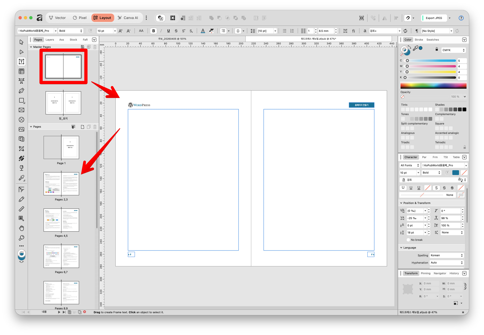
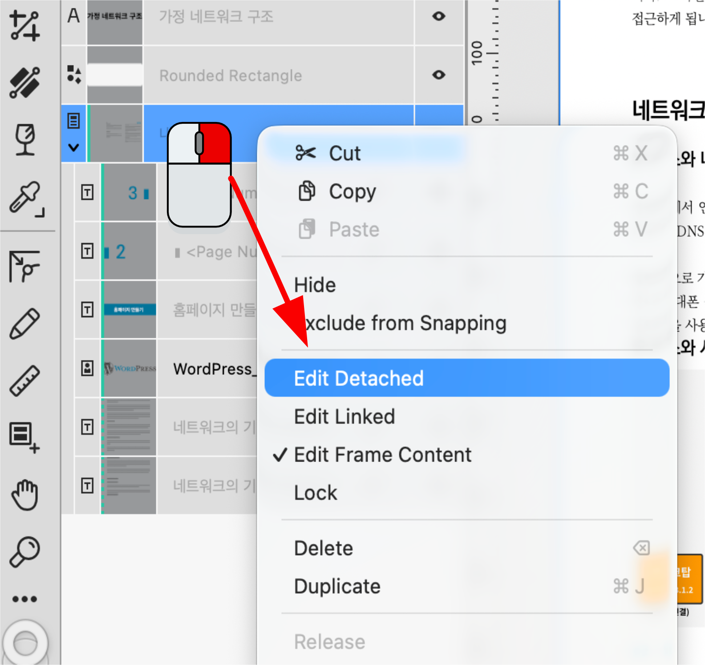
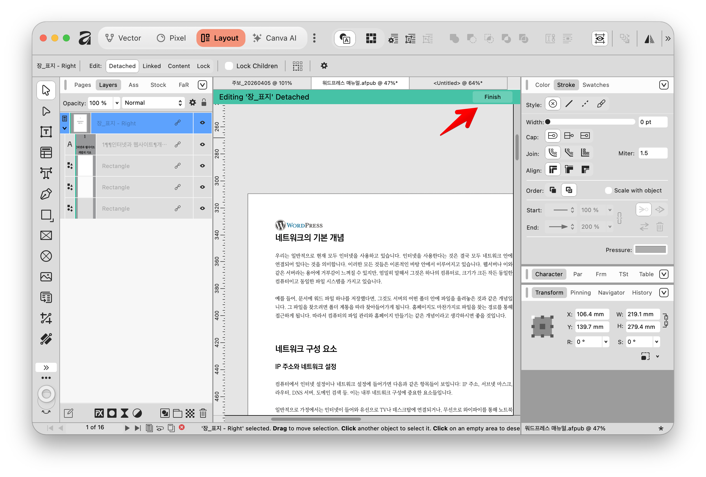

Affinity의 레이아웃 스튜디오(Layout Studio)에서 제공하는 **마스터 페이지(Master Pages)**는 문서의 여러 페이지에 반복적으로 들어가는 디자인 요소를 한 번에 관리할 수 있게 해주는 강력한 '템플릿' 기능입니다. 초보자도 쉽게 이해할 수 있도록 단계별로 설명해 드립니다.

### **1. 마스터 페이지란 무엇인가요?**

로고, 쪽 번호, 머리글(Header), 바닥글, 배경 그래픽 등 문서 전체에 공통으로 배치해야 하는 요소를 매 페이지마다 복사해서 붙여넣을 필요 없이, 한 곳에서 설정하는 기능입니다. **마스터 페이지의 내용을 한 번만 수정하면, 이 마스터가 적용된 모든 일반 문서 페이지에 자동으로 변경 사항이 반영**되어 작업 시간을 획기적으로 줄여줍니다.

### **2. 마스터 페이지 설정 및 사용 방법**

1. 앱 상단의 아이콘을 클릭하여 문서 편집에 최적화된 **레이아웃 스튜디오(Layout Studio)**로 이동합니다.
2. 화면 우측(또는 좌측)의 **Pages(페이지) 패널**을 열면, 패널 상단에 'Master Pages' 섹션이 있습니다.
3. 기본으로 생성되어 있는 **'Master A'를 더블 클릭**하여 마스터 편집 모드로 들어갑니다.
4. 이 빈 화면에 반복해서 보여줄 이미지(교회/회사 로고 등)를 배치하거나 텍스트를 입력합니다.
5. **자동 쪽 번호 넣기 (꿀팁):** 마스터 페이지 하단에 텍스트 상자를 만들고, 상단 메뉴에서 `Text > Insert > Fields > Page Number`를 선택하면 자동으로 숫자가 매겨지는 쪽 번호가 삽입됩니다.
6. 편집을 마친 후 다시 일반 페이지(예: Page 1)를 더블 클릭하여 돌아오면, 마스터에서 만든 요소들이 고정되어 나타납니다.

### **3. 마스터 페이지의 심화 활용법**

- **다중 페이지 레이아웃:** 브로슈어, 잡지, 책 등 페이지 수가 많은 프로젝트를 진행할 때 통일성 있는 뼈대를 잡는 핵심 도구로 활용됩니다.
- **계층형(중첩) 마스터 페이지:** 마스터 페이지 안에 또 다른 마스터 페이지를 적용할 수 있습니다. 예를 들어, 모든 페이지에 들어가는 '공통 쪽 번호'를 부모 마스터로 만들고, 각 챕터별로 색상이 다른 '머리글'을 가진 여러 개의 자식 마스터들에 부모 마스터를 적용하면 문서 전체를 아주 체계적으로 관리할 수 있습니다.

### **4. 일반 페이지에서 마스터 항목 개별 수정하기 (분리 편집)**

기본적으로 일반 페이지에서는 마스터에서 가져온 개체를 실수로 건드리지 못하도록 선택되거나 수정되지 않습니다. 레이어 패널을 보면 마스터 요소들은 **청록색 실선(Solid turquoise line)이 있는 하나의 마스터 레이어로 묶여 보호**되고 있습니다.

하지만 특정 페이지에 큰 사진이 들어가서 마스터의 머리글을 가리는 등, **특정 페이지에서만 예외적으로 마스터 요소를 옮기거나 수정**해야 할 때가 있습니다. 이때는 다음 방법을 사용합니다.

1. 수정하고 싶은 일반 페이지로 이동합니다.
2. 레이어 패널에서 청록색 실선이 있는 해당 **마스터 레이어를 클릭**하여 선택합니다.
3. 화면 상단의 **이동 도구(Move Tool) 컨텍스트 툴바**를 보면 **'분리 편집(Edit Detached)'**이라는 버튼이 있습니다. 이 버튼을 클릭합니다.
4. 이제 해당 페이지 안에서만 마스터 페이지의 요소들을 클릭하여 위치를 옮기거나 내용을 바꿀 수 있습니다.
5. 상단의 '완료(Finish)' 버튼을 누르면 원상태로 돌아옵니다.

이 기능을 사용하면 **마스터 템플릿과의 전체적인 연결 고리를 끊지 않고도, 해당 페이지에서만 일시적으로 구조를 변경**할 수 있어 디자인의 유연성을 크게 높일 수 있습니다.
