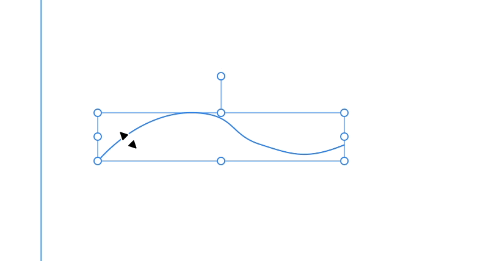

# 1. Text Frame 연결하기

Affinity Studio v3의 레이아웃 스튜디오(Layout Studio)에서 글상자(텍스트 프레임)를 연결하고, 대량의 텍스트 분량에 맞춰 자동으로 페이지를 생성하는 방법은 다음과 같습니다.

**1. 글상자(텍스트 프레임) 연결 방법** 여러 페이지에 걸쳐 긴 본문이 자연스럽게 이어지도록(Story) 여러 개의 텍스트 프레임을 서로 연결할 수 있습니다.

- *프레임 텍스트 툴(Frame Text Tool)**을 사용하여 텍스트가 들어갈 상자를 캔버스에 그립니다.
- 첫 번째 글상자에 텍스트를 입력했을 때 상자 크기보다 내용이 많아 넘치게 되면(오버플로우), 상자 오른쪽 하단에 텍스트가 넘쳤음을 알리는 **삼각형 아이콘(또는 빨간색 눈 모양 아이콘)**이 나타납니다.
- 이 오른쪽 하단의 아이콘을 마우스로 클릭한 뒤, 글이 이어질 다음 빈 글상자를 클릭합니다.
- 이제 두 프레임이 링크되어 첫 번째 상자에서 다 담지 못한 글이 두 번째 상자로 부드럽게 흘러가게 됩니다.

**2. 대량 텍스트 붙여넣기 시 자동 페이지 생성 방법 (Autoflow)** 수십 페이지 분량의 텍스트를 한 번에 붙여넣을 때, 넘치는 분량만큼 일일이 페이지와 프레임을 만들지 않고 소프트웨어가 자동으로 생성하게 하는 **오토플로우(Autoflow)** 기능이 있습니다.

- 첫 번째 글상자에 대량의 텍스트를 복사하여 붙여넣습니다.
- 글상자 우측 하단에 텍스트 넘침을 표시하는 아이콘(빨간색 눈/삼각형 아이콘)이 나타나면, **키보드의 Shift 키를 누른 상태로 해당 아이콘을 클릭**합니다.
- 이 'Shift + 클릭' 동작이 오토플로우 기능을 작동시켜, 남은 텍스트를 모두 담을 때까지 필요한 만큼의 새 페이지를 자동으로 추가하고 연결된 텍스트 프레임들을 연달아 생성해 줍니다.

이 기능을 활용하면 책이나 긴 보고서 등의 초기 조판(Typesetting) 작업을 할 때 수작업 시간을 획기적으로 줄일 수 있습니다.

# 2. 선을 따라 흐르는 텍스트 (Text on a Path)

아티스틱 텍스트 도구를 사용하여 펜 도구로 그린 자유 곡선이나 원형 같은 기본 도형의 테두리를 따라 글자가 흐르게 만들 수 있습니다.

- **사용 방법:**
  1. 먼저 펜 도구, 연필 도구 또는 원형(Ellipse) 도구를 사용하여 원하는 선이나 도형을 그립니다.
  2. 도구 모음에서 **아티스틱 텍스트 도구(Artistic Text Tool)**를 선택합니다.
  3. 마우스 커서를 그려둔 선이나 도형의 테두리 위로 가져가면 커서의 모양이 '선을 따라 흐르는 텍스트' 아이콘으로 바뀝니다.
    - *팁:* 선의 아주 살짝 위를 클릭하면 선 바깥쪽으로 글자가 써지고, 살짝 아래를 클릭하면 선 안쪽을 따라 글자가 써집니다.
  4. 클릭한 후 원하는 텍스트를 입력합니다.
- **텍스트 위치 및 간격 조절:**
  - 텍스트를 입력하면 **녹색 삼각형(시작점)**과 **빨간색 삼각형(끝점)**이 나타납니다. 이 삼각형들을 마우스로 드래그하여 선 위에서 텍스트가 시작되고 끝나는 위치를 자유롭게 옮길 수 있습니다.
  - 텍스트를 모두 선택한 후 `Alt/Option` 키를 누른 채 키보드의 좌우 방향키를 누르면 전체 글자 사이의 간격(Tracking)을 쉽게 조절할 수 있습니다.
  - 컨텍스트 툴바에 있는 **기준선(Baseline)** 수치를 조절(예: 0%에서 수치를 올리거나 내림)하여 텍스트를 선에 정확히 붙이거나 선에서 위아래로 띄울 수 있습니다.

# 3. 이미지/도형을 피해서 흐르는 텍스트 (Text Wrap)

주로 레이아웃 스튜디오(Layout Studio)에서 잡지나 브로슈어를 디자인할 때 긴 본문 텍스트가 삽입된 사진이나 그래픽 요소를 자연스럽게 감싸며 피해서 흐르도록 하는 기능입니다.

- **사용 방법:**
  1. 프레임 텍스트 도구(Frame Text Tool)를 사용하여 긴 본문이 들어갈 텍스트 상자를 만들고 글을 채웁니다.
  2. 글자 위에 올려둘 이미지나 벡터 도형을 캔버스에 가져옵니다. (레이어 패널에서 이미지/도형 레이어가 텍스트 레이어보다 위에 있어야 합니다.)
  3. 삽입한 이미지나 도형을 선택한 상태에서 상단 툴바에 있는 **'텍스트 흐르기(Text Wrap)'** 설정을 켭니다.
- **세밀한 제어:**
  - 단순히 글자가 피하는 것을 넘어, **패딩(Padding)** 거리를 미세하게 제어하여 객체와 텍스트 사이의 여백을 원하는 만큼 조절할 수 있습니다.
  - 유기적이거나 불규칙한 형태의 객체(예: 배경을 지운 인물 사진) 주변으로 텍스트가 흐를 때, 텍스트가 피하는 **윤곽선(Wrap Outline)을 수동으로 직접 편집**할 수 있습니다. 이를 통해 텍스트가 이미지의 형태에 딱 맞게 감싸도록 하여 훨씬 전문적이고 깔끔한 레이아웃을 구성할 수 있습니다.
