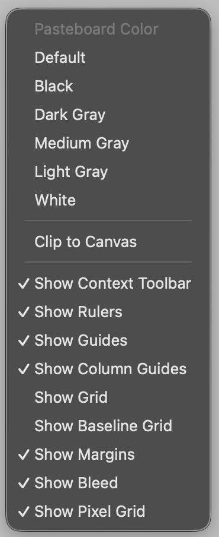

### Pasteboard 컬러 및 Object 보이도록 설정하는 법

- Canvas 바깥 영역(Pasteboard)에서 마우스 오른쪽 버튼 클릭
- 상단에서 배경색 지정
- Clip to Canvas: Pasteboard 내에 있는 Object를 표시할지를 선택
  - 체크: Canvas 영역만 표시
  - 체크 해제: Pasteboard 영역의 Object도 표시

