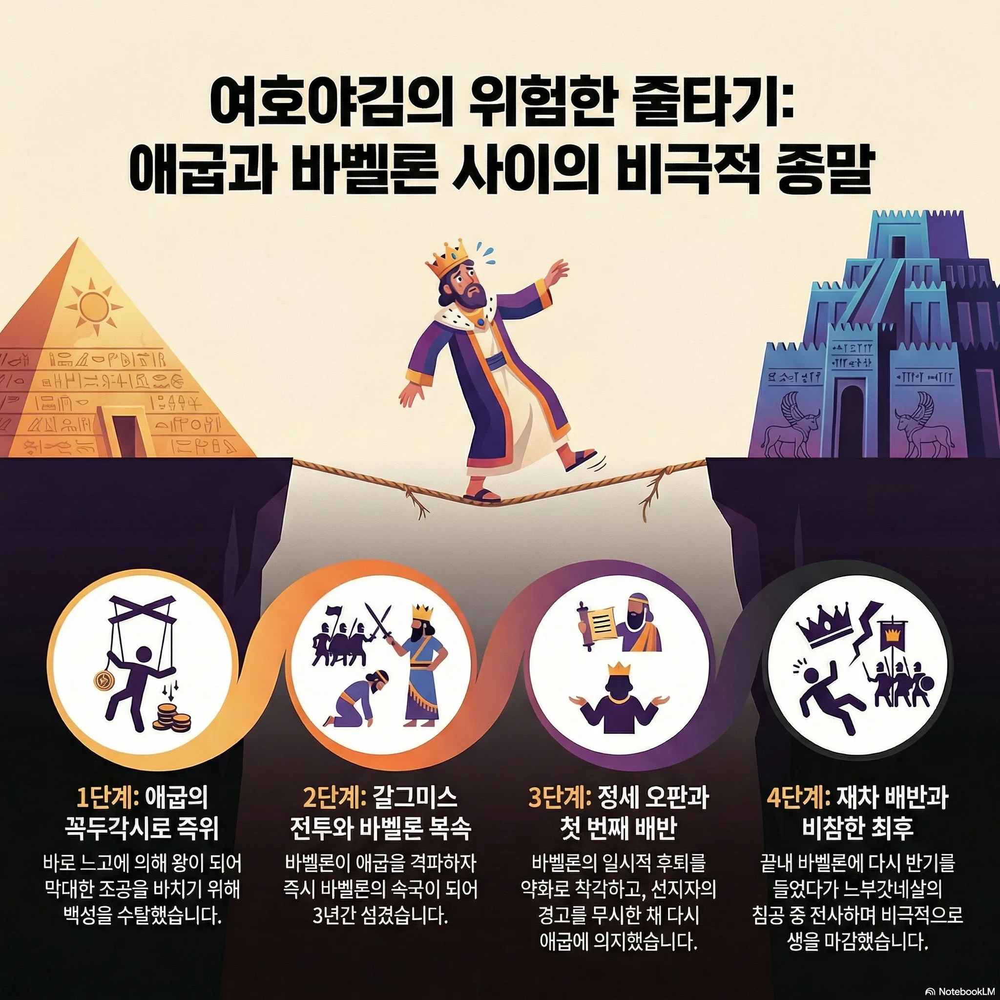

## 여호야김 왕의 정치 노선 분석

### 👑 여호야김 (Jehoiakim, 주전 608-598년)

**이름**: 여호야김 (יְהוֹיָקִים, "여호와께서 세우시다")
**원래 이름**: 엘리야김
**재위 기간**: 주전 608-598년 (11년)
**아버지**: 요시야
**형제**: 여호아하스, 시드기야

### 🌍 당시 국제 정세

### **주요 세력 구도**

- **쇠퇴하는 앗수르** (주전 612년 니느웨 함락)
- **신흥 바벨론** (느부갓네살, 갈그미스 전투 주전 605년 승리)
- **애굽(이집트)** (네카우 2세/바로 느고, 주전 610-595년)

### 📜 여호야김의 정치 노선 변화

### **1단계: 애굽의 꼭두각시 왕 (주전 608-605년)**

**배경**:

- 아버지 요시야가 므깃도 전투에서 애굽 왕 네카우 2세에게 죽임당함 (주전 609년)
- 동생 여호아하스가 3개월 재위 후 애굽에 의해 폐위됨
- 애굽 왕 네카우 2세가 여호야김을 왕으로 옹립

**정책**:

- 애굽에 막대한 조공 바침
- 백성들을 수탈하여 애굽에 아부
- 애굽의 속국으로서 생존 전략

### **2단계: 강제적 바벨론 복속 (주전 605-601년, 3년간)**

**전환점**: **갈그미스 전투 (주전 605년)**

- 바벨론 느부갓네살이 애굽군을 완전히 격파
- 바벨론이 시리아-팔레스타인 지역 장악
- 여호야김, 애굽 의존에서 바벨론 속국으로 전환

**이 시기**:

- 다니엘과 세 친구가 1차 포로로 바벨론에 끌려감 (주전 605년)
- 여호야김은 바벨론을 섬기며 조공 바침
- 성전 기구들이 바벨론으로 약탈당함

### **3단계: 1차 배반과 굴욕 (주전 601-598년)**

**배반 이유**:

1. **애굽-바벨론 전투** (주전 601년)
  - 애굽과 바벨론이 접전, 무승부에 가까운 결과
  - 바벨론군이 손실을 입고 철수
  - 여호야김이 이를 바벨론 약화로 오판
2. **친애굽 세력의 압력**
  - 유다 지도층에 강력한 친애굽파 존재
  - 전통적으로 애굽을 큰 형님처럼 의지하는 경향
3. **선지자 무시**
  - 예레미야의 경고("바벨론에 항복하라") 완전 무시
  - 두루마리 책을 불태우는 만행

**결과** (주전 602년):

- 바벨론군이 다시 침공
- 여호야김이 쇠사슬로 결박되어 바벨론으로 끌려감
- 충성 맹세 후 귀환 (역대하 36:6)

### **4단계: 2차 배반과 비극적 최후 (주전 598년)**

**재차 배반**:

- 598년경 다시 바벨론에 반기
- 이번에는 애굽과의 동맹 재개 시도

**비참한 결말**:

- 느부갓네살의 3차 침공
- 여호야김이 전투 중 전사 (주전 598년)
- 아들 여호야긴이 즉위하지만 3개월 만에 폐위되어 포로로 끌려감

### ⚖️ 여호야김 정치 노선의 특징

### **1. 기회주의적 외교**

- 강자에게 줄 대기
- 일관성 없는 정책
- 국제 정세 오판

### **2. 애굽 의존증**

- 전통적 친애굽 성향
- 애굽의 실제 국력 과대평가
- 바벨론의 새로운 패권 인정 거부

### **3. 영적 타락**

- 요시야의 종교개혁 무효화
- 우상 숭배 부활
- 하나님 말씀 거역 (예레미야 두루마리 소각)
- 의인 박해와 살해

### **4. 백성 수탈**

- 애굽 조공 마련을 위한 무리한 세금
- 사치스러운 궁전 건축 (예레미야 22:13-14)
- 불의한 노동 착취

### 💭 역사적 평가

**실패한 정치가**:

- 근동 정세의 본질적 변화(앗수르→바벨론)를 읽지 못함
- 애굽의 쇠퇴와 바벨론의 부상을 제대로 판단하지 못함
- 선지자의 경고를 무시하고 자신의 정치적 계산만 믿음

**유다 멸망의 직접적 원인**:

- 여호야김의 반복된 배반으로 바벨론의 신뢰 완전 상실
- 이후 시드기야 시대에도 친애굽 정책 계속
- 결국 주전 586년 예루살렘 완전 멸망

**성경의 평가** (열왕기하 24:3-4):

> "이 일이 유다에 임함은 곧 여호와의 말씀대로 그들을 그의 앞에서 물리치심이니 이는 므낫세가 지은 모든 죄로 말미암음이며, 또 그가 무죄한 자의 피를 흘려 그의 피가 예루살렘에 가득하게 하였음이라"

여호야김은 **정치적 판단 미숙**, **영적 타락**, **백성 수탈**의 삼중 실패로 유다 멸망을 재촉한 왕으로 평가됩니다.
