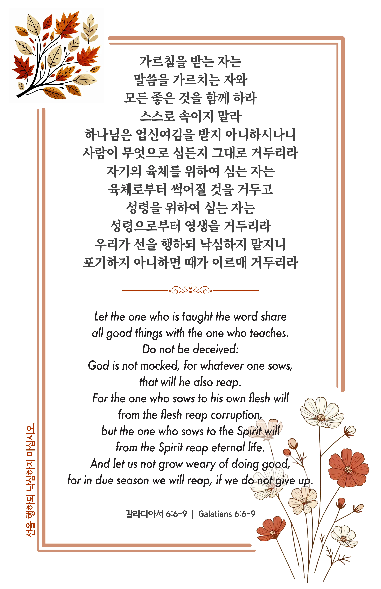

## 갈라디아서 6:6-9 (개역개정)

> **6** ○가르침을 받는 자는 말씀을 가르치는 자와 모든 좋은 것을 함께 하라
>
> **7** 스스로 속이지 말라 하나님은 업신여김을 받지 아니하시나니 사람이 무엇으로 심든지 그대로 거두리라
>
> **8** 자기의 육체를 위하여 심는 자는 육체로부터 썩어질 것을 거두고 성령을 위하여 심는 자는 성령으로부터 영생을 거두리라
>
> **9** 우리가 선을 행하되 낙심하지 말지니 포기하지 아니하면 때가 이르매 거두리라

> 이슬비전도카드는 한 영혼에게 복음과 사랑을 전하는 문서선교 도구입니다. 자유롭게 나누고 전해 주세요.
