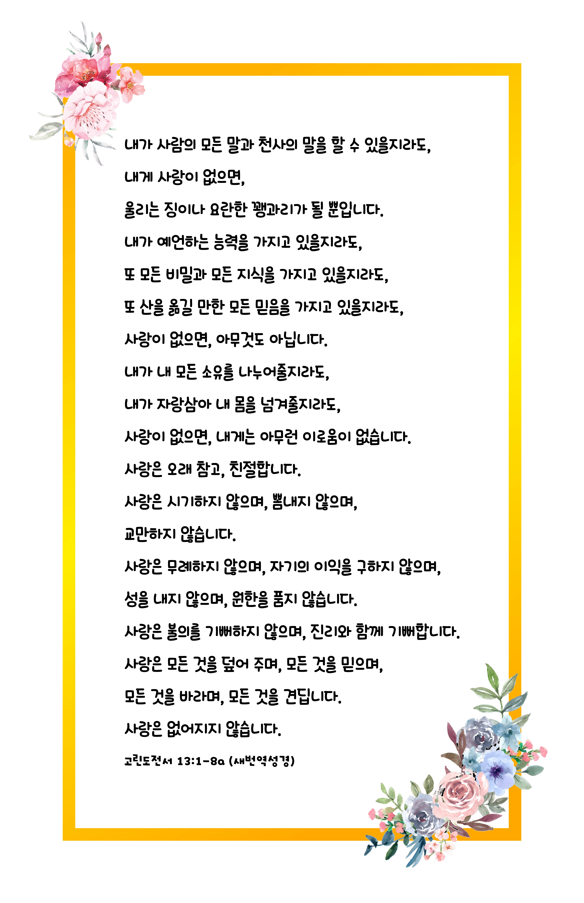

## 고린도전서 13:1-8a (개역개정)

> **1** 내가 사람의 방언과 천사의 말을 할지라도 사랑이 없으면 소리 나는 구리와 울리는 꽹과리가 되고
>
> **2** 내가 예언하는 능력이 있어 모든 비밀과 모든 지식을 알고 또 산을 옮길 만한 모든 믿음이 있을지라도 사랑이 없으면 내가 아무 것도 아니요
>
> **3** 내가 내게 있는 모든 것으로 구제하고 또 내 몸을 불사르게 내줄지라도 사랑이 없으면 내게 아무 유익이 없느니라
>
> **4** 사랑은 오래 참고 사랑은 온유하며 시기하지 아니하며 사랑은 자랑하지 아니하며 교만하지 아니하며
>
> **5** 무례히 행하지 아니하며 자기의 유익을 구하지 아니하며 성내지 아니하며 악한 것을 생각하지 아니하며
>
> **6** 불의를 기뻐하지 아니하며 진리와 함께 기뻐하고
>
> **7** 모든 것을 참으며 모든 것을 믿으며 모든 것을 바라며 모든 것을 견디느니라
>
> **8** 사랑은 언제까지나 떨어지지 아니하되 예언도 폐하고 방언도 그치고 지식도 폐하리라

> 이슬비전도카드는 한 영혼에게 복음과 사랑을 전하는 문서선교 도구입니다. 자유롭게 나누고 전해 주세요.
