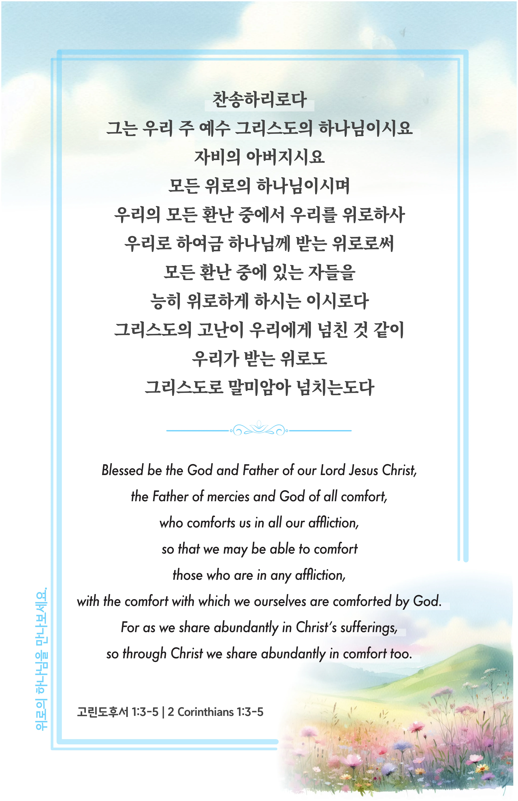

## 고린도후서 1:3-5 (개역개정)

> **3** 찬송하리로다 그는 우리 주 예수 그리스도의 하나님이시요 자비의 아버지시요 모든 위로의 하나님이시며
>
> **4** 우리의 모든 환난 중에서 우리를 위로하사 우리로 하여금 하나님께 받는 위로로써 모든 환난 중에 있는 자들을 능히 위로하게 하시는 이시로다
>
> **5** 그리스도의 고난이 우리에게 넘친 것 같이 우리가 받는 위로도 그리스도로 말미암아 넘치는도다

> 이슬비전도카드는 한 영혼에게 복음과 사랑을 전하는 문서선교 도구입니다. 자유롭게 나누고 전해 주세요.
