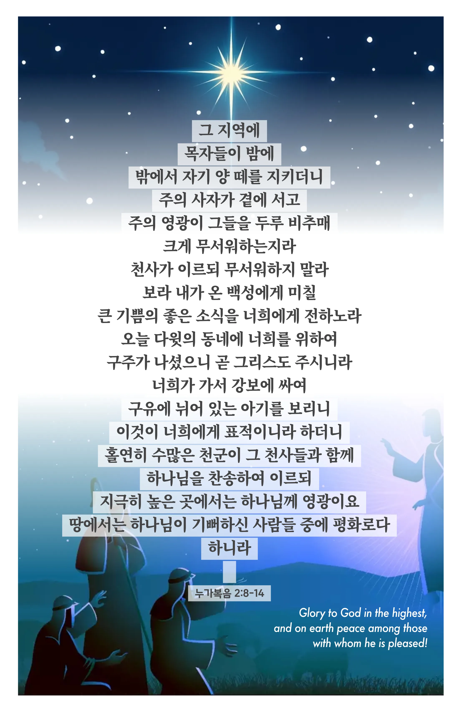

## 누가복음 2:8-14 (개역개정)

> **8** ○그 지역에 목자들이 밤에 밖에서 자기 양 떼를 지키더니
>
> **9** 주의 사자가 곁에 서고 주의 영광이 그들을 두루 비추매 크게 무서워하는지라
>
> **10** 천사가 이르되 무서워하지 말라 보라 내가 온 백성에게 미칠 큰 기쁨의 좋은 소식을 너희에게 전하노라
>
> **11** 오늘 다윗의 동네에 너희를 위하여 구주가 나셨으니 곧 그리스도 주시니라
>
> **12** 너희가 가서 강보에 싸여 구유에 뉘어 있는 아기를 보리니 이것이 너희에게 표적이니라 하더니
>
> **13** 홀연히 수많은 천군이 그 천사들과 함께 하나님을 찬송하여 이르되
>
> **14** 지극히 높은 곳에서는 하나님께 영광이요 땅에서는 하나님이 기뻐하신 사람들 중에 평화로다 하니라

> 이슬비전도카드는 한 영혼에게 복음과 사랑을 전하는 문서선교 도구입니다. 자유롭게 나누고 전해 주세요.
