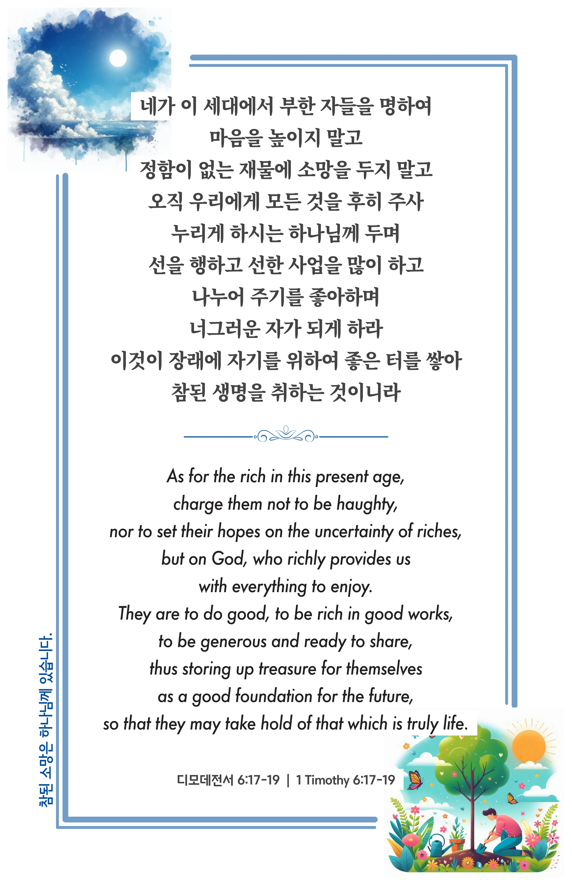

## 디모데전서 6:17-19 (개역개정)

> **17** ○네가 이 세대에서 부한 자들을 명하여 마음을 높이지 말고 정함이 없는 재물에 소망을 두지 말고 오직 우리에게 모든 것을 후히 주사 누리게 하시는 하나님께 두며
>
> **18** 선을 행하고 선한 사업을 많이 하고 나누어 주기를 좋아하며 너그러운 자가 되게 하라
>
> **19** 이것이 장래에 자기를 위하여 좋은 터를 쌓아 참된 생명을 취하는 것이니라

> 이슬비전도카드는 한 영혼에게 복음과 사랑을 전하는 문서선교 도구입니다. 자유롭게 나누고 전해 주세요.
