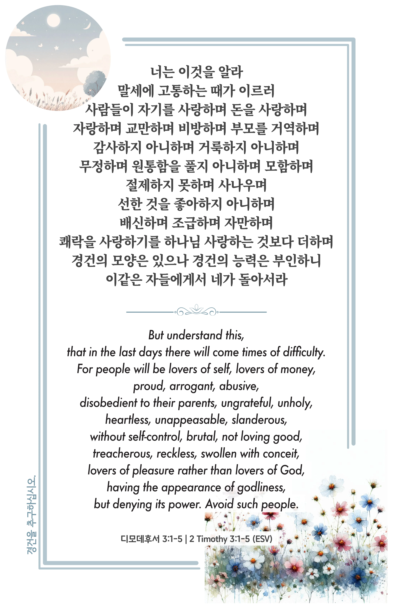

## 디모데후서 3:1-5 (개역개정)

> **1** 너는 이것을 알라 말세에 고통하는 때가 이르러
>
> **2** 사람들이 자기를 사랑하며 돈을 사랑하며 자랑하며 교만하며 비방하며 부모를 거역하며 감사하지 아니하며 거룩하지 아니하며
>
> **3** 무정하며 원통함을 풀지 아니하며 모함하며 절제하지 못하며 사나우며 선한 것을 좋아하지 아니하며
>
> **4** 배신하며 조급하며 자만하며 쾌락을 사랑하기를 하나님 사랑하는 것보다 더하며
>
> **5** 경건의 모양은 있으나 경건의 능력은 부인하니 이같은 자들에게서 네가 돌아서라

> 이슬비전도카드는 한 영혼에게 복음과 사랑을 전하는 문서선교 도구입니다. 자유롭게 나누고 전해 주세요.
