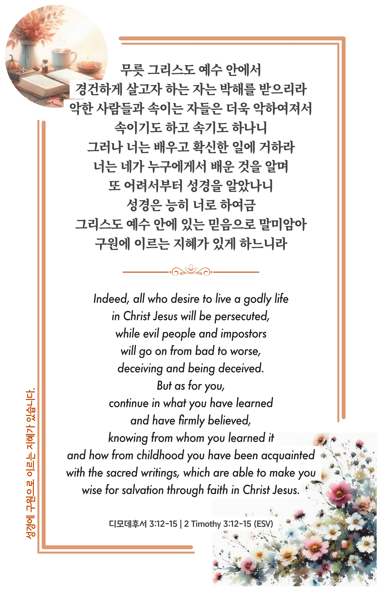

## 디모데후서 3:12-15 (개역개정)

> **12** 무릇 그리스도 예수 안에서 경건하게 살고자 하는 자는 박해를 받으리라
>
> **13** 악한 사람들과 속이는 자들은 더욱 악하여져서 속이기도 하고 속기도 하나니
>
> **14** 그러나 너는 배우고 확신한 일에 거하라 너는 네가 누구에게서 배운 것을 알며
>
> **15** 또 어려서부터 성경을 알았나니 성경은 능히 너로 하여금 그리스도 예수 안에 있는 믿음으로 말미암아 구원에 이르는 지혜가 있게 하느니라

> 이슬비전도카드는 한 영혼에게 복음과 사랑을 전하는 문서선교 도구입니다. 자유롭게 나누고 전해 주세요.
