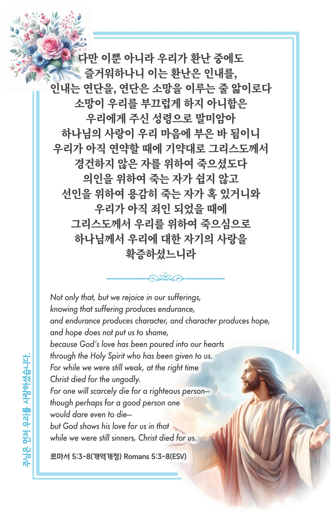

## 로마서 5:3-8 (개역개정)

> **3** 다만 이뿐 아니라 우리가 환난 중에도 즐거워하나니 이는 환난은 인내를,
>
> **4** 인내는 연단을, 연단은 소망을 이루는 줄 앎이로다
>
> **5** 소망이 우리를 부끄럽게 하지 아니함은 우리에게 주신 성령으로 말미암아 하나님의 사랑이 우리 마음에 부은 바 됨이니
>
> **6** 우리가 아직 연약할 때에 기약대로 그리스도께서 경건하지 않은 자를 위하여 죽으셨도다
>
> **7** 의인을 위하여 죽는 자가 쉽지 않고 선인을 위하여 용감히 죽는 자가 혹 있거니와
>
> **8** 우리가 아직 죄인 되었을 때에 그리스도께서 우리를 위하여 죽으심으로 하나님께서 우리에 대한 자기의 사랑을 확증하셨느니라

> 이슬비전도카드는 한 영혼에게 복음과 사랑을 전하는 문서선교 도구입니다. 자유롭게 나누고 전해 주세요.
