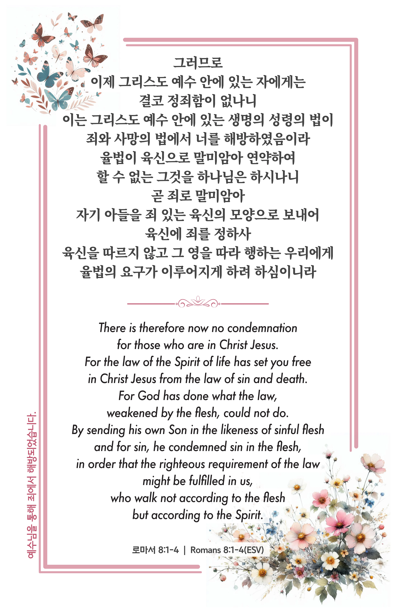

## 로마서 8:1-4 (개역개정)

> **1** 그러므로 이제 그리스도 예수 안에 있는 자에게는 결코 정죄함이 없나니
>
> **2** 이는 그리스도 예수 안에 있는 생명의 성령의 법이 죄와 사망의 법에서 너를 해방하였음이라
>
> **3** 율법이 육신으로 말미암아 연약하여 할 수 없는 그것을 하나님은 하시나니 곧 죄로 말미암아 자기 아들을 죄 있는 육신의 모양으로 보내어 육신에 죄를 정하사
>
> **4** 육신을 따르지 않고 그 영을 따라 행하는 우리에게 율법의 요구가 이루어지게 하려 하심이니라

> 이슬비전도카드는 한 영혼에게 복음과 사랑을 전하는 문서선교 도구입니다. 자유롭게 나누고 전해 주세요.
