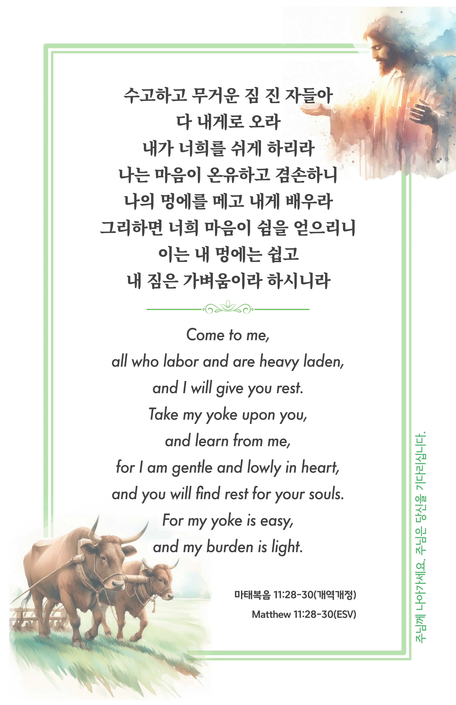

## 마태복음 11:28-30 (개역개정)

> **28** 수고하고 무거운 짐 진 자들아 다 내게로 오라 내가 너희를 쉬게 하리라
>
> **29** 나는 마음이 온유하고 겸손하니 나의 멍에를 메고 내게 배우라 그리하면 너희 마음이 쉼을 얻으리니
>
> **30** 이는 내 멍에는 쉽고 내 짐은 가벼움이라 하시니라

> 이슬비전도카드는 한 영혼에게 복음과 사랑을 전하는 문서선교 도구입니다. 자유롭게 나누고 전해 주세요.
