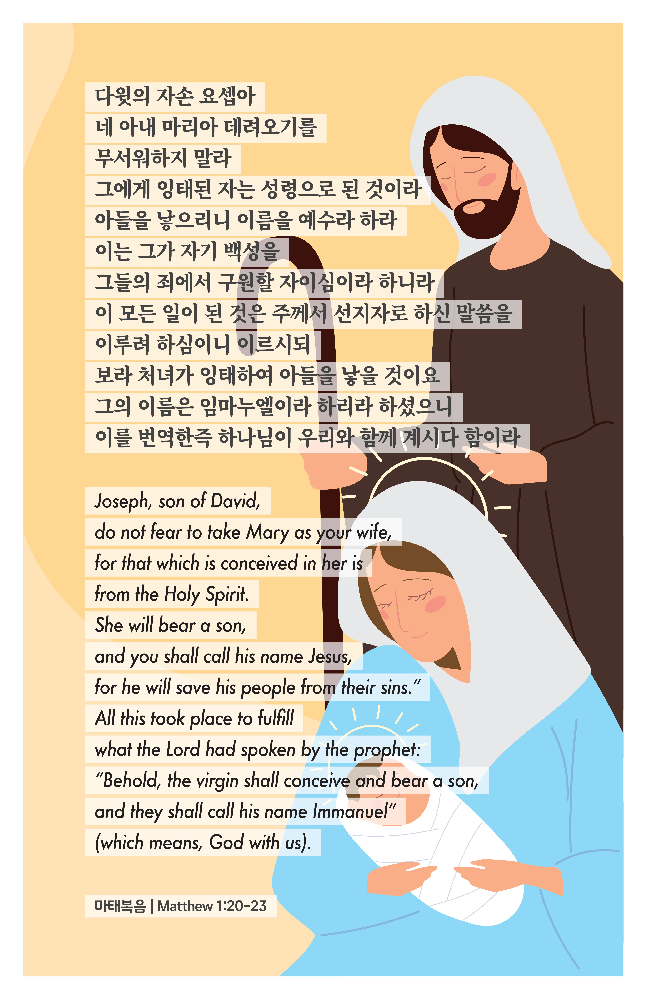

## 마태복음 1:20-23 (개역개정)

> **20** 이 일을 생각할 때에 주의 사자가 현몽하여 이르되 다윗의 자손 요셉아 네 아내 마리아 데려오기를 무서워하지 말라 그에게 잉태된 자는 성령으로 된 것이라
>
> **21** 아들을 낳으리니 이름을 예수라 하라 이는 그가 자기 백성을 그들의 죄에서 구원할 자이심이라 하니라
>
> **22** 이 모든 일이 된 것은 주께서 선지자로 하신 말씀을 이루려 하심이니 이르시되
>
> **23** 보라 처녀가 잉태하여 아들을 낳을 것이요 그의 이름은 임마누엘이라 하리라 하셨으니 이를 번역한즉 하나님이 우리와 함께 계시다 함이라

> 이슬비전도카드는 한 영혼에게 복음과 사랑을 전하는 문서선교 도구입니다. 자유롭게 나누고 전해 주세요.
