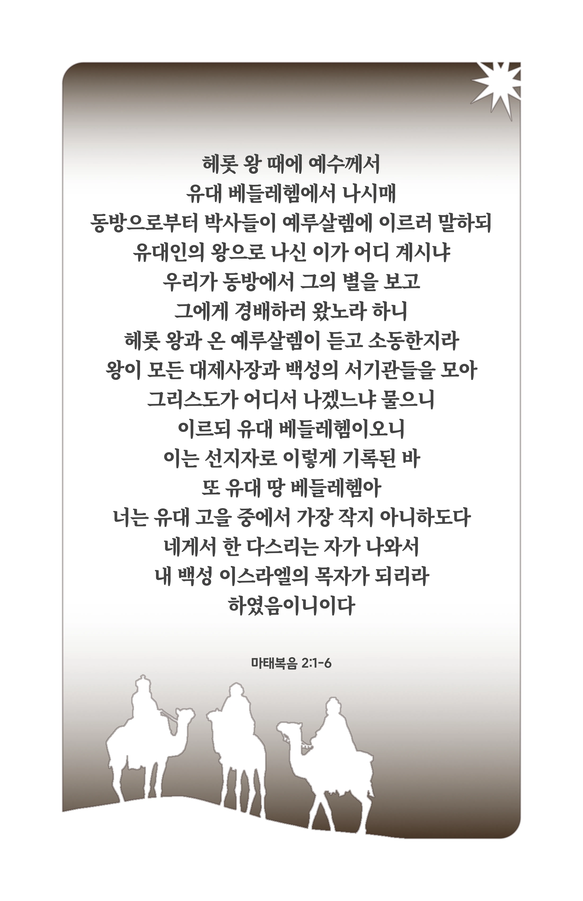
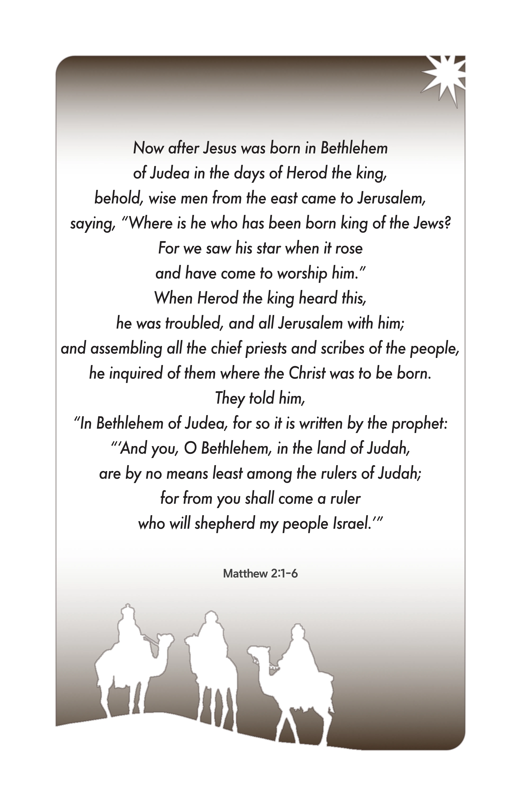

## 마태복음 2:1-6 (개역개정)

> **1** 헤롯 왕 때에 예수께서 유대 베들레헴에서 나시매 동방으로부터 박사들이 예루살렘에 이르러 말하되
>
> **2** 유대인의 왕으로 나신 이가 어디 계시냐 우리가 동방에서 그의 별을 보고 그에게 경배하러 왔노라 하니
>
> **3** 헤롯 왕과 온 예루살렘이 듣고 소동한지라
>
> **4** 왕이 모든 대제사장과 백성의 서기관들을 모아 그리스도가 어디서 나겠느냐 물으니
>
> **5** 이르되 유대 베들레헴이오니 이는 선지자로 이렇게 기록된 바
>
> **6** 또 유대 땅 베들레헴아 너는 유대 고을 중에서 가장 작지 아니하도다 네게서 한 다스리는 자가 나와서 내 백성 이스라엘의 목자가 되리라 하였음이니이다

> 이슬비전도카드는 한 영혼에게 복음과 사랑을 전하는 문서선교 도구입니다. 자유롭게 나누고 전해 주세요.
