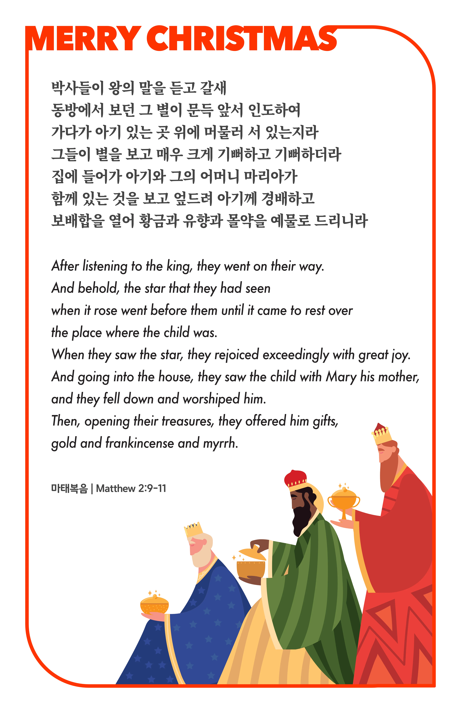

## 마태복음 2:9-11 (개역개정)

> **9** 박사들이 왕의 말을 듣고 갈새 동방에서 보던 그 별이 문득 앞서 인도하여 가다가 아기 있는 곳 위에 머물러 서 있는지라
>
> **10** 그들이 별을 보고 매우 크게 기뻐하고 기뻐하더라
>
> **11** 집에 들어가 아기와 그의 어머니 마리아가 함께 있는 것을 보고 엎드려 아기께 경배하고 보배합을 열어 황금과 유향과 몰약을 예물로 드리니라

> 이슬비전도카드는 한 영혼에게 복음과 사랑을 전하는 문서선교 도구입니다. 자유롭게 나누고 전해 주세요.
