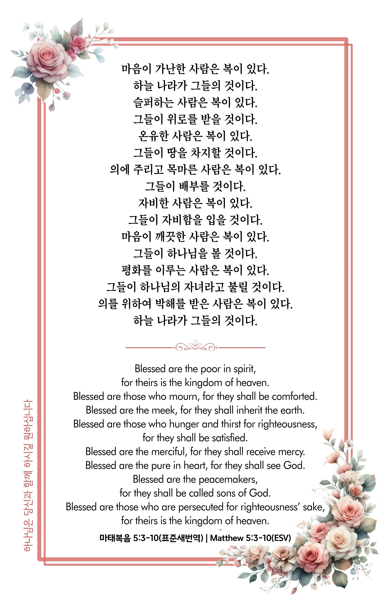

## 마태복음 5:3-10 (개역개정)

> **3** 심령이 가난한 자는 복이 있나니 천국이 그들의 것임이요
>
> **4** 애통하는 자는 복이 있나니 그들이 위로를 받을 것임이요
>
> **5** 온유한 자는 복이 있나니 그들이 땅을 기업으로 받을 것임이요
>
> **6** 의에 주리고 목마른 자는 복이 있나니 그들이 배부를 것임이요
>
> **7** 긍휼히 여기는 자는 복이 있나니 그들이 긍휼히 여김을 받을 것임이요
>
> **8** 마음이 청결한 자는 복이 있나니 그들이 하나님을 볼 것임이요
>
> **9** 화평하게 하는 자는 복이 있나니 그들이 하나님의 아들이라 일컬음을 받을 것임이요
>
> **10** 의를 위하여 박해를 받은 자는 복이 있나니 천국이 그들의 것임이라

> 이슬비전도카드는 한 영혼에게 복음과 사랑을 전하는 문서선교 도구입니다. 자유롭게 나누고 전해 주세요.
