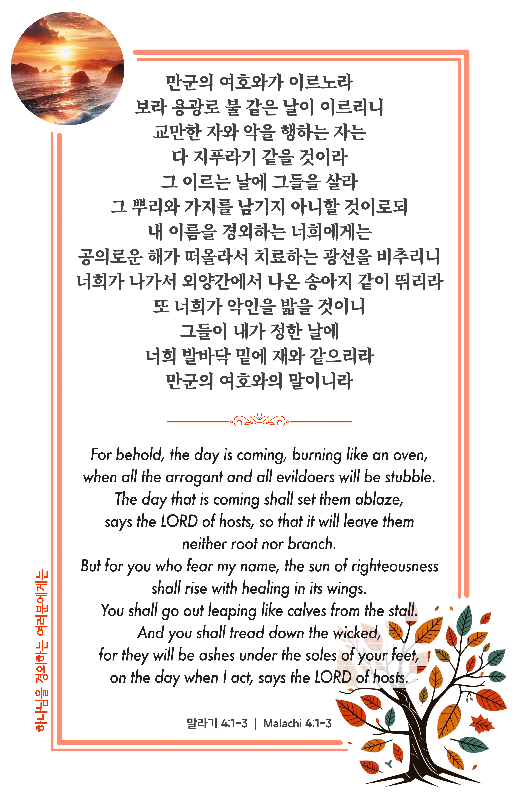

## 말라기 4:1-3 (개역개정)

> **1** 만군의 여호와가 이르노라 보라 용광로 불 같은 날이 이르리니 교만한 자와 악을 행하는 자는 다 지푸라기 같을 것이라 그 이르는 날에 그들을 살라 그 뿌리와 가지를 남기지 아니할 것이로되
>
> **2** 내 이름을 경외하는 너희에게는 공의로운 해가 떠올라서 치료하는 광선을 비추리니 너희가 나가서 외양간에서 나온 송아지 같이 뛰리라
>
> **3** 또 너희가 악인을 밟을 것이니 그들이 내가 정한 날에 너희 발바닥 밑에 재와 같으리라 만군의 여호와의 말이니라

> 이슬비전도카드는 한 영혼에게 복음과 사랑을 전하는 문서선교 도구입니다. 자유롭게 나누고 전해 주세요.
