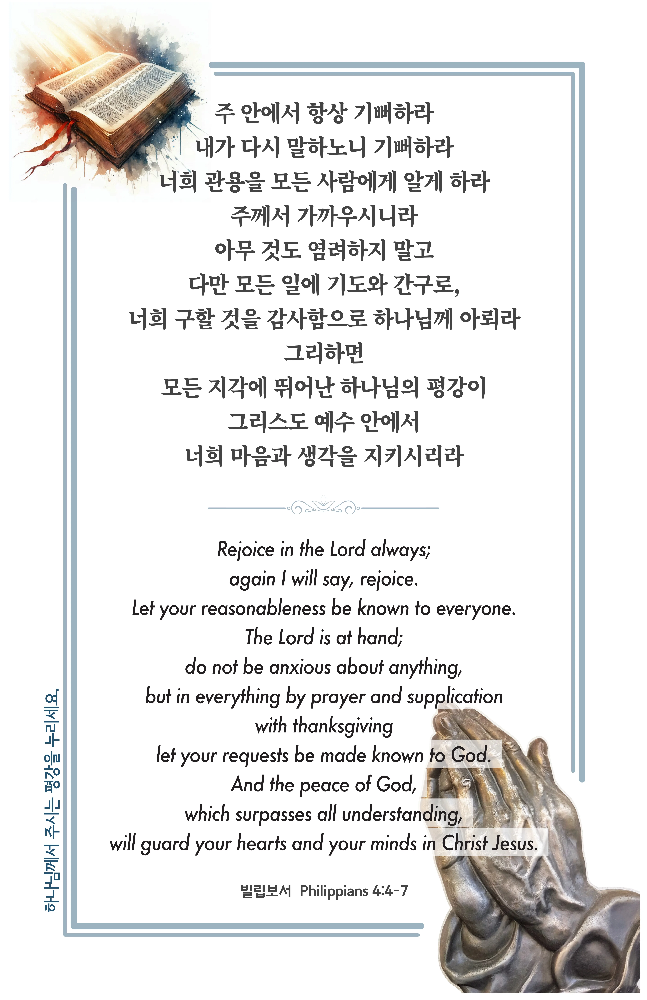

## 빌립보서 4:4-7 (개역개정)

> **4** ○주 안에서 항상 기뻐하라 내가 다시 말하노니 기뻐하라
>
> **5** 너희 관용을 모든 사람에게 알게 하라 주께서 가까우시니라
>
> **6** 아무 것도 염려하지 말고 다만 모든 일에 기도와 간구로, 너희 구할 것을 감사함으로 하나님께 아뢰라
>
> **7** 그리하면 모든 지각에 뛰어난 하나님의 평강이 그리스도 예수 안에서 너희 마음과 생각을 지키시리라

> 이슬비전도카드는 한 영혼에게 복음과 사랑을 전하는 문서선교 도구입니다. 자유롭게 나누고 전해 주세요.
