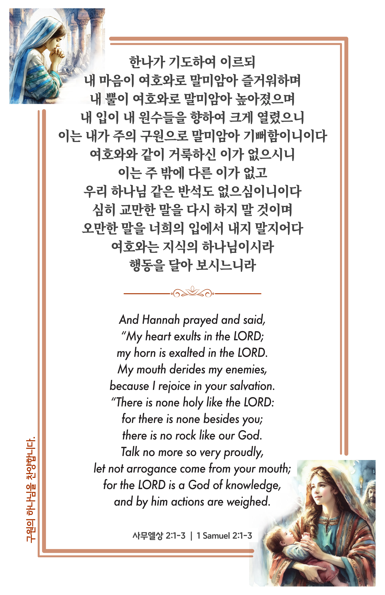

## 사무엘상 2:1-3 (개역개정)

> **1** 한나가 기도하여 이르되 내 마음이 여호와로 말미암아 즐거워하며 내 뿔이 여호와로 말미암아 높아졌으며 내 입이 내 원수들을 향하여 크게 열렸으니 이는 내가 주의 구원으로 말미암아 기뻐함이니이다
>
> **2** 여호와와 같이 거룩하신 이가 없으시니 이는 주 밖에 다른 이가 없고 우리 하나님 같은 반석도 없으심이니이다
>
> **3** 심히 교만한 말을 다시 하지 말 것이며 오만한 말을 너희의 입에서 내지 말지어다 여호와는 지식의 하나님이시라 행동을 달아 보시느니라

> 이슬비전도카드는 한 영혼에게 복음과 사랑을 전하는 문서선교 도구입니다. 자유롭게 나누고 전해 주세요.
