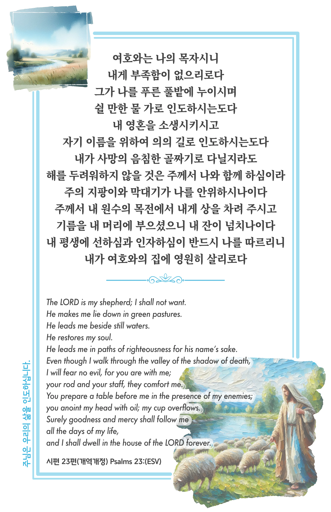

## 시편 23편 (개역개정)

> **1** 여호와는 나의 목자시니 내게 부족함이 없으리로다
>
> **2** 그가 나를 푸른 풀밭에 누이시며 쉴 만한 물 가로 인도하시는도다
>
> **3** 내 영혼을 소생시키시고 자기 이름을 위하여 의의 길로 인도하시는도다
>
> **4** 내가 사망의 음침한 골짜기로 다닐지라도 해를 두려워하지 않을 것은 주께서 나와 함께 하심이라 주의 지팡이와 막대기가 나를 안위하시나이다
>
> **5** 주께서 내 원수의 목전에서 내게 상을 차려 주시고 기름을 내 머리에 부으셨으니 내 잔이 넘치나이다
>
> **6** 내 평생에 선하심과 인자하심이 반드시 나를 따르리니 내가 여호와의 집에 영원히 살리로다

> 이슬비전도카드는 한 영혼에게 복음과 사랑을 전하는 문서선교 도구입니다. 자유롭게 나누고 전해 주세요.
