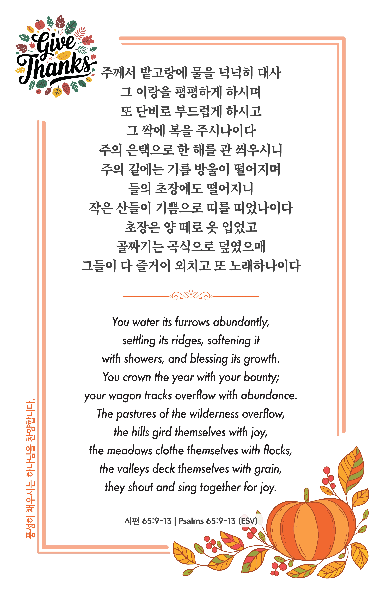

## 시편 65:9-13 (개역개정)

> **9** 땅을 돌보사 물을 대어 심히 윤택하게 하시며 하나님의 강에 물이 가득하게 하시고 이같이 땅을 예비하신 후에 그들에게 곡식을 주시나이다
>
> **10** 주께서 밭고랑에 물을 넉넉히 대사 그 이랑을 평평하게 하시며 또 단비로 부드럽게 하시고 그 싹에 복을 주시나이다
>
> **11** 주의 은택으로 한 해를 관 씌우시니 주의 길에는 기름 방울이 떨어지며
>
> **12** 들의 초장에도 떨어지니 작은 산들이 기쁨으로 띠를 띠었나이다
>
> **13** 초장은 양 떼로 옷 입었고 골짜기는 곡식으로 덮였으매 그들이 다 즐거이 외치고 또 노래하나이다

> 이슬비전도카드는 한 영혼에게 복음과 사랑을 전하는 문서선교 도구입니다. 자유롭게 나누고 전해 주세요.
