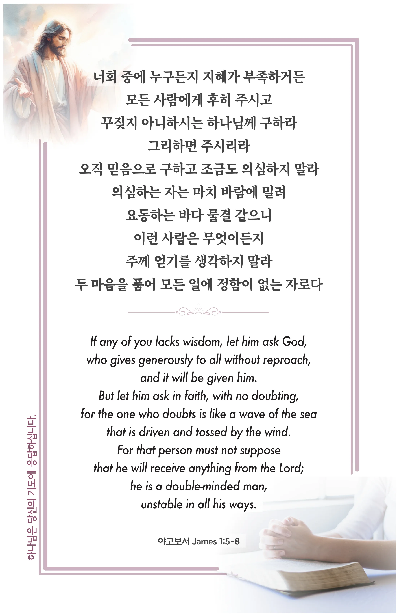

## 야고보서 1:5-8 (개역개정)

> **5** ○너희 중에 누구든지 지혜가 부족하거든 모든 사람에게 후히 주시고 꾸짖지 아니하시는 하나님께 구하라 그리하면 주시리라
>
> **6** 오직 믿음으로 구하고 조금도 의심하지 말라 의심하는 자는 마치 바람에 밀려 요동하는 바다 물결 같으니
>
> **7** 이런 사람은 무엇이든지 주께 얻기를 생각하지 말라
>
> **8** 두 마음을 품어 모든 일에 정함이 없는 자로다

> 이슬비전도카드는 한 영혼에게 복음과 사랑을 전하는 문서선교 도구입니다. 자유롭게 나누고 전해 주세요.
