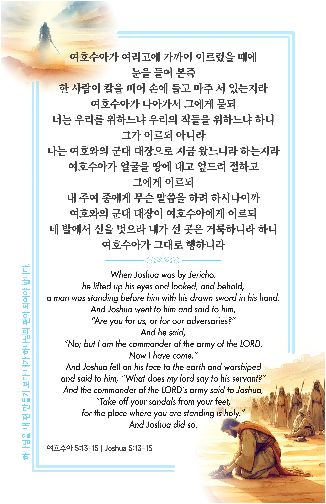

## 여호수아 5:13-15 (개역개정)

> **13** ○여호수아가 여리고에 가까이 이르렀을 때에 눈을 들어 본즉 한 사람이 칼을 빼어 손에 들고 마주 서 있는지라 여호수아가 나아가서 그에게 묻되 너는 우리를 위하느냐 우리의 적들을 위하느냐 하니
>
> **14** 그가 이르되 아니라 나는 여호와의 군대 대장으로 지금 왔느니라 하는지라 여호수아가 얼굴을 땅에 대고 엎드려 절하고 그에게 이르되 내 주여 종에게 무슨 말씀을 하려 하시나이까
>
> **15** 여호와의 군대 대장이 여호수아에게 이르되 네 발에서 신을 벗으라 네가 선 곳은 거룩하니라 하니 여호수아가 그대로 행하니라

> 이슬비전도카드는 한 영혼에게 복음과 사랑을 전하는 문서선교 도구입니다. 자유롭게 나누고 전해 주세요.
