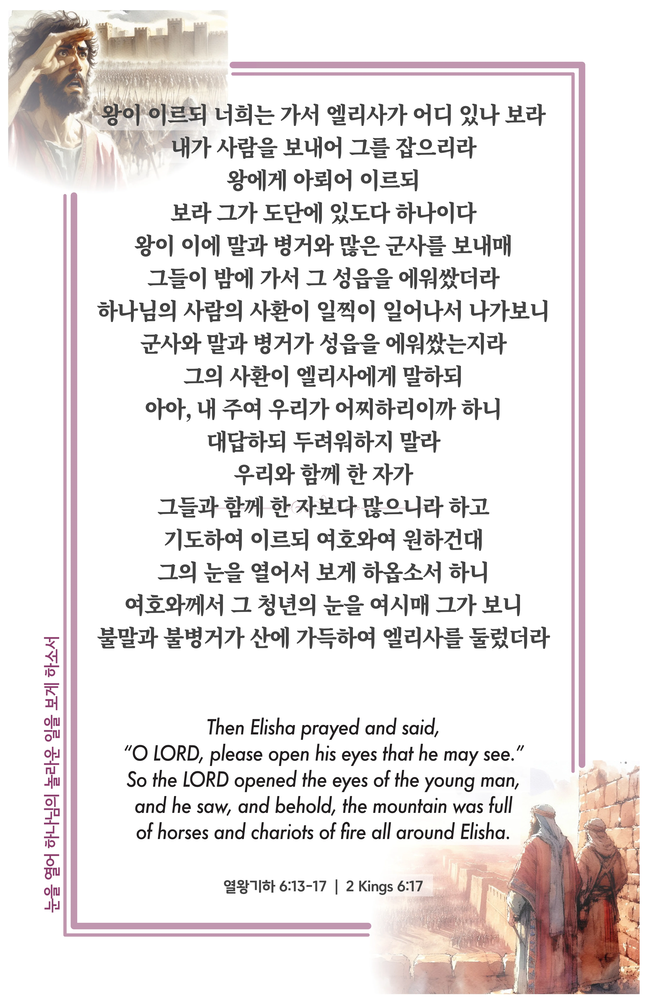

## 열왕기하 6:13-17 (개역개정)

> **13** 왕이 이르되 너희는 가서 엘리사가 어디 있나 보라 내가 사람을 보내어 그를 잡으리라 왕에게 아뢰어 이르되 보라 그가 도단에 있도다 하나이다
>
> **14** ○왕이 이에 말과 병거와 많은 군사를 보내매 그들이 밤에 가서 그 성읍을 에워쌌더라
>
> **15** 하나님의 사람의 사환이 일찍이 일어나서 나가보니 군사와 말과 병거가 성읍을 에워쌌는지라 그의 사환이 엘리사에게 말하되 아아, 내 주여 우리가 어찌하리이까 하니
>
> **16** 대답하되 두려워하지 말라 우리와 함께 한 자가 그들과 함께 한 자보다 많으니라 하고
>
> **17** 기도하여 이르되 여호와여 원하건대 그의 눈을 열어서 보게 하옵소서 하니 여호와께서 그 청년의 눈을 여시매 그가 보니 불말과 불병거가 산에 가득하여 엘리사를 둘렀더라

> 이슬비전도카드는 한 영혼에게 복음과 사랑을 전하는 문서선교 도구입니다. 자유롭게 나누고 전해 주세요.
