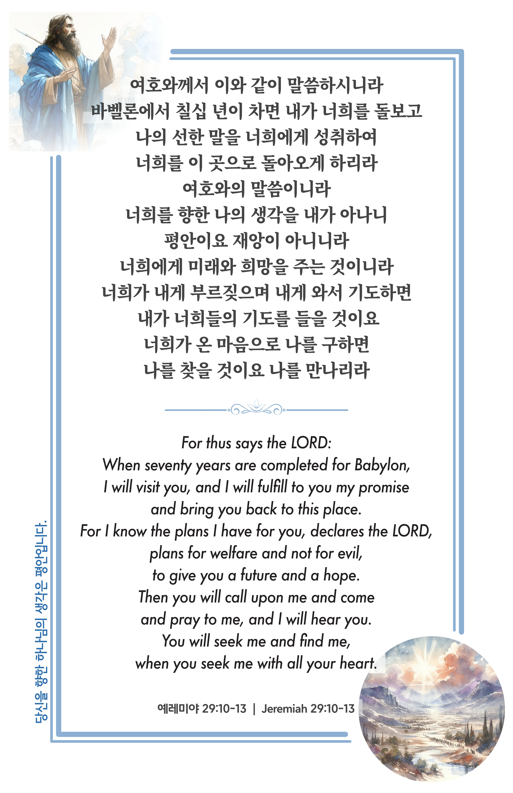

## 예레미야 29:10-13 (개역개정)

> **10** 여호와께서 이와 같이 말씀하시니라 바벨론에서 칠십 년이 차면 내가 너희를 돌보고 나의 선한 말을 너희에게 성취하여 너희를 이 곳으로 돌아오게 하리라
>
> **11** 여호와의 말씀이니라 너희를 향한 나의 생각을 내가 아나니 평안이요 재앙이 아니니라 너희에게 미래와 희망을 주는 것이니라
>
> **12** 너희가 내게 부르짖으며 내게 와서 기도하면 내가 너희들의 기도를 들을 것이요
>
> **13** 너희가 온 마음으로 나를 구하면 나를 찾을 것이요 나를 만나리라

> 이슬비전도카드는 한 영혼에게 복음과 사랑을 전하는 문서선교 도구입니다. 자유롭게 나누고 전해 주세요.
