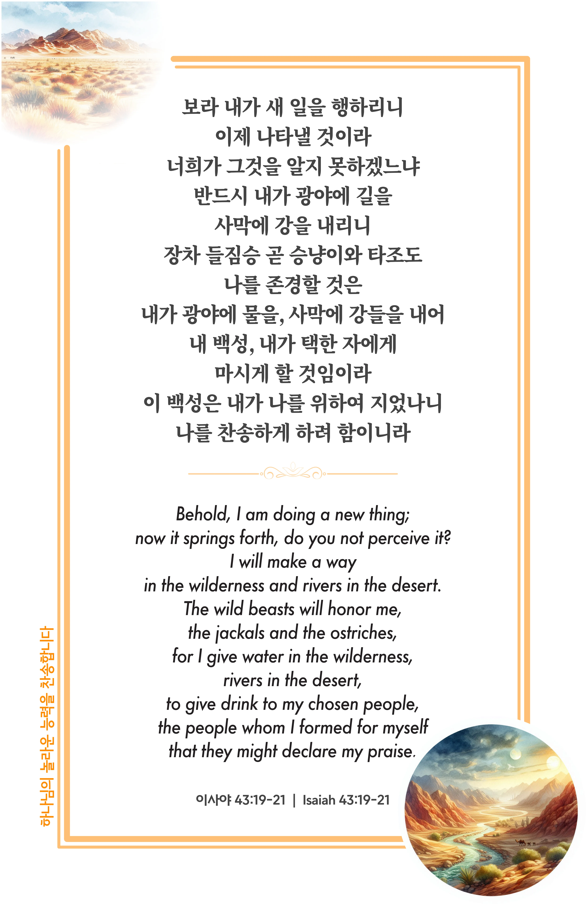
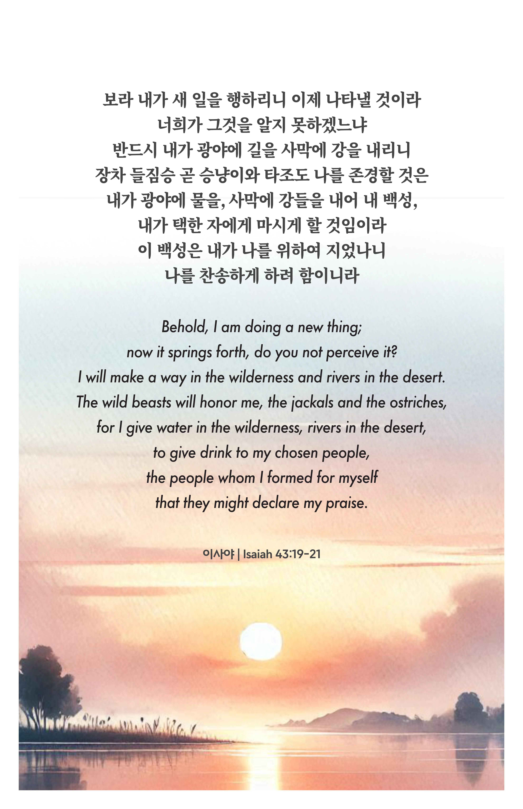

## 이사야 43:19-21 (개역개정)

> **19** 보라 내가 새 일을 행하리니 이제 나타낼 것이라 너희가 그것을 알지 못하겠느냐 반드시 내가 광야에 길을 사막에 강을 내리니
>
> **20** 장차 들짐승 곧 승냥이와 타조도 나를 존경할 것은 내가 광야에 물을, 사막에 강들을 내어 내 백성, 내가 택한 자에게 마시게 할 것임이라
>
> **21** 이 백성은 내가 나를 위하여 지었나니 나를 찬송하게 하려 함이니라

> 이슬비전도카드는 한 영혼에게 복음과 사랑을 전하는 문서선교 도구입니다. 자유롭게 나누고 전해 주세요.
