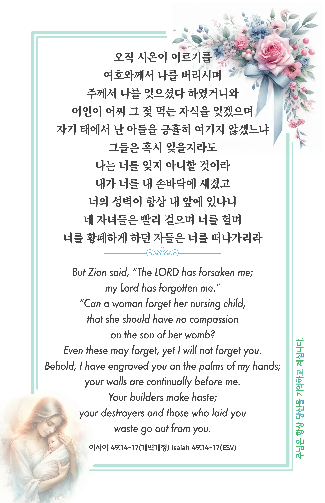

## 이사야 49:14-17 (개역개정)

> **14** 오직 시온이 이르기를 여호와께서 나를 버리시며 주께서 나를 잊으셨다 하였거니와
>
> **15** 여인이 어찌 그 젖 먹는 자식을 잊겠으며 자기 태에서 난 아들을 긍휼히 여기지 않겠느냐 그들은 혹시 잊을지라도 나는 너를 잊지 아니할 것이라
>
> **16** 내가 너를 내 손바닥에 새겼고 너의 성벽이 항상 내 앞에 있나니
>
> **17** 네 자녀들은 빨리 걸으며 너를 헐며 너를 황폐하게 하던 자들은 너를 떠나가리라

> 이슬비전도카드는 한 영혼에게 복음과 사랑을 전하는 문서선교 도구입니다. 자유롭게 나누고 전해 주세요.
