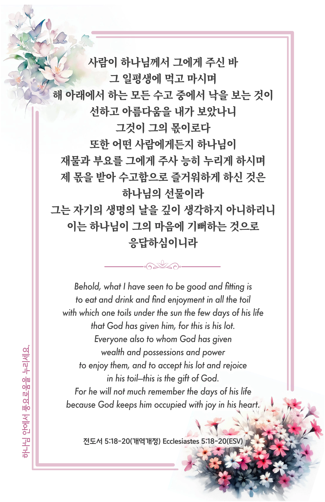

## 전도서 5:18-20 (개역개정)

> **18** ○사람이 하나님께서 그에게 주신 바 그 일평생에 먹고 마시며 해 아래에서 하는 모든 수고 중에서 낙을 보는 것이 선하고 아름다움을 내가 보았나니 그것이 그의 몫이로다
>
> **19** 또한 어떤 사람에게든지 하나님이 재물과 부요를 그에게 주사 능히 누리게 하시며 제 몫을 받아 수고함으로 즐거워하게 하신 것은 하나님의 선물이라
>
> **20** 그는 자기의 생명의 날을 깊이 생각하지 아니하리니 이는 하나님이 그의 마음에 기뻐하는 것으로 응답하심이니라

> 이슬비전도카드는 한 영혼에게 복음과 사랑을 전하는 문서선교 도구입니다. 자유롭게 나누고 전해 주세요.
