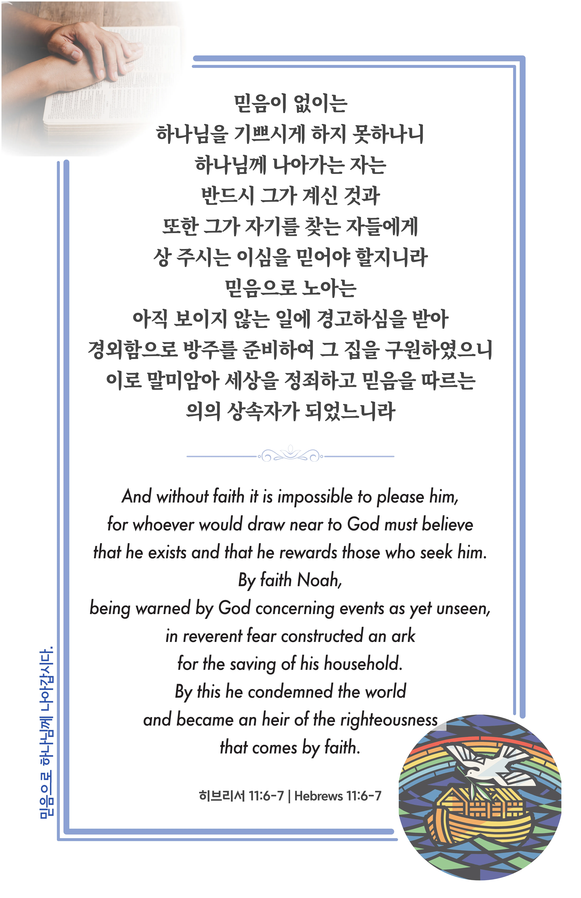

## 히브리서 11:6-7 (개역개정)

> **6** 믿음이 없이는 하나님을 기쁘시게 하지 못하나니 하나님께 나아가는 자는 반드시 그가 계신 것과 또한 그가 자기를 찾는 자들에게 상 주시는 이심을 믿어야 할지니라
>
> **7** 믿음으로 노아는 아직 보이지 않는 일에 경고하심을 받아 경외함으로 방주를 준비하여 그 집을 구원하였으니 이로 말미암아 세상을 정죄하고 믿음을 따르는 의의 상속자가 되었느니라

> 이슬비전도카드는 한 영혼에게 복음과 사랑을 전하는 문서선교 도구입니다. 자유롭게 나누고 전해 주세요.
