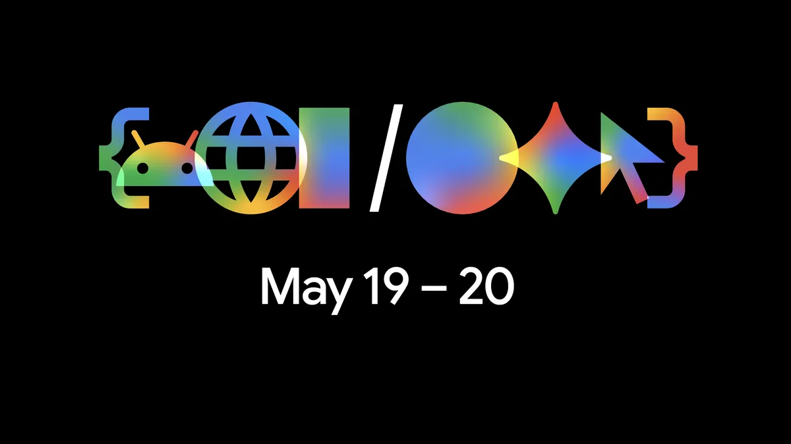

# Google I/O 2026 종합 리뷰

**작성일**: 2026년 5월 25일 | **작성 기준**: 검증된 공개 보도 및 공식 발표

---

## 1. 행사 개요 (Executive Summary)

Google I/O 2026은 Sundar Pichai가 **"우리는 확고히 에이전틱 Gemini 시대에 돌입했다"** 고 선언한 행사로, 단순한 AI 기능 업데이트를 넘어 **운영체제(OS)에서 지능 시스템(Intelligence System)으로의 플랫폼 전환**을 공식 선언한 자리였다. 핵심 발표 Top 3는 ① **Gemini 3.5 Flash** (플래그십급 성능을 플래시 속도로 제공하는 새 모델군, 즉시 GA), ② **Gemini Spark** (24시간 365일 자율 작동하는 개인 AI 에이전트), ③ **Antigravity 2.0** (에이전트 우선 개발 플랫폼으로의 전면 재편)이다. 2025년 대비 가장 큰 전략적 변화는 **AI 모델 발표 중심에서 에이전트 플랫폼·하드웨어 생태계 선언으로의 무게중심 이동**이며, Googlebook(Chromebook 대체 AI 노트북)과 Intelligent Eyewear(삼성·Qualcomm 공동 개발 스마트 안경)를 통해 하드웨어 플랫폼까지 전면 재편 의지를 드러냈다.

---

## 2. 행사 기본 정보

| 항목 | 내용 |
| --- | --- |
| 행사명 (정식/약칭) | Google I/O 2026 / I/O 2026 |
| 회차 | (2026년) |
| 일정 | 2026-05-19 ~ 2026-05-20 |
| 장소 | Shoreline Amphitheatre, Mountain View, California, USA |
| 형식 | 하이브리드 (오프라인 + io.google 동시 스트리밍) |
| 참가 규모 | 구체 수치 미공개 (전통적으로 수천 명 오프라인 참가) |
| 키노트 발표자 | Sundar Pichai (CEO, Google) / Demis Hassabis (CEO, Google DeepMind) |
| 공식 사이트 | [https://io.google/2026/](https://io.google/2026/) |

---

## 3. 핵심 발표 사항 (Key Announcements)

### 3-1. AI / 머신러닝

---

**[Gemini 3.5 Flash]**

- **카테고리**: AI/ML — 기반 모델
- **발표 내용**: Gemini 3.5 시리즈의 첫 모델로, 플래그십급 추론 지능을 플래시 계열의 속도에 결합. 코딩·에이전틱 워크플로우에 최적화되어 있으며 1M 토큰 컨텍스트, 65k 최대 출력 지원.
- **출시 상태**: ✅ GA (발표 당일 즉시)
- **출시 일정**: 2026-05-19, 발표 즉시 전 Google 제품 및 API에 롤아웃
- **지원 리전**: 글로벌 (230개국 이상, 70개 이상 언어)
- **정량적 지표**: 경쟁 모델 대비 출력 토큰/초 기준 **4배 빠름**; Terminal-Bench 2.1 **76.2%**, GDPval-AA **1656 Elo**, MCP Atlas **83.6%** (출처: Google Developers Blog, 2026-05-19)
- **가격 정보**: Gemini API 통해 제공; AI Ultra 플랜($100/월)에 포함
- **경쟁 제품**: OpenAI GPT-4o, Anthropic Claude 3.7 Sonnet, Meta Llama 4
- **출처**: https://blog.google/innovation-and-ai/technology/ai/google-io-2026-all-our-announcements/

---

**[Gemini Omni]**

- **카테고리**: AI/ML — 멀티모달 생성 모델
- **발표 내용**: 텍스트·이미지·오디오·비디오 등 모든 입력으로부터 콘텐츠를 생성하는 새 모델 시리즈. 현재 비디오 생성·편집에 집중하며, 물리적 일관성·장면 이해·멀티턴 편집 지원.
- **출시 상태**: 🟡 Public Preview (초기 릴리스)
- **출시 일정**: 2026년 여름 예정 (구체 날짜 미공개)
- **지원 리전**: 구체 리전 정보 미공개
- **정량적 지표**: Demis Hassabis, "세계 이해·멀티모달·편집에서 새로운 수준의 도약"이라 언급 (수치 미공개)
- **가격 정보**: 미공개
- **경쟁 제품**: OpenAI Sora, Meta Movie Gen, Adobe Firefly Video
- **출처**: https://9to5google.com/2026/05/19/google-io-2026-news/

---

**[Gemini Spark]**

- **카테고리**: AI/ML — 에이전트
- **발표 내용**: 24시간 365일 클라우드에서 자율 작동하는 개인 AI 에이전트. 스마트폰·노트북이 꺼진 상태에서도 백그라운드에서 작업 수행. Gemini 3.5 및 Antigravity 플랫폼 기반.
- **출시 상태**: 🟠 Private Preview (신뢰 테스터 대상 베타, AI Ultra 플랜 대상 확대 예정)
- **출시 일정**: 2026년 여름 (AI Ultra 구독자 베타)
- **지원 리전**: 미공개 (미국 우선 예상)
- **정량적 지표**: 구체 수치 미공개
- **가격 정보**: Google AI Ultra 플랜($100/월)에 포함
- **경쟁 제품**: OpenAI Operator, Anthropic Computer Use, Microsoft Copilot Agent
- **출처**: https://blog.google/innovation-and-ai/technology/ai/google-io-2026-all-our-announcements/

---

**[Google AI Ultra 플랜]**

- **카테고리**: AI/ML — 구독 서비스
- **발표 내용**: 월 $100의 신규 프리미엄 구독 티어. Gemini 3.5 Flash/Omni/Spark 전 모델 이용권, Google One 30TB 스토리지, Workspace Gemini AI, 신규 기능 우선 접근권 포함.
- **출시 상태**: ✅ GA
- **출시 일정**: 2026-05-19
- **정량적 지표**: ChatGPT Pro($200/월) 대비 50% 저렴; Claude Max($100~$200/월)와 동일 하한선에서 경쟁
- **경쟁 제품**: OpenAI ChatGPT Pro($200/월), Anthropic Claude Max($100~$200/월)
- **출처**: https://techjournal.org/google-io-2026-everything-announced

---

### 3-2. 개발 플랫폼 / 개발도구

---

**[Google Antigravity 2.0]**

- **카테고리**: 개발도구 — 에이전트 개발 플랫폼
- **발표 내용**: 2025년 11월 Gemini 3과 함께 출시된 Antigravity를 에이전트 우선(Agent-first) 플랫폼으로 전면 재편. Antigravity CLI·SDK·데스크톱 앱·API(Managed Agents) 등 4개 서피스 제공. AGENTS.md·SKILL.md 마크다운 파일로 커스텀 에이전트 정의 가능.
- **출시 상태**: ✅ GA (CLI·데스크톱 앱·SDK)
- **출시 일정**: 2026-05-19
- **정량적 지표**: 온스테이지 데모: Antigravity + Gemini 3.5 Flash로 93개 병렬 서브에이전트, 15,000회 이상 모델 요청, 2.6B 토큰 사용하여 12시간 만에 작동 가능한 OS 제작, API 비용 $1,000 미만 (출처: I/O 2026 키노트 데모)
- **경쟁 제품**: GitHub Copilot Workspace, Cursor, Replit Agent
- **출처**: https://developers.googleblog.com/all-the-news-from-the-google-io-2026-developer-keynote/

---

**[Managed Agents (Gemini API)]**

- **카테고리**: 개발도구 — API
- **발표 내용**: 단일 API 호출로 영구 상태를 가진 완전 프로비저닝된 에이전트를 즉시 생성. Antigravity 에이전트 하네스를 관리형 서비스로 제공.
- **출시 상태**: 🟡 Public Preview
- **출시 일정**: 2026-05-19
- **출처**: https://developers.googleblog.com/all-the-news-from-the-google-io-2026-developer-keynote/

---

**[WebMCP]**

- **카테고리**: 개발도구 — 웹 표준
- **발표 내용**: 브라우저 기반 AI 에이전트가 JavaScript 함수, HTML 폼 등 구조화된 도구를 활용할 수 있도록 하는 오픈 웹 표준 제안. 2026년 2월 얼리 프리뷰 프로그램 출시 후 I/O에서 공식 발표.
- **출시 상태**: 🟡 Public Preview (Early Preview)
- **출처**: https://blog.google/innovation-and-ai/technology/ai/google-io-2026-all-our-announcements/

---

### 3-3. 검색 / 커머스

---

**[Search 대규모 업그레이드 + 정보 에이전트]**

- **카테고리**: 검색
- **발표 내용**: 구글이 "30년 만의 최대 업그레이드"라 표현한 Search 개편. 검색창이 입력 길이에 맞춰 동적으로 확장되며, Gemini 3.5 Flash 기반 AI Mode 탑재. 사용자 대신 24시간 웹·뉴스·SNS·금융·스포츠 데이터를 모니터링하는 정보 에이전트(Information Agents) 도입. 특정 작업을 위한 커스텀 대시보드·트래커 자동 생성 기능도 추가.
- **출시 상태**: 🟡 Public Preview (정보 에이전트는 AI Pro·Ultra 구독자 대상, 2026년 여름)
- **경쟁 제품**: Microsoft Bing Copilot, Perplexity, ChatGPT Search
- **출처**: https://9to5google.com/2026/05/19/google-io-2026-news/

---

**[Universal Cart]**

- **카테고리**: 커머스
- **발표 내용**: Search·Gemini·YouTube·Gmail에 걸쳐 통합된 AI 쇼핑 카트. 장바구니에 제품을 담는 순간 AI가 가격 변동·재고·프로모션을 자동 모니터링. 상품 호환성 사전 감지 및 결제 수단별 혜택 비교도 자동 수행. Google Wallet 기반.
- **출시 상태**: 🟡 Public Preview (Search·Gemini 앱은 2026년 여름, YouTube·Gmail은 추후)
- **출처**: https://blog.google/innovation-and-ai/technology/ai/google-io-2026-all-our-announcements/

---

### 3-4. 하드웨어 / 기기

---

**[Intelligent Eyewear (Android XR 스마트 안경)]**

- **카테고리**: 하드웨어 — 스마트 안경
- **발표 내용**: 삼성·Qualcomm 하드웨어, Gentle Monster·Warby Parker 외관 디자인의 AI 스마트 안경. Android XR + Gemini AI 통합으로 음성 명령만으로 내비게이션·사진 촬영·결제·문자 등 수행. Android폰·iPhone 모두와 연동 가능.
- **출시 상태**: 🔵 로드맵 발표 (2026년 가을 출시 예정)
- **경쟁 제품**: Meta Ray-Ban AI Glasses, Apple Vision Pro (폼팩터 상이)
- **출처**: https://9to5google.com/2026/05/19/google-io-2026-news/

---

**[Googlebook (AI 노트북 플랫폼)]**

- **카테고리**: 하드웨어 — 노트북
- **발표 내용**: Chromebook을 대체하는 AI 네이티브 노트북 플랫폼. ChromeOS 대신 Android 기반 'Aluminium OS' 탑재 예정. Gemini 3.5 + Spark를 노트북 레벨에서 구동.
- **출시 상태**: 🔵 로드맵 발표 (2026년 Q3 출시 예정)
- **출처**: https://www.explainx.ai/blog/google-io-2026-complete-recap-all-announcements

---

### 3-5. 기타 주요 발표

| 항목 | 내용 | 출시 상태 |
| --- | --- | --- |
| **Google Pics** | AI 기반 신규 디자인 도구 | 🟡 Preview |
| **Ask YouTube** | 유튜브 콘텐츠 AI 질의응답 | 🟡 Preview |
| **Android Halo** | 에이전트 작업 진행상황을 폰 상단에 항시 표시 | 🔵 로드맵 |
| **SynthID + C2PA** | AI 생성 이미지 워터마크·검증 (Search·Chrome 확대, OpenAI 협력) | ✅ GA (단계적 확대) |
| **Gemini for Science** | 질병·기후(허리케인 등) 예측 AI 연구 도구 | 🟡 Preview |
| **Android 17 (코드명 Cinnamon Bun)** | 시스템 레벨 Gemini 통합, 2026년 6월 안정화 예정 | 🟡 Preview |
| **Build with Gemini XPRIZE Hackathon** | 상금 $200만 글로벌 해커톤 (역대 최대 규모) | ✅ 공모 시작 |

---

## 4. 키노트 세션 분석

### 오프닝 키노트 (Sundar Pichai, CEO)

- **핵심 메시지 1**: AI가 질문에 답하는 시대에서, AI가 사용자를 대신해 행동하는 에이전틱 시대로 전환 선언
- **핵심 메시지 2**: Google의 풀스택 AI 전략(칩→모델→앱→기기) 10년 AI 퍼스트 전환 성과 재확인; Gemini 앱 MAU 9억 명(전년 4억 명 대비 2.25배 성장) 공개
- **핵심 메시지 3**: 운영체제(OS)가 아닌 지능 시스템(IS)으로 회사 정체성 재정의
- **주목할 시연**: Antigravity 2.0 온스테이지 데모 — 12시간 만에 Doom이 실행되는 OS를 라이브로 빌드. 93개 병렬 에이전트, 15,000회 이상 모델 호출, $1,000 미만 비용
- **인용**: "AI-first를 선언한 지 10년, 우리는 이제 에이전틱 Gemini 시대에 있습니다" (Sundar Pichai)

### 개발자 키노트

- **핵심 메시지**: Gemini 3.5, Antigravity 2.0, WebMCP를 통해 인간이 아닌 AI 에이전트가 오케스트레이션하는 개발 패러다임 도입
- **주목할 발표**: Google AI Studio에 Kotlin 네이티브 지원 추가, Workspace 통합, Cloud Run 원클릭 배포, Firebase 지원 — 에이전트 기반 풀스택 개발의 마찰 제거
- **출처**: https://developers.googleblog.com/all-the-news-from-the-google-io-2026-developer-keynote/

---

## 5. 작년 대비 변화 및 전략적 방향 분석

| 구분 | I/O 2025 | I/O 2026 | 변화 방향 |
| --- | --- | --- | --- |
| 핵심 모델 | Gemini 2.5 Pro/Flash | Gemini 3.5 Flash/Omni | 코딩·에이전틱 특화로 전환 |
| AI 에이전트 | Jules(코딩 에이전트, 베타) | Gemini Spark(범용 개인 에이전트, 24/7) | 에이전트 범위 급확장 |
| Search | AI Mode 미국 출시 | 정보 에이전트·커스텀 트래커 도입 | 수동 검색→자율 모니터링 |
| 하드웨어 | Android XR 헤드셋 프리뷰 | 스마트 안경 가을 출시 확정 + Googlebook | 폼팩터 다양화 가속 |
| 개발 플랫폼 | AI Studio 중심 | Antigravity 2.0 + CLI + SDK + Managed API | 플랫폼화 완성 |
| 구독 모델 | Google AI Pro | AI Ultra($100/월) 추가 | 프리미엄 티어 확대 |

**강화된 키워드**: 에이전틱(Agentic), 풀스택(Full-stack), 지능 시스템(Intelligence System), WebMCP, 서브에이전트(Subagent)

**사라진/약화된 키워드**: Project Astra(범용 AI 에이전트 비전, 제품화로 수렴), Chromebook(Googlebook으로 대체), "AI Overviews"(AI Mode·에이전트로 진화)

**전략적 방향성**: Google은 이번 I/O에서 소비자 제품 업데이트에서 한발 더 나아가 **"OS → IS(Intelligence System)" 패러다임 전환**을 공식화했다. Antigravity 2.0이 개발 플랫폼의 중심축이 됨으로써, 단순히 AI 기능을 추가하는 것이 아니라 AI 에이전트가 앱과 서비스를 조율하는 새로운 소프트웨어 레이어를 구축하는 방향이 명확해졌다.

---

## 6. 경쟁사 대비 포지셔닝

| 영역 | Google I/O 2026 발표 | 주요 경쟁사 현황 | Google 격차/우위 |
| --- | --- | --- | --- |
| 기반 모델 속도 | Gemini 3.5 Flash (경쟁 대비 4x 빠름) | OpenAI GPT-4o, Claude 3.7 Sonnet | 속도 우위 주장; 독립 검증 필요 |
| 에이전트 플랫폼 | Antigravity 2.0 (CLI + SDK + Managed API 통합) | OpenAI Operator, GitHub Copilot Workspace | 플랫폼 수직 통합도에서 우위 |
| 지속 에이전트 | Gemini Spark (24/7 클라우드 에이전트) | OpenAI Operator, Anthropic Computer Use | 유사 기능이나 항시 작동·기기 꺼짐 상태 지원은 차별점 |
| 스마트 안경 | Android XR 안경 (삼성·Qualcomm·GM/WP) | Meta Ray-Ban AI Glasses | Meta 대비 후발주자나 Gemini 통합 깊이에서 차별화 시도 |
| 쇼핑 AI | Universal Cart (Search+Gemini+YouTube+Gmail 통합) | Amazon 구매 AI, 경쟁사 미비 | 크로스-서피스 통합 범위에서 현재 선두 |
| 구독 가격 | AI Ultra $100/월 (스토리지+Workspace 번들) | ChatGPT Pro $200/월, Claude Max $100~$200/월 | ChatGPT Pro 대비 가격 경쟁력; 번들 가치 우위 주장 |
| AI 콘텐츠 검증 | SynthID + C2PA (OpenAI 협력 포함) | 업계 표준화 공동 추진 | OpenAI와 협력이 이례적, 업계 표준 선점 포석 |

---

## 7. 한국 시장 / 한국어 사용자 관점

### ✅ 긍정적 신호

- **Gemini in Chrome 한국 출시 (2026-04-21)**: I/O 직전인 4월 21일, Google이 한국을 포함한 한국·일본·싱가포르 등 APAC에 Gemini in Chrome을 출시. 미국 런칭(2025년 9월) 대비 약 7개월 시차. (출처: Seoul Economic Daily)
- **한국어 지원 범위**: Gemini Live는 이미 한국어(10종 보이스 옵션) 지원 중. Gemini for Workspace는 한국어 포함 7개 언어 지원 확대(2024년 11월~).
- **삼성 협력**: 스마트 안경 하드웨어 파트너로 삼성 참여. Qualcomm과 삼성이 핵심 협력사로, 한국 반도체·디바이스 생태계와의 연결고리.
- **Gemini 3.5 Flash 글로벌 즉시 GA**: 230개국·70개 이상 언어 동시 지원으로, 한국 사용자도 발표 당일부터 접근 가능.

### ⚠️ 주의 및 불확실 사항

- **Gemini Spark**: 초기 신뢰 테스터 한정 → 미국 우선 출시 예상. 한국 출시 일정 미공개.
- **Universal Cart**: 한국 내 구글 쇼핑 생태계 기반이 미국 대비 약해 실질적 활용도 제한 가능.
- **AI Ultra 한국 구매 가능 여부**: 공식 확인 필요 (현재 구체 국가 목록 미공개).
- **국내 규제 영향**: 개인정보보호법(PIPA) 관점에서 Gemini Spark의 24시간 상시 작동·웹 모니터링 기능이 국내 규제 환경과의 적합성 검토 필요. 망분리 의무 환경(금융·공공기관)에서는 클라우드 기반 에이전트 활용 제한 예상.
- **국내 경쟁 구도**: Gemini in Chrome 한국 출시에 네이버가 'AI Tab'으로 대응 예고. 국내 검색 시장에서의 AI 경쟁 격화 전망.

---

## 8. 타깃 독자별 핵심 요약

### 🏢 경영진/의사결정자가 알아야 할 3가지

1. **AI 에이전트가 비용 구조를 바꾼다**: Antigravity 데모에서 $1,000 미만 비용으로 12시간 내 OS 개발을 시연. AI 에이전트 활용 시 소프트웨어 개발 비용 구조가 근본적으로 변화할 수 있음. 내부 개발 인력 운용 및 아웃소싱 전략 재검토 필요.
2. **구글이 '검색 엔진 회사'에서 '에이전트 플랫폼 회사'로 전환**: 광고 의존 비즈니스 모델에서 $100/월 AI Ultra 구독 모델로 수익원 다변화. B2B 관점에서 Google Workspace + Gemini 에이전트 번들의 도입 비용 대비 생산성 검토 시점.
3. **스마트 안경이 다음 디바이스 플랫폼**: 삼성·Google이 가을 출시 확정. Meta Ray-Ban과 본격 경쟁 시작. 기업 현장 작업(제조·물류·현장 서비스)에서의 활용 가능성 선행 탐색 필요.

---

### 🏗️ 아키텍트가 알아야 할 3가지

1. **Antigravity 2.0의 에이전트 오케스트레이션 아키텍처 전환**: 기존 IDE 중심에서 CLI·SDK·Managed API로 분산. AGENTS.md·SKILL.md 기반 선언형 에이전트 정의 방식은 마이크로서비스 아키텍처와 유사한 에이전트 분해 패턴을 요구. 기존 모노리식 파이프라인의 에이전트화 전환 설계 검토 필요.
2. **Managed Agents + Interactions API**: 영구 상태(Persistent State) 관리를 서버 측에서 처리하는 Managed Agents는 기존 세션리스 API 패턴과 다른 설계를 요구. Interactions API는 OpenAI Responses API와 유사한 서버사이드 히스토리 관리 방식으로, 두 플랫폼 간 이식성 설계 고려 필요.
3. **WebMCP 표준 모니터링**: 브라우저 AI 에이전트가 웹사이트 기능을 직접 호출하는 WebMCP가 표준으로 채택될 경우, 웹 서비스 설계 시 에이전트 접근 레이어를 별도로 구성해야 하는 새로운 아키텍처 요구사항 발생 예상.

---

### 👨‍💻 개발자가 알아야 할 3가지

1. **Gemini 3.5 Flash + Antigravity CLI 즉시 사용 가능**: Google AI Studio에서 오늘 바로 사용 가능. Kotlin 네이티브 지원 추가로 Android 앱 바이브 코딩 환경 개선. Cloud Run 원클릭 배포 + Firebase 연동으로 풀스택 에이전트 개발의 마찰이 크게 낮아짐.
2. **Build with Gemini XPRIZE 해커톤 참가 기회**: 역대 최대 규모 $200만 상금 글로벌 해커톤. Gemini로 실제 문제를 해결하는 애플리케이션을 개발하는 대회. 참가 신청 및 세부 조건은 공식 사이트 확인 필요.
3. **WebMCP Early Preview 등록 고려**: 브라우저 에이전트가 웹사이트를 직접 조작하는 새 표준. 자신이 운영하는 서비스에 MCP 도구를 노출하면 미래 에이전트 트래픽 선점 가능. 얼리 어답터 이점이 있는 시점.

---

## 9. 액션 아이템 / 체크리스트

### 🟢 즉시 시도 (GA 기능)

- [ ] Gemini 앱에서 **Gemini 3.5 Flash** 업데이트 적용 확인 (이미 기본 모델로 전환됨)
- [ ] **Google AI Studio**에서 Antigravity 2.0 + Kotlin 지원 테스트
- [ ] **SynthID / C2PA** 이미지 검증 기능 Chrome에서 확인
- [ ] **AI Ultra 플랜** 한국 구매 가능 여부 및 실제 기능 스펙 재확인 (공식 사이트)

### 🟡 신청/등록 필요 (Preview 기능)

- [ ] **Gemini Spark 베타** 대기자 등록 (Google AI Ultra 구독 후 베타 초대 대기)
- [ ] **WebMCP Early Preview Program** 참여 등록 (https://io.google/2026/ 확인)
- [ ] **정보 에이전트 in Search** — AI Pro/Ultra 구독자 대상 여름 출시 시 즉시 활성화
- [ ] **Build with Gemini XPRIZE 해커톤** 참가 신청

### 🔄 아키텍처 재검토 필요 영역

- [ ] 기존 LLM 파이프라인의 **Managed Agents API 전환 가능성** 평가
- [ ] 내부 Workspace 환경에서 **Gemini 에이전트 업무 자동화 시나리오** 발굴
- [ ] 웹 서비스 설계에 **WebMCP 호환 도구 레이어** 추가 여부 검토

### 📚 추가 학습 필요 주제

- [ ] Antigravity 2.0 아키텍처 공식 문서 검토 (AGENTS.md / SKILL.md 방법론)
- [ ] Interactions API vs. OpenAI Responses API 비교 분석
- [ ] Android XR 개발 SDK 및 Intelligent Eyewear 개발 가이드 모니터링

---

## 10. 종합 평가 및 시사점

### 행사 성공 지표: ★★★★☆ (5점 만점, 4점)

**긍정 평가 근거**:

- AI 에이전트의 소비자화·플랫폼화를 동시에 달성한 일관된 내러티브
- Gemini 3.5 Flash의 발표 당일 즉시 GA라는 실행력 입증
- Antigravity 온스테이지 라이브 데모의 임팩트 (12시간 OS 빌드)
- Gemini 앱 MAU 9억 명이라는 구체적 성장 지표 공개

**기대에 못 미친 부분**:

- Gemini Spark의 신뢰 테스터 한정 출시 → 일반 사용자 접근 시점 불명확
- Gemini 3.5 Pro는 이번 발표에서 빠짐 (다음 달 예정)
- 제품군 명칭 혼란: Gemini CLI vs. Antigravity CLI 구분이 불분명해 개발자 커뮤니티에서 혼선 보고
- Android 17 / Googlebook 등 하드웨어·OS 발표가 Android Show와 분산되어 집중도 분산

### 향후 6~12개월 업계 영향 예측

1. **에이전트 표준 경쟁 격화**: Antigravity vs. OpenAI Operator vs. Anthropic Computer Use의 3파전. WebMCP 표준 채택 여부가 에이전트 생태계 판도를 좌우할 분기점.
2. **스마트 안경 카테고리 주류화 신호**: Google + 삼성의 가을 출시가 실현되면 Meta Ray-Ban AI Glasses와 함께 스마트 안경이 '얼리어답터 제품'에서 '주류 제품'으로 전환되는 계기가 될 수 있음.
3. **검색 광고 모델 압박 심화**: 정보 에이전트·AI Mode가 기존 클릭 기반 검색 광고를 잠식할 가능성. Universal Cart 수익 모델(아직 미공개)이 구글의 수익 구조 변화의 핵심 관전 포인트.
4. **한국 AI 검색 시장 경쟁 격화**: Gemini in Chrome 한국 출시 + I/O 2026 발표 후 Naver·Kakao의 방어 전략 가속화 예상.

### 다음 회차(I/O 2027) 기대 방향

- Gemini Spark의 완전 GA 및 성과 데이터 공개
- Googlebook 실제 판매 및 Aluminium OS 성숙도 평가
- Android XR 안경의 개발자 생태계 성과
- AI Ultra 구독 모델의 기업용(B2B) 확장 여부

---

## 11. 참고자료

> ⚠️ 아래 링크는 모두 검색을 통해 실제 존재가 확인된 URL입니다.

### 공식 자료

- **Google I/O 2026 공식 사이트**: https://io.google/2026/
- **공식 100가지 발표 요약**: https://blog.google/innovation-and-ai/technology/ai/google-io-2026-all-our-announcements/
- **Sundar Pichai 키노트 전문**: https://blog.google/innovation-and-ai/sundar-pichai-io-2026/
- **개발자 키노트 공식 요약**: https://developers.googleblog.com/all-the-news-from-the-google-io-2026-developer-keynote/
- **키노트 영상 (YouTube 재생목록)**: https://www.youtube.com/playlist?list=PLOU2XLYxmsIIAOskSyap13n9W-xOt_GP5

### 주요 분석 매체

- **9to5Google 전체 발표 정리**: https://9to5google.com/2026/05/19/google-io-2026-news/
- **Tom's Guide 라이브 블로그**: https://www.tomsguide.com/news/live/google-io-2026-live-news-updates
- **AI.cc 10대 발표 분석**: https://www.ai.cc/blogs/google-io-2026/
- **Latent Space AINews 개발자 분석**: https://www.latent.space/p/ainews-google-io-2026-gemini-35-flash
- **Build Fast with AI — Gemini 3.5 심층 분석**: https://www.buildfastwithai.com/blogs/google-io-2026-gemini-3-5-flash-announcements

### 한국 시장 관련

- **Seoul Economic Daily — Gemini in Chrome 한국 출시**: https://en.sedaily.com/technology/2026/04/21/googles-gemini-powered-chrome-lands-in-korea-naver-counters
- **BusinessKorea — Gemini Live 한국어 지원**: https://www.businesskorea.co.kr/news/articleView.html?idxno=232238

---

*본 리뷰는 공개된 보도자료·공식 블로그·신뢰 가능한 IT 미디어를 기반으로 작성되었습니다. 일부 수치는 Google 공식 발표 기준이며 독립적 검증이 필요할 수 있습니다.*
