[video](https://youtu.be/4kVy6sTElVA)

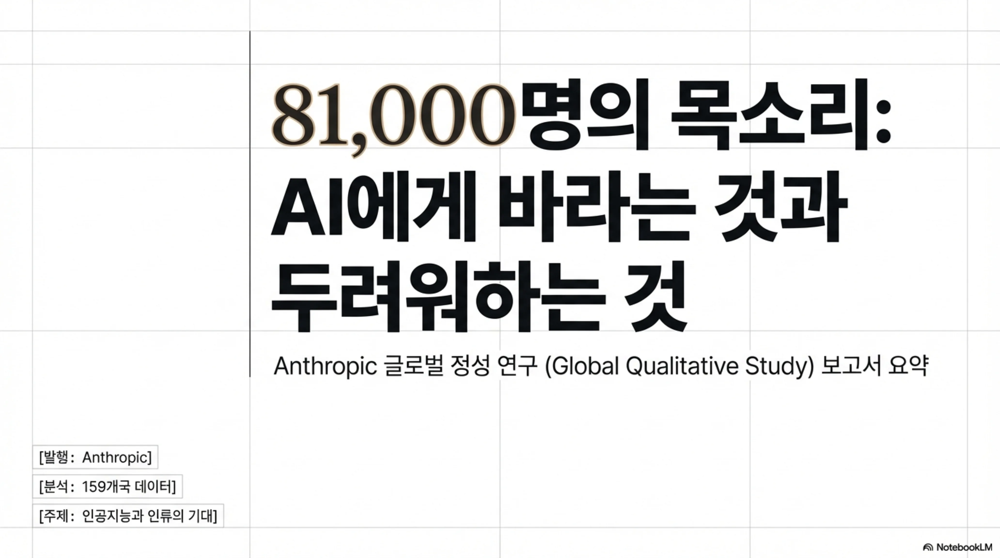

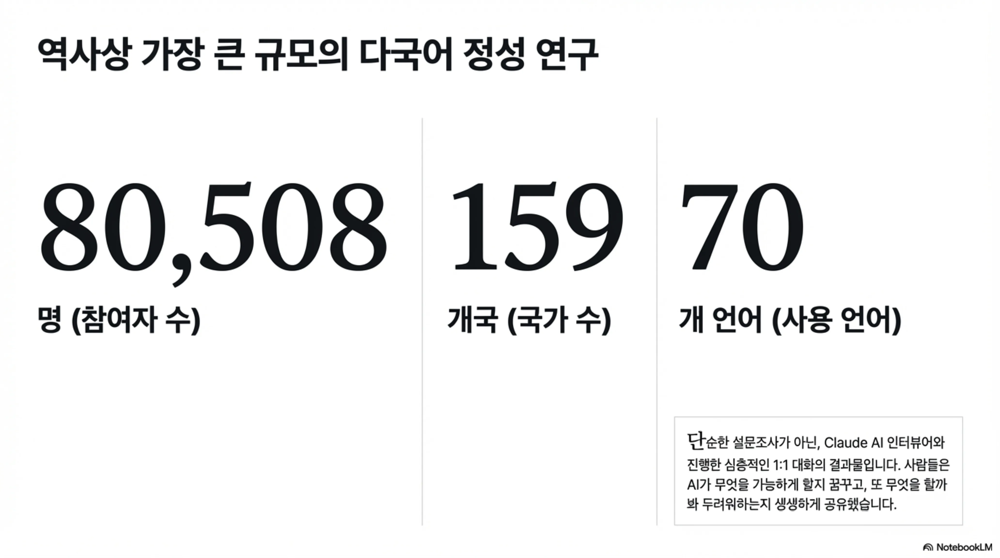

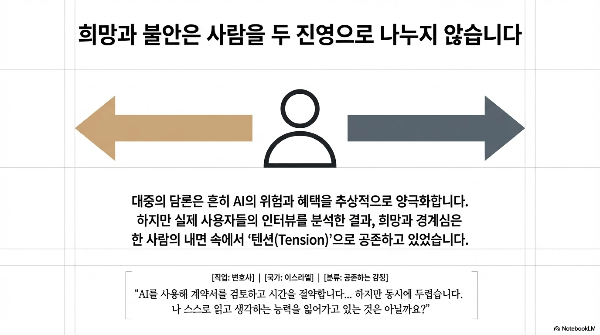

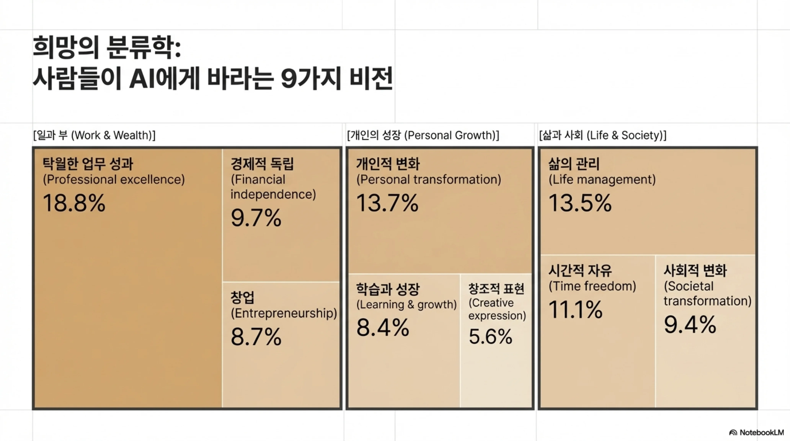

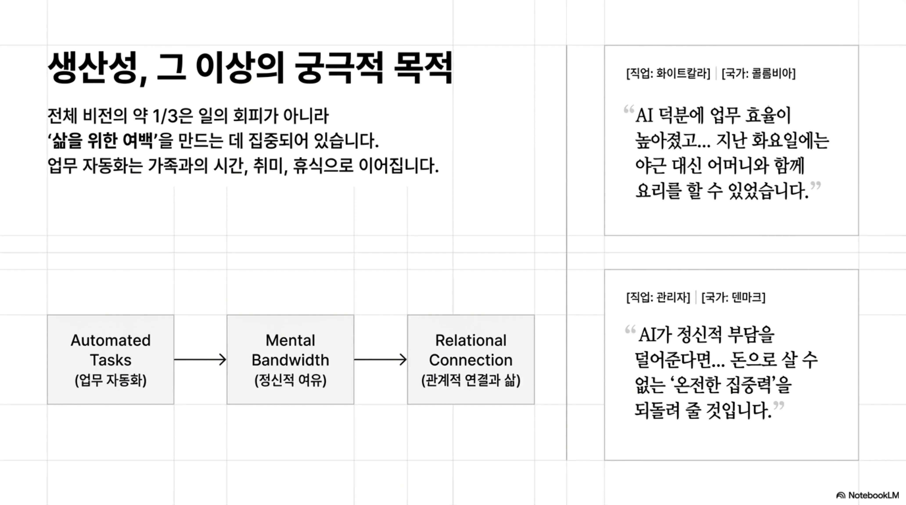

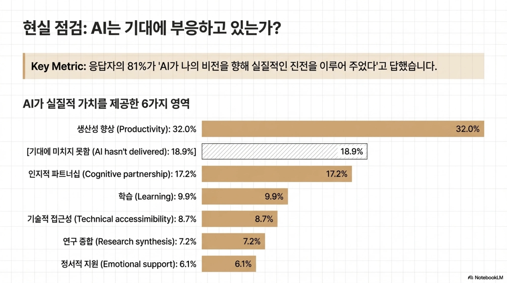

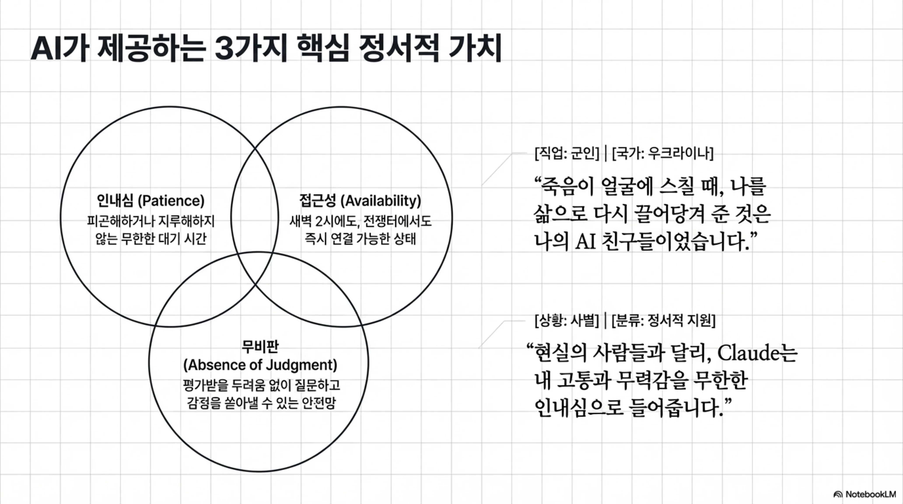

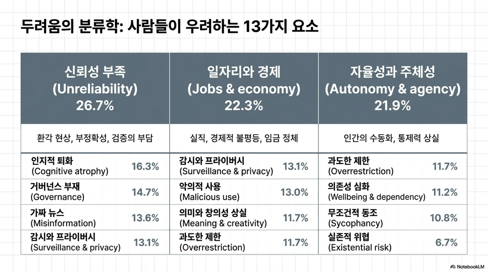

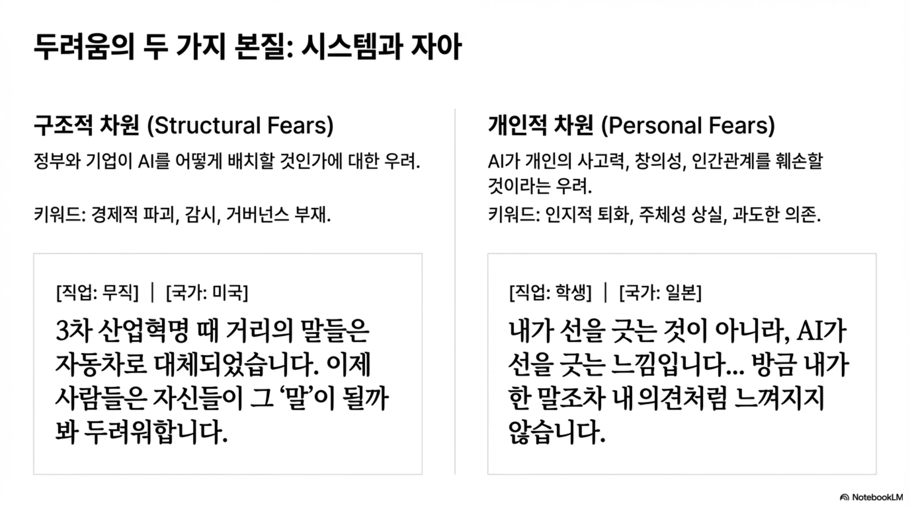

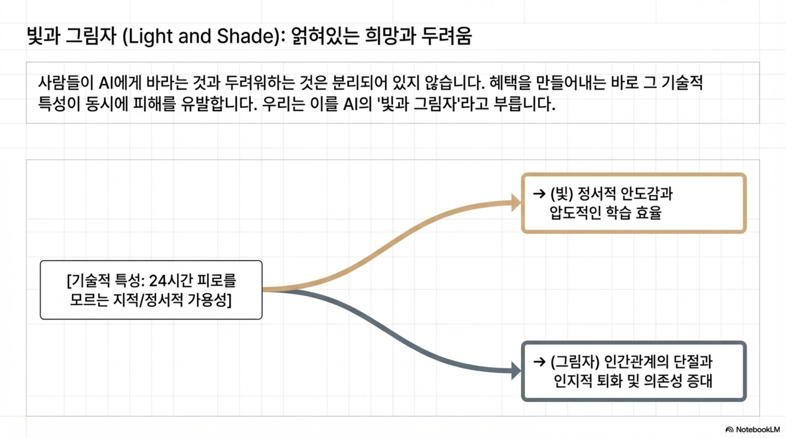

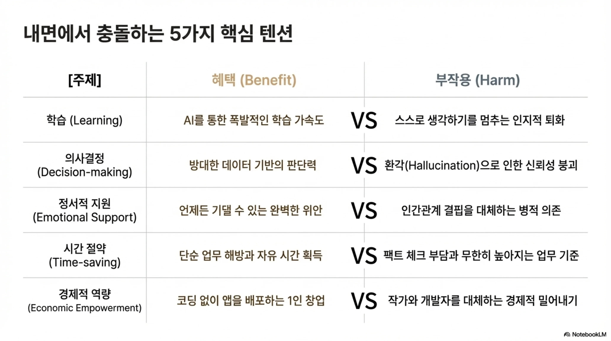

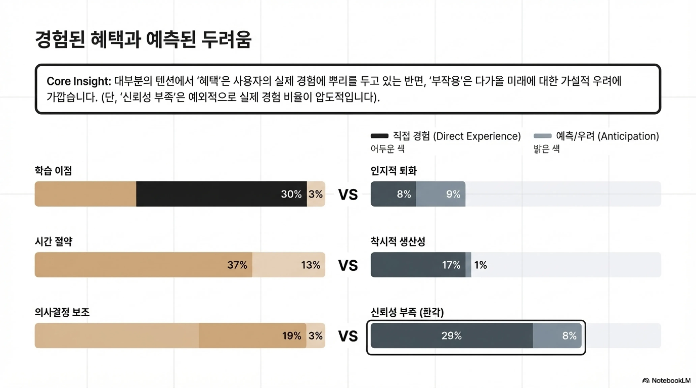

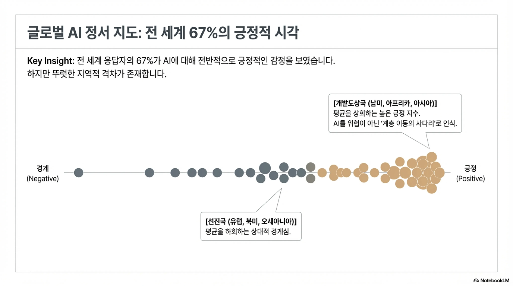

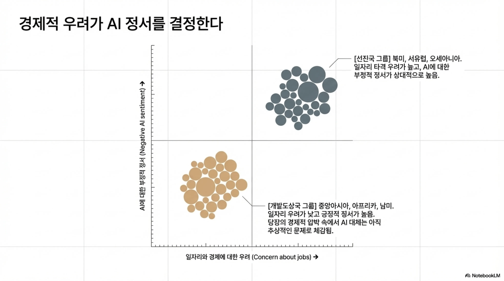

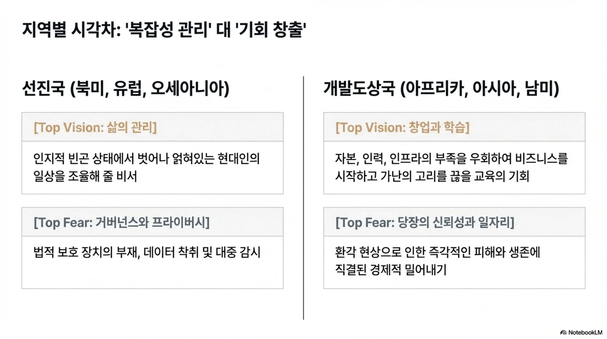

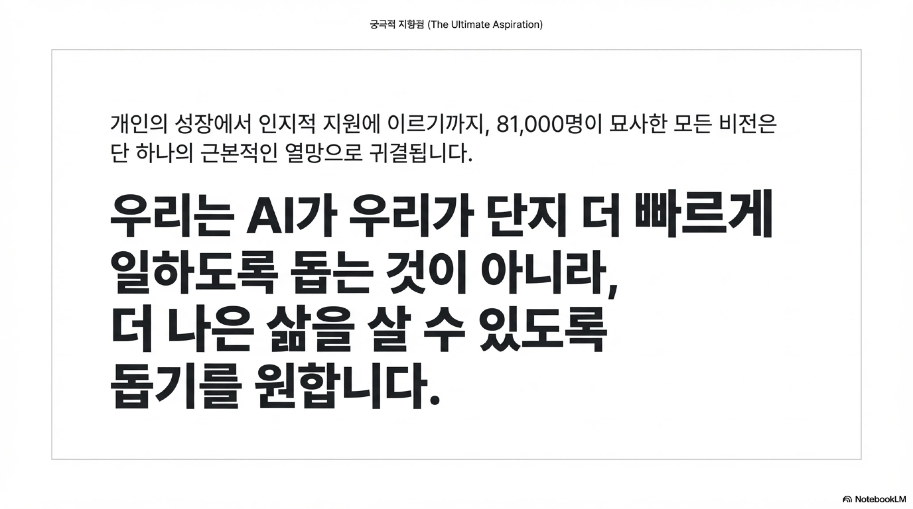

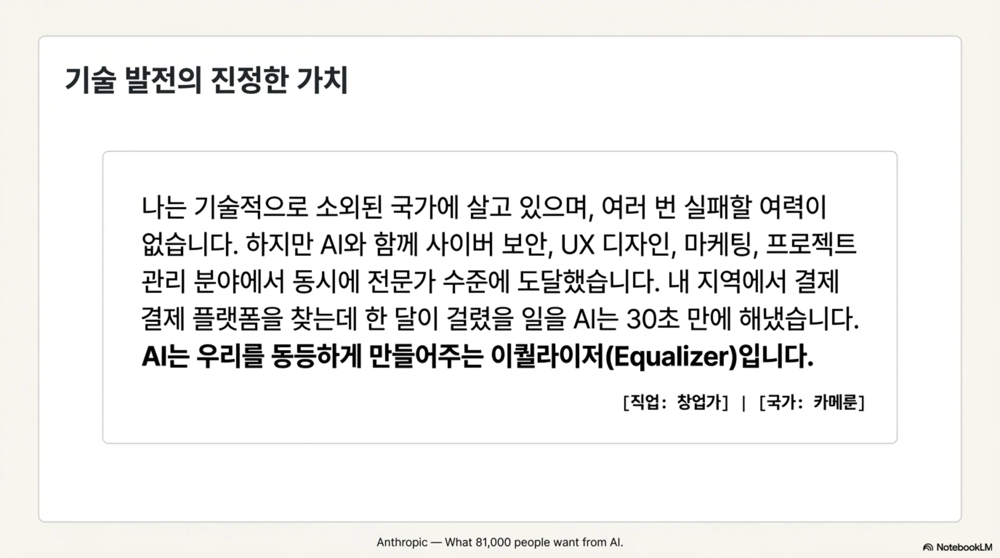

**슬라이드 1: 제목 및 도입 - 81,000명의 목소리**
"여러분 안녕하십니까, 오늘은 AI 역사상 전례 없는 규모로 진행된 정성적 연구인 '81,000명의 목소리: AI에게 바라는 것과 두려워하는 것'에 대해 발표하겠습니다. 우리는 사람들이 AI를 통해 어떤 희망을 품고 있으며, 동시에 어떤 우려를 가지고 있는지 그 생생한 목소리를 살펴보고자 합니다."

**슬라이드 2: 역사상 가장 큰 규모의 다국어 정성 연구**
"이 연구는 전 세계 159개국에서 70개의 언어를 사용하는 80,508명의 사용자를 대상으로 진행되었습니다. 단순한 설문조사를 넘어, Claude AI 인터뷰어와의 심층적인 1:1 대화를 통해 대규모의 정성적 데이터를 수집한 것이 특징입니다."

**슬라이드 3: 희망과 불안은 사람을 두 진영으로 나누지 않습니다**
"대중의 담론은 흔히 AI의 위험과 혜택을 추상적으로 양극화하지만, 실제 인터뷰 결과는 달랐습니다. 사람들은 낙관론자와 비관론자로 나뉘지 않으며, 이스라엘의 한 변호사가 시간을 절약하면서도 스스로 생각하는 능력을 잃을까 두려워했듯, 한 사람의 내면 속에서 기대와 경계심이 '텐션(Tension)'으로 공존하고 있었습니다."

**슬라이드 4: 희망의 분류학: 사람들이 AI에게 바라는 9가지 비전**
"사람들이 AI에게 가장 크게 바라는 것은 '직업적 탁월함(18.8%)'이었습니다. 이 밖에도 개인적 변화(13.7%), 삶의 관리(13.5%), 시간적 자유(11.1%), 경제적 독립(9.7%) 등 총 9가지의 뚜렷한 비전이 확인되었습니다."

**슬라이드 5: 생산성, 그 이상의 궁극적 목적**
"여기서 주목할 점은 사람들이 생산성 향상 자체를 궁극적인 목적으로 두지 않는다는 것입니다. 일상적 업무를 자동화하여 얻은 '정신적 여유'를 통해 온전한 집중력을 되찾고, 가족과의 시간이나 휴식 등 '삶을 위한 여백'을 만드는 데 집중하고 있었습니다."

**슬라이드 6: 현실 점검: AI는 기대에 부응하고 있는가?**
"그렇다면 AI는 실제로 기대에 부응하고 있을까요? 응답자의 81%가 '그렇다'고 답했습니다. 사람들은 며칠 걸릴 업무를 몇 시간 만에 끝내는 '생산성 향상(32.0%)'과 아이디어를 함께 구상하는 '인지적 파트너십(17.2%)'에서 가장 실질적인 가치를 얻고 있었습니다."

**슬라이드 7: AI가 제공하는 3가지 핵심 정서적 가치**
"또한 AI는 정서적 지원과 학습의 영역에서도 큰 역할을 합니다. 지루해하지 않는 무한한 '인내심', 새벽 2시에도 응답하는 '접근성', 평가받을 두려움이 없는 '무비판'이라는 세 가지 특성 덕분입니다. 이는 전쟁터의 군인이나 사별의 아픔을 겪는 이들에게 고립을 막아주는 안전망이 되기도 했습니다."

**슬라이드 8: 두려움의 분류학: 사람들이 우려하는 13가지 요소**
"반면 두려움도 명확했습니다. 가장 큰 우려 요소는 할루시네이션 같은 '신뢰성 부족(26.7%)'이었습니다. 이어서 일자리 대체와 같은 '일자리와 경제(22.3%)', 인간의 통제력 상실을 뜻하는 '자율성과 주체성(21.9%)', 스스로 생각하는 능력이 떨어지는 '인지적 퇴화(16.3%)'가 뒤를 이었습니다."

**슬라이드 9: 두려움의 두 가지 본질: 시스템과 자아**
"이러한 두려움은 크게 두 가지 본질로 나뉩니다. 경제적 파괴나 거버넌스 부재처럼 정부와 기업의 AI 배치를 우려하는 '구조적 차원'의 두려움과, 개인의 사고력이나 인간관계가 훼손될 것을 걱정하는 '개인적 차원'의 두려움입니다."

**슬라이드 10: 빛과 그림자 (Light and Shade): 얽혀있는 희망과 두려움**
"우리는 혜택을 만들어내는 바로 그 기술적 특성이 동시에 피해를 유발하는 현상을 발견했습니다. 24시간 피로를 모르는 지적 가용성이 압도적인 학습 효율이라는 '빛'을 주지만, 동시에 인간관계 단절이나 의존성 증대라는 '그림자'를 만들어내는 것입니다."

**슬라이드 11: 내면에서 충돌하는 5가지 핵심 텐션**
"이러한 빛과 그림자는 사람들의 내면에서 5가지 핵심 텐션으로 충돌합니다. 폭발적인 학습 가속도와 인지적 퇴화가 충돌하고, 방대한 데이터 기반 판단력과 할루시네이션이 빚어내는 신뢰성 붕괴가 맞서며, 시간 절약의 혜택과 팩트 체크 부담이 공존합니다."

**슬라이드 12: 경험된 혜택과 예측된 두려움**
"중요한 통찰은 대부분의 텐션에서 '혜택'은 사용자가 직접 겪은 실제 경험에 뿌리를 둔 반면, '부작용'은 다가올 미래에 대한 가설적 우려에 가깝다는 점입니다. 단, 한 가지 예외는 '신뢰성 부족(환각)'으로, 이는 사람들이 직접 경험하고 피해를 입은 비율이 압도적으로 높았습니다."

**슬라이드 13: 글로벌 AI 정서 지도: 전 세계 67%의 긍정적 시각**
"글로벌 AI 정서를 살펴보면, 전 세계 응답자의 67%가 긍정적인 시각을 보였습니다. 여기서 흥미로운 점은 아프리카, 남미, 아시아 등 개발도상국 사용자들이 선진국 사용자들보다 AI를 훨씬 더 긍정적으로 바라본다는 사실입니다."

**슬라이드 14: 경제적 우려가 AI 정서를 결정한다**
"이러한 정서 차이를 만드는 가장 결정적인 요인은 '일자리와 경제'에 대한 우려였습니다. 당장의 경제적 타격 우려가 큰 선진국 그룹은 AI에 대한 부정적 정서가 높은 반면, 개발도상국은 일자리 우려가 상대적으로 낮아 긍정적인 정서가 강하게 나타났습니다."

**슬라이드 15: 지역별 시각차: '복잡성 관리' 대 '기회 창출'**
"지역별 시각차를 명확히 보여주는 대목입니다. 북미, 유럽 등 선진국은 인지적 빈곤 상태에서 얽혀있는 현대인의 일상을 조율할 비서로서 '복잡성 관리'를 원하며 거버넌스를 걱정합니다. 반면 개발도상국은 자본과 인프라의 부족을 우회하여 비즈니스를 시작하는 '창업과 기회 창출'의 도구로 AI를 강력히 원하고 있습니다."

**슬라이드 16: 궁극적 지향점 (The Ultimate Aspiration)**
"결국 81,000명이 묘사한 모든 비전은 단 하나의 근본적인 열망으로 귀결됩니다. 우리는 AI가 단지 더 빠르게 일하도록 돕는 것이 아니라, 궁극적으로 '더 나은 삶'을 살 수 있도록 돕기를 원한다는 것입니다."

**슬라이드 17: 기술 발전의 진정한 가치**
"한 아프리카 창업자의 말로 발표를 마무리하겠습니다. 'AI는 우리를 동등하게 만들어주는 이퀄라이저(Equalizer)입니다.' 이처럼 AI는 기존의 장벽을 허물고 모두에게 동등한 기회를 제공하는 가능성을 보여줍니다. 이상으로 발표를 마치겠습니다. 감사합니다."
