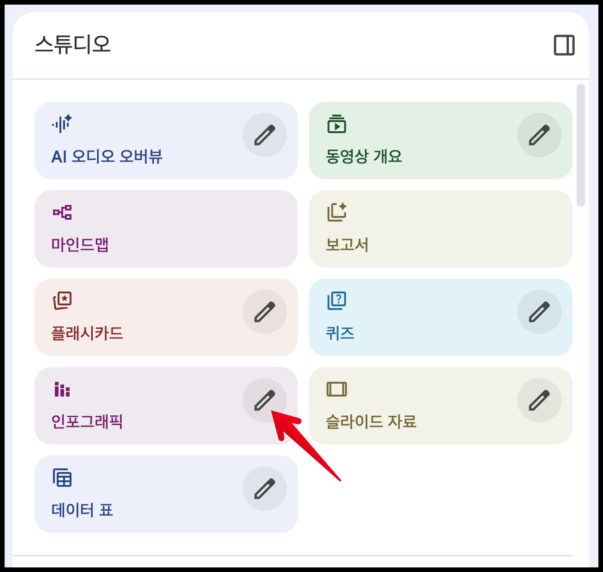
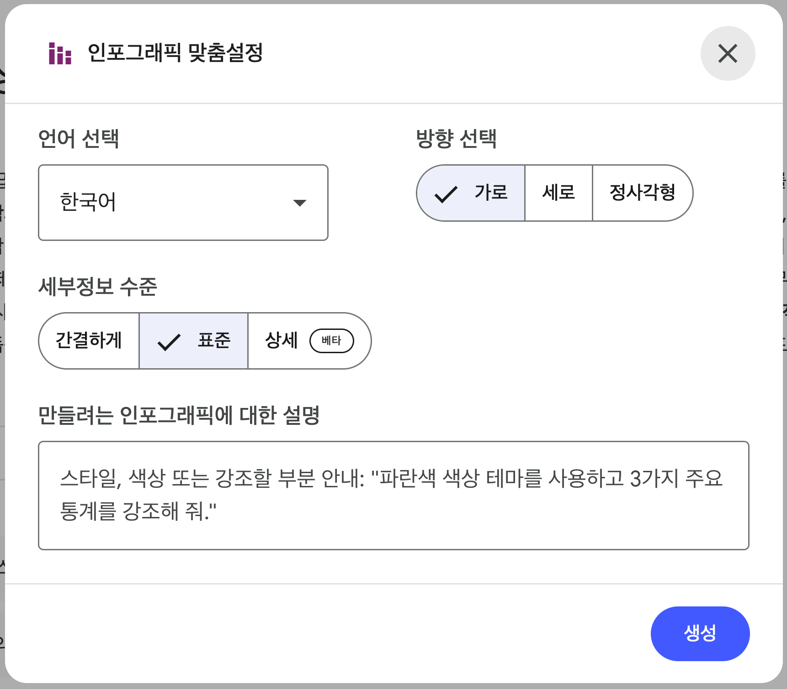

## NotebookLM 인포그래픽 기능 소개

NotebookLM의 인포그래픽 기능은 업로드한 소스 자료를 기반으로 시각적 요약을 자동 생성하는 강력한 도구입니다. 복잡한 정보를 한눈에 파악할 수 있는 시각 자료로 변환해주어, 보고서 작성, 교육 자료 제작, 프리젠테이션 준비 등 다양한 용도로 활용할 수 있습니다.

### 주요 특징

- **AI 기반 자동 생성:** 구글의 최신 이미지 생성 모델인 Nano Banana Pro를 활용하여 소스 내용을 분석하고 자동으로 인포그래픽을 생성합니다.
- **맥락 이해:** 단순히 텍스트를 요약하는 것이 아니라, 문서의 핵심 주제와 데이터 포인트를 파악하여 의미 있는 시각 자료를 만들어냅니다.
- **다양한 표현 방식:** 차트, 그래프, 타임라인, 비교 프레임워크 등 내용에 적합한 시각화 방식을 자동으로 선택합니다.

## 인포그래픽 커스텀 옵션

NotebookLM의 스튜디오에 있는 ‘인포그래픽’ 버튼 옆의 연필 버튼이 있습니다. 이 버튼을 클릭하면 나오는 창에서 옵션 및 프롬프트를 통해 세밀하게 커스터마이징할 수 있습니다. 프롬프트를 통해 다음과 같은 요소들을 조절할 수 있습니다.

### 1. 시각적 스타일 지정

- **아트 스타일:** 수채화(Watercolor), 종이 공예(Paper-craft), 레트로 프린트(Retro Print), 일본 만화(Manga), 화이트보드(Whiteboard) 등 구체적인 스타일을 지정할 수 있습니다.
- **색상 테마:** "비즈니스용 색상 테마", "흰색 배경에 검은색 텍스트", "짙은 녹색 칠판 디자인" 등 원하는 색상 조합을 명시할 수 있습니다.
- **분위기 설정:** "마법 같고 기발한(whimsical)", "세련된(Sleek)", "전문가용(Professional)" 등 전체적인 분위기를 지정할 수 있습니다.

### 2. 내용 구성 커스터마이징

- **강조 요소 선택:** "상위 5가지 통계", "3가지 핵심 기둥", "주요 이정표" 등 특정 내용에 집중하도록 요청할 수 있습니다.
- **구조 지정:** 타임라인, 비교표, 관계도, 대시보드 등 원하는 정보 구조를 명시할 수 있습니다.
- **제목 스타일:** "2~5글자의 강력한 단어", "시선을 압도하는 제목" 등 제목의 형식을 구체화할 수 있습니다.

### 3. 타겟 독자 맞춤화

- **독자 지정:** "관리자용", "학생 교육용", "임원 보고용" 등 타겟 독자를 명시하면 해당 독자층에 적합한 표현과 수준으로 조정됩니다.
- **용도 명시:** "비즈니스 보고", "교육 자료", "소셜 미디어 공유" 등 사용 목적을 밝히면 그에 맞는 형식으로 생성됩니다.

### 4. 데이터 표현 방식

- **시각화 방법:** "실생활과 연관 지어 다양한 방식으로 시각화", "아이콘과 함께 전문가 레이아웃" 등 데이터 표현 방식을 구체화할 수 있습니다.
- **스토리텔링 요소:** "숫자를 실생활 예시와 연결", "축제 장면과 지역 건축 양식 존중" 등 서사적 요소를 추가할 수 있습니다.

이러한 커스텀 옵션들을 조합하여 프롬프트를 작성하면, 단순한 자동 생성을 넘어 사용자의 의도와 필요에 정확히 부합하는 고품질 인포그래픽을 만들 수 있습니다.

## 인포그래픽용 프롬프트 샘플

NotebookLM의 인포그래픽 기능은 구글의 최신 이미지 생성 모델인 **Nano Banana Pro**를 기반으로 작동합니다. 따라서 단순한 요약 요청을 넘어, **시각적 스타일, 데이터 표현 방식, 타겟 독자, 핵심 주제**를 구체적으로 명시할수록 퀄리티 높은 결과물을 얻을 수 있습니다.

### 1. 데이터 시각화 및 비즈니스 보고용

복잡한 수치나 비즈니스 트렌드를 명확하게 전달해야 할 때 사용할 수 있는 프롬프트입니다.

- **비즈니스 변화 요약:** "AI가 업무 현장을 어떻게 변화시키는지 요약하는 인포그래픽을 디자인해줘. 다음 3가지 기둥을 강조해: (1) 생산성 및 자동화, (2) 의사결정 지원, (3) 직원 경험 및 업스킬링. 깔끔한 비즈니스용 색상 테마를 사용하고 관리자에게 중요한 주요 통계와 변화를 집중 조명해줘."
- **수치 데이터 강조:** "세련된 디자인(Sleek design)에 흰색 배경을 사용해줘. 자료에 있는 숫자들을 실생활과 연관 지어 다양한 방식으로 시각화하고, 강렬하고 영감을 주는 수치들을 인포그래픽 스타일로 표현해줘."
- **핵심 지표 대시보드:** "보고서 내 상위 5가지 통계 수치에 집중하여 비즈니스 테마로 시각화해줘."

### 2. 개념 설명 및 구조화 (교육/연구용)

논문이나 복잡한 개념을 쉽게 풀어서 설명하거나 구조를 보여줄 때 유용한 프롬프트입니다.

- **논문 핵심 주제 요약:** "업로드된 기후 변화 연구 논문의 주요 주제와 데이터 포인트를 요약하는 인포그래픽을 생성해줘."
- **비교 분석 프레임워크:** "솔루션 A와 B의 성능 차이를 시각적 프레임워크로 정리해줘." (예: 벤더 비교, 기술 스택 선정 등)
- **타임라인 및 관계도:** "세 가지 주요 이론 간의 관계를 시각화하거나, 프로젝트 이정표와 주요 지표를 포함한 수직 타임라인을 생성해줘."
- **핵심 교훈 정리:** "노트에서 5가지 핵심 교훈을 아이콘과 함께 전문가 레이아웃으로 제작해줘."

### 3. 창의적 스타일 및 스토리텔링

정보 전달을 넘어 독자의 흥미를 유발하고 기억에 오래 남게 하기 위한 스타일링 프롬프트입니다.

- **스토리북/만화 스타일:** "19세기와 21세기의 명절 요리법 간의 유사점을 찾아줘. 흰색 배경에 검은색 텍스트를 사용하고, 현대적인 일본 만화(Manga) 스타일로 모든 페이지를 설명해줘."
- **칠판 필기 스타일:** "흰색, 노란색, 분홍색의 손글씨 분필 텍스트를 사용하여 짙은 녹색의 '칠판(blackboard)' 디자인을 만들어 새해 결심을 정리해줘."
- **환상적인 분위기:** "전 세계의 새해 축하 행사를 보여줘. 마법 같고 기발한(whimsical) 요소와 축제 장면을 섞어서 표현하되, 지역의 건축 양식과 스타일을 존중해줘."

### 4. 프롬프트 작성 팁 (고급 활용)

더 나은 결과를 얻기 위해 다음과 같은 요소들을 프롬프트에 포함시키는 것이 좋습니다.

- **시각적 앵커 설정:** "제목은 2~5글자의 강력한 단어로 배치하여 시선을 압도하라 (예: 'AI의 실체', '비용의 장벽')."
- **데이터 스토리텔링:** "숫자를 단순히 나열하지 말고 실생활의 예시와 연결하여 시각화하라."
- **구체적인 스타일 지정:** 단순히 "예쁘게"보다는 "수채화(Watercolor)", "종이 공예(Paper-craft)", "레트로 프린트(Retro Print)", "화이트보드(Whiteboard)" 등 구체적인 아트 스타일을 지정하면 Nano Banana 엔진이 이를 반영합니다.

이러한 프롬프트들을 조합하여 사용자의 구체적인 니즈(예: "임원 보고용으로 깔끔하게", "학생 교육용으로 만화처럼")에 맞춰 변형해 사용하시길 권장합니다.

## 참고사항

옵션 중 ‘세부정보 수준’에서 ‘간결하게’를 선택하면 한국어 오타가 거의 없이 제작 가능합니다. ‘표준’과 ‘상세’에는 오타가 있을 수 있으니 사용 전 반드시 체크하시길 바랍니다.

