**동영상 개요**

[video](https://youtu.be/FUmsMOOTFSk)

# 8. 10년 후에도 이해할 수 있게: 완벽한 기록 자료 제작 가이드

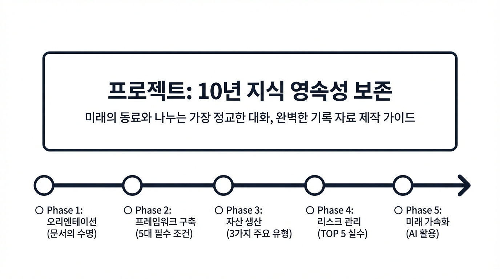

기록은 단순히 과거의 사실을 나열하는 행위가 아닙니다. 기록은 **현재의 내가 미래의 나, 그리고 아직 만나지 못한 미래의 동료와 나누는 가장 정교한 대화**입니다. 오늘 우리가 공들여 만든 문서가 10년 뒤 누군가에게 길을 밝혀주는 등불이 될지, 아니면 해독 불가능한 쓰레기가 될지는 '무엇을' 적느냐보다 '어떻게' 기록하느냐에 달려 있습니다.

조직의 지식이 증발하지 않고 자산으로 축적되는 법, 프리젠테이션 8가지 유형 시리즈의 대미를 장식할 **유형 8: 기록 자료** 제작의 정수를 소개합니다.

## 1. 기록 자료는 무엇이 다른가?

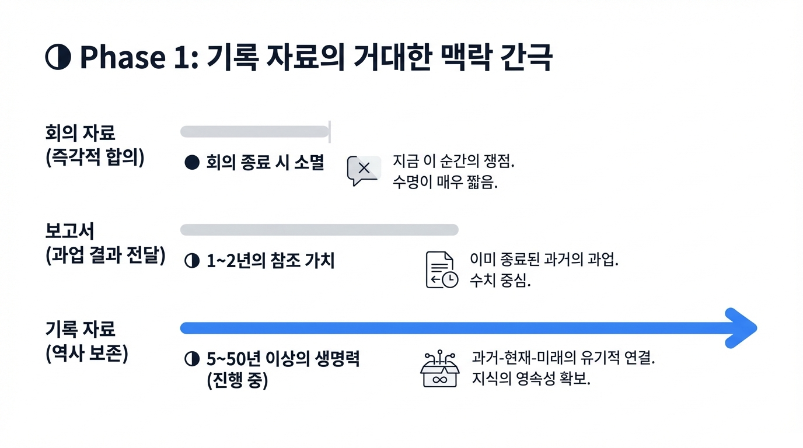

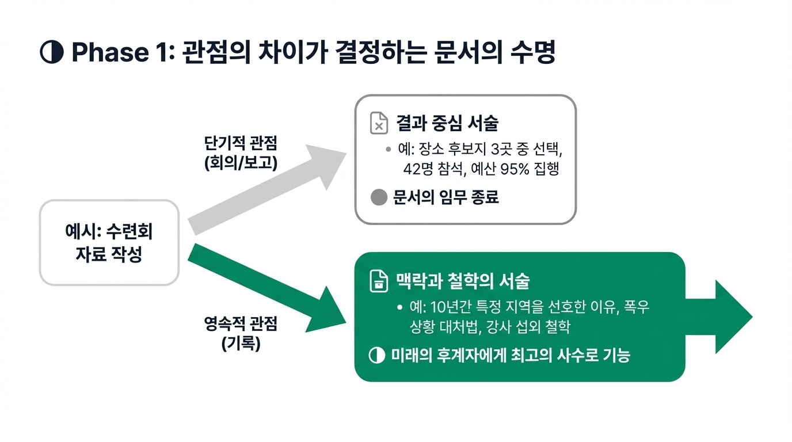

우리가 일상적으로 작성하는 회의 자료나 보고서와 '기록 자료' 사이에는 거대한 맥락의 간극이 존재합니다. 그 차이는 '수명'과 '잠재적 독자'의 범위에서 극명하게 드러납니다.

| 구분 | 회의 자료 (유형 7) | 보고서 (유형 5) | **기록 자료 (유형 8)** |
| --- | --- | --- | --- |
| **목적** | 즉각적인 의사결정 및 합의 | 특정 과업의 결과 및 성과 전달 | **지식의 영속성 확보 및 역사 보존** |
| **시점** | 현재 (지금 이 순간의 쟁점) | 과거 (이미 종료된 과업) | **과거-현재-미래의 유기적 연결** |
| **수명** | 매우 짧음 (회의 종료 시 소멸) | 중간 (1~2년의 참조 가치) | **매우 길음 (5~50년 이상의 생명력)** |
| **독자** | 회의실 안의 특정 참석자 | 상급자 및 관련 유관 부서원 | **현재 구성원과 미래의 후계자 전체** |

### 예시: 청년부 수련회 자료로 보는 관점의 차이

- **회의 자료:** "이번 수련회 장소 후보지 3곳 중 어디가 좋을까요?" (결정되는 순간 문서의 임무는 끝납니다.)
- **보고서:** "2025년 수련회에 42명이 참석하여 예산 대비 95%를 집행했습니다." (수치 중심의 결과 보고이며, 1~2년 뒤 예산 편성 시에나 다시 열어보게 됩니다.)
- **기록 자료:** "왜 우리가 10년간 가평 지역을 선호했는지, 역대 강사 섭외 시 어떤 철학을 가졌는지, 그리고 예기치 못한 폭우 상황에서 어떻게 대처했는지에 대한 상세한 기록." (이 문서는 10년 뒤 처음 부임한 담당자에게 최고의 사수가 됩니다.)

## 2. 기록 자료의 5대 필수 조건 (5대 공식)

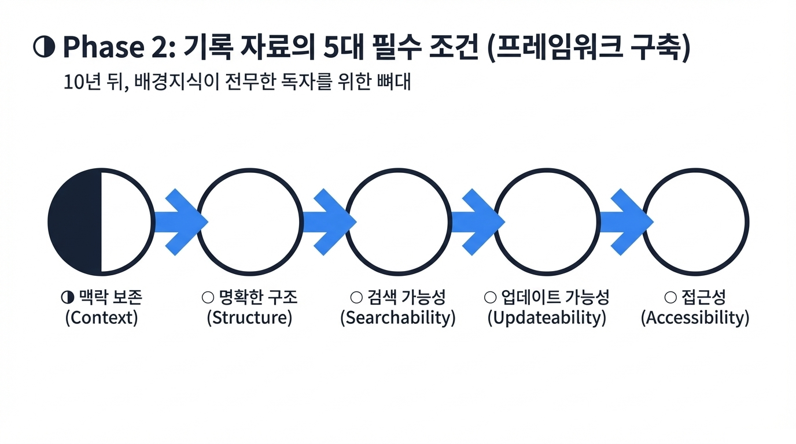

시간이 흐르면 '당연하게 공유되던 상식'이 사라집니다. 10년 뒤, 배경지식이 전무한 독자가 이 문서를 읽고도 당시 상황을 입체적으로 재현할 수 있게 하려면 다음 5가지 원칙이 뼈대가 되어야 합니다.

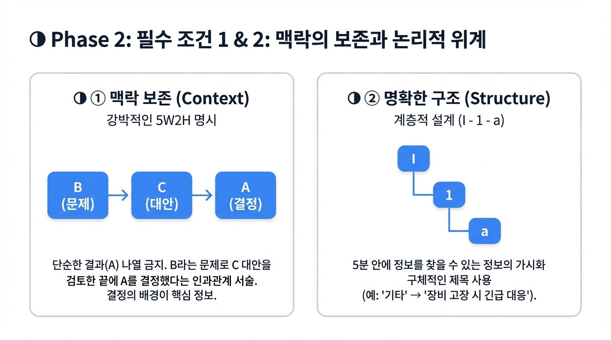

### ① 맥락 보존 (Context)

기록에서 가장 위험한 것은 '그때는 다 알았던 것'을 생략하는 것입니다. 이를 방지하기 위해 5W2H(Who, What, When, Where, Why, How, How much)를 강박적일 정도로 명시해야 합니다.

- **인과관계의 서술:** "단순히 A를 했다"가 아니라, "당시 B라는 문제로 인해 C라는 대안을 검토한 끝에 A를 결정했다"는 연결고리가 필요합니다. 이 '결정의 배경'이야말로 미래 세대에게 가장 가치 있는 정보입니다.

### ② 명확한 구조 (Structure)

방대한 기록물 속에서 원하는 정보를 5분 안에 찾지 못하면 그 기록은 버려집니다.

- **계층적 설계:** I - 1 - a와 같은 논리적인 번호 체계를 사용하여 정보의 위계를 세우세요.
- **정보의 가시화:** 상세한 목차와 페이지 번호는 기본이며, 섹션마다 구체적이고 명확한 제목(예: '기타' 보다는 '장비 고장 시 긴급 대응 요령')을 달아 정보의 '냄새'를 맡기 쉽게 해야 합니다.

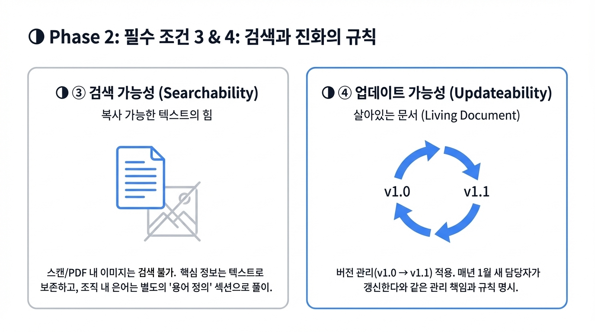

### ③ 검색 가능성 (Searchability)

아무리 훌륭한 통찰도 검색되지 않으면 존재하지 않는 것과 같습니다.

- **텍스트의 힘:** 스캔 이미지나 PDF 내의 이미지는 검색 엔진이 읽지 못할 위험이 큽니다. 핵심 정보는 반드시 '복사 가능한 텍스트' 형태로 남기세요.
- **용어의 통일:** 조직 내에서만 쓰이는 은어나 약어는 반드시 별도의 '용어 정의' 섹션을 만들어 풀이해 두어야 10년 뒤의 독자가 소외되지 않습니다.

### ④ 업데이트 가능성 (Updateability)

한 번 작성하고 굳어버린 문서는 '박제된 유물'이 되어 실무에서 멀어집니다.

- **살아있는 문서(Living Document):** 버전 관리(v1.0 → v1.1)를 통해 문서가 어떻게 진화했는지 보여주세요.
- **관리의 책임:** "이 문서는 매년 1월에 새 담당자가 갱신한다"와 같은 명확한 규칙과 수정 제안 경로를 명시하여 문서의 노화를 막아야 합니다.

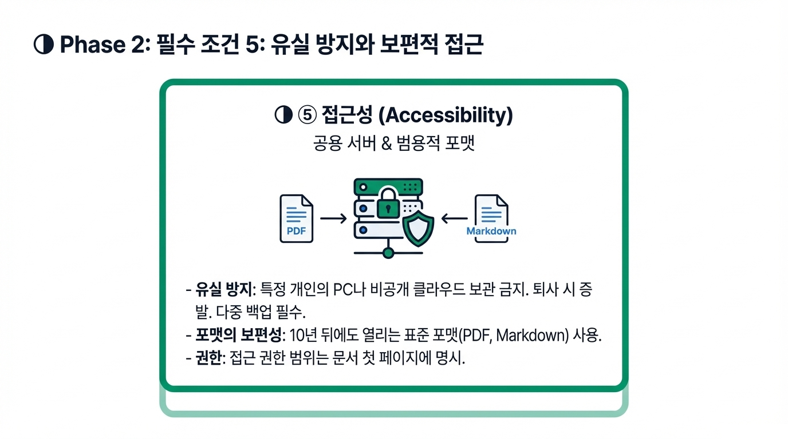

### ⑤ 접근성 (Accessibility)

문서는 '찾기 쉬운 곳'에 있어야 하고, '열 수 있는 형식'이어야 합니다.

- **유실 방지 전략:** 특정 개인의 PC나 비공개 클라우드 계정에 저장된 문서는 그 사람이 퇴사하는 순간 사라집니다. 공용 서버와 다중 백업은 필수입니다.
- **포맷의 보편성:** 10년 뒤에도 표준적으로 열릴 수 있는 범용적인 파일 포맷(PDF, Markdown 등)을 사용하고, 접근 권한 범위를 문서 첫 페이지에 명시하세요.

## 3. 기록 자료의 3가지 주요 유형

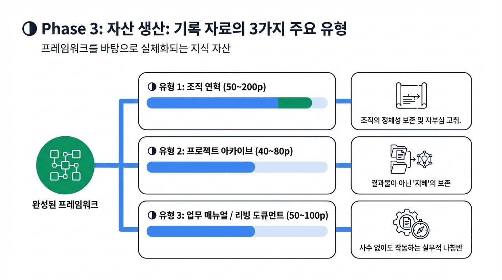

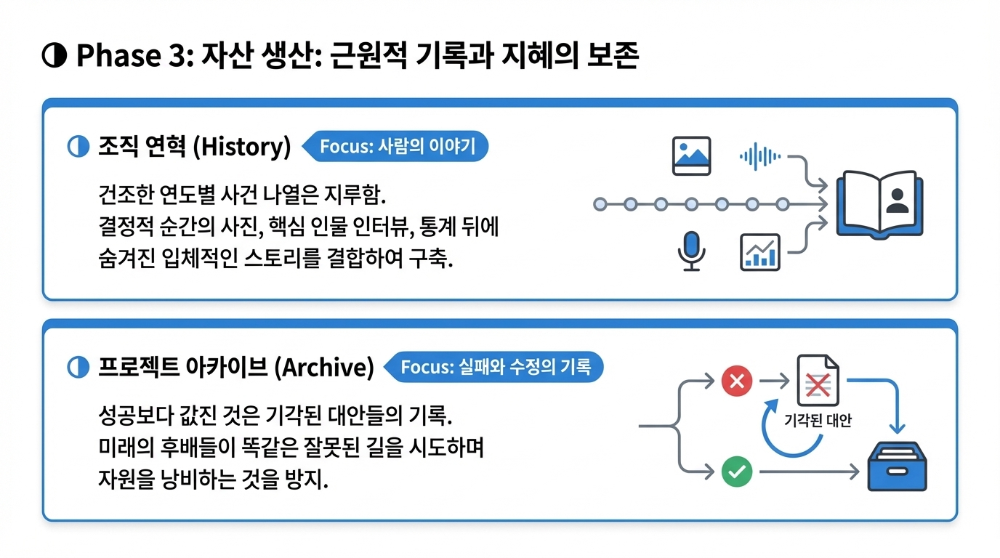

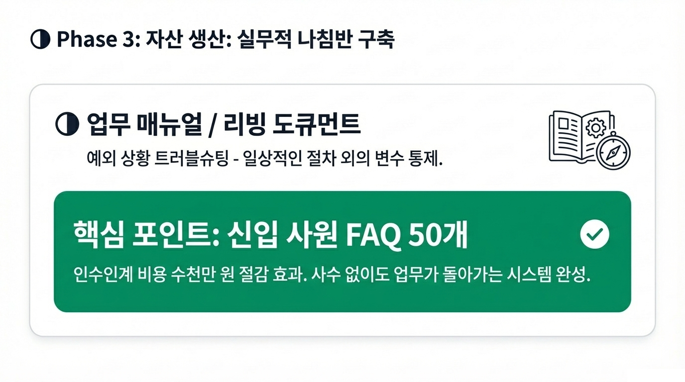

### 유형 1: 조직 연혁 (50~200p)

조직의 정체성을 보존하고 자부심을 고취하는 '근원적 기록'입니다.

- **핵심:** 연도별 사건을 건조하게 나열하는 것은 지루합니다. 당시 결정적이었던 순간의 사진, 핵심 인물의 인터뷰, 그리고 통계 뒤에 숨겨진 '사람의 이야기'를 결합하여 입체적인 스토리를 구축하세요.

### 유형 2: 프로젝트 아카이브 (40~80p)

프로젝트가 종료된 후 남는 것은 결과물이 아니라 '지혜'여야 합니다.

- **핵심:** 성공의 기록보다 '실패와 수정의 기록'이 훨씬 값집니다. 기각된 대안들이 왜 기각되었는지 기록해두면, 미래의 후배들이 똑같은 잘못된 길을 시도하며 자원을 낭비하는 일을 막을 수 있습니다.

### 유형 3: 업무 매뉴얼 / 리빙 도큐먼트 (50~100p)

사수 없이도 업무가 돌아가게 만드는 '실무적 나침반'입니다.

- **핵심:** 일상적인 절차 외에 '예외 상황'에 대한 트러블슈팅을 보강하세요. 특히 신입 사원의 질문 50개를 모은 FAQ 섹션은 인수인계 비용을 수천만 원 절감해 주는 효과를 발휘합니다.

## 4. 우리가 자주 저지르는 TOP 5 실수와 그 대가

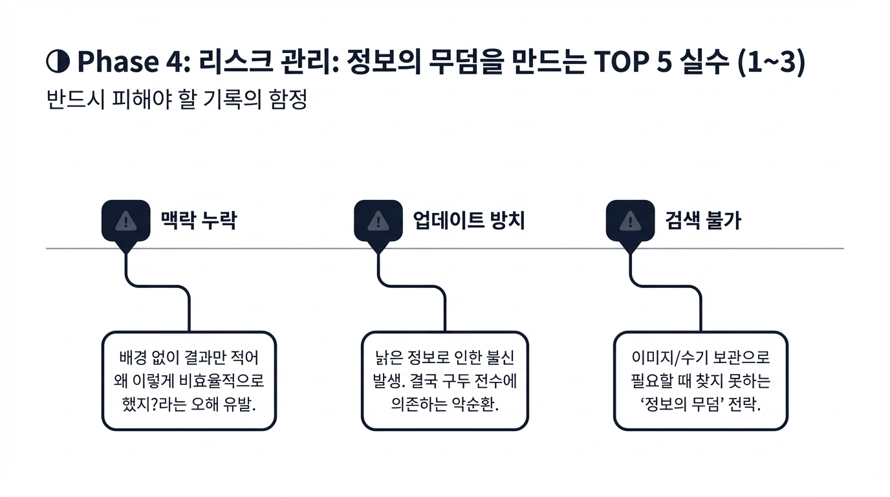

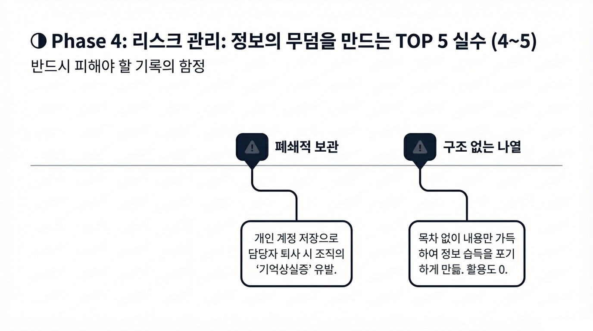

1. **맥락 누락:** 배경 설명 없이 결과만 적음 → 훗날 "왜 이렇게 비효율적으로 했지?"라며 당시의 고뇌를 오해받게 됨.
2. **업데이트 방치:** 낡은 정보를 수정하지 않음 → 실무자가 매뉴얼을 불신하게 되어 결국 구두 전수에만 의존하는 악순환 발생.
3. **검색 불가:** 이미지나 수기 자료로 보관함 → 자료는 쌓여가는데 정작 필요할 때 아무것도 찾지 못하는 '정보의 무덤'이 됨.
4. **폐쇄적 보관:** 개인 계정에 저장함 → 담당자 퇴사나 기기 고장 시 조직의 기억상실증을 유발함.
5. **구조 없는 나열:** 목차 없이 내용만 가득함 → 읽는 이로 하여금 정보 습득을 포기하게 만들어 문서의 활용도를 0으로 만듦.

## 5. AI를 활용한 기록의 지혜

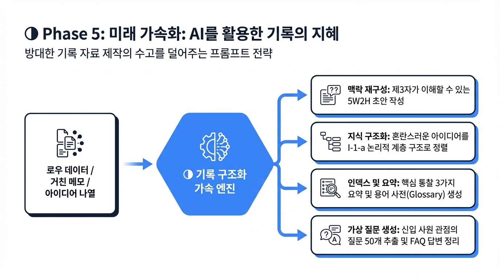

방대한 기록 자료를 만드는 수고를 AI가 획기적으로 덜어줄 수 있습니다.

- **맥락의 재구성:** 현장의 거친 메모나 로우 데이터를 입력하고 "이를 바탕으로 제3자가 이해할 수 있는 5W2H 구조의 보고서로 초안을 잡아줘"라고 요청하세요.
- **지식의 구조화:** 혼란스럽게 나열된 아이디어들을 "I-1-a 형태의 논리적인 계층 구조로 정렬하고 각 섹션에 적절한 소제목을 달아줘"라고 명령하세요.
- **인덱스 및 요약:** 수백 페이지의 문서에서 핵심 키워드를 뽑거나, 미래의 독자를 위해 "이 문서의 핵심 통찰 3가지를 요약하고 용어 사전(Glossary)을 만들어줘"라고 활용하세요.
- **가상 질문 생성:** "이 업무 매뉴얼을 처음 접하는 신입 사원이 가질 법한 질문 50개를 뽑고 답변을 정리해줘"라고 요청하여 FAQ 섹션을 풍성하게 만드세요.

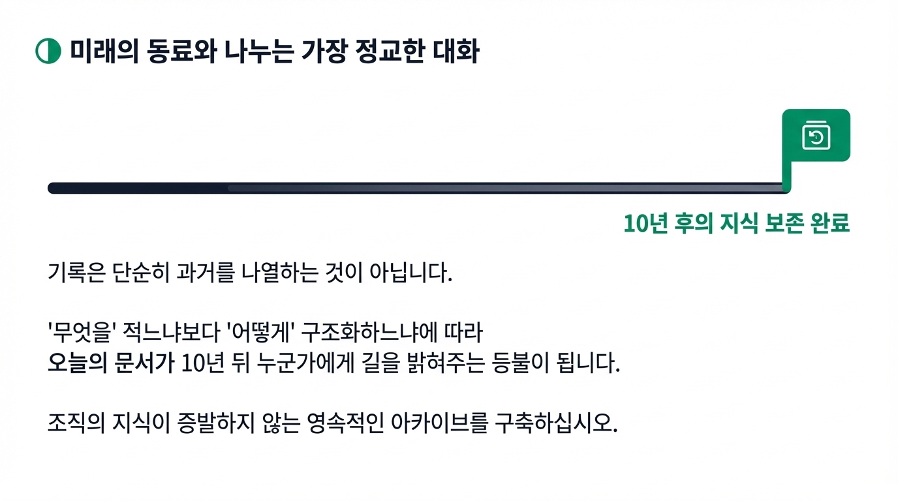
