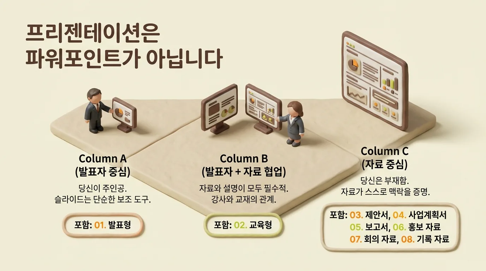
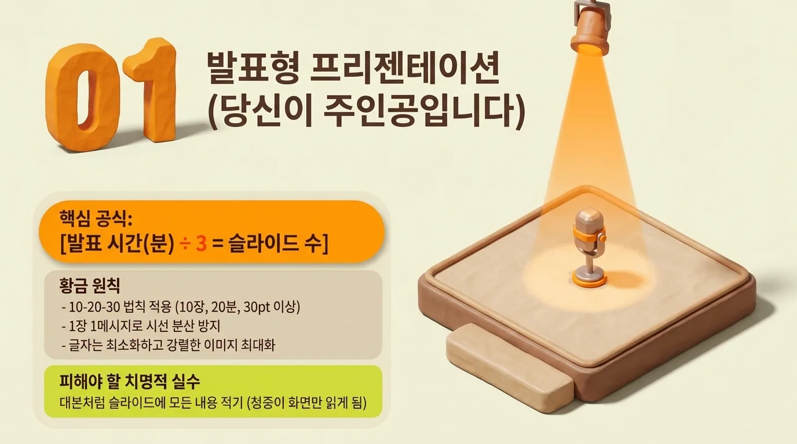
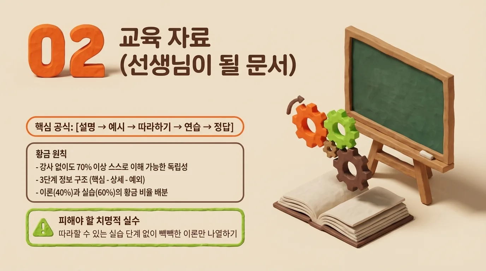
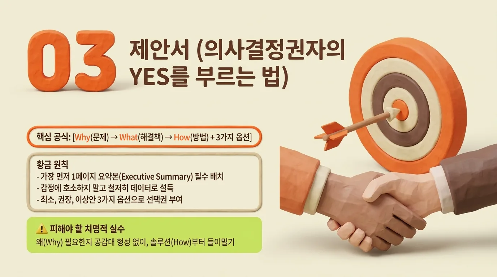
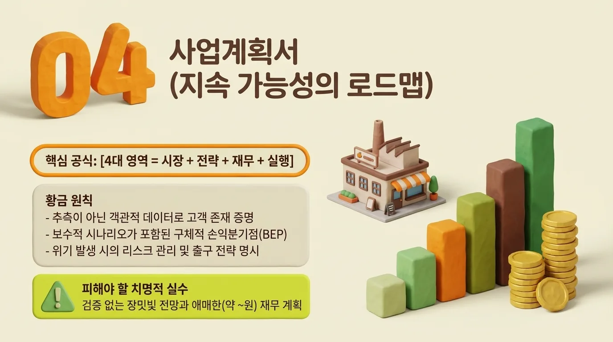
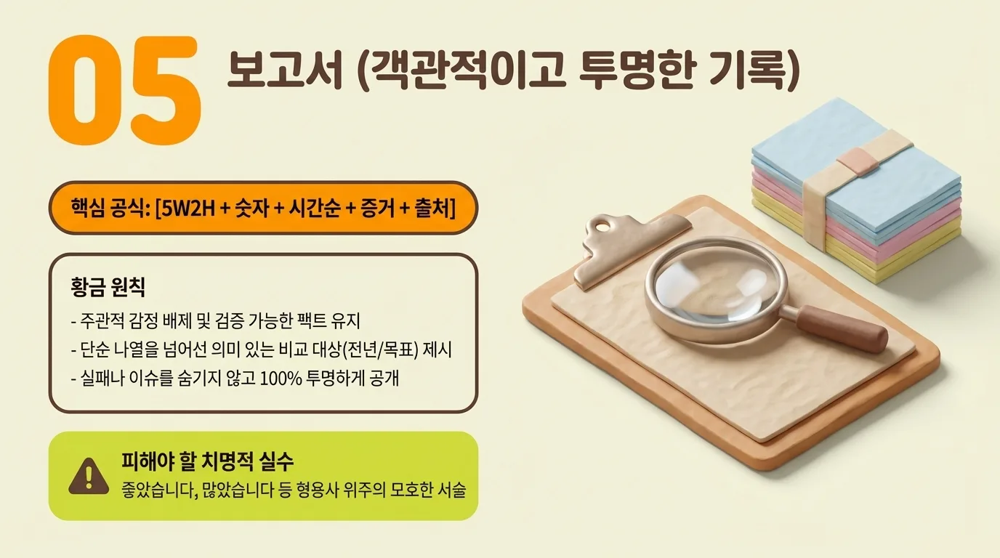
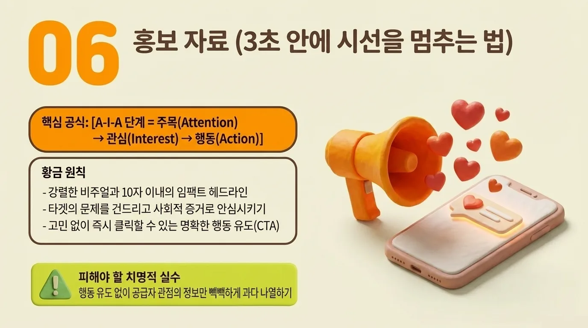
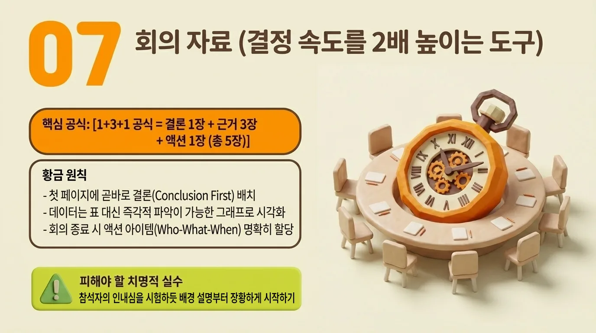
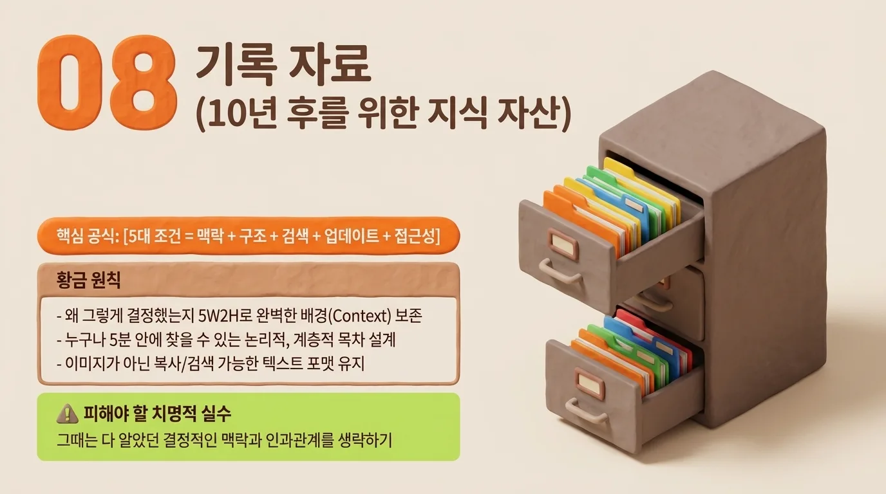
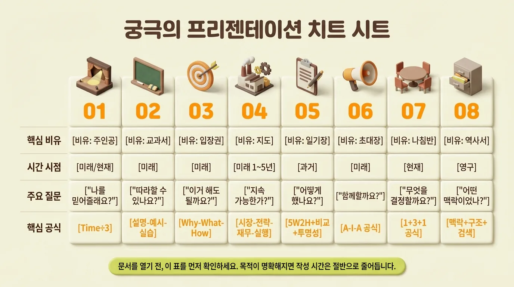

[video](https://youtu.be/5QQA-Qld3Do)

# **성공적인 소통을 위한 프리젠테이션 8가지 유형 가이드**

**프리젠테이션 8가지 유형 완벽 가이드: 목적을 알면 길이 보입니다 (시리즈 완결)**

지난 9주간, 기나긴 여정을 함께해 주셔서 감사합니다. 우리는 이 시리즈를 통해 "프리젠테이션 = 파워포인트"라는 오랜 오해를 깨고, 프리젠테이션이 단순한 디자인 작업이 아닌 '**목적에 최적화된 커뮤니케이션 전략**'임을 확인했습니다.

빈 화면의 깜빡이는 커서 앞에서 막막함을 느꼈던 경험은 이제 과거의 일이 될 것입니다. 모든 시리즈를 종합하여, 여러분이 언제든 꺼내 볼 수 있는 '성공적인 소통의 나침반'으로 이 글을 바칩니다.

## **1. 8가지 프리젠테이션, 한눈에 되돌아보기**

우리가 다룬 8가지 문서 유형은 상황(누가 발표하는가)과 목적(무엇을 얻고자 하는가)에 따라 명확히 구분됩니다.

**[상황 A: 당신이 주인공인 문서]**

- **유형 1. 발표형 프리젠테이션:** 슬라이드는 10%, 당신의 말이 90%입니다. 텍스트는 최소화하고 시각적 이미지를 극대화하여, 청중의 시선이 화면이 아닌 '발표자'에게 향하도록 해야 합니다.

**[상황 B: 자료와 함께 호흡하는 문서]**

- **유형 2. 교육 자료:** 선생님 없이도 70% 이상 이해될 수 있어야 합니다. 명확한 단계별 구성(scaffolding)과 풍부한 실습 예제, 그리고 피드백을 통해 학습자의 자기주도 학습을 이끌어내는 것이 핵심입니다.

**[상황 C: 당신을 대신하여 말하는 문서]**

- **유형 3. 제안서:** 의사결정권자의 'YES'를 이끌어내는 설득의 도구입니다. 솔루션(What)부터 들이미는 대신, 문제 상황(Why)에 대한 공감을 먼저 이끌어내고 3가지 옵션으로 선택권을 부여해야 합니다.

- **유형 4. 사업계획서:** 아이디어의 '지속 가능성'을 증명하는 로드맵입니다. 시장, 전략, 재무, 실행이라는 4대 핵심 영역을 객관적 데이터로 입증하여, 장밋빛 환상이 아닌 현실적인 생존 계획을 보여주어야 합니다.

- **유형 5. 보고서:** 과거의 성과를 '객관적으로, 투명하게, 숫자로' 기록합니다. 주관적인 감상을 배제하고 5W2H와 비교 데이터를 통해 신뢰를 구축하며, 문제점까지 투명하게 공개하여 성장의 밑거름으로 삼아야 합니다.

- **유형 6. 홍보 자료:** 3초 안에 시선을 멈추고 행동(Action)을 유도합니다. A-I-A 공식(주목 Attention → 관심 Interest → 행동 Action)을 따라 감성을 자극하고, 참여의 장벽을 낮춰 즉각적인 클릭과 신청을 만들어냅니다.

- **유형 7. 회의 자료:** 의사결정 속도를 2배 높이는 전략 도구입니다. '결론 1장 + 근거 3장 + 액션 1장'의 5장 공식을 통해, 참석자들이 현황 파악에 시간을 낭비하지 않고 즉시 '결정'에 집중할 수 있게 돕습니다.

- **유형 8. 기록 자료:** 10년 후의 후임자도 이해할 수 있는 조직의 자산입니다. 맥락(Context)을 상세히 남기고, 명확한 구조와 검색 가능성을 확보하여 '정보의 무덤'이 아닌 '살아있는 매뉴얼'을 구축해야 합니다.

## **2. 막막할 때 이 가이드를 활용하는 플로우차트**

앞으로 문서를 작성해야 할 순간이 오면, 무작정 파워포인트를 열거나 예쁜 템플릿을 찾지 마십시오. 대신 아래의 **3가지 질문**을 순서대로 스스로에게 던져보시기 바랍니다.

**Step 1. "나는 어떻게 전달할 것인가?"**

- 내가 무대에 서서 말로 다 설명한다 → **[유형 1: 발표형]**
- 설명도 하지만 혼자서도 봐야 한다 → **[유형 2: 교육형]**
- 나는 없고 이메일/메신저로 자료만 넘어간다 → **Step 2로 이동**

**Step 2. "이 문서의 궁극적인 목적(시간적 관점)은 무엇인가?"**

- 과거의 일을 알리려고 한다(기록/성과) → **[유형 5: 보고서]** 또는 **[유형 8: 기록 자료]**
- 현재 지금 당장 결정해야 할 안건이 있다 → **[유형 7: 회의 자료]**
- 미래의 승인이나 행동을 원한다 → **Step 3으로 이동**

**Step 3. "독자는 누구이며, 무엇을 요청하는가?"**

- 다수의 대중에게 행사/제품 참여를 원한다 → **[유형 6: 홍보 자료]**
- 의사결정권자에게 특정 과업 승인을 원한다 → **[유형 3: 제안서]**
- 투자자에게 장기적인 사업 운영을 증명해야 한다 → **[유형 4: 사업계획서]**

방향을 정하셨다면, 본 시리즈의 해당 유형 가이드를 펼쳐 핵심 공식과 'Top 5 실수 체크리스트'를 확인하십시오. 그리고 AI 프롬프트의 도움을 받아 뼈대를 잡는다면 작업 시간은 절반으로 줄어들 것입니다.

## **3. 맺으며: 형식에 끌려다니지 않는 당당한 커뮤니케이터로**

"내가 만들려는 게 8가지 중 어떤 종류일까?" 이 하나의 질문을 던질 수 있게 된 순간, 여러분은 이미 평범한 문서 작성자에서 '전략적 커뮤니케이터'로 도약하신 것입니다.

문서의 겉모습이 조금 투박해도 괜찮습니다. 중요한 것은 독자가 원하는 타이밍에, 가장 적절한 깊이와 형식으로 여러분의 인사이트가 전달되는 것입니다. 각 문서가 가진 고유의 톤앤매너와 구조를 이해한 여러분은 더 이상 상황에 맞지 않는 템플릿에 갇혀 밤을 새우지 않을 것입니다.

여러분의 다음 프리젠테이션이 조직의 신뢰를 얻고, 타인의 마음을 움직이는 강력한 무기가 되기를 진심으로 응원합니다. 그동안 **[프리젠테이션 8가지 유형 가이드]** 시리즈를 사랑해 주셔서 감사합니다!
