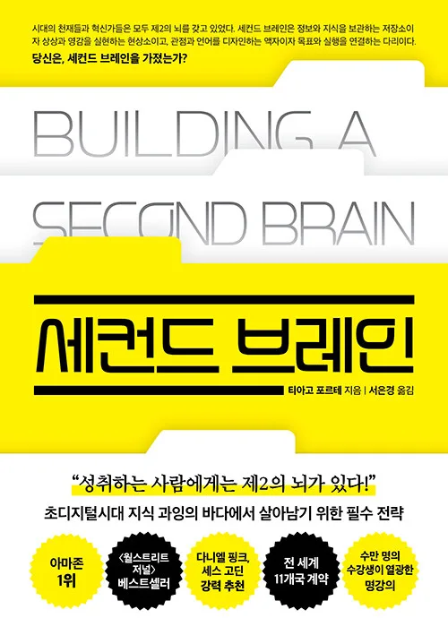
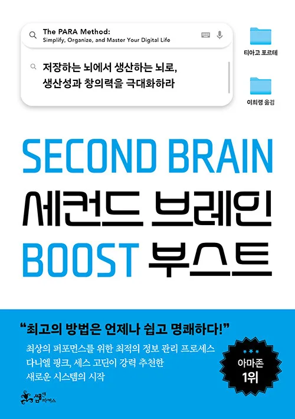

**영상 개요**

[video](https://youtu.be/1aBn2uFUO0E)

**오디오 개요**

# 제1장: 세컨드 브레인의 개념과 기초

## 1.1 세컨드 브레인이란 무엇인가

세컨드 브레인(Second Brain)은 **우리의 생물학적 뇌를 보완하는 외부 디지털 시스템으로, 정보를 수집하고, 조직하고, 활용하는 개인 맞춤형 지식 관리 체계를 의미**합니다. 이는 단순한 노트 작성이나 파일 저장을 넘어서, 우리가 접하는 모든 가치있는 정보와 아이디어를 체계적으로 관리하고 필요할 때 즉시 활용할 수 있도록 설계된 종합적인 사고 지원 시스템입니다.

세컨드 브레인의 핵심 철학은 인간의 뇌가 본래 기억 저장소가 아닌 창의적 사고와 문제 해결을 위한 프로세서로 진화했다는 인식에서 출발합니다. 우리의 뇌는 무한한 정보를 완벽하게 저장하고 인출하는 데 최적화되어 있지 않습니다. 오히려 패턴 인식, 연결 생성, 직관적 판단과 같은 고차원적 인지 활동에 탁월한 능력을 발휘합니다. 따라서 정보 저장과 조직화라는 부담을 외부 시스템에 위임함으로써, 우리는 뇌의 본연의 강점인 창의적 사고와 통찰력 발견에 더욱 집중할 수 있게 됩니다.

세컨드 브레인은 디지털 도구를 활용하여 구축되지만, 그 본질은 기술 그 자체가 아니라 사고 방식의 전환에 있습니다. 이는 **"내가 모든 것을 기억해야 한다"는 압박에서 벗어나 "중요한 것은 시스템이 기억하고, 나는 필요할 때 찾아서 활용한다"는 신뢰 기반의 접근법으로의 전환을 의미**합니다. 이러한 관점의 변화는 단순히 생산성을 높이는 것을 넘어서, 지식 노동자로서 우리가 일하고 학습하고 창조하는 방식 전체를 근본적으로 재구성합니다.

## 1.2 현대인이 직면한 정보 관리의 위기

우리는 인류 역사상 가장 많은 정보에 접근할 수 있는 시대에 살고 있습니다. 매일 수백 개의 이메일, 수십 개의 기사, 무수한 소셜 미디어 게시물, 회의와 대화를 통해 쏟아지는 정보의 홍수 속에서 생활합니다. 2025년 현재, 전 세계에서 생성되는 데이터의 양은 매년 기하급수적으로 증가하고 있으며, 개인이 하루에 소비하는 정보의 양은 불과 수십 년 전과 비교할 수 없을 정도로 방대해졌습니다.

이러한 정보 과잉 시대의 역설은 우리가 더 많은 정보에 접근할수록 오히려 중요한 것을 놓치고, 핵심을 파악하지 못하며, 실제로 활용 가능한 지식으로 전환하는 데 실패한다는 점입니다. 우리는 매일 수많은 흥미로운 아이디어를 접하지만, 며칠만 지나면 대부분을 잊어버립니다. 귀중한 통찰을 얻었던 책의 구절을 정확히 어디서 읽었는지 기억하지 못하고, 중요한 프로젝트를 시작할 때 과거에 수집했던 관련 자료들을 찾지 못해 처음부터 다시 조사해야 하는 상황에 직면합니다.

전통적인 노트 필기나 파일 저장 방식은 이러한 문제를 해결하기에 충분하지 않습니다. 정보는 다양한 앱과 플랫폼에 분산되어 있고, 체계적인 조직화 없이 무질서하게 쌓여갑니다. 검색해도 원하는 정보를 찾기 어렵고, 설령 찾더라도 맥락이 사라져 그 정보가 왜 중요했는지, 어떻게 활용해야 하는지 파악하기 힘듭니다. 결과적으로 우리는 과거에 투자했던 학습과 연구의 성과를 제대로 활용하지 못하고, 매번 비슷한 문제에 대해 처음부터 다시 생각해야 하는 비효율을 반복합니다.

더 심각한 문제는 이러한 정보 관리의 실패가 인지적 부담을 가중시켜 창의적 사고를 방해한다는 점입니다. "나중에 필요할지도 모르는" 정보에 대한 불안감, "어디선가 봤는데 찾을 수 없는" 답답함, "분명 정리해뒀는데 어디에 있는지 모르겠는" 혼란은 우리의 정신적 에너지를 소모시킵니다. **뇌는 중요한 것을 잊어버릴까 봐 끊임없이 경계 상태를 유지해야 하고, 이는 불안과 스트레스를 유발하며 창의적 사고를 위한 여유 공간을 앗아갑니다.**

## 1.3 세컨드 브레인의 필요성

세컨드 브레인은 이러한 정보 시대의 도전에 대응하기 위한 체계적이고 지속가능한 해결책을 제시합니다. 그 필요성은 크게 네 가지 차원에서 이해할 수 있습니다.

첫째, **인지적 부담의 경감**입니다. 데이비드 앨런(David Allen)이 GTD(Getting Things Done) 방법론에서 강조한 "마음은 아이디어를 보관하는 곳이 아니라 만들어내는 곳"이라는 원칙처럼, 세컨드 브레인은 기억해야 할 것들을 신뢰할 수 있는 외부 시스템에 위임함으로써 우리의 정신적 에너지를 보존합니다. 무엇을 기억해야 할지 걱정하는 대신, 우리는 그 정보를 어떻게 활용할지 생각하는 데 집중할 수 있습니다.

둘째, **지식의 복리 효과 실현**입니다. 우리가 학습하고 경험한 모든 것은 잠재적으로 미래의 프로젝트나 아이디어에 기여할 수 있는 자산입니다. 그러나 체계적인 관리 없이는 이러한 지식 자산이 활용되지 못하고 사장됩니다. 세컨드 브레인은 과거의 학습과 통찰을 미래의 창작에 연결함으로써, 시간이 지날수록 우리의 지적 자본이 복리로 성장하도록 만듭니다. 오늘 수집한 아이디어가 6개월 후 진행할 프로젝트의 핵심 요소가 되고, 작년에 읽은 책의 통찰이 현재 직면한 문제의 해결책이 될 수 있습니다.

셋째, **창의성과 혁신의 촉진**입니다. 스티븐 존슨(Steven Johnson)이 그의 저서 『좋은 생각은 어디서 오는가』에서 설명했듯이, 가장 혁신적인 아이디어는 종종 서로 다른 영역의 개념들이 새로운 방식으로 결합될 때 탄생합니다. 세컨드 브레인은 다양한 분야의 정보와 아이디어를 한 곳에 모아 우연한 발견과 창의적 연결을 가능하게 합니다. 체계적으로 조직된 지식 저장소를 탐색하는 과정에서 우리는 예상치 못한 통찰을 얻고, 전혀 관련 없어 보이던 개념들 사이에서 새로운 패턴을 발견하게 됩니다.

넷째, **개인적 성장과 자아 인식의 심화**입니다. 세컨드 브레인을 구축하는 과정은 단순히 정보를 저장하는 것이 아니라, 우리가 무엇에 관심을 갖고, 무엇을 가치있게 여기며, 어떤 방향으로 성장하고 있는지를 명확히 인식하게 만듭니다. 시간이 지나면서 축적된 노트와 아이디어는 우리의 지적 여정을 보여주는 개인적 아카이브가 되며, 이를 정기적으로 검토하는 과정에서 우리는 자신의 생각이 어떻게 진화했는지, 어떤 주제에 반복적으로 끌리는지, 어떤 패턴으로 문제를 해결하는지를 이해하게 됩니다.

## 1.4 티아고 포르테(Tiago Forte)와 Building a Second Brain

**티아고 포르테의 저서 ‘세컨드 브레인’, ‘세컨드 브레인 부스트’**

티아고 포르테는 세컨드 브레인 개념을 체계화하고 대중화한 생산성 전문가이자 교육자입니다. 그는 2017년부터 "Building a Second Brain"이라는 온라인 코스를 통해 수만 명의 학생들에게 개인 지식 관리 방법론을 가르쳐왔으며, 2022년에는 같은 제목의 베스트셀러 책을 출간하여 세컨드 브레인 방법론을 보다 넓은 대중에게 소개했습니다.

포르테의 배경은 그의 방법론에 실용성과 깊이를 더합니다. 그는 원래 실리콘밸리의 기술 기업에서 일하던 중 만성 통증으로 고통받으면서, 자신의 건강 상태를 관리하고 의료 정보를 체계적으로 정리할 필요성을 절감했습니다. 이 개인적 경험은 정보 관리가 단순히 업무 효율성의 문제가 아니라 삶의 질과 직결된다는 인식으로 이어졌고, 다양한 생산성 방법론과 지식 관리 시스템을 연구하고 실험하는 계기가 되었습니다.

포르테의 독창성은 기존의 여러 생산성 이론과 실천법들을 종합하여 실행 가능한 하나의 체계로 통합했다는 점에 있습니다. 그는 데이비드 앨런의 GTD, 제텔카스텐(Zettelkasten) 방법론, 니클라스 루만의 노트 시스템, 그리고 현대의 디지털 도구들을 연구하여, 이들의 장점을 결합하고 일반인도 쉽게 적용할 수 있도록 단순화했습니다. 특히 그가 개발한 CODE(Capture, Organize, Distill, Express) 프레임워크와 PARA(Projects, Areas, Resources, Archives) 조직 시스템은 복잡한 지식 관리 이론을 누구나 실천할 수 있는 구체적인 단계로 변환한 것으로 평가받습니다.

포르테의 접근법이 기존 생산성 방법론과 구별되는 핵심은 **"****실행 가능성(actionability)"에 대한 집요한 강조**입니다. 그는 정보를 수집하고 정리하는 것 자체가 목적이 아니라, 그 정보를 실제 프로젝트와 창작 활동에 활용하는 것이 궁극적 목표라고 강조합니다. 이러한 철학은 세컨드 브레인을 단순한 디지털 도서관이 아닌 "생각의 공장"으로 만드는 것을 목표로 합니다. 모든 노트, 모든 자료는 미래의 어떤 프로젝트나 결정에 기여할 가능성을 염두에 두고 수집되고 조직됩니다.

또한 포르테는 **"완벽함보다 진행"을 중시하는 실용주의적 태도**를 일관되게 유지합니다. 많은 지식 관리 시스템이 복잡한 분류 체계와 엄격한 규칙으로 인해 오히려 사용자를 압도하고 지속하기 어렵게 만드는 반면, 포르테의 방법론은 80/20 원칙에 기반하여 최소한의 노력으로 최대의 효과를 얻을 수 있는 단순하고 유연한 접근을 지향합니다. 그는 완벽한 시스템을 설계하려는 시도가 종종 실행을 방해한다는 점을 인식하고, **"지금 당장 시작할 수 있고 점진적으로 개선할 수 있는" 방법**을 제시합니다.

**80/20 원칙이란?**

80/20 원칙은 '파레토 법칙(Pareto Principle)'을 말하는 것으로, **20%의 노력으로 80%의 결과를 얻을 수 있다**는 개념입니다.

본문에서는 이 원칙이 다음과 같이 적용됩니다:

- **80%의 효과**: 지식 관리 시스템이 제공하는 대부분의 실질적 가치
- **20%의 노력**: 최소한의 시간과 에너지 투입 (복잡한 분류나 완벽한 시스템 설계 대신 단순하고 유연한 접근)

즉, 포르테는 100%의 노력을 들여 완벽한 시스템을 만들려고 하면 오히려 실행이 어려워지므로, 핵심적인 20%의 노력만 투입해도 충분히 효과적인 시스템을 만들 수 있다고 강조합니다.

이것이 바로 "완벽함보다 진행"과 "지금 당장 시작할 수 있는 방법"을 중시하는 이유입니다.

## 1.5 세컨드 브레인의 핵심 가치 제안

세컨드 브레인은 단순히 정보를 더 잘 저장하는 방법 이상의 가치를 제공합니다. 그것은 우리가 지식 노동자로서 일하고, 학습하고, 창조하는 방식 전체를 변화시키는 종합적인 시스템입니다. 이 시스템의 핵심 가치 제안은 다음과 같습니다.

1. **기억의 확장과 신뢰성 확보**
  세컨드 브레인의 가장 기본적인 가치는 우리의 기억 능력을 근본적으로 확장한다는 것입니다. 인간의 기억은 본질적으로 불완전하고 선택적이며 왜곡되기 쉽습니다. 우리는 중요한 정보를 잊어버리고, 세부사항을 혼동하며, 시간이 지나면서 경험을 재구성합니다. 세컨드 브레인은 이러한 한계를 극복하여 우리가 경험하고 학습한 모든 것의 정확한 기록을 보존합니다. 더 중요한 것은, 이 시스템이 신뢰할 수 있다는 확신이 우리의 심리적 부담을 크게 경감시킨다는 점입니다.
2. **시간을 뛰어넘는 사고의 연속성**
  세컨드 브레인은 과거의 나와 현재의 나, 그리고 미래의 나를 연결하는 시간적 다리 역할을 합니다. 6개월 전에 읽었던 책의 통찰이 오늘의 프로젝트에 완벽하게 들어맞는 순간, 작년에 메모했던 아이디어가 현재 직면한 문제의 해결책이 되는 경험은 세컨드 브레인 사용자들이 공통적으로 보고하는 놀라운 가치입니다. 이는 단순히 정보를 재발견하는 것을 넘어, 우리의 사고가 시간을 초월하여 누적되고 성숙해지도록 만듭니다.
3. **창의적 연결의 촉진**
  스티브 잡스는 "창의성이란 사물을 연결하는 것"이라고 말했습니다. 세컨드 브레인은 이러한 연결을 체계적으로 만들어내는 환경을 제공합니다. 서로 다른 시기에, 다른 맥락에서 수집된 정보들이 한 공간에 모여있을 때, 우리는 예상치 못한 패턴을 발견하고 새로운 아이디어를 생성할 수 있습니다. 이는 단순한 검색이나 분류를 넘어서, 지식 간의 유기적 연결망을 만들어 세렌디피티(행복한 우연)를 의도적으로 설계하는 것입니다.
4. **프로젝트 실행 속도의 가속화**
  새로운 프로젝트를 시작할 때 가장 큰 장벽 중 하나는 "빈 페이지의 공포"입니다. 아무것도 없는 상태에서 시작하는 것은 막대한 에너지를 요구합니다. 세컨드 브레인을 가진 사람은 절대 빈손으로 시작하지 않습니다. 과거에 수집하고 정리해둔 아이디어, 자료, 템플릿들이 이미 존재하며, 새 프로젝트는 이러한 기존 자산을 재조합하고 발전시키는 과정이 됩니다. 이는 프로젝트 시작의 심리적 장벽을 낮추고, 실제 실행 속도를 극적으로 높입니다.
5. **학습의 복리 효과**
  세컨드 브레인은 학습을 단발성 이벤트에서 누적되는 투자로 전환합니다. 한 번 읽은 책, 한 번 들은 강의, 한 번 경험한 프로젝트가 일회성으로 소비되지 않고 영구적인 지적 자산이 됩니다. 시간이 지날수록 이러한 자산은 복리로 성장하여, 새로운 학습이 기존 지식과 결합되면서 점점 더 빠르고 깊은 이해를 가능하게 합니다. 이는 단순한 정보 축적이 아니라 진정한 지혜의 성장입니다.
6. **의사결정의 질 향상**
  중요한 결정을 내려야 할 때, 우리는 종종 불완전한 기억과 부분적인 정보에 의존합니다. 세컨드 브레인은 과거의 경험, 학습한 교훈, 고려했던 옵션들에 대한 완전한 기록을 제공하여 더 정보에 입각한 의사결정을 가능하게 합니다. 또한 정기적으로 노트를 검토하는 과정에서 우리는 자신의 생각 패턴, 편향, 가치관을 더 명확히 인식하게 되며, 이는 메타인지적 능력을 향상시켜 의사결정의 질을 높입니다.

  **‘메타인지’란?**

  메타인지(Metacognition)는 '생각에 대한 생각', 즉 자신의 인지 과정을 인식하고 조절하는 능력입니다.

  1. 핵심 구성 요소: 메타인지는 크게 두 가지로 구성됩니다:
    - 메타인지적 지식 - 자신이 무엇을 알고 모르는지, 어떻게 학습하는지, 어떤 전략이 효과적인지에 대한 이해
    - 메타인지적 조절 - 학습이나 문제 해결 과정에서 자신의 사고를 모니터링하고 조정하는 능력
  2. 실생활 예시
    - "이 개념을 이해했는지 스스로 테스트해봐야겠어" (자기 점검)
    - "이 방법으로는 안 되니 다른 접근을 시도해야겠어" (전략 조정)
    - "나는 아침에 집중이 더 잘 되니까 어려운 작업은 오전에 하자" (자기 인식)
  3. 왜 중요한가?
    메타인지 능력이 높은 사람은:

    - 더 효과적으로 학습합니다
    - 문제 해결 능력이 뛰어납니다
    - 자신의 강점과 약점을 정확히 파악합니다
    - 더 나은 의사결정을 내립니다

  세컨드 브레인을 통해 노트를 정기적으로 검토하는 과정에서 "자신의 생각 패턴, 편향, 가치관을 더 명확히 인식하게 되며, 이는 메타인지적 능력을 향상시켜 의사결정의 질을 높입니다."
7. **개인적 성장의 가시화**
  세컨드 브레인은 우리의 지적 성장을 가시적으로 만듭니다. 시간이 지나면서 축적된 노트들을 돌아보면, 우리가 어떤 주제에 관심을 가져왔고, 생각이 어떻게 진화했으며, 무엇을 성취했는지를 명확히 볼 수 있습니다. 이러한 가시성은 강력한 동기부여 요소가 되며, 지속적인 학습과 성장에 대한 내재적 보상을 제공합니다. 또한 자신의 독특한 관심사와 전문성의 영역을 발견하는 데 도움을 줍니다.
8. **스트레스 감소와 정신적 여유**
  "나중에 필요할 수도 있는" 정보에 대한 불안, "분명 어딘가에 있는데" 찾을 수 없는 답답함에서 해방되는 것은 세컨드 브레인이 주는 가장 즉각적인 심리적 혜택입니다. 모든 중요한 것이 안전하게 저장되어 있고 필요할 때 찾을 수 있다는 신뢰는 우리의 정신적 부담을 크게 줄이고, 이렇게 확보된 인지적 여유는 창의적 사고와 깊은 작업을 위한 공간을 만들어냅니다.

세컨드 브레인은 이처럼 다층적인 가치를 제공하는 종합적 시스템입니다. 그것은 단순한 생산성 향상 도구를 넘어서, 우리가 정보 시대를 살아가는 지식 노동자로서 더 효과적이고, 창의적이며, 균형잡힌 삶을 살아갈 수 있도록 돕는 근본적인 인프라가 됩니다.

## 1.6 적용

### 1.6.1 Second Brain 시작 전 준비 체크리스트

1. **마인드셋 점검:**
  - [ ] 완벽한 시스템이 아닌 **지속 가능한 습관**이 목표임을 이해
  - [ ] 최소 6개월 동안 하나의 도구에 집중하기로 약속
  - [ ] "수집"이 아닌 "창작"이 최종 목표임을 인식
  - [ ] 80/20 원칙 수용 (80%의 가치는 20%의 노력에서)
2. **현재 상태 평가:**
  - [ ] 현재 정보 관리의 가장 큰 문제점 3가지 작성
  - [ ] 세컨드 브레인으로 달성하고 싶은 구체적 목표 정의
  - [ ] 주당 할애 가능한 시간 확인 
  - [ ] 현재 사용 중인 도구와 워크플로우 목록 작성

### 1.6.2 기초 시스템 구축을 위한 도구 선택과 설치

1. 메인 노트 앱 선택
  - [ ] Notion (협업 가능, 초보자 친화적, 데이터베이스 사용, 기능성 템플릿 제작 가능)
  - [ ] Obsidian (프라이버시 강조, 설정이 다소 어려움, 확장성, 연관된 글쓰기에 적합)
  - [ ] Apple Notes/Google Keep (최소주의)
2. 앱 설치 및 계정 생성
3. 기본 설정 완료 (언어, 테마, 폰트)
