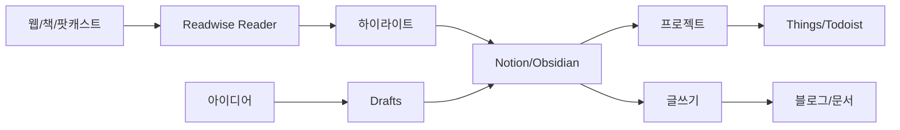

# 제7장: 도구 생태계와 앱 추천 – 당신의 Second Brain을 위한 최적의 도구 선택

"최고의 도구는 당신이 실제로 사용하는 도구입니다."

이 문장을 기억하세요. 수많은 생산성 전문가들이 이 단순한 진실을 깨닫기까지 수년이 걸렸습니다. 우리는 종종 완벽한 도구를 찾는 데 몰두하다가, 정작 중요한 것 – 실제로 지식을 수집하고, 정리하고, 활용하는 것 – 을 놓치곤 합니다.

이번 장에서는 Second Brain 구축을 위한 도구들을 체계적으로 살펴봅니다. 하지만 단순히 앱 목록을 나열하는 것이 아니라, **각 도구가 언제, 왜 필요한지, 그리고 어떻게 통합하여 사용할지**에 초점을 맞춥니다.

Tiago Forte는 말합니다: "도구는 시스템을 지원해야지, 시스템이 도구에 종속되어서는 안 된다." 이 원칙을 염두에 두고, 당신만의 도구 생태계를 구축해봅시다.

---

## 7.1 도구 선택의 원칙 – 미로에서 나침반 찾기

### 7.1.1 복잡성 vs 기능성: 황금 균형점

**복잡성의 역설**

더 많은 기능이 항상 더 나은 것은 아닙니다. 실제로 대부분의 사용자는:

```plain text
Notion의 기능 중 20%만 사용
Obsidian 플러그인 1,500개 중 평균 5-10개만 활용
Evernote 고급 기능의 90%는 한 번도 사용하지 않음

```

**80/20 원칙 적용**

```plain text
필수 기능 (80%의 가치):
✅ 빠른 캡처
✅ 검색
✅ 동기화
✅ 기본적인 조직화

선택 기능 (20%의 가치):
⚡ 고급 태깅
⚡ 복잡한 자동화
⚡ 커스텀 워크플로우
⚡ API 연동

```

**복잡성 테스트**

새 도구를 평가할 때 자문하세요:

1. **3초 테스트**: 새 노트를 만드는 데 3초 이상 걸리는가?
2. **1주일 테스트**: 일주일 후에도 주요 기능을 기억하는가?
3. **설명 테스트**: 친구에게 5분 안에 사용법을 설명할 수 있는가?

하나라도 "아니오"라면, 그 도구는 너무 복잡할 가능성이 큽니다.

### 7.1.2 장기 지속가능성: 10년 후를 생각하라

**도구 수명 체크리스트**

```markdown
## 🏆 지속가능한 도구의 특징

### 데이터 이식성
✅ 표준 포맷 지원 (Markdown, HTML, PDF)
✅ 쉬운 내보내기/가져오기
✅ 오픈 파일 형식

### 비즈니스 모델
✅ 명확한 수익 모델
✅ 활발한 개발 (최근 6개월 내 업데이트)
✅ 투명한 로드맵

### 커뮤니티
✅ 활성 사용자 커뮤니티
✅ 서드파티 도구/플러그인
✅ 풍부한 문서화

### 백업 계획
✅ 로컬 백업 가능
✅ 다른 도구로 마이그레이션 경로
✅ 오프라인 접근성

```

**레드 플래그 (경고 신호)**

```plain text
⚠️ 독점적 파일 형식만 사용
⚠️ 내보내기 기능 제한
⚠️ 1년 이상 주요 업데이트 없음
⚠️ 불명확한 비즈니스 모델
⚠️ 작은 회사의 무료 서비스

```

### 7.1.3 플랫폼 독립성: 종속되지 않는 자유

**멀티 플랫폼 우선순위**

```plain text
1순위: 웹 + 모든 OS + 모바일
   예: Notion, Google Keep

2순위: 주요 OS + 모바일
   예: Obsidian, Todoist

3순위: 특정 생태계 전용
   예: Apple Notes (Apple만), OneNote (Microsoft 중심)

```

**플랫폼 전략별 선택**

**All-in-One 전략**

```plain text
장점:
- 단일 도구로 모든 작업
- 학습 곡선 하나
- 일관된 경험

추천: Notion, Obsidian + 플러그인

단점:
- 벤더 종속
- 단일 실패점

```

**Best-of-Breed 전략**

```plain text
장점:
- 각 영역 최고의 도구
- 유연성
- 리스크 분산

추천:
- 캡처: Drafts
- 정리: Obsidian
- 작업: Things
- 공유: Notion

단점:
- 통합 복잡성
- 비용 증가

```

---

## 7.2 Capture(포착) 단계 도구 – 아이디어를 놓치지 않는 그물망

### 7.2.1 통합 노트 앱: 모든 것을 담는 그릇

**Notion – 협업의 왕**

```markdown
## Notion

### 강점
✅ 데이터베이스 + 노트의 완벽한 결합
✅ 실시간 협업
✅ 풍부한 템플릿
✅ AI 기능 내장
✅ 무료 플랜 관대함

### 약점
❌ 오프라인 제한적
❌ 대용량 데이터베이스 느림
❌ 마크다운 부분 지원

### 최적 사용자
- 팀 프로젝트 관리자
- 비주얼 사고 선호자
- 올인원 솔루션 원하는 사람

### 실전 설정
1. 웹 클리퍼 설치
2. 모바일 위젯 설정
3. 기본 PARA 템플릿 적용
4. 단축키 암기 (Cmd/Ctrl + N 등)

💰 가격: 무료 / $8/월 (Plus) / $15/월 (Business)

```

**Obsidian – 파워유저의 선택**

```markdown
## Obsidian

### 강점
✅ 완전한 로컬 저장
✅ 순수 마크다운
✅ 강력한 링킹 시스템
✅ 1,500+ 플러그인
✅ 무료 (동기화 제외)

### 약점
❌ 가파른 학습 곡선
❌ 모바일 앱 제한적
❌ 설정 시간 필요

### 최적 사용자
- 개발자/연구자
- 프라이버시 중시
- 커스터마이징 좋아함
- Zettelkasten 방식 선호

### 필수 플러그인
1. Templater
2. Calendar
3. Dataview
4. Quick Switcher++
5. Natural Language Dates

💰 가격: 무료 / $5-10/월 (Sync)

```

**Evernote – 검증된 고전**

```markdown
## Evernote

### 강점
✅ 강력한 OCR
✅ 웹 클리핑 최강
✅ 검색 기능 탁월
✅ 15년+ 안정성

### 약점
❌ 무료 제한 심함
❌ 혁신 부족
❌ 느린 동기화
❌ 마크다운 미지원

### 최적 사용자
- 기존 Evernote 사용자
- 스캔/OCR 많이 사용
- 단순함 선호

💰 가격: 무료 (2기기) / $8/월 (Personal)

```

### 7.2.2 빠른 캡처: 순간의 아이디어를 잡는 도구

**속도가 생명인 이유**

```plain text
아이디어 증발 시간:
5초: 세부사항 잊기 시작
30초: 맥락 손실
2분: 완전히 잊음

→ 캡처는 5초 이내여야 함

```

**Apple Notes – iOS의 숨은 보석**

```markdown
## 빠른 캡처 설정 (iOS)

### 제어 센터 설정
1. 설정 → 제어 센터
2. Notes 추가
3. 잠금 화면에서 스와이프 → 탭

### 음성 메모 연동
1. Siri: "노트 만들어"
2. 바로 말하기 시작
3. 자동 저장

### 스캔 기능 활용
- 문서 스캔: 자동 보정
- 텍스트 인식: iOS 15+
- 태그 자동 생성

💡 팁: "빠른 노트" 폴더 별도 생성

```

**Google Keep – 크로스 플랫폼 챔피언**

```markdown
## Google Keep 최적화

### 위젯 설정
- 홈 화면 1번 위치
- 음성 메모 위젯
- 사진 메모 위젯

### 라벨 시스템
#capture (임시)
#process (처리 필요)
#idea (아이디어)
#reference (참고)

### 색상 코딩
🔴 긴급
🟡 중요
🟢 참고
⚫ 보관

### 리마인더 활용
- 위치 기반: "집 도착 시"
- 시간 기반: "매일 오후 9시"

```

**Drafts – 텍스트 우선 철학**

```markdown
## Drafts 마스터하기

### 핵심 철학
"캡처 먼저, 정리는 나중에"

### 설정
1. 앱 열면 바로 새 노트
2. 자동 저장
3. 처리 액션 설정

### 필수 액션
- Send to Notion
- Send to Obsidian
- Create Task in Things
- Append to Daily Note

### 워크플로우
캡처 (1초)
  ↓
임시 보관 (자동)
  ↓
일일 처리 (저녁)
  ↓
적절한 앱으로 전송

```

### 7.2.3 웹 클리핑: 인터넷의 보물을 수집하기

**Readwise Reader – 궁극의 읽기 도구**

```markdown
## Readwise Reader 완벽 가이드

### 통합 가능 소스
- 웹 기사
- PDF
- 트위터 스레드
- YouTube 동영상
- 뉴스레터
- Kindle 하이라이트

### 하이라이트 워크플로우
1. 읽으며 하이라이트
2. 태그 자동 추가
3. Readwise 동기화
4. Second Brain으로 자동 전송

### 고급 기능
- AI 요약
- 질문 생성
- Ghostreader (AI 대화)
- 소크라테스식 질문

💰 가격: $8/월 (Reader + Readwise)

### 설정 팁
- Daily Review 이메일 활성화
- 노트 앱 자동 동기화
- 커스텀 임포트 템플릿

```

**Pocket – 심플한 수집**

```markdown
## Pocket 활용법

### 장점
✅ 깔끔한 읽기 모드
✅ 오프라인 저장
✅ 음성 재생 (TTS)

### 태그 전략
읽기 우선순위:
#must-read
#should-read
#nice-to-read

주제:
#work
#personal
#learning

### 주간 처리
일요일 저녁 루틴:
1. 모든 저장 항목 검토
2. 읽을 것 선별 (최대 5개)
3. 나머지 아카이브/삭제
4. 핵심 내용 Second Brain으로

```

**Raindrop.io – 비주얼 북마크 매니저**

```markdown
## Raindrop.io 특화 기능

### 시각적 정리
- 무드보드 스타일
- 스크린샷 자동 생성
- 컬렉션별 커버 이미지

### 협업 기능
- 공유 컬렉션
- 팀 코멘트
- 퍼블릭 페이지

### 고급 검색
- 전체 텍스트 검색
- 깨진 링크 감지
- 중복 제거

💰 가격: 무료 / $3/월 (Pro)

```

### 7.2.4 음성/비디오: 말하는 것을 텍스트로

**Otter.ai – 회의의 혁명**

```markdown
## Otter.ai 실전 활용

### 회의 녹음
1. 회의 시작 → 녹음 시작
2. 자동 화자 구분
3. 실시간 전사
4. 핵심 포인트 하이라이트

### 통합
- Zoom 자동 녹음
- Google Meet 연동
- Slack 공유
- Notion/Obsidian 내보내기

### 활용 시나리오
- 1:1 미팅
- 강의/웨비나
- 브레인스토밍
- 인터뷰

### 후처리 워크플로우
1. 자동 전사 검토
2. 오류 수정 (5분)
3. 핵심 발췌
4. Action Items 추출
5. Second Brain으로 이동

💰 가격: 무료 (600분/월) / $10/월 (Pro)

```

---

## 7.3 Organize(조직) 단계 도구 – 카오스에서 코스모스로

### 7.3.1 PKM 시스템: 지식의 집

**노트 앱 비교 매트릭스**

```markdown
| 기능 | Notion | Obsidian | Roam | Logseq |
|------|--------|----------|------|--------|
| 가격 | 무료/$8 | 무료 | $15 | 무료 |
| 로컬 저장 | ❌ | ✅ | ❌ | ✅ |
| 협업 | ⭐⭐⭐ | ⭐ | ⭐⭐ | ⭐ |
| 링킹 | ⭐⭐ | ⭐⭐⭐ | ⭐⭐⭐ | ⭐⭐⭐ |
| 데이터베이스 | ⭐⭐⭐ | ⭐ | ⭐⭐ | ⭐ |
| 학습 곡선 | 중간 | 높음 | 높음 | 중간 |
| 모바일 | ⭐⭐ | ⭐⭐ | ⭐ | ⭐⭐ |
| 플러그인 | 제한적 | 1500+ | 제한적 | 중간 |

```

**Roam Research – 사고의 그래프**

```markdown
## Roam Research 심화

### 블록 참조의 힘
- 모든 것이 블록
- 어디서나 참조 가능
- 양방향 자동 링크

### Daily Notes 워크플로우
매일 아침:
- 자동으로 오늘 페이지 생성
- 전날 미완료 끌어오기
- 랜덤 블록 리뷰

### 쿼리 활용
{{[[query]]: {and: [[프로젝트]] [[진행중]]}}}
→ 진행 중인 모든 프로젝트 표시

### 단점 극복
- 느린 속도 → 페이지 분할
- 비싼 가격 → Logseq 대안
- 오프라인 없음 → 로컬 백업

```

**Logseq – 무료 대안의 최강자**

```markdown
## Logseq 마스터 가이드

### Obsidian과 차별점
- 아웃라이너 기반
- 블록 단위 작업
- 내장 플래시카드
- 완전 오픈소스

### PDF 주석 워크플로우
1. PDF 임포트
2. 하이라이트하며 읽기
3. 블록 참조로 노트 작성
4. 자동으로 원문 링크

### 저널 중심 조직
- 모든 것이 Daily Journal에서 시작
- 자연스럽게 링크 생성
- 나중에 구조화

### 플러그인 추천
1. Tabs (멀티탭)
2. Agenda (일정 관리)
3. Heatmap (활동 시각화)
4. TODO Master

```

### 7.3.2 프로젝트 관리: 실행의 엔진

**Todoist – 심플함의 미학**

```markdown
## Todoist PARA 통합

### 프로젝트 구조
📁 Projects (PARA)
  📁 [P] 웹사이트 리뉴얼
  📁 [P] Q4 마케팅 캠페인

📁 Areas (PARA)
  📁 [A] 건강 관리
  📁 [A] 재무 관리

### 라벨 시스템
@다음행동 (Next Action)
@대기중 (Waiting For)
@언젠가 (Someday)
@장소 (Context)

### 필터 마법
오늘 집중:
"오늘 & @다음행동"

주간 리뷰:
"7일 이내 & !@언젠가"

대기 중 팔로업:
"@대기중 & 기한 지남"

### 카르마 시스템 활용
- 일일 목표: 5개 작업
- 주간 목표: 25개
- 연속 기록 유지

```

**Things 3 – Mac의 예술품**

```markdown
## Things 3 고급 활용

### 자연어 입력
"내일 오후 3시 회의 준비 @사무실"
→ 자동 파싱 및 설정

### 영역별 체크리스트
프로젝트 시작 템플릿:
- [ ] 목표 정의
- [ ] 이해관계자 확인
- [ ] 타임라인 설정
- [ ] 리소스 할당
- [ ] 킥오프 미팅

### 반복 작업 패턴
매주 금요일:
- 주간 리뷰
- 다음 주 계획
- 인박스 정리

매월 첫째 주:
- 월간 목표 점검
- 프로젝트 상태 업데이트

### Things + Obsidian 연동
- Things URL 스킴 활용
- 프로젝트 노트에 작업 링크
- 완료 작업 자동 기록

```

### 7.3.3 파일 관리: 디지털 자산의 도서관

**DEVONthink – Mac 파워유저의 선택**

```markdown
## DEVONthink 고급 기능

### AI 분류 엔진
- 자동 분류 제안
- 유사 문서 찾기
- 스마트 그룹

### 문서 처리
- OCR (여러 언어)
- 이메일 아카이브
- 웹 사이트 전체 저장
- RSS 피드 관리

### 워크플로우 자동화
1. 감시 폴더 설정
2. 자동 임포트
3. 규칙 기반 분류
4. 태그 자동 적용
5. 스마트 규칙 실행

💰 가격: $99 (표준) / $199 (Pro)

```

---

## 7.4 Distill(정제) 단계 도구 – 금을 정련하기

### 7.4.1 하이라이팅: 핵심을 뽑아내는 기술

**Readwise – 하이라이트의 허브**

```markdown
## Readwise 완전 정복

### 통합 가능 플랫폼 (2024)
📚 전자책
- Kindle
- Apple Books
- Kobo
- Google Play Books

📱 소셜/웹
- Twitter
- Instapaper
- Pocket
- Reader

📝 노트 앱
- Obsidian
- Notion
- Roam
- Evernote

### Daily Review 최적화
설정:
- 하루 5개 하이라이트
- 오전 8시 발송
- 테마별 그룹핑
- 질문 프롬프트 포함

### 태그 전략
#🌟 (최고 중요)
#💡 (아이디어)
#📊 (데이터/통계)
#✍️ (글쓰기 참고)
#🎯 (실행 가능)

### Readwise to Obsidian
자동 동기화 템플릿:

```

# {{title}}

{{author}}
{{url}}

## Highlights

{{#highlights}}

> {{text}}
> {{#note}}📝 {{note}}{{/note}}
> 🏷️ {{tags}}
> {{/highlights}}

```plain text

```

**Hypothesis – 웹 주석의 표준**

```markdown
## Hypothesis 협업 주석

### 공개 주석 vs 비공개
공개: 학술 논문, 공개 문서
비공개: 개인 리서치, 민감 자료

### 그룹 기능
- 팀 리서치
- 스터디 그룹
- 프로젝트 협업

### API 활용
- 자동 백업
- Second Brain 동기화
- 데이터 분석

```

### 7.4.2 요약/분석: AI의 도움받기

**ChatGPT/Claude 활용법**

```markdown
## AI 요약 프롬프트 템플릿

### 논문 요약
"다음 논문을 읽고 5가지로 요약해주세요:
1. 핵심 주장
2. 방법론
3. 주요 발견
4. 한계점
5. 실무 적용 방안"

### 책 챕터 정리
"이 챕터의 내용을:
- 3가지 핵심 개념
- 2가지 실전 적용법
- 1가지 기억할 인용구
로 정리해주세요"

### 회의록 분석
"이 회의록에서:
- 결정 사항
- 액션 아이템 (담당자 포함)
- 미해결 이슈
- 다음 단계
를 추출해주세요"

```

**Notion AI 통합 활용**

```markdown
## Notion AI 실전 활용

### 자동 요약
선택 → AI → Summarize
- 핵심만 추출
- 불필요한 부분 제거

### 글 개선
- Fix spelling & grammar
- Make shorter/longer
- Change tone

### 아이디어 확장
"Continue writing"
"Find action items"
"Generate ideas"

### 커스텀 프롬프트
/ai 명령어 생성:
- 주간 보고서 템플릿
- 이메일 초안
- 프로젝트 계획서

```

### 7.4.3 시각화: 보이는 것이 이해하는 것

**MindNode – 생각의 지도**

```markdown
## MindNode 활용 시나리오

### 브레인스토밍
중앙: 핵심 문제
  → 원인들
    → 세부 원인
  → 해결책들
    → 실행 방안

### 프로젝트 계획
프로젝트명
  → 목표
  → 이해관계자
  → 타임라인
  → 리소스
  → 리스크

### 학습 정리
주제
  → 핵심 개념 1
    → 세부 설명
    → 예시
  → 핵심 개념 2
    → 응용

### 스타일 설정
- 색상: 중요도별
- 아이콘: 카테고리별
- 연결선: 관계 표시

```

**Miro – 무한 캔버스**

```markdown
## Miro 팀 협업 템플릿

### PARA 비주얼 대시보드
[Projects]     [Areas]
  카드들         카드들

[Resources]    [Archive]
  카드들         카드들

### 프로젝트 칸반
To Do | Doing | Review | Done
 카드    카드    카드     카드

### 브레인스토밍 세션
1. 아이디어 수집 (5분)
2. 그룹핑 (5분)
3. 투표 (3분)
4. 액션 플랜 (10분)

### 통합 기능
- Slack 알림
- Jira 연동
- Google Drive
- Notion 임베드

```

---

## 7.5 Express(표현) 단계 도구 – 창작의 도구들

### 7.5.1 글쓰기: 생각을 문장으로

**Ulysses – 작가의 도구**

```markdown
## Ulysses 장편 글쓰기

### 구조
📁 프로젝트
  📄 아이디어 노트
  📂 초고
    📄 챕터 1
    📄 챕터 2
  📂 수정본
  📂 최종본

### 글쓰기 목표
- 일일: 500단어
- 주간: 3,000단어
- 프로젝트: 50,000단어

### 마크다운 XL
특수 기능:
{++추가된 텍스트++}
{--삭제된 텍스트--}
{~~취소선~~}
{>>주석<<}

### 출판 워크플로우
Ulysses → Medium/WordPress
- 직접 퍼블리싱
- 이미지 자동 업로드
- 포맷 유지

```

**iA Writer – 집중의 미학**

```markdown
## iA Writer 미니멀 환경

### Focus Mode
- Sentence: 현재 문장만
- Paragraph: 현재 단락만
- Typewriter: 중앙 고정

### 문체 분석
- 형용사 (파란색)
- 명사 (빨간색)
- 부사 (주황색)
- 동사 (초록색)
- 접속사 (보라색)

### 템플릿 시스템
/템플릿 폴더
  - 블로그.md
  - 리포트.md
  - 이메일.md

### Content Blocks
파일 포함:
/챕터1.md
/이미지.webp
/표.csv

```

### 7.5.2 발표: 아이디어를 무대에

**Keynote/PowerPoint 대안들**

```markdown
## 현대적 프레젠테이션 도구

### Pitch
장점:
✅ 실시간 협업
✅ 아름다운 템플릿
✅ 분석 기능
✅ 비디오 녹화

활용:
- 팀 발표
- 투자자 피칭
- 제품 데모

### Slides (Google)
장점:
✅ 무료
✅ 어디서나 접근
✅ 실시간 Q&A
✅ 자동 저장

통합:
- YouTube 임베드
- Google Sheets 차트
- 실시간 업데이트

### Deckset (Mac)
장점:
✅ 마크다운 → 슬라이드
✅ 자동 디자인
✅ 버전 관리 쉬움
✅ 빠른 제작

워크플로우:
Obsidian 노트 → Deckset → PDF

```

### 7.5.3 퍼블리싱: 세상과 공유하기

**플랫폼별 전략**

```markdown
## 퍼블리싱 플랫폼 선택

### Medium
최적: 일반 독자, 기술 블로그
장점: 내장 독자층, 깔끔한 UI
단점: 페이월, 제한적 커스터마이징

### Substack
최적: 뉴스레터, 유료 구독
장점: 이메일 리스트, 수익화
단점: SEO 약함, 디자인 제한

### Ghost
최적: 전문 블로그, 멤버십
장점: 오픈소스, 완전 제어
단점: 기술 지식 필요

### WordPress
최적: 완전한 웹사이트
장점: 무한 확장, 플러그인
단점: 복잡함, 유지보수

```

---

## 7.6 통합 워크플로우 예시 – 레벨별 최적 조합

### 7.6.1 초보자용 미니멀 스택 (월 $0-10)

**도구 구성**

```markdown
## 🌱 초보자 스택

### 핵심 도구 (무료)
- **노트**: Apple Notes 또는 Google Keep
- **작업**: 기본 리마인더 앱
- **클라우드**: iCloud(5GB) 또는 Google Drive(15GB)
- **웹 클립**: 브라우저 북마크

### 선택 도구 ($8-10/월 중 1개)
- Notion Personal (올인원 원할 때)
- Readwise Reader (많이 읽을 때)
- Todoist Pro (작업 관리 중요할 때)

### 일일 워크플로우

```

아침 (5분)
├─ 어제 캡처 검토
├─ 오늘 할 일 확인
└─ 빠른 정리

일중
├─ Keep/Notes에 빠른 메모
├─ 중요한 것만 캡처
└─ 태그 없이 그냥 저장

저녁 (10분)
├─ 오늘 메모 검토
├─ 내일 할 일 정리
└─ 중요한 것 폴더 이동

```plain text

### PARA 구현

```

📱 Notes 앱
📁 1-Projects (진행 중)
📁 2-Areas (지속 관리)
📁 3-Resources (참고)
📁 4-Archive (완료)
📁 0-Inbox (임시)

```plain text

```

### 7.6.2 중급자용 밸런스 스택 (월 $25-40)

**도구 구성**

```markdown
## ⚖️ 중급자 스택

### 핵심 도구
- **노트**: Notion ($10/월) 또는 Obsidian + Sync ($10/월)
- **읽기**: Readwise + Reader ($8/월)
- **작업**: Things 3 ($50 일회) 또는 Todoist Pro ($4/월)
- **캡처**: Drafts ($20/년)

### 보조 도구
- **백업**: Backblaze ($7/월)
- **자동화**: Zapier Starter ($20/월, 선택)
- **클라우드**: Dropbox Plus ($10/월)

### 통합 워크플로우


### 자동화 설정

1. Readwise → Notion/Obsidian (일일)
2. Drafts → 적절한 앱 (액션)
3. 완료 작업 → 아카이브 (주간)
4. 백업 → 클라우드 (실시간)

```plain text

### 7.6.3 고급자용 최적화 스택 (월 $50+)

**도구 구성**

```markdown
## 🚀 파워유저 스택

### 핵심 인프라
- **지식베이스**: Obsidian + Sync ($10/월)
- **협업**: Notion Team ($15/월)
- **읽기**: Readwise 생태계 ($8/월)
- **작업**: OmniFocus ($100/년)

### 전문 도구
- **음성**: Otter.ai Pro ($10/월)
- **자동화**: Zapier Professional ($50/월)
- **백업**: Backblaze + Arq ($15/월)
- **AI**: ChatGPT Plus + Claude Pro ($40/월)

### 고급 워크플로우
```yaml
입력 레이어:
  - 웹: Readwise Reader + 웹 클리퍼
  - 음성: Otter.ai → 자동 전사
  - 이메일: Spark → 자동 분류
  - 문서: Hazel → 자동 정리

처리 레이어:
  - AI 요약: GPT-4 API
  - 자동 태깅: 규칙 기반
  - 링크 생성: 자동화
  - 버전 관리: Git

저장 레이어:
  - 로컬: Obsidian (마스터)
  - 클라우드: 다중 백업
  - 협업: Notion (팀)
  - 아카이브: 콜드 스토리지

출력 레이어:
  - 블로그: Ghost Pro
  - 뉴스레터: ConvertKit
  - 코스: Teachable
  - 책: Ulysses → Vellum

```

### 투자 대비 수익 (ROI)

- 시간 절약: 주 10시간+
- 품질 향상: 3배
- 스트레스 감소: 측정불가
- 월 수익 증가: $500+

```plain text

---

## 7.7 자동화와 연동 – 도구를 하나로 묶기

### 7.7.1 Zapier 활용: 노코드 자동화의 왕

**필수 Zap 템플릿**

```markdown
## Zapier 필수 자동화 10선

### 1. 읽기 → 노트
Trigger: Pocket에 새 아이템
Action: Notion 데이터베이스에 추가

```

설정:

- 태그 매핑
- 날짜 자동 추가
- URL과 제목 파싱

```plain text

### 2. 이메일 → 작업
Trigger: Gmail 스타 표시
Action: Todoist 작업 생성

```

설정:

- 제목 = 이메일 제목
- 노트 = 이메일 본문 요약
- 마감일 = 오늘 + 2일

```plain text

### 3. 캘린더 → 노트
Trigger: Google Calendar 이벤트 종료
Action: Notion에 회의록 템플릿 생성

```

설정:

- 참석자 자동 추가
- 시간 정보 포함
- 관련 프로젝트 링크

```plain text

### 4. 양식 → 데이터베이스
Trigger: Typeform 응답
Action: Notion 데이터베이스 행 추가

```

설정:

- 필드 매핑
- 자동 분류
- 팔로업 작업 생성

```plain text

### 5. 소셜 → 아카이브
Trigger: Twitter 좋아요
Action: Readwise에 저장

```

설정:

- 스레드 전체 저장
- 작성자 정보 포함
- 자동 태그

```plain text

### 멀티스텝 자동화

```

RSS 피드 새 글
↓
AI 요약 (GPT)
↓
중요도 평가
↓
높음 → Notion 즉시
중간 → 주간 다이제스트
낮음 → 무시

```plain text

### 비용 최적화
- 무료: 월 100 작업
- Starter ($20): 월 750
- Professional ($50): 월 2,000

💡 팁: 작업 수 절약하기
- 필터 활용
- 배치 처리
- 조건문 활용

```

### 7.7.2 IFTTT: 심플한 연결

```markdown
## IFTTT vs Zapier

### IFTTT 장점 케이스
✅ 개인용 간단한 자동화
✅ 스마트홈 연동
✅ 위치 기반 트리거
✅ 저렴 (무료-$5)

### 유용한 Applet
1. 위치 → 노트
"집 도착 → 일일 리뷰 리마인더"

2. 날씨 → 작업
"비 예보 → 우산 챙기기 작업"

3. iOS 스크린샷 → 클라우드
"스크린샷 → Google Drive 자동 업로드"

4. 시간 → 습관
"매일 9시 → 일일 노트 생성"

```

### 7.7.3 API 통합 전략

**노코드 → 로코드 → 코드**

```markdown
## API 활용 단계별 접근

### Level 1: 노코드 (Zapier/Make)
- 시각적 인터페이스
- 템플릿 활용
- 즉시 시작

### Level 2: 로코드 (n8n)
```javascript
// n8n 커스텀 함수 예시
items[0].json.processedText =
  items[0].json.rawText
    .toLowerCase()
    .replace(/\s+/g, ' ')
    .trim();
return items;

```

### Level 3: 풀코드

```python
# Python 자동화 예시
import notion_client
import openai

# 노션에서 읽기
notion = notion_client.Client(auth=token)
page = notion.pages.retrieve(page_id)

# AI 처리
summary = openai.ChatCompletion.create(
  model="gpt-4",
  messages=[{
    "role": "user",
    "content": f"Summarize: {page['content']}"
  }]
)

# 결과 저장
notion.pages.update(
  page_id=page_id,
  properties={"Summary": summary}
)

```

### 추천 통합 라이브러리

- Notion: notion-py
- Obsidian: Obsidian API
- Todoist: todoist-python
- Readwise: readwise-api

```plain text

---

## 7.8 다음 단계: 당신만의 스택 구축하기

### 7.8.1 30일 실험 계획

```markdown
## 🧪 30일 도구 실험

### Week 1: 현재 상태 평가
- [ ] 현재 사용 중인 모든 도구 목록
- [ ] 각 도구 사용 빈도 기록
- [ ] 가장 큰 마찰점 3개 식별
- [ ] 예산 설정 ($X/월)

### Week 2: 핵심 도구 선택
- [ ] 노트 앱 1개 선택 및 설정
- [ ] PARA 구조 구현
- [ ] 기본 캡처 워크플로우
- [ ] 일주일 사용 후 평가

### Week 3: 보조 도구 추가
- [ ] 작업 관리 도구 결정
- [ ] 읽기/하이라이트 도구
- [ ] 기본 자동화 1-2개
- [ ] 통합 테스트

### Week 4: 최적화
- [ ] 불필요한 도구 제거
- [ ] 워크플로우 다듬기
- [ ] 백업 시스템 구축
- [ ] 장기 지속가능성 평가

### 측정 지표
- 캡처 속도 (목표: 5초 이내)
- 검색 시간 (목표: 30초 이내)
- 주간 산출물 (목표: 3개+)
- 도구 사용 스트레스 (1-10점)

```

### 7.8.2 도구 전환 가이드

```markdown
## 🔄 안전한 마이그레이션

### 전환 전 체크리스트
- [ ] 전체 데이터 백업 (2곳)
- [ ] 내보내기 형식 확인
- [ ] 새 도구에서 가져오기 테스트
- [ ] 병렬 운영 기간 설정 (2주)
- [ ] 팀/협업자 공지

### 점진적 전환 전략

```

Week 1-2: 병렬 운영
├─ 새 콘텐츠 → 새 도구
└─ 기존 콘텐츠 → 유지

Week 3-4: 주요 콘텐츠 이동
├─ 활성 프로젝트 이전
└─ 자주 참조 자료 이전

Week 5-6: 완전 전환
├─ 나머지 이전
├─ 구 도구 읽기 전용
└─ 1개월 후 삭제

```plain text

### 실패 시 롤백 계획
1. 전환 시작 시점 백업 보관
2. 2주간 일일 백업
3. 문제 발생 시 24시간 내 복구
4. 대안 도구 리스트 준비

```

### 7.8.3 비용 최적화 전략

```markdown
## 💰 도구 비용 관리

### 연간 vs 월간 구독
연간 할인율:
- Notion: 20% 할인
- Todoist: 30% 할인
- Obsidian Sync: 18% 할인

판단 기준:
- 3개월 이상 사용 확실 → 연간
- 실험 중 → 월간

### 학생/교육 할인
- Notion: 무료 (Plus 플랜)
- GitHub: 무료 (Pro 계정)
- Todoist: 50% 할인
- SetApp: 50% 할인

### 번들 딜
- SetApp ($10/월): 240+ 앱
  포함: Ulysses, MindNode, etc
- Microsoft 365: Office + OneDrive
- Google One: 저장소 + 도구

### 무료 대안 활용
유료 → 무료:
- Roam → Logseq
- Notion → Obsidian
- Todoist → Apple Reminders
- Readwise → 수동 관리
- Grammarly → LanguageTool

```

---

## 7.9 다음 장 예고

도구는 수단일 뿐, 목적이 아닙니다. 이번 장에서 우리는 Second Brain을 구축하기 위한 다양한 도구들을 살펴보았습니다. 각 도구의 강점과 약점, 그리고 어떻게 통합하여 사용할지 배웠습니다.

하지만 도구만으로는 충분하지 않습니다. **"어떻게 이 시스템을 지속가능하게 유지할 것인가?"**가 다음 중요한 질문입니다.

다음 장 "생산성 최적화와 지속가능한 실천"에서는:

- GTD와 Second Brain의 완벽한 통합
- 시간과 에너지 관리 전략
- 습관 형성과 루틴 구축
- 번아웃 방지와 균형 유지
- 팀과 조직에서의 Second Brain

도구를 넘어 진정한 **생산성 시스템**을 구축하는 방법을 다룰 것입니다.

---

**📚 이 챕터의 핵심 요약**

1. **도구 선택 3원칙: 단순성, 지속가능성, 독립성**
2. **최고의 도구 = 실제로 사용하는 도구**
3. **올인원 vs 전문화: 당신의 스타일에 맞게**
4. **초보자는 무료로, 숙련자는 시간을 사서**
5. **Capture 빠르게, Organize 간단하게**
6. **자동화는 반복 작업만, 과하면 독**
7. **백업은 3-2-1 규칙 필수**
8. **도구 호핑 금지: 6개월 약속**
9. **통합 > 기능: 연결되어야 가치**
10. **ROI 측정: 시간 절약 vs 도구 관리 시간**

**💡 당신의 다음 액션**

1. 현재 도구 감사: 실제 사용 vs 보유 도구 목록
2. 핵심 도구 하나 선택: 노트 앱부터 시작
3. 30일 실험 계획 수립
4. 예산 설정: 월 투자 가능 금액 결정
5. 백업 시스템 점검: 지금 바로!

**다음 장에서 만나요!** 🚀
