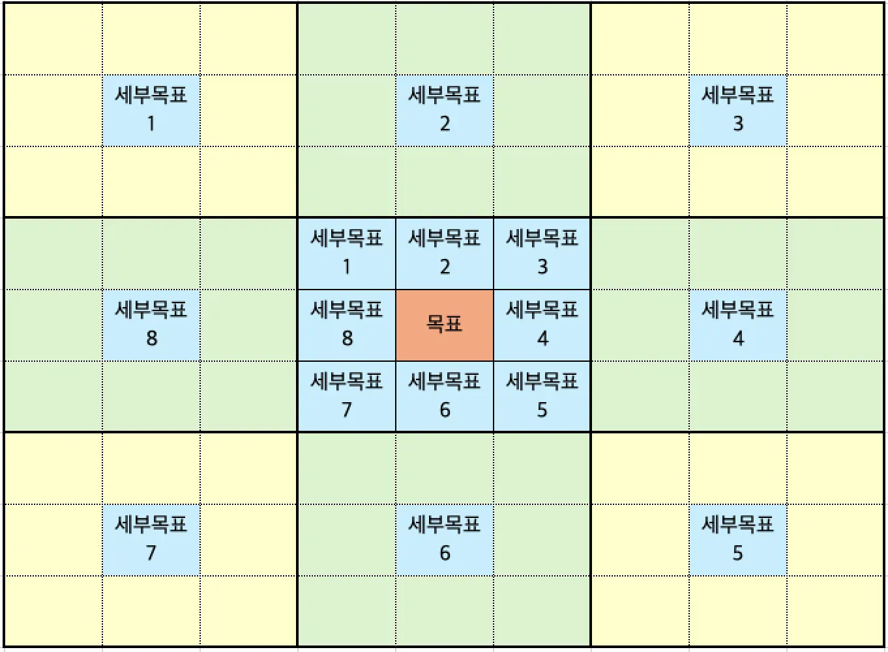

**동영상 개요**



# 만다라트(Mandal-Art)란?

## 📜 기원

만다라트는 일본의 디자이너이자 경영 컨설턴트인 이마이즈미 히로아키(今泉浩晃)가 1987년에 개발한 창의적 사고 기법입니다. '만다라(Mandala)'는 산스크리트어로 '원'이나 '중심'을 의미하며, 불교의 만다라 문양에서 영감을 받아 만들어졌습니다.(불교사상과는 상관이 없습니다.) 중심에서 시작해 방사형으로 확장되는 구조가 특징입니다.

## 💡 개념

만다라트는 9×9 총 81개의 칸으로 구성된 사고 정리 도구입니다. 중심에 핵심 목표나 주제를 배치하고, 이를 달성하기 위한 8개의 세부 목표를 주변에 배치합니다. 그리고 각 세부 목표마다 다시 8개의 실행 방안을 작성하여 총 64개의 구체적인 행동 계획을 수립하게 됩니다.

이 방법은 추상적인 목표를 구체적이고 실행 가능한 단계로 세분화하는 데 매우 효과적입니다.

## 🎯 구조

- **1단계 (중심):** 최종 목표 또는 해결하고자 하는 핵심 문제
- **2단계 (주변 8칸):** 목표 달성을 위한 8개의 핵심 요소나 세부 목표
- **3단계 (외곽 64칸):** 각 세부 목표별 8개의 구체적 실행 방안

## 📝 사용 방법

### Step 1: 중심 목표 설정

3×3 표의 정중앙에 달성하고자 하는 최종 목표를 작성합니다. 명확하고 구체적인 목표일수록 좋습니다.

### Step 2: 8개 세부 목표 도출

중심 목표를 둘러싼 8개 칸에 목표 달성을 위해 필요한 핵심 요소나 세부 목표를 작성합니다. 브레인스토밍 방식으로 자유롭게 아이디어를 떠올립니다.

### Step 3: 9×9 확장

각 세부 목표를 새로운 3×3 표의 중심으로 옮기고, 주변 8칸에 해당 세부 목표를 달성하기 위한 구체적 실행 방안을 작성합니다. 이 과정을 8번 반복하면 총 64개의 실행 항목이 완성됩니다.

### Step 4: 실행 및 관리

완성된 만다라트를 바탕으로 우선순위를 정하고, 일정을 수립하여 실행합니다. 정기적으로 진행 상황을 체크하며 조정합니다.

> 
>
> ## ⚾ 실제 사용 예시
> 
> ### 오타니 쇼헤이의 만다라트
> 
> 만다라트의 가장 유명한 성공 사례는 메이저리그 스타 오타니 쇼헤이입니다. 그는 고등학교 1학년 때 "8개 구단으로부터 1위 지명 받기"라는 목표로 만다라트를 작성했습니다.
> 
> **중심 목표:** 8개 구단 1위 지명
> 
> **8개 세부 목표:**
> 
> - 체력
> - 구위(球威)
> - 변화구
> - 운(運)
> - 멘탈
> - 인간성
> - 컨트롤
> - 스피드 160km/h
> 
> 각 세부 목표마다 구체적 실행 방안을 작성했습니다. 예를 들어:
> 
> - **체력:** 유연성 향상, 체간 강화, RSQ 90kg, 가동역 확대 등
> - **멘탈:** 감정 컨트롤, 긍정적 사고, 평정심 유지, 감사하는 마음 등
> - **운:** 인사하기, 쓰레기 줍기, 방 청소, 독서, 응원받기 등
> 
> 이처럼 추상적 목표를 구체적 행동으로 세분화하여 일관되게 실천한 결과, 그는 목표를 달성했고 현재 메이저리그 최고의 선수가 되었습니다.
> 
> ### 기업에서의 활용
> 
> 도요타, 소니 등 일본 대기업들이 전략 수립, 제품 개발, 문제 해결 과정에서 만다라트를 활용하고 있습니다. 팀 프로젝트의 목표 설정과 역할 분담에도 유용합니다.

## 💎 활용 팁

### 1. 명확한 목표 설정

중심 목표는 측정 가능하고 달성 가능한 형태로 구체적으로 작성하세요. "성공하기"보다는 "연봉 5,000만원 달성" 같은 명확한 목표가 좋습니다.

**새해 목표로 설정하기 좋은 구체적이고 측정 가능한 중심 목표 예시 10가지입니다:**

- **커리어:** "2026년 12월까지 연봉 6,000만원 달성하기"
- **건강:** "2026년 말까지 체지방률 15% 달성 및 하프 마라톤 완주하기"
- **재테크:** "2026년 12월 31일까지 비상금 3,000만원 모으기"
- **학습:** "2026년 상반기 TOEIC 900점 이상 달성하기"
- **독서:** "2026년 한 해 동안 52권의 책 읽고 독후감 작성하기"
- **부업:** "2026년 말까지 사이드 프로젝트로 월 100만원 수익 만들기"
- **습관:** "2026년 365일 중 300일 이상 아침 6시 기상 및 운동하기"
- **인간관계:** "2026년 한 해 동안 매월 1회 이상 소중한 사람들과 깊은 대화 나누기"
- **창작:** "2026년 12월까지 개인 블로그에 50개의 양질의 콘텐츠 발행하기"
- **자기계발:** "2026년 말까지 새로운 기술 자격증 2개 취득하기"

이러한 목표들은 만다라트 방식으로 8개의 세부 목표와 64개의 구체적 실행 방안으로 확장할 수 있습니다.

### 2. 균형 잡힌 세부 목표

8개의 세부 목표를 작성할 때 한 영역에 치우치지 않도록 다양한 관점에서 접근하세요. 기술, 체력, 정신력, 인간관계 등 여러 측면을 고려합니다.

**"다양한 관점"이란 반드시 8가지를 의미하는 것은 아니지만, 목표 달성에 필요한 여러 측면을 균형 있게 고려하는 것을 뜻합니다.**

**"50개의 블로그 글 작성" 목표에 대한 8가지 세부 목표 예시:**

- **콘텐츠 기획:** 주제 선정, 독자 분석, 키워드 리서치 등
- **글쓰기 기술:** 문장력 향상, 스토리텔링, 가독성 개선 등
- **시간 관리:** 작성 루틴 확립, 일정 관리, 생산성 향상 등
- **자료 조사:** 리서치 방법, 신뢰할 수 있는 출처 확보, 데이터 수집 등
- **편집 및 퇴고:** 교정 프로세스, 피드백 수용, 품질 관리 등
- **SEO 및 마케팅:** 검색 최적화, 소셜미디어 활용, 독자 확보 등
- **멘탈 및 동기부여:** 슬럼프 극복, 꾸준함 유지, 자기관리 등
- **기술적 역량:** 블로그 플랫폼 숙달, 이미지 편집, 레이아웃 디자인 등

이처럼 "글 작성"이라는 하나의 활동을 기획, 실행, 관리, 기술, 정신적 측면 등 다양한 각도에서 분해하면 더 체계적이고 실행 가능한 계획을 수립할 수 있습니다.

> AI 챗봇을 활용해 만다라트의 세부 주제를 도출할 때는, AI가 **단순한 키워드 나열을 넘어 다각도(기술, 환경, 멘탈, 습관 등)에서 분석**할 수 있도록 구체적인 '페르소나'와 '카테고리'를 지정해주는 것이 중요합니다.
>
> 효과적인 결과를 얻을 수 있는 프롬프트 3가지를 제안해 드립니다.
> 
> ---
> 
> ### 옵션 1. 논리적이고 다각적인 분석을 원할 때 (전문가 모드)
> 
> > 프롬프트:
> >
> > "나는 현재 **[핵심 목표 입력: 예 - 1년 안에 영어 회화 상급자 되기]**라는 목표로 만다라트를 작성하고 있어. 이 목표를 달성하기 위해 필요한 8가지 세부 주제를 제안해줘.
> > 
> > 주제를 선정할 때 다음 기준을 고려해줘:
> > 
> > 1. 기술적 측면 (지식, 스킬)
> > 2. 환경적 측면 (도구, 장소, 네트워크)
> > 3. 마인드셋 및 습관 (태도, 루틴)
> > 4. 리스크 관리 (장애물 극복)
> > 
> > 각 주제는 명확한 명사형 키워드로 제안해주고, 왜 그 주제가 중요한지 짧은 이유도 덧붙여줘."
> 
> ---
> 
> ### 옵션 2. 오타니 쇼헤이 스타일의 균형 잡힌 구성을 원할 때 (실천 중심)
> 
> > 프롬프트:
> >
> > "오타니 쇼헤이가 사용한 만다라트 기법을 바탕으로 **[핵심 목표 입력]**을 위한 세부 주제 8개를 추천해줘.
> > 
> > 단순히 기술적인 부분뿐만 아니라 '운(Luck)', '인성(Character)', '멘탈(Mental)'처럼 목표 달성을 돕는 간접적이고 근본적인 요소들을 포함해서 8개의 균형 잡힌 카테고리를 짜줘."
> 
> ---
> 
> ### 옵션 3. 창의적이고 새로운 관점을 원할 때 (브레인스토밍 모드)
> 
> > 프롬프트:
> >
> > "**[핵심 목표 입력]**을 달성하려고 해. 사람들이 흔히 생각하는 당연한 방법들 말고, 훨씬 더 빠르고 효율적으로 목표에 도달할 수 있게 만드는 전략적인 세부 주제 8가지를 제안해줘.
> > 
> > 결과는 다음과 같은 형식으로 출력해줘:
> > 
> > - 주제 1: [키워드] - [설명]
> > - 주제 2: [키워드] - [설명] ... (주제 8까지)"
> 
> ---
> 
> ### 💡 프롬프트 활용 팁
> 
> - **목표의 구체화:** "부자 되기"보다는 "내 집 마련을 위한 1억 모으기"처럼 목표가 구체적일수록 AI가 더 현실적인 세부 주제를 제안합니다.
> - **추가 질문:** AI가 제안한 8개 중 마음에 들지 않는 것이 있다면, *"5번은 나랑 잘 안 맞는 것 같아. 조금 더 창의적인 다른 대안으로 바꿔줘"*라고 요청해 보세요.
> 
> **지금 바로 시도해보고 싶은 '핵심 목표'가 있으신가요? 말씀해 주시면 제가 먼저 8가지 세부 주제를 제안해 드릴 수 있습니다.**

### 3. 구체적인 행동 계획

외곽 64칸은 최대한 구체적이고 실행 가능한 행동으로 채우세요. "열심히 한다"보다는 "매일 아침 6시에 30분 운동"처럼 명확하게 작성합니다.

> 만다라트의 중앙 8개 칸(세부 목표)이 정해졌다면, 이제 각 칸을 둘러쌀 ‘**8개의 구체적인 실행 계획(Action Plan)’**을 세울 차례입니다.
>
> 이 단계에서는 AI에게 '**당장 오늘부터 할 수 있는 아주 작은 행동(Micro-habits)**'과 '**측정 가능한 지표**'를 포함해달라고 요청하는 것이 핵심입니다.
> 
> ---
> 
> ### 옵션 1. 즉시 실천 가능한 '루틴' 중심 (행동 지침 모드)
> 
> > 프롬프트:
> >
> > "만다라트의 세부 목표 중 하나인 **[세부 목표 입력: 예 - 기초 체력 강화]**를 달성하기 위한 8가지 구체적인 실행 계획을 제안해줘.
> > 
> > 계획을 세울 때 아래 조건을 지켜줘:
> > 
> > 1. '열심히 하기' 같은 추상적인 표현 대신 **'하루 15분 스쿼트'**처럼 즉시 실행 가능한 행동 위주로 짜줘.
> > 2. 매일 반복할 수 있는 **'습관'**과 한 번만 하면 되는 **'설정'**을 적절히 섞어줘.
> > 3. 각 계획은 아주 작고 쉬운 단계부터 시작해서 점점 난이도가 높아지는 순서로 구성해줘."
> 
> ---
> 
> ### 옵션 2. 수치와 마감기한 중심 (성과 관리 모드)
> 
> > 프롬프트:
> >
> > "**[세부 목표 입력]**을 성공적으로 완수하기 위해, 측정 가능한 8가지 실행 계획을 세워줘.
> > 
> > 다음 형식을 포함해줘:
> > 
> > - **행동 지침:** 무엇을 해야 하는가?
> > - **측정 지표:** 달성 여부를 어떻게 확인할 수 있는가? (수치, 횟수 등)
> > - **빈도:** 얼마나 자주 수행해야 하는가?
> > 
> > 결과는 총 8개의 항목으로 명확하게 번호를 매겨서 보여줘."
> 
> ---
> 
> ### 옵션 3. PARA 시스템과 연동하는 방식 (관리 시스템 모드)
> 
> > 프롬프트:
> >
> > "나는 **[세부 목표 입력]**을 위해 PARA 시스템과 만다라트를 함께 사용하고 있어. 이를 위한 8가지 실행 계획을 제안하되, **'지식 습득(Resources)'**과 '실제 프로젝트(Projects)' 관점으로 나누어 제안해줘.
> > 
> > - 4개는 이 주제를 공부하기 위해 수집해야 할 자료나 리서치 항목으로.
> > - 4개는 이번 달 안에 끝낼 수 있는 구체적인 프로젝트성 업무로 제안해줘."
> 
> ---
> 
> ### 💡 실행 계획을 더 날카롭게 만드는 팁
> 
> 1. **동사로 끝내기:** "독서"보다는 **"매일 아침 경제 기사 1편 읽기"**처럼 명확한 동사로 끝나는 문장이 실천력을 높입니다.
> 2. **난이도 조절:** 8개 계획 중 최소 2개는 **'뇌를 거치지 않고도 할 수 있을 만큼 쉬운 일'**로 설정하세요. (예: 운동복 입기, 앱 켜기 등)
> 3. **검토 요청:** AI가 제안한 계획을 보고 *"이 중에서 가장 중요도가 높은 순서대로 우선순위를 매겨줘"*라고 추가 질문을 던져보세요.
> 
> 어떤 세부 목표에 대해 실행 계획을 먼저 짜보고 싶으신가요? 목표를 알려주시면 바로 예시를 보여드릴 수 있습니다.

### 4. 정기적인 검토

완성 후 방치하지 말고 주간/월간 단위로 정기적으로 검토하며 진행 상황을 체크하고 필요시 수정합니다.

### 5. 시각화

완성된 만다라트를 눈에 잘 띄는 곳에 붙여두거나 디지털 도구로 관리하여 자주 확인할 수 있도록 합니다.

### 6. 우선순위 설정

64개의 실행 항목 중 가장 중요하거나 시급한 것부터 우선순위를 매겨 단계적으로 실행합니다.

### 7. 유연한 접근

처음부터 완벽하게 채우려 하지 말고, 실행하면서 수정하고 보완해 나가는 것이 중요합니다.

### 8. 다양한 분야 적용

개인 목표뿐만 아니라 학습 계획, 프로젝트 관리, 문제 해결, 아이디어 발상 등 다양한 상황에 응용할 수 있습니다.

## 🎓 만다라트의 장점

- **체계적 사고:** 복잡한 목표를 논리적으로 분해하여 체계화할 수 있습니다
- **실행력 향상:** 추상적 목표를 구체적 행동으로 전환하여 실행 가능성을 높입니다
- **전체적 관점:** 목표의 다양한 측면을 균형 있게 고려할 수 있습니다
- **시각적 명확성:** 한눈에 전체 구조를 파악할 수 있어 이해하기 쉽습니다
- **지속적 동기부여:** 진행 상황을 시각적으로 확인하며 동기를 유지할 수 있습니다

## 🛠️ 디지털 도구 활용

종이로도 작성할 수 있지만, 다음과 같은 디지털 도구를 활용하면 더욱 효과적입니다:

- Notion - 데이터베이스와 템플릿 활용
- Excel/Google Sheets - 표 형식으로 관리
- Miro/Figma - 시각적 디자인 도구
- 만다라트 전용 앱 - MandalArt, 만다라트 차트 등

> 💡 **핵심 요약**

만다라트는 하나의 큰 목표를 8개의 세부 목표로, 다시 각각을 8개의 실행 방안으로 나누어 총 64개의 구체적 행동 계획을 수립하는 강력한 목표 달성 도구입니다. 오타니 쇼헤이의 사례처럼, 꾸준히 실행하면 놀라운 성과를 달성할 수 있습니다.

> 
>
> ## 🎯 실전 예시: "50개의 양질의 블로그 글 게시" 만다라트
> 
> 위의 활용 팁을 바탕으로 작성한 구체적인 만다라트 예시입니다.
> 
> ### 📌 중심 목표 및 8개 세부 목표
> 
> | **콘텐츠 기획** | **글쓰기 기술** | **시간 관리** |
> | --- | --- | --- |
> | **자료 조사** | **🎯 2026년 말까지50개의 양질의블로그 글 게시** | **편집 및 퇴고** |
> | **SEO 및 마케팅** | **멘탈 및 동기부여** | **기술적 역량** |
> 
> ### 📋 세부 목표별 8개 실행 방안
> 
> ****1️⃣ 콘텐츠 기획****
> 
> - 매월 첫째 주에 다음 달 주제 5개 선정하기
> - 독자 페르소나 3가지 유형 정의하고 분석하기
> - 경쟁 블로그 5개 벤치마킹 및 차별화 포인트 찾기
> - 키워드 리서치 도구(Google Trends, Naver 키워드) 주 1회 활용
> - 시즌별/트렌드 주제 캘린더 작성하기
> - 독자 피드백 및 댓글 분석하여 주제 개선하기
> - 시리즈물 3개 기획하여 연속성 확보하기
> - 콘텐츠 아이디어 노트 매일 1개 이상 기록하기
> 
> ****2️⃣ 글쓰기 기술****
> 
> - 매일 아침 자유 글쓰기 15분 실천하기
> - 글쓰기 관련 책 월 1권 읽고 정리하기
> - 후킹 문장 연습: 매 글마다 3가지 도입부 작성 후 선택
> - 스토리텔링 기법 적용: 개인 경험이나 사례 포함하기
> - 문장 길이 조절: 짧은 문장과 긴 문장 적절히 배치하기
> - 은유와 비유 표현 주 3회 이상 사용하기
> - 좋은 글 필사: 주 1회 참고할 만한 글 베껴쓰기
> - 글쓰기 커뮤니티 가입하여 월 2회 피드백 받기
> 
> ****3️⃣ 시간 관리****
> 
> - 매주 월요일 저녁 2시간을 글쓰기 시간으로 고정하기
> - 매주 수요일 오전 1시간 자료 조사 시간 확보하기
> - 매주 금요일 1시간 편집 및 퇴고 시간 설정하기
> - 포모도로 기법 활용: 25분 집중 + 5분 휴식 반복
> - 글감 메모는 틈날 때마다 스마트폰에 즉시 기록
> - 월간 글쓰기 목표 설정: 최소 4개 글 발행
> - 분기별 회고 시간 확보: 3개월마다 진행 상황 점검
> - 일정 관리 앱(Notion, Google Calendar)에 마감일 입력
> 
> ****4️⃣ 자료 조사****
> 
> - 신뢰할 수 있는 출처 리스트 10개 확보하기
> - 논문, 통계 자료는 최근 3년 이내 데이터 우선 활용
> - 인터뷰나 설문조사로 1차 자료 월 1회 수집하기
> - 북마크 폴더 주제별로 정리하여 빠른 접근 가능하게
> - 관련 도서 월 2권 읽고 핵심 내용 발췌하기
> - 유튜브 영상, 팟캐스트 등 멀티미디어 자료도 활용
> - 전문가 인터뷰 분기별 1회 진행하여 깊이 더하기
> - 자료 출처 명시 습관화: 신뢰도 향상
> 
> ****5️⃣ 편집 및 퇴고****
> 
> - 초고 완성 후 최소 1일 뒤에 퇴고 시작하기
> - 맞춤법 검사 도구(한국어 맞춤법 검사기) 필수 사용
> - 소리 내어 읽기: 어색한 문장 발견하기
> - 불필요한 부사, 형용사 제거하여 문장 간결하게
> - 단락 구조 점검: 한 단락 = 한 가지 주제
> - 제3자에게 피드백 요청: 월 2회 이상
> - 퇴고 체크리스트 작성하여 매번 확인하기
> - 최종 발행 전 모바일 화면 미리보기로 가독성 확인
> 
> ****6️⃣ SEO 및 마케팅****
> 
> - 제목에 핵심 키워드 자연스럽게 포함하기
> - 메타 설명 작성: 150자 이내로 핵심 내용 요약
> - 이미지 alt 텍스트 작성하여 검색 최적화
> - 내부 링크 2~3개 이상 연결하여 체류 시간 증가
> - 소셜미디어(인스타그램, 페이스북, 트위터) 발행 당일 공유
> - 관련 커뮤니티(카페, 레딧, 클리앙 등)에 주 1회 글 공유
> - 이메일 뉴스레터 구독자 확보: 분기별 30명 목표
> - Google Analytics로 월 1회 트래픽 분석 및 개선점 도출
> 
> ****7️⃣ 멘탈 및 동기부여****
> 
> - 완벽주의 버리기: 80% 완성도에서 발행하고 개선하기
> - 작은 성과 축하하기: 10개 글 달성할 때마다 보상
> - 슬럼프 대비 계획: 3일 쉬고 다시 시작하기
> - 동료 글쓴이와 스터디 그룹 운영: 주 1회 모임
> - 긍정적인 댓글 스크랩하여 힘들 때 다시 보기
> - 월간 회고 작성: 배운 점, 개선할 점 정리
> - 롤모델 글쓴이 3명 선정하고 그들의 글 분석하기
> - 매일 감사 일기 작성: 글쓰기 여정에서 감사한 점 3가지
> 
> ****8️⃣ 기술적 역량****
> 
> - 블로그 플랫폼(티스토리, 워드프레스 등) 기능 숙달하기
> - Canva로 썸네일 이미지 제작 기술 익히기
> - 무료 이미지 사이트(Unsplash, Pexels) 활용법 학습
> - 기본 HTML/CSS 학습하여 레이아웃 커스터마이징
> - YouTube 영상 임베드, 인포그래픽 삽입 등 멀티미디어 활용
> - 반응형 디자인 체크: 모바일 가독성 최적화
> - 글 로딩 속도 개선: 이미지 압축, 불필요한 플러그인 제거
> - 백업 시스템 구축: 월 1회 전체 글 백업하기
> 
> ### ✅ 실행 체크리스트
> 
> 매주 진행 상황을 체크하며 실행력을 높이세요:
> 
> - [ ] 이번 주 글 1개 작성 완료
> - [ ] 키워드 리서치 완료
> - [ ] 자료 조사 및 출처 정리
> - [ ] 초고 작성 후 1일 뒤 퇴고
> - [ ] SEO 최적화 (제목, 메타 설명, alt 텍스트)
> - [ ] 소셜미디어 공유
> - [ ] 주간 회고 작성
> 
> > 💡 **핵심 포인트**
> 
> 이 만다라트는 "50개의 블로그 글"이라는 목표를 8가지 관점(기획, 글쓰기, 시간 관리, 조사, 편집, 마케팅, 멘탈, 기술)으로 나누고, 각각 8개씩 총 64개의 구체적 실행 방안을 제시합니다. 매주 체크리스트를 활용하여 꾸준히 실천하면 목표를 달성할 수 있습니다!
> 
> ### 🌅 매일 실천하는 블로그 글쓰기 루틴 10가지 (위 자료를 바탕으로 추출)
> 
> 위 64개 실행 방안 중에서 매일 꾸준히 실천할 수 있는 핵심 루틴을 추천합니다:
> 
> 1. **매일 아침 자유 글쓰기 15분** - 글쓰기 근육을 키우는 가장 효과적인 방법입니다 (글쓰기 기술)
> 2. **콘텐츠 아이디어 노트 매일 1개 이상 기록** - 일상에서 발견한 글감을 즉시 메모하세요 (주제 발굴)
> 3. **글감 메모는 틈날 때마다 스마트폰에 즉시 기록** - 아이디어는 떠오를 때 바로 잡아야 합니다 (시간 관리)
> 4. **매일 감사 일기 작성: 글쓰기 여정에서 감사한 점 3가지** - 긍정적 마인드셋 유지가 중요합니다 (멘탈 및 동기부여)
> 5. **키워드 리서치 도구 매일 10분 확인** - Google Trends나 Naver 키워드를 통해 트렌드를 파악하세요 (주제 발굴)
> 6. **좋은 글 읽기 및 분석 20분** - 롤모델 글쓴이나 경쟁 블로그의 글을 매일 읽고 분석하세요 (글쓰기 기술)
> 7. **작성 중인 글 매일 30분 진전시키기** - 조금씩이라도 매일 진행하면 완성도가 높아집니다 (시간 관리)
> 8. **관련 자료 매일 1개 수집 및 북마크** - 꾸준한 자료 축적이 양질의 콘텐츠를 만듭니다 (자료 조사)
> 9. **완성한 문장 소리 내어 읽기** - 어색한 표현을 즉시 발견하고 수정할 수 있습니다 (편집 및 퇴고)
> 10. **하루 마무리 3분 회고** - 오늘의 글쓰기 진행 상황과 내일의 계획을 간단히 정리하세요 (멘탈 및 동기부여)
> 
> > 💡 **루틴 실천 팁**
> 
> 이 10가지 루틴을 모두 한 번에 시작하기보다는, 먼저 3-4가지를 선택하여 2주간 습관화한 후 점진적으로 추가하는 것을 추천합니다. 가장 중요한 것은 완벽함이 아니라 꾸준함입니다!

## 📊 Notion으로 만다라트 만들기

Notion은 위에 제시한 만다라트 형식(9x9 형태의 표)를 만들어 관리하기에 적합하지 않습니다. 사용 가능한 방법들이 있지만 아래와 같은 토글 리스트를 활용하는 것이 가장 효과적이라 생각합니다. 이렇게 토글 리스트 형식을 사용한다면 Notion 홈 또는 대시보드에 넣어두고 수시로 보면서 확인할 수 있는 효과도 있습니다.

### 추천방법: 토글 리스트 활용

중심 목표를 제목으로, 8개 세부 목표를 토글로 만들고, 각 토글 안에 8개의 실행 방안을 리스트로 작성합니다.

> 
>
> ### **🎯 중심 목표:** [여기에 목표를 작성하세요]
> 
> ****세부목표 1:** [목표명]**
> 
> - 실행방안 1-1
> - 실행방안 1-2
> - 실행방안 1-3
> - 실행방안 1-4
> - 실행방안 1-5
> - 실행방안 1-6
> - 실행방안 1-7
> - 실행방안 1-8
> 
> ****세부목표 2:** [목표명]**
> 
> - 실행방안 2-1
> - 실행방안 2-2
> - 실행방안 2-3
> - 실행방안 2-4
> - 실행방안 2-5
> - 실행방안 2-6
> - 실행방안 2-7
> - 실행방안 2-8
> 
> ****세부목표 3:** [목표명]**
> 
> - 실행방안 3-1
> - 실행방안 3-2
> - 실행방안 3-3
> - 실행방안 3-4
> - 실행방안 3-5
> - 실행방안 3-6
> - 실행방안 3-7
> - 실행방안 3-8
> 
> ****세부목표 4:** [목표명]**
> 
> - 실행방안 4-1
> - 실행방안 4-2
> - 실행방안 4-3
> - 실행방안 4-4
> - 실행방안 4-5
> - 실행방안 4-6
> - 실행방안 4-7
> - 실행방안 4-8
> 
> ****세부목표 5:** [목표명]**
> 
> - 실행방안 5-1
> - 실행방안 5-2
> - 실행방안 5-3
> - 실행방안 5-4
> - 실행방안 5-5
> - 실행방안 5-6
> - 실행방안 5-7
> - 실행방안 5-8
> 
> ****세부목표 6:** [목표명]**
> 
> - 실행방안 6-1
> - 실행방안 6-2
> - 실행방안 6-3
> - 실행방안 6-4
> - 실행방안 6-5
> - 실행방안 6-6
> - 실행방안 6-7
> - 실행방안 6-8
> 
> ****세부목표 7:** [목표명]**
> 
> - 실행방안 7-1
> - 실행방안 7-2
> - 실행방안 7-3
> - 실행방안 7-4
> - 실행방안 7-5
> - 실행방안 7-6
> - 실행방안 7-7
> - 실행방안 7-8
> 
> ****세부목표 8:** [목표명]**
> 
> - 실행방안 8-1
> - 실행방안 8-2
> - 실행방안 8-3
> - 실행방안 8-4
> - 실행방안 8-5
> - 실행방안 8-6
> - 실행방안 8-7
> - 실행방안 8-8
