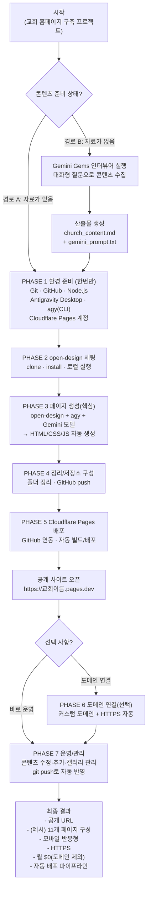

## 교회 홈페이지 구축 프로젝트 개요
### Static Site + AI Agent 기반 무료 홈페이지 구축 가이드
> **문서 목적**: 이 프로젝트가 무엇을 목표로 하는지, 어떤 방법으로 구축하는지, 왜 이 방법을 선택했는지를 처음 접하는 사람도 이해할 수 있도록 정리한 기준 문서
---
### 1. 한 줄 요약
> **코딩 경험이 없어도, 월 $0의 비용으로, AI의 도움을 받아
> 보안에 강하고 빠른 교회 홈페이지를 직접 만들고 운영한다.**
---
### 2. 이 프로젝트로 무엇을 얻는가
이 가이드를 처음부터 끝까지 따라 하면 다음 결과물을 얻는다.
| 결과물 | 설명 |
| --- | --- |
| 🌐 **실제 인터넷 홈페이지** | 누구나 접속할 수 있는 공개 URL |
| 📄 **11개 완성 페이지** | 홈·교회소개·예배안내·설교·공지·오시는길·헌금·온라인예배·갤러리·기도요청·교회역사 |
| 📱 **모바일 반응형** | 스마트폰·태블릿·PC 모두 자동 최적화 |
| 🔒 **HTTPS 보안 연결** | SSL 인증서 자동 적용 |
| 🤖 **AI 보조 운영 환경** | 이후 콘텐츠 추가·수정도 AI에게 지시 |
| 🔄 **자동 배포 파이프라인** | 파일 저장 → 자동 빌드 → 자동 사이트 반영 |
| 💰 **월 운영 비용 $0** | 도메인 비용을 제외한 모든 서비스 무료 |
---
### 3. 프로젝트 진행 과정
| PHASE | 제목 | 예상 시간 |
| --- | --- | --- |
| 사전 준비 | 콘텐츠 문서 준비 | 30~60분 |
| 1 | 환경 준비 | 60분 |
| 2 | open-design 세팅 | 15분 |
| 3 | 페이지 생성 | 90분 |
| 4 | 파일 정리 및 저장소 구성 | 20분 |
| 5 | Cloudflare Pages 배포 | 10분 |
| 6 | 도메인 연결 (선택) | 10분 |
| 7 | 이후 운영·관리 | 5분/회 |

### 4. 자료의 준비
- 교회 이름, 주소, 담임목사 소개, 예배 시간, 비전 문구 등의 기본 콘텐츠가 이미 문서나 메모 형태로 준비되어 있다면 **PHASE 1 환경 준비부터 바로 시작**한다.
- 콘텐츠가 아직 준비되지 않았다면 **Gemini Gems 인터뷰어**를 먼저 실행한다.
- 인터뷰어가 한 가지씩 질문을 던지고 완성된 샘플 예시를 제공하므로, 그것을 그대로 쓰거나 수정해서 답하면 자동으로 콘텐츠 문서가 만들어진다.
문서 완성 후 PHASE 1부터 동일하게 진행한다.
> 💡 **Gemini Gems 인터뷰어가 처리하는 것**
교회 주소 입력 → 국가·언어 자동 감지 → 인터뷰 언어 선택 → 원하는 메뉴 선택 → 메뉴별 콘텐츠 대화형 수집 → `church_content.md` (콘텐츠 문서) + `gemini_prompt.txt` (AI 프롬프트) 자동 생성
---
**총 예상 소요 시간**: 처음부터 배포까지 **약 3~4시간**
---
### 5. 사용 기술 스택 (Spec)
> **Gemini Gems로 콘텐츠를 만들고 → open-design + Antigravity(agy) + Gemini로 페이지 코드를 생성하고 → Git/GitHub로 버전관리 후 → Cloudflare Pages로 자동 배포해서 공개한다(필요하면 도메인 연결).**
- **사용 도구:** Gemini Gems
- **역할:** 교회 정보를 *대화형 인터뷰*로 받아서 콘텐츠를 정리/문서화
- **비용:** 무료
- **산출물:**
  - `church_content.md` 같은 콘텐츠 문서(교회 소개, 예배시간, 비전 문구 등)
  - (필요 시) 이후 단계에서 사용할 프롬프트/지침 문서
---
이 단계는 “디자인 프레임워크(open-design)” + “에이전트 실행 환경(Antigravity)” + “코드 생성 모델(Gemini)”이 함께 움직이는 구조입니다.
- **사용 도구:** open-design
  - **역할:** 디자인 시스템과 페이지 생성 프레임워크 제공(구조/레이아웃/디자인 베이스)
  - **비용:** 무료(오픈소스)
  - **산출물:** 사이트의 기본 형태/디자인 틀
- **사용 도구:** Antigravity 2.0 Desktop
  - **역할:** AI 통합 개발환경(IDE) + 에이전트 오케스트레이션(작업을 실행/관리하는 컨트롤 타워)
  - **비용:** 무료(Free tier)
  - **산출물:** 생성 작업을 운영하는 실행 환경
- **사용 도구:** Antigravity CLI (`agy`)
  - **역할:** 터미널 기반 에이전트 도구. open-design과 연결되어 프롬프트 기반으로 생성 작업 자동화
  - **비용:** 무료(Free tier)
  - **산출물:** 실제 생성 파이프라인 실행(파일 생성/수정/정리 등)
- **사용 도구:** Gemini 3.5 Flash
  - **역할:** HTML/CSS/JS 코드를 만들어내는 생성 모델(페이지 코드 생성 엔진)
  - **비용:** 무료(한도 내)
  - **산출물:** 완성된 웹 페이지 파일들(HTML/CSS/JS)
---
- **사용 도구:** Git
  - **역할:** 변경 이력 관리(버전 관리), 실수 복구(롤백), 작업 안전장치
  - **비용:** 무료
  - **산출물:** 로컬 변경 이력/커밋 기록
- **사용 도구:** GitHub
  - **역할:** 원격 저장소(클라우드 백업) + 배포 트리거(푸시하면 배포가 시작되는 구조)
  - **비용:** 무료
  - **산출물:** 원격 백업된 소스 + 배포 파이프라인의 시작점
---
- **사용 도구:** Cloudflare Pages
- **역할:** 정적 사이트 호스팅 + 전 세계 CDN 제공
  - GitHub에 push → 자동 감지 → 자동 빌드 → 자동 배포
- **비용:** 무료
- **산출물:** 공개 사이트
  - 예: `https://교회이름.pages.dev`
---
- **사용 도구:** 도메인(선택)
- **역할:** 커스텀 웹 주소 연결(브랜딩/기억하기 쉬운 주소) + HTTPS 자동 적용
- **비용:** 연 $10~30
- **산출물:**
  - 예: `https://교회도메인.com`
> 💡 도메인을 구매하지 않으면 `교회이름.pages.dev` 주소로 무료 운영 가능하다.
---
- **사용 도구:** Google Drive(추후 연동 가능)
- **역할:** 사진/미디어 파일 저장·관리용 저장소(갤러리 콘텐츠 운영 기반)
- **비용:** 무료 15GB
- **산출물:** 이미지 파일 저장소(향후 자동화 연동 가능)
---
### 6. 완성되는 홈페이지 페이지 구성
모든 페이지는 **공통 내비게이션 바와 Footer를 공유**하며, 하나의 레이아웃 파일만 수정하면 전체 페이지에 동시 반영된다. 페이지 구성은 인터뷰 시 교회 상황에 맞게 선택할 수 있다.
| 페이지 | 주요 내용 |
| --- | --- |
| 홈 (메인) | 비전 문구·환영 메시지·예배 시간 요약·최신 설교·CTA 버튼 |
| 교회 소개 | 담임목사 소개·핵심 가치·교회 역사 타임라인 |
| 예배 안내 | 예배 시간표·처음 오시는 분 안내·복장·주차 안내 |
| 설교 말씀 | 설교 목록·YouTube 영상·성경 본문·PDF 다운로드 |
| 공지사항 | 카테고리별 게시판·PDF 주보 다운로드 |
| 오시는 길 | 주소·지도 임베드·대중교통·자가용·주차 안내 |
| 페이지 | 주요 내용 |
| --- | --- |
| 온라인 헌금 | 계좌·간편결제·세금공제 안내 (한국/미국 양식 지원) |
| 온라인 예배 | YouTube Live 스트리밍 배너·다시보기·알림 설정 |
| 사진 갤러리 | 3열 반응형 그리드·카테고리 탭·라이트박스 |
| 기도 요청 | 교역자 전용 프라이빗 폼·익명 허용 |
| 교회 역사 | 수직 타임라인·연혁서 PDF 다운로드 |
| 소그룹·셀 | 지역별 소그룹 안내·신청 폼 |
| 교육부서 | 유아부~청년부 예배 시간·담당자 소개 |
| 선교·봉사 | 파송 선교사·단기 선교·국내 봉사 현황 |
| 새가족 등록 | 등록 폼·처음 방문자 안내 |
| 교회 일정 | 연간 행사·절기 캘린더 |
---
### 7. 이 방법을 추천하는 이유
- WordPress, Wix, 일반 CMS 방식은 서버에서 PHP가 실행되고 데이터베이스(DB)가 동작한다. 이것이 해킹의 주요 표적이 된다. SQL Injection, 플러그인 취약점, PHP 코드 실행 공격이 모두 이 구조를 겨냥한다.
- 이 프로젝트는 **순수 HTML 파일만 서빙**한다. 서버 프로세스가 없고 DB가 없으므로 공격할 대상 자체가 존재하지 않는다.
| 비교 항목 | WordPress (CMS) | 이 프로젝트 (정적 사이트) |
| --- | --- | --- |
| 서버 실행 | PHP 상시 실행 | 없음 |
| 데이터베이스 | MySQL 필수 | 없음 |
| SQL Injection | 위험 | 불가능 |
| 플러그인 취약점 | 빈번 | 없음 |
| 보안 업데이트 | 매달 필요 | 불필요 |
- WordPress 사이트 운영에는 서버 비용(월 $10~30), 보안 플러그인(연 $50~100), 백업 서비스, 유지보수 비용이 지속적으로 발생한다.
- 이 프로젝트는 GitHub 저장소와 Cloudflare Pages 모두 **무료 플랜으로 완전히 운영**할 수 있다. 도메인(연 $10~30)을 제외하면 **월 $0**이다.
- 미리 빌드된 HTML 파일을 Cloudflare의 전 세계 CDN에서 직접 전달하므로 서버에서 매번 페이지를 생성하는 WordPress와 비교해 로딩 속도가 현저히 빠르다.
- 속도는 Google 검색 노출(SEO)에도 직접 영향을 미친다.
- HTML, CSS, JavaScript를 전혀 몰라도 된다. Antigravity CLI에게 **한국어로 "이런 페이지 만들어줘"** 라고 말하면 에이전트가 코드를 작성하고 파일을 생성한다.
- 이후 콘텐츠 수정, 새 페이지 추가, 디자인 변경도 모두 같은 방식으로 처리된다.
- 모든 파일이 Git으로 관리되므로 잘못 수정하거나 파일을 삭제해도 언제든지 이전 상태로 정확하게 되돌릴 수 있다.
- 또한 GitHub가 자동 백업 역할을 하므로 컴퓨터가 망가져도 파일이 보존된다.
- 한 번 설정해두면 이후에는 **파일을 저장하고 ****`git push`**** 한 번**만 하면 Cloudflare Pages가 자동으로 사이트를 업데이트한다.
- FTP 업로드, 서버 접속, 캐시 삭제 같은 복잡한 과정이 전혀 없다.
- 이 가이드는 **미국, 한국, 캐나다, 호주 등 어느 나라의 교회**에도 동일하게 적용된다.
- Gemini Gems 인터뷰어가 주소를 기반으로 언어와 지역 설정을 자동으로 맞추며, 한국어·영어·이중 언어 병행 중 선택해서 진행할 수 있다.
---
### 8. 이 방법이 적합한 교회
| 상황 | 적합도 |
| --- | --- |
| 새로 개척하는 교회 (초기 비용 최소화) | ⭐⭐⭐⭐⭐ |
| 기존 사이트의 유지비·보안이 부담스러운 교회 | ⭐⭐⭐⭐⭐ |
| IT 담당자 없이 목사·사모가 직접 관리해야 하는 교회 | ⭐⭐⭐⭐⭐ |
| 해외 한인 교회 (영한 이중 언어 필요) | ⭐⭐⭐⭐⭐ |
| 설교·주보·공지를 정기적으로 업데이트하는 교회 | ⭐⭐⭐⭐☆ |
| 수천 명 대형 교회 (복잡한 회원 시스템 필요) | ⭐⭐☆☆☆ |
> 💡 **대형 교회나 온라인 헌금·회원 관리 시스템이 필요한 경우**에는 이 가이드의 기본 사이트를 만든 후 외부 서비스(Planning Center, Tithely 등)를 링크로 연결하는 하이브리드 방식을 권장한다.
---
### 9. 준비물 요약
- [ ] 인터넷이 연결된 맥 또는 윈도우즈 컴퓨터
- [ ] 개인 Gmail 계정 (Antigravity 로그인에 사용)
- [ ] GitHub 가입용 이메일
- [ ] 교회 이름 (한글 + 영문)
- [ ] 교회 주소
- [ ] 담임목사 성함
- [ ] 예배 시간 목록
- [ ] 교회 비전 문구 또는 슬로건
- [ ] 커스텀 도메인 (없으면 `.pages.dev` 무료 주소 사용)
- [ ] 교회 로고 이미지
- [ ] 담임목사·교회 사진
---
## 10. 관련 문서 목록
| 문서 | 설명 | 사용 시점 |
| --- | --- | --- |
| `church_gems_prompt.md` | Gemini Gems 인터뷰어 시스템 프롬프트 | 경로 B — 콘텐츠 준비 단계 |
| `church_menu_samples.md` | 메뉴별 샘플 예제 참고 문서 | 인터뷰 전 참고용 |
| `church_website_manual_outline.md` | 전체 매뉴얼 챕터 개요 | 전체 흐름 파악용 |
| `chapter1_environment_setup_v2.md` | PHASE 1 환경 준비 상세 매뉴얼 | PHASE 1 진행 시 |
| `church_website_full_manual.md` | PHASE 1~6 전체 구축 가이드 | 구축 전 과정 |
| *(이 문서)* `project_overview.md` | 프로젝트 전체 개요 | 프로젝트 시작 전 |
