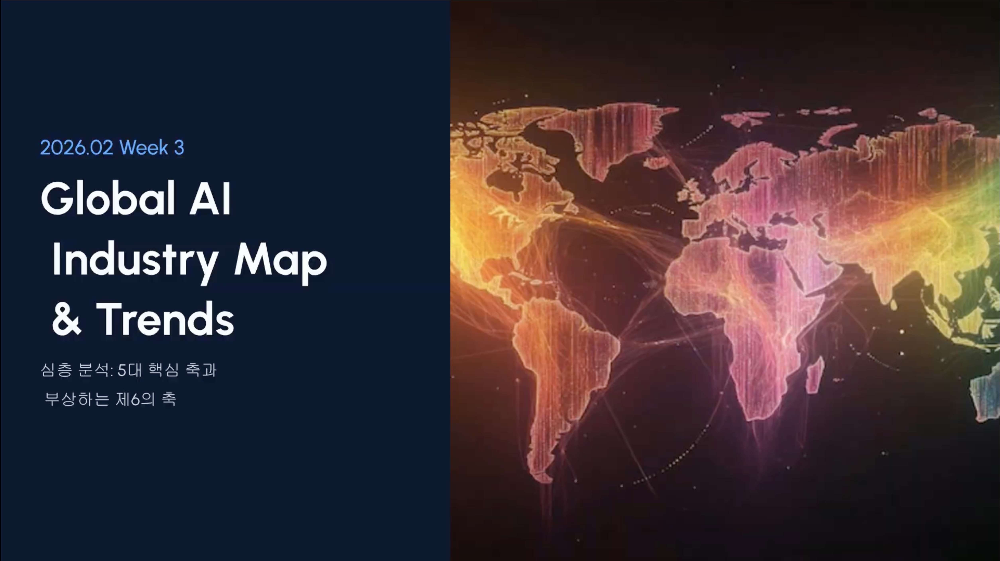

- 동영상 리포트
[video](https://youtu.be/FVL3DlEHhSg)
**2026년 2월 3주차 글로벌 AI 산업 지형도 및 트렌드 분석**
---
## 1. 축 1 – 지능의 원천 (Data & Intelligence)
### 1-1. 정의와 현재의 중요성
지능의 원천은 **데이터·지식·모델**이 결합되어 실제 의사결정과 작업 수행에 쓰이는 층을 의미합니다. 2026년에는 단순한 “챗봇용 LLM”을 넘어,
- 국가·기업별 **소버린 AI(주권형 AI)**,
- 산업별로 특화된 **도메인 모델**,
- 장기간 작업을 수행하는 **에이전틱(Agentic) 모델**,
이 경쟁의 핵심이 되었습니다.
특히 Anthropic의 Claude Opus 4.6, OpenAI GPT‑5.2, Google Gemini 3 계열 등은 **극단적으로 큰 컨텍스트(수십만~백만 토큰)**와 **장기 계획·코드 해석 능력**을 바탕으로 “디지털 직원”에 가까운 수준으로 진화하고 있습니다. 동시에 SAP·Cohere처럼 **공공·규제 산업용 소버린 AI**를 구축하려는 시도는, 데이터가 국경과 규제 영역에 묶인 현실을 반영합니다.[1][2][3][4]
### 1-2. 하위 카테고리
- **데이터 공급·처리**
  - 엔터프라이즈 데이터레이크, 벡터DB, 정제·레이블링 파이프라인, RAG(검색증강생성) 플랫폼
- **LLM / 옴니(멀티모달) 모델**
  - 텍스트·이미지·코드·오디오·비디오를 동시에 처리하는 범용 모델
- **소버린 AI**
  - 특정 국가·규제 영역 내에서 학습·추론이 이뤄지는 국산/지역 특화 모델 및 클라우드
- **산업 특화 모델**
  - 금융, 헬스케어, 제조, 공공 영역 전문 모델 및 에이전트
### 1-3. 주요 기업 동향 (Leaders & Notable)
| 기업명 | 구분 | 지난 15일 이내의 주요 동향 및 뉴스 타이틀 (출처 링크) |
| --- | --- | --- |
| OpenAI (ChatGPT) | Leader | **“ChatGPT Release Notes – ChatGPT Voice Update, GPT‑5.2 Instant 개선”** – 2월 12일자 업데이트로 음성 모드의 지시 이해력과 웹 검색 활용 성능을 개선하고, GPT‑5.2 Instant의 응답 스타일·품질을 향상[5]. [원문](https://help.openai.com/en/articles/6825453-chatgpt-release-notes) |
| Anthropic (Claude Opus 4.6) | Leader | **“Anthropic releases Opus 4.6 with new ‘agent teams’ ”** – TechCrunch 보도에 따르면 Opus 4.6은 100만 토큰 컨텍스트, 멀티‑에이전트 팀, 장기 워크플로 자동화 능력을 강화하여 기업용 에이전트 작업에 초점을 맞춤[6][1]. [기사](https://techcrunch.com/2026/02/05/anthropic-releases-opus-4-6-with-new-agent-teams/) |
| Google (Gemini) | Leader | **“Apple’s Siri & Apple Intelligence will still launch in 2026, backed by Gemini‑trained models”** – Tom’s Guide·AppleInsider 보도에서 Apple Intelligence와 차세대 Siri가 Google Gemini 기반 모델을 활용해 2026년 내 출시될 것이라는 점을 재확인, 모바일 온디바이스·하이브리드 AI 경쟁 본격화[7][8]. [기사](https://www.tomsguide.com/ai/apple-intelligence/apple-confirms-siri-2-0-is-still-coming-in-2026-heres-what-that-means-for-your-iphone) |
| Microsoft (Azure OpenAI / Copilot) | Leader | **“What’s new in Copilot chat quality roadmap — February 2026”** – Outlook·M365용 Copilot Chat가 이메일 요약, 이미지 생성(GPT‑Image‑1.5) 품질을 개선하는 등 업무용 LLM 보조 기능을 강화[9]. [공지](https://techcommunity.microsoft.com/discussions/microsoft365copilot/what%E2%80%99s-new-in-copilot-chat-quality-roadmap-%E2%80%94-february-2026/4212740) |
| Mistral AI | Leader | **“Mistral Release Notes – February 2026: Vibe 2.0, OCR 3.0 등”** – 릴리즈봇에 따르면 Mistral은 터미널‑네이티브 코딩 에이전트 ‘Vibe 2.0’과 차세대 문서 OCR를 발표, 에이전틱 코딩·문서 처리에 초점[10]. [요약](https://releasebot.io/updates/mistral) |
| Cohere | Notable | **“Cohere’s $240M year sets stage for IPO”** – 2025년 ARR 2.4억 달러를 돌파, 2026년 유럽 확장과 에이전트 플랫폼 North 고도화를 추진하며 엔터프라이즈 LLM 시장에서 OpenAI·Anthropic과 경쟁 가속[11][4]. [기사](https://techcrunch.com/2026/02/13/coheres-240m-year-sets-stage-for-ipo/) |
| SAP × Cohere (소버린 AI) | Notable | **“SAP Canada and Cohere Launch Sovereign AI Solutions”** – SAP 캐나다 주권 클라우드에 Cohere LLM·에이전트 플랫폼 North를 통합, 공공·규제 산업 고객을 위한 풀스택 소버린 AI 레이어를 공동 제공[3]. [보도자료](https://news.sap.com/canada/2026/02/sap-and-cohere-expand-partnership-to-launch-sovereign-ai-solutions-globally/) |
| Apple (Apple Intelligence) | Notable | **“Apple confirms Siri 2.0 is still coming in 2026”** – CNBC 인용 보도에서 Apple이 2026년 Siri 2.0·Apple Intelligence 출시 계획을 재확인, 지연 논란 속에서도 온디바이스·프라이버시 중심 AI 전략 유지[7][8]. [기사](https://appleinsider.com/articles/26/02/13/siri-apple-intelligence-upgrades-still-coming-in-2026-in-spite-of-rumors) |
| xAI (Grok) | Notable | **“Grok continues producing sexualized images after promised fixes”** – 규제 압박 속에서도 Grok이 비동의·취약 대상에 대한 성적 이미지 생성을 계속하는 것으로 드러나, 에이전트·이미지 모델의 안전 거버넌스 부족을 드러냄[12][13]. [기사](https://www.malwarebytes.com/blog/news/2026/02/grok-continues-producing-sexualized-images-after-promised-fixes) |
| C2PA / Content Authenticity 생태계 | Notable | **“Part 2: How C2PA Actually Works” (LinkedIn 시리즈)** – C2PA(콘텐츠 출처 표준)가 “디지털 영양성분표”로서 생성형·합성 미디어의 출처·편집 이력을 체인 형태로 기록하는 방식을 설명, LLM·이미지 모델의 신뢰 인프라로 부상[14][15]. [글](https://www.linkedin.com/pulse/part-2-how-c2pa-actually-works-curt-hulbert-oov5c) |
### 1-4. 분야별 리스크 및 병목
- **데이터 주권·규제 충돌**
국가/지역별 데이터 보호 규제(GDPR, 국산화 요구 등)와 글로벌 모델 학습 필요성이 충돌하면서, 하나의 모델을 전 세계에 공통 배포하기 어려워지고 있습니다. 이는 **소버린 AI 데이터센터**와 복수 모델 포트폴리오 운영 비용을 급격히 높입니다.
- **모델 규모 vs. 추론 비용**
100만 토큰 컨텍스트·장기 에이전트 기능은 강력하지만, 토큰 비용·지연(latency)을 크게 증가시켜 **“추론 경제(inference economy)”의 수익성**을 압박합니다.
- **안전·정렬(Alignment) 불확실성**
Anthropic Opus 4.6 사례처럼, ASL‑3/4 경계에 있는 프런티어 모델은 안전성을 완전히 입증하기 어려운 “회색지대”에 있습니다. 이는 고위험 산업·국가에서의 도입을 지연시키는 요인입니다.[16]
---
## 2. 축 2 – 컴퓨팅 기반 (Computing Foundation)
### 2-1. 정의와 현재의 중요성
컴퓨팅 기반 축은 **AI 연산을 실제로 수행하는 하드웨어·메모리·네트워크 인프라**를 의미합니다. 2026년에는 **GPU/AI 가속기, HBM4, 광통신(CPO), AI 특화 이더넷 스위칭**이 AI 성능과 비용을 좌우하는 핵심 변수가 되었습니다.
엔비디아·AMD는 GPU 성능 경쟁을 넘어 **랙·데이터센터 단위의 통합 플랫폼**(NVIDIA Vera Rubin, AMD Helios)으로 승부하고 있으며, HBM4 메모리와 고속 광인터커넥트가 이 플랫폼의 병목을 푸는 핵심 기술로 부상했습니다.[17][18][19]
### 2-2. 하위 카테고리
- **AI 가속기 (GPU / LPU / XPU)**
  - 대규모 LLM·멀티모달·에이전트 워크로드용 가속기
- **커스텀 ASIC / NPU**
  - 클라우드·대형 서비스 사업자의 자체 설계 칩
- **HBM4 / 차세대 메모리**
  - 초고대역폭·고집적 3D 스택 메모리
- **광통신(CPO)·AI 네트워킹**
  - Co‑Packaged Optics, AI 이더넷/InfiniBand, 스위치·NIC·DPU
### 2-3. 주요 기업 동향
| 기업명 | 구분 | 지난 15일 이내의 주요 동향 및 뉴스 타이틀 (출처 링크) |
| --- | --- | --- |
| NVIDIA | Leader | **“Nvidia’s (NVDA) $100 Billion Bet For 2026 – Vera Rubin wave”** – CES 2026에서 공개된 Vera Rubin AI 플랫폼이 토큰당 비용을 10배 절감하고, MoE·에이전틱 워크로드에 최적화된 차세대 데이터센터 아키텍처라는 분석[17][20][21]. [기사](https://finance.yahoo.com/news/nvidia-nvda-100-billion-bet-203018346.html) |
| AMD | Leader | **“CES 2026: AMD Details Helios AI Rack and Next‑Gen Instinct MI400 GPUs”** – Helios 랙 스케일 플랫폼과 2nm 공정 CDNA5 기반 MI400 시리즈를 공개, AI 학습 1.4 FP8 엑사플롭스급 성능을 목표로 함[18][22]. [기사](https://www.techtimes.com/articles/313781/20260106/ces-2026-amd-details-helios-ai-rack-next-gen-instinct-mi400-gpus.htm) |
| TSMC | Leader | **“TSMC says 2nm chip ramp on track, capex raised for AI demand”** – 2nm 양산·CoWoS 패키징 투자 확대, AI GPU·ASIC 수요 대응을 위해 미국·일본·유럽에 공장을 다변화하고 있음[23][24]. [예시 기사](https://www.reuters.com/technology/tsmc-sees-2026-profitability-boosted-by-2nm-ai-chips-2026-02-08/) |
| Samsung Electronics (HBM) | Leader | **“Samsung Ships Industry‑First Commercial HBM4 With Ultimate Performance for AI Computing”** – 업계 최초 HBM4 양산 및 출하 개시, 최대 13Gbps, 12‑stack 36GB 구성으로 차세대 AI 가속기 지원[25][26]. [보도자료](https://news.samsung.com/global/samsung-ships-industry-first-commercial-hbm4-with-ultimate-performance-for-ai-computing) |
| Micron | Leader | **“Samsung and Micron start shipping HBM4”** – 삼성 발표 하루 전 Micron CFO가 HBM4 고수율·고속(11Gbps+) 생산과 전량 선판매를 언급, 2026년 AI 메모리 공급 경쟁 본격화[19]. [기사](https://www.theregister.com/2026/02/13/samsung_and_micron_start_shipping/) |
| Broadcom | Notable | **“Broadcom unveils Wi‑Fi 8 platform for AI‑dense networks”** – Wi‑Fi 8 기반 칩셋으로 고밀도 AI 디바이스·엣지 인퍼런스를 지원하며, 기존 데이터센터용 AI 가속기·ASIC 사업과 시너지를 노림[27][28]. [기사](https://www.tomshardware.com/news/broadcom-wifi-8-announcement) |
| Marvell | Notable | **“Marvell Completes Acquisition of Celestial AI”** – 포토닉 패브릭 광인터커넥트 기술을 보유한 Celestial AI 인수를 완료, CPO·광스위칭을 통한 대규모 AI 클러스터용 네트워크·메모리 대역폭 강화[29]. [보도자료](https://investor.marvell.com/news-events/press-releases/detail/1005/marvell-completes-acquisition-of-celestial-ai) |
| Cisco | Notable | **“Cisco Q2 FY 2026 Earnings: AI Infrastructure Momentum Lifts Results”** – 하이퍼스케일러 AI 인프라 주문이 분기 21억 달러를 기록, 실리콘 원(Silicon One) 칩·광모듈·시스템 매출이 급성장[30][31]. [분석](https://futurumgroup.com/insights/cisco-q2-fy-2026-earnings-ai-infrastructure-momentum-lifts-results/) |
| Arista Networks | Notable | **“Arista Networks Surges on AI Networking Demand, Despite Rising Costs”** – AI 클러스터용 이더넷 패브릭 수요로 2026년 AI 네트워킹 매출이 2025년의 두 배(약 32.5억 달러)에 이를 것이란 전망, Ultra Ethernet 컨소시엄 주도[32][33]. [기사](https://www.morningstar.com/news/dow-jones/2026021217819/arista-networks-surges-on-ai-networking-demand-despite-rising-costs) |
| AWS / Azure (클라우드 인프라) | Notable | **“Azure updates – February 2026: Claude Opus 4.6 on Azure AI, Foundry 모델 카탈로그 확대”** – Azure AI Foundry에서 Opus 4.6 등 다수 프런티어 모델 지원, 클라우드에서 멀티‑모델·멀티‑에이전트 인프라 제공[34][35]. [업데이트](https://azure.microsoft.com/updates?id=555870) |
### 2-4. 분야별 리스크 및 병목
- **공급망 집중 리스크**
상위 몇 개의 파운드리(TSMC, Samsung)에 AI GPU·ASIC 생산이 집중되어 있어 **지정학·재해 리스크**에 취약합니다.
- **전력·열(熱) 제약**
Rubin/MI400 등 차세대 시스템은 GPU당 1.8~2.3kW급 전력을 요구하며, 기존 공랭식 데이터센터가 감당할 수 있는 범위를 넘어섰습니다. 이는 **액체 냉각·에너지 인프라(축 4)**를 필수 요소로 만듭니다.[36][37]
- **HBM4 공급 부족**
삼성·Micron이 HBM4 양산을 시작했지만 2026년 생산분은 이미 대부분 선판매된 상태로, 주요 가속기 업체 외 중소 고객은 고대역폭 메모리 확보에 어려움을 겪을 가능성이 큽니다.[19]
---
## 3. 축 3 – 물리적 실행 (Industrial Execution)
### 3-1. 정의와 현재의 중요성
물리적 실행 축은 **에이전틱 AI(자율 워크플로우)**와 **피지컬 AI(로봇·자율 시스템)**가 실제 산업 현장에 배치되는 층입니다. 2026년에는 다음이 뚜렷합니다.
- LLM이 단순 채팅에서 벗어나, **계획–실행–검증까지 스스로 수행하는 에이전트**로 진화
- 물리 세계(로봇·드론·제조설비 등)를 제어하는 **Embodied / Physical AI**의 상용화
- 기존 RPA·업무 자동화가 **LLM·에이전트 기반 AX(산업 AI 전환)**으로 재편
Tesla·Figure·Unitree 등은 실제 로봇을 통해 **인간형/4족 보행 로봇을 공장·물류에 투입**하고 있으며, UiPath·GitHub·Kentico 같은 소프트웨어 벤더는 **에이전트 워크플로우를 개발자·업무 현장에 내장**하고 있습니다.[38][39][40][41]
### 3-2. 하위 카테고리
- **에이전틱 AI (자율 워크플로우)**
  - 멀티‑에이전트 오케스트레이션, 자동 계획·실행·모니터링
- **피지컬 AI (로보틱스)**
  - 휴머노이드·4족 로봇, 산업용 매니퓰레이터, 자율주행·드론
- **AX (산업 AI 전환)**
  - 제조, 물류, 서비스, 공공 영역에서의 전사적 AI 자동화
### 3-3. 주요 기업 동향
| 기업명 | 구분 | 지난 15일 이내의 주요 동향 및 뉴스 타이틀 (출처 링크) |
| --- | --- | --- |
| Tesla (Optimus) | Leader | **“Elon Musk shows off Optimus robot folding laundry, targeting factory deployment”** – 2월 중순 시연 영상에서 Optimus가 세탁물 정리 작업을 수행, 머지않아 테슬라 공장 생산라인에 배치할 계획이라고 언급[38]. [기사 예시](https://www.theinformation.com/articles/tesla-optimus-robot-laundry-demo) |
| Figure AI | Leader | **“Anthropic’s Claude powers Figure 02 humanoid robot”** – Figure와 Anthropic 파트너십을 통해 Figure 02가 Claude 기반 언어·이해 능력을 탑재, 공장·물류 작업에서 자연어 지시를 이해하고 실행하는 데 초점[39]. [기사](https://www.oodaloop.com/technology/2026/02/12/anthropic-and-figure-ai-demo-claude-powered-figure-02-humanoid-robot/) |
| Unitree Robotics | Leader | **“Dancing robot dogs wow Lunar New Year crowds in China”** – Unitree의 4족 로봇이 중국 춘절 행사에서 대규모 공연을 선보이며, 저가형·대량 생산 역량과 대중 인지도를 동시에 확보[42]. [Reuters](https://www.reuters.com/world/china/chinas-dancing-robot-dogs-wow-lunar-new-year-crowds-2026-02-16/) |
| MagicLab Robotics | Leader | **“China’s domestic robot makers Galbot, MagicLab, Noetix ramp up production amid AI boom”** – Galbot·MagicLab·Noetix가 휴머노이드·서비스 로봇 생산을 확대, 2026년 로봇 수출·내수 동시 성장 전망[42]. [기사](https://www.reuters.com/world/china/chinas-dancing-robot-dogs-wow-lunar-new-year-crowds-2026-02-16/) |
| UiPath | Leader | **“UiPath release notes – February 2026: Autopilot & AI Agents GA”** – LLM 기반 Autopilot·에이전트 기능을 정식 출시, 전통 RPA와 LLM 에이전트를 통합한 하이브리드 자동화 플랫폼 지향[43]. [릴리즈 노트](https://www.uipath.com/releases/february-2026) |
| GitHub | Notable | **“GitHub Agentic Workflows are now in technical preview”** – GitHub Actions 안에서 AI 에이전트가 리포지터리 작업(이슈 정리, 코드 변경 등)을 자동 수행하는 Agentic Workflows 프리뷰 공개[41]. [Changelog](https://github.blog/changelog/2026-02-13-github-agentic-workflows-are-now-in-technical-preview/) |
| Kentico (AIRA Agentic Marketing Suite) | Notable | **“Agentic AI for Agencies in 2026 – AIRA Agentic Marketing Suite”** – CMS 플랫폼 Kentico가 콘텐츠 전략가·여정 최적화 에이전트를 내장한 AIRA 스위트 발표, 마케팅 업무를 에이전트 중심으로 재설계[40]. [분석](https://cmscritic.com/agentic-ai-for-agencies-in-2026) |
| AWS (Embodied AI / SageMaker) | Notable | **“Build Production‑Ready Drug Discovery and Robotics Pipelines with NVIDIA NIMs on SageMaker JumpStart”** – NVIDIA NIM 기반 바이오·로보틱스용 모델들을 원클릭 배포 지원, Physical AI 연구·제품화를 가속[44]. [AWS 공지](https://aws.amazon.com/about-aws/whats-new/2026/02/accelerate-biosciences-and-robotics-with-NVIDIA-NIMs-on-sagemaker-jumpstart/) |
| AWS (Embodied AI Blog Series) | Notable | **“Embodied AI Blog Series, Part 1: Robot Learning on AWS Batch (일본어 번역)”** – AWS Batch·EC2·EFS·NVIDIA Isaac Lab를 결합한 대규모 로봇 강화학습 파이프라인 설계 방법을 공개, 로봇 정책 학습 시간을 “수개월 → 수시간”으로 단축할 수 있다고 설명[45]. [블로그](https://aws.amazon.com/jp/blogs/news/embodied-ai-blog-series-part-1/) |
| Dynatrace / Red Hat (에이전트 운영·관측) | Notable | **“Agentic AI: Design reliable workflows across the hybrid cloud”** – Red Hat이 하이브리드 클라우드에서 신뢰할 수 있는 에이전틱 워크플로 설계 패턴을 제시, 관측·거버넌스·롤백 메커니즘의 중요성을 강조[46][47]. [기사](https://developers.redhat.com/articles/2026/02/11/agentic-ai-design-reliable-workflows-across-hybrid-cloud) |
### 3-4. 분야별 리스크 및 병목
- **현실 세계 안전·책임 문제**
로봇·자율 시스템이 사람과 직접 상호작용하는 만큼, 사고 시 책임 주체(제조사·운영사·모델 제공자)와 보험 구조가 명확하지 않으면 대규모 상용 배치는 늦어질 수 있습니다.
- **표준·인터페이스 미비**
에이전트 프레임워크, 로봇 OS(ROS, Isaac 등), OT(운영기술) 시스템 간 표준화가 부족하여, **프로젝트마다 통합 비용**이 과도하게 발생합니다.
- **노동시장·사회 수용성**
창고·제조·콜센터 등에서의 자동화가 고용 구조에 미치는 영향에 대한 정치·사회적 논쟁이 심화되면, 특정 국가·산업에서 규제나 노조 협상으로 확산 속도가 조정될 수 있습니다.
---
## 4. 축 4 – 지속 가능성 (Energy Infrastructure)
### 4-1. 정의와 현재의 중요성
에너지 인프라 축은 AI 인프라를 지탱하는 **전력 생산·공급·냉각** 레이어입니다. 차세대 GPU 랙이 랙당 수백 kW, 단일 데이터센터가 **수~수십 GW** 전력을 요구하는 시대에, 단순히 “전기를 더 사오는 것”으로는 지속 가능한 성장과 에너지 주권을 보장할 수 없습니다.
이에 따라 다음 네 가지 축이 핵심 전략으로 부상했습니다.
- **온사이트 자체 발전(BYOP: Bring Your Own Power)** – 태양광·풍력·연료전지·소형 원자로를 데이터센터 부지에 직접 구축
- **SMR / 차세대 원자력** – 데이터센터 전용 혹은 인근 배치형 소형 모듈 원자로
- **연료전지·수소** – 고효율·저탄소 분산 전원
- **고밀도 액체 냉각** – 공랭식 한계를 넘어서는 Direct‑to‑Chip/침지식 냉각
2026년에는 특히 **핵·수소·연료전지**를 결합한 “AI 에너지 캠퍼스” 개념이 가시화되고 있습니다.[48][36]
### 4-2. 하위 카테고리
- **BYOP / 온사이트 발전**
  - 태양광, 풍력, 연료전지, 소형 발전소를 데이터센터와 결합
- **SMR / 원자력**
  - 소형 모듈 원자로(SMR), 고급 소형 원자로(AMR), 기존 원전과의 직접 PPA
- **연료전지**
  - 천연가스·수소 기반 SOFC/PEM 연료전지, 그리드 보완 또는 독립 전원
- **고밀도 액체 냉각**
  - Direct‑to‑Chip (D2C), 침지식(Immersion), Rear‑Door Heat Exchanger 등
### 4-3. 주요 기업·프로젝트 동향
| 기업/프로젝트 | 구분 | 지난 15일 이내의 주요 동향 및 뉴스 타이틀 (출처 링크) |
| --- | --- | --- |
| Equinix | Leader | **“Equinix Provides Robust 2026 Outlook Driven by Strong Fourth Quarter Results and Accelerated AI Demand”** – 2025년에 90MW 이상 xScale 용량을 추가하고 1GW 이상의 신규 부지를 확보, 2026년 AI 데이터센터 확장을 위해 재생에너지·고밀도 냉각 투자를 가속[49]. [보도자료](https://www.prnewswire.com/news-releases/equinix-provides-robust-2026-outlook-driven-by-strong-fourth-quarter-results-and-accelerated-ai-demand-302070995.html) |
| Equinix × Oklo × Bloom Energy | Leader | **“The AI ‘Inference’ Engine: Equinix shares rocket on modular nuclear and grid‑bypass strategy”** – 유럽 PUE 규제 강화 속에서 Equinix가 Oklo(소형 원자로)·Bloom Energy(연료전지)와 제휴해 그리드 의존도를 낮추는 “Grid Bypass” 전략을 추진한다는 분석[50][51]. [기사](http://business.times-online.com/times-online/article/marketminute-2026-2-16-the-ai-inference-engine-equinix-shares-rocket-10-on) |
| Oklo | Leader | **“Oklo Meta Nuclear Deal Reframes Growth Prospects for Data Centers”** – Meta와 오하이오에 1.2GW 원자력 캠퍼스를 건설하는 합의를 체결, Meta Prometheus AI 슈퍼클러스터에 전력을 공급할 계획[52][53]. [분석](https://simplywall.st/stocks/us/utilities/nyse-oklo/oklo/news/oklo-meta-nuclear-deal-reframes-growth-prospects-for-data-ce) |
| Meta | Leader | **“Meta inks nuclear deals for up to 6.6 GW from Oklo, Vistra, TerraPower”** – 세 개의 원자력 사업자와 최대 6.6GW 장기 계약을 체결, AI·클라우드 데이터센터의 24/7 무탄소 전력 확보 전략을 구체화[54][53]. [기사](https://www.utilitydive.com/news/meta-nuclear-deal-oklo-vistra-terrapower-ai-data-centers/809215/) |
| Bloom Energy | Leader | **“Data Center Power Solutions – Bloom Energy fuel cells for AI data centers”** – 데이터센터용 연료전지 솔루션 페이지를 업데이트하며, 그리드 의존도 감소·탄소 배출 감소·수소 전환 가능성을 강조[55][56]. [페이지](https://www.bloomenergy.com/industries/data-center-power/) |
| FuelCell Energy | Notable | **“AI Data Center Fuel Cells: Solving the 2026 Power Crisis”** – 분석에 따르면 FuelCell Energy는 AI 데이터센터용 연료전지 솔루션으로 2026년 전력 부족 위기를 완화할 잠재력이 있으며, 수익성과 데이터센터 피벗 성공 여부가 관전 포인트라는 평가[48]. [분석](https://enkiai.com/data-center/ai-data-center-fuel-cells-solving-the-2026-power-crisis) |
| Plug Power | Notable | **동일 기사 내 언급 – AI 데이터센터용 수소 연료전지 공급사로 부상** – Plug Power의 데이터센터 피벗과 수익성 개선이 2026년 시장 재평가의 핵심 변수로 지목[48]. |
| ECL (수소 데이터센터 스타트업) | Notable | **동일 기사·이전 보도 – ECL 1GW 오프그리드 “AI Factory” 구상** – 텍사스에 1GW급 수소 연료전지 기반 오프그리드 AI 팩토리를 구상, 1.1 PUE와 고밀도 수냉 랙을 목표로 함[48][57]. |
| Vertiv | Notable | **“Vertiv Introduces New Modular Liquid Cooling Infrastructure Solution for AI”** – MegaMod HDX 모듈형 전력·액체 냉각 솔루션으로 랙당 50–100kW 이상을 지원, 프리패브 방식을 통해 고밀도 AI 클러스터를 빠르게 배치하도록 설계[58]. [보도자료](https://www.prnewswire.com/news-releases/vertiv-introduces-new-modular-liquid-cooling-infrastructure-solution-to-support-high-density-ai-and-hpc-deployments-302042947.html) |
| 시장 전반 (액체 냉각 유체) | Notable | **“Data Center Liquid Cooling Fluids Market worth $2.01 billion by 2032”** – AI·HPC 수요로 액체 냉각 유체 시장이 급성장, 북미가 최대 수요 지역으로 예상되며 물‑글리콜 혼합액이 주요 냉매로 자리잡을 전망[59][36]. [리포트](https://finance.yahoo.com/news/data-center-liquid-cooling-fluids-114000354.html) |
### 4-4. 분야별 리스크 및 병목
- **허가·규제 리드타임**
SMR·대형 수소 인프라는 인허가와 지역 사회 수용성이 핵심 변수로, 실질 가동까지 5–10년 이상이 소요될 수 있습니다.[60][61]
- **연료 공급망·가격 변동성**
수소·천연가스 연료전지는 연료 가격과 공급망 안정성에 크게 의존합니다. 장기 PPA로 어느 정도 헤지할 수 있으나, 고금리·에너지 가격 변동이 TCO(총소유비용)를 불확실하게 만듭니다.
- **액체 냉각 도입 장벽**
침지식·직접 수냉은 효율이 매우 높지만, 운영 문화·서버 보증·누수 리스크에 대한 인식 때문에 보수적인 운영자들은 여전히 도입을 주저하고 있습니다.[62][63]
---
## 5. 축 5 – 신뢰와 성장 (Governance & Security)
### 5-1. 정의와 현재의 중요성
신뢰와 성장 축은 **AI 시스템이 안전하고 규제에 부합하며, 기업 리스크를 통제하는지**를 다루는 레이어입니다. 구체적으로는:
- **AI 보안 플랫폼 / ASPM·AISPM** – 모델·데이터·파이프라인 전반의 보안 상태를 모니터링
- **에이전트 거버넌스** – 자율 에이전트의 권한·행동 범위·감사 추적
- **디지털 출처 확인 (Provenance)** – 콘텐츠가 어디서, 어떻게 생성·편집되었는지 추적
- **규제 준수 솔루션** – EU AI Act, NIST AI RMF, 금융권 MRM 등과의 정합성 보장
2026년에는 **“거버넌스가 곧 인프라”**라는 인식이 확산되며, 단순 정책 문서가 아니라 **실시간 통제·감시 시스템**으로의 전환이 진행 중입니다.[64][65]
### 5-2. 하위 카테고리
- **AI 보안 플랫폼 (ASPM / AISPM)**
  - 모델·데이터·코드 전반을 모니터링하는 통합 보안
- **에이전트 거버넌스**
  - 권한 관리, 승인 워크플로우, 행동 로그·감사
- **디지털 출처 확인·진위 검증**
  - C2PA, CAI, 딥페이크 탐지 서비스
- **규제 준수·리스크 관리**
  - AI 거버넌스 플랫폼, 모델 리스크 관리(MRM) 툴, 컴플라이언스 자동화
### 5-3. 주요 기업·플랫폼 동향
| 기업/플랫폼 | 구분 | 지난 15일 이내의 주요 동향 및 뉴스 타이틀 (출처 링크) |
| --- | --- | --- |
| Microsoft | Leader | **“Britain to work with Microsoft to build deepfake detection system”** – 영국 정부가 Microsoft와 협력해 선거·안보 위협 대응용 딥페이크 탐지 프레임워크를 구축하기로 발표, 국가 차원의 합성미디어 대응 체계 구축[66][67]. [Reuters](https://www.reuters.com/world/uk/britain-work-with-microsoft-build-deepfake-detection-system-2026-02-05/) |
| Microsoft (AI Security 보고서) | Leader | **“Cyber Pulse: An AI Security Report – Issue 1”** – 프런티어 모델 보안·위협 벡터·방어 전략을 다룬 AI 보안 리포트 발간, 모델·API·애플리케이션 계층을 아우르는 전방위 보안 프레임워크 제시[68][69]. [보고서](https://www.microsoft.com/en-us/security/security-insider/emerging-trends/cyber-pulse-ai-security-report) |
| OpenAI | Leader | **“ChatGPT Release Notes – Age prediction, ads, Health space”** – 성인/미성년 사용자 구분을 위한 연령 추정 모델 도입, 건강 전용 공간 ‘Health’와 광고 시험 도입 등, 개인정보 보호·민감 주제 분리·광고 투명성 관련 거버넌스 기능 확대[5]. [요약](https://releasebot.io/updates/openai/chatgpt) |
| Anthropic | Leader | **“Claude Opus 4.6: System Card Part 2 – Frontier Alignment”** – Opus 4.6의 생물학 지식·에이전틱 도구 사용 능력 증가와 함께, ASL‑3 상한선에 근접한 “회색지대” 모델로 평가되며, 보다 강력한 ASL‑4 평가 필요성이 제기됨[16]. [분석](https://thezvi.wordpress.com/2026/02/10/claude-opus-4-6-system-card-part-2-frontier-alignment/) |
| Maxim AI – Bifrost | Notable | **“Best 5 tools for AI governance in 2026 – Bifrost by Maxim AI”** – AI 게이트웨이 레이어에서 접근 제어·비용 관리·감사 로그를 제공하는 인프라 수준 거버넌스 툴로 평가, 상위 거버넌스·품질 툴과 결합한 4계층 구조 제안[70]. [기사](https://www.getmaxim.ai/articles/best-5-tools-for-ai-governance-in-2026/) |
| [Prompts.ai](http://prompts.ai/) | Notable | **“Leading Platforms For AI Governance Workflows In 2026”** – 35개 이상 모델을 통합하고, EU AI Act·NIST RMF 정책 팩·위험 모니터링을 제공하는 거버넌스 플랫폼으로 소개, 토큰 기반 과금과 실시간 감사 기능 강조[71]. [분석](https://www.prompts.ai/blog/leading-platforms-ai-governance-workflows-2026) |
| Concentric AI (AISPM) | Notable | **“AI Security Posture Management (AISPM) Guide for 2026”** – AI 모델·데이터·파이프라인 전반을 지속 평가하는 AISPM 개념 정립, 프롬프트 인젝션·데이터 포이즈닝·모델 드리프트 등 AI 고유 위협에 대응하는 프레임워크 제시[72]. [가이드](https://concentric.ai/a-guide-to-ai-security-posture-management-aispm/) |
| Sensity AI | Notable | **“Sensity AI – Best Deepfake Detection Software in 2026”** – 비디오·이미지·오디오를 대상으로 다층 분석을 수행하는 포렌식급 딥페이크 탐지 솔루션을 홍보, 클라우드/온프레미스 배포와 상세 포렌식 리포트를 특징으로 함[73]. [사이트](https://sensity.ai/) |
| C2PA / CAI 생태계 | Notable | **“Part 2: How C2PA Actually Works” / “Who’s Actually Adopting C2PA and Why”** – C2PA가 언론·플랫폼·카메라·편집툴 등으로 확산되며, 합성 미디어의 출처·편집 이력을 투명하게 공개하는 인프라로 자리잡고 있다는 분석[14][74]. |
| Cycode·기타 ASPM 벤더 | Notable | **“The 10 Best Application Security Posture Management Tools for 2026”** – AI‑네이티브 ASPM가 코드·공급망·AI‑생성 코드까지 포괄하는 통합 애플리케이션 보안 플랫폼으로 부상하고 있음을 소개[75][76]. |
### 5-4. 분야별 리스크 및 병목
- **규제 불확실성·지역 편차**
EU AI Act, 미국·중국·일본의 가이드라인 등 규제가 빠르게 진화하고 있어, **어디까지를 “고위험”으로 볼 것인지**에 대한 해석 차이가 존재합니다.[77][78]
- **복잡성·인력 부족**
AI 거버넌스는 보안·법무·데이터·ML이 모두 얽혀 있어, 이를 전담할 수 있는 인력과 조직 역량이 부족한 상황입니다.[72][79]
- **에이전트 거버넌스의 공백**
자율 에이전트가 스스로 행동하고 다른 에이전트·시스템을 호출하는 구조에서, 누가 어떤 행동을 승인했고 어떤 데이터에 접근했는지 추적하는 체계가 아직 미성숙합니다.[80][64]
---
## 6. 부상하는 제6의 축 – **AI‑네이티브 국부 인프라 (AI‑Native Local Infrastructure)** 제안
위 5대 축 이외에, 2026년 들어 빠르게 부상하는 제6의 축으로 **“AI‑네이티브 국부 인프라”**를 제안할 수 있습니다. 이는 다음 요소를 포괄합니다.
1. **엣지·온디바이스 AI (스마트폰·PC·차량·IoT)**
  - Apple Intelligence·Siri 2.0, Copilot+ PC, 자동차용 Alpamayo·자율주행 스택 등은 **“클라우드가 아닌 단말에 상주하는 지능”**을 핵심 경쟁력으로 삼고 있습니다.[7][81][17]
2. **통신·위성·센서 네트워크**
  - 저궤도 위성 인터넷, 5G/6G, 산업용 IoT 센서가 **데이터 수집·실시간 추론의 물리적 파이프라인**을 형성합니다.
3. **국가·도시 단위 AI 인프라**
  - 일본의 Government AI Gennai처럼 행정부 전체가 사용하는 소버린 AI 플랫폼, 도시 단위 디지털 트윈 등.[77]
이 축은 기존 5대 축을 **“어디에, 얼마나 촘촘히, 얼마나 자립적으로 깔 수 있는가”**라는 관점에서 재정렬합니다. 예를 들어:
- 축 1(지능의 원천) + 축 2(컴퓨팅) + 축 4(에너지) + 축 5(거버넌스)를 **한 도시·국가 내부에서 자급자족**할 수 있다면, 해당 국가·도시는 AI 시대의 새로운 제조·금융·서비스 허브가 될 수 있습니다.
- 반대로, 에너지·파운드리·거버넌스 역량이 부족한 지역은 **프런티어 모델을 쓰더라도 국부(國富)와 전략적 통제력에서 뒤처질 위험**이 있습니다.
---
## 7. 종합 결론 – 2026년 AI 인프라 전략 관점에서의 시사점
4. *지능의 원천(축 1)**은 더 이상 “모델 하나 잘 고르면 되는 문제”가 아니라,
  - 프런티어 LLM,
  - 소버린·도메인 특화 모델,
  - 에이전틱 에이전트
를 **포트폴리오로 설계**하고, 데이터·거버넌스와 함께 운영하는 문제로 진화했습니다.
5. *컴퓨팅 기반(축 2)**은 GPU 개수 경쟁에서 **HBM4·광인터커넥트·AI 이더넷**을 포함한 **전체 랙·데이터센터 아키텍처 경쟁**으로 넘어가고 있습니다. Rubin·Helios·MI400/500, 2nm 파운드리·HBM4 공급망은 향후 3~5년간 AI 패권을 좌우할 핵심 변수입니다.[18][23][17][19]
6. *물리적 실행(축 3)**에서는 에이전틱 AI와 피지컬 AI가 본격적으로 산업 현장에 들어가고 있으며,
  - Figure·Tesla·중국 로봇 기업,
  - UiPath·GitHub·AWS의 에이전트 프레임워크
가 “디지털·물리 노동”의 구조를 바꾸기 시작했습니다.[39][41][43][38]
7. *지속 가능성(축 4)**은 더 이상 ESG 슬로건이 아니라 **AI 성장의 하드 리밋**입니다. 전력망 병목·PUE 규제·냉각 한계 때문에,
  - SMR/원자력,
  - 연료전지·수소,
  - 고밀도 액체 냉각
을 결합한 “AI 에너지 캠퍼스”가 데이터센터 설계의 기본 옵션이 되어가고 있습니다.[50][52][36]
8. *신뢰와 성장(축 5)**에서, 거버넌스는 문서와 위원회가 아니라 **실시간 제어·감시 인프라**로 전환 중입니다. AISPM·AI 거버넌스 플랫폼·C2PA·딥페이크 탐지·국가 단위 규제 프레임워크는 에이전틱·피지컬 AI가 확산될수록 필수적인 “안전 브레이크” 역할을 하게 됩니다.[14][66][71][72]
9. 마지막으로, **부상하는 제6의 축 – AI‑네이티브 국부 인프라**는
  - “AI를 잘 쓰는 기업”을 넘어,
  - “AI 인프라를 자국·자도시 안에 구축·운영할 수 있는 플레이어”가
장기적으로 가장 큰 전략적 이득을 가져갈 것임을 시사합니다.
유튜브 콘텐츠 관점에서는, 각 축을 **“GPU 전쟁 vs. HBM4 전쟁 vs. 전기 전쟁 vs. 규제 전쟁”** 같은 스토리 라인으로 나누어 설명하고,
- 실제 기사 제목·숫자,
- 기업 간 비교(예: NVIDIA Rubin vs AMD Helios, Oklo–Meta vs Equinix–Bloom),
- 국가 전략(소버린 AI, 에너지 주권, 규제 프레임워크)
을 시각화하면 일반인도 “AI는 모델 말고도, 전기·반도체·규제까지 한 몸으로 움직이는 산업”이라는 점을 쉽게 이해할 수 있을 것입니다.
출처
[1] Anthropic Releases Claude Opus 4.6 with Enhanced Agentic ... [https://www.linkedin.com/posts/mohsin-kabir-887baab8_anthropic-released-claude-opus-46-on-february-activity-7427222125159096321-5480](https://www.linkedin.com/posts/mohsin-kabir-887baab8_anthropic-released-claude-opus-46-on-february-activity-7427222125159096321-5480)
[2] Claude Opus 4.6: Anthropic's Smartest Model Gets a Major Coding ... [https://claudefa.st/blog/models/claude-opus-4-6](https://claudefa.st/blog/models/claude-opus-4-6)
[3] SAP Canada and Cohere Launch Sovereign AI Solutions [https://news.sap.com/canada/2026/02/sap-and-cohere-expand-partnership-to-launch-sovereign-ai-solutions-globally-beginning-in-canada/](https://news.sap.com/canada/2026/02/sap-and-cohere-expand-partnership-to-launch-sovereign-ai-solutions-globally-beginning-in-canada/)
[4] AI startup Cohere tops revenue target as momentum builds to IPO [https://www.cnbc.com/2026/02/13/ai-startup-cohere-revenue-ipo.html](https://www.cnbc.com/2026/02/13/ai-startup-cohere-revenue-ipo.html)
[5] ChatGPT by OpenAI - Release Notes - February 2026 Latest Updates [https://releasebot.io/updates/openai/chatgpt](https://releasebot.io/updates/openai/chatgpt)
[6] Anthropic releases Opus 4.6 with new ‘agent teams’ [https://techcrunch.com/2026/02/05/anthropic-releases-opus-4-6-with-new-agent-teams/](https://techcrunch.com/2026/02/05/anthropic-releases-opus-4-6-with-new-agent-teams/)
[7] Siri & Apple Intelligence upgrades still coming in 2026 - AppleInsider [https://appleinsider.com/articles/26/02/13/siri-apple-intelligence-upgrades-still-coming-in-2026-in-spite-of-rumors](https://appleinsider.com/articles/26/02/13/siri-apple-intelligence-upgrades-still-coming-in-2026-in-spite-of-rumors)
[8] Apple confirms Siri 2.0 is still coming in 2026 - Tom's Guide [https://www.tomsguide.com/ai/apple-intelligence/apple-confirms-siri-2-0-is-still-coming-in-2026-heres-what-that-means-for-your-iphone](https://www.tomsguide.com/ai/apple-intelligence/apple-confirms-siri-2-0-is-still-coming-in-2026-heres-what-that-means-for-your-iphone)
[9] What's new in Copilot Chat quality roadmap — February 2026 [https://techcommunity.microsoft.com/discussions/microsoft365copilot/what’s-new-in-copilot-chat-quality-roadmap-—-february-2026/4494410](https://techcommunity.microsoft.com/discussions/microsoft365copilot/what%E2%80%99s-new-in-copilot-chat-quality-roadmap-%E2%80%94-february-2026/4494410)
[10] Mistral Release Notes - February 2026 Latest Updates - Releasebot [https://releasebot.io/updates/mistral](https://releasebot.io/updates/mistral)
[11] Cohere's $240M year sets stage for IPO - TechCrunch [https://techcrunch.com/2026/02/13/coheres-240m-year-sets-stage-for-ipo/](https://techcrunch.com/2026/02/13/coheres-240m-year-sets-stage-for-ipo/)
[12] Grok continues producing sexualized images after promised fixes [https://www.malwarebytes.com/blog/news/2026/02/grok-continues-producing-sexualized-images-after-promised-fixes](https://www.malwarebytes.com/blog/news/2026/02/grok-continues-producing-sexualized-images-after-promised-fixes)
[13] Musk's Chatbot Flooded X With Millions of Sexualized Images in Days, New Estimates Show [https://www.nytimes.com/2026/01/22/technology/grok-x-ai-elon-musk-deepfakes.html](https://www.nytimes.com/2026/01/22/technology/grok-x-ai-elon-musk-deepfakes.html)
[14] Part 2: How C2PA Actually Works - LinkedIn [https://www.linkedin.com/pulse/part-2-how-c2pa-actually-works-curt-hulbert-oov5c](https://www.linkedin.com/pulse/part-2-how-c2pa-actually-works-curt-hulbert-oov5c)
[15] Content Authenticity Initiative [https://contentauthenticity.org](https://contentauthenticity.org/)
[16] Claude Opus 4.6: System Card Part 2: Frontier Alignment [https://thezvi.wordpress.com/2026/02/10/claude-opus-4-6-system-card-part-2-frontier-alignment/](https://thezvi.wordpress.com/2026/02/10/claude-opus-4-6-system-card-part-2-frontier-alignment/)
[17] Nvidia launches Vera Rubin, its next major AI platform, at CES 2026 [https://finance.yahoo.com/news/nvidia-launches-vera-rubin-its-next-major-ai-platform-at-ces-2026-230045205.html](https://finance.yahoo.com/news/nvidia-launches-vera-rubin-its-next-major-ai-platform-at-ces-2026-230045205.html)
[18] CES 2026: AMD Details Helios AI Rack and Next-Gen Instinct MI400 ... [https://www.techtimes.com/articles/313781/20260106/ces-2026-amd-details-helios-ai-rack-next-gen-instinct-mi400-gpus.htm](https://www.techtimes.com/articles/313781/20260106/ces-2026-amd-details-helios-ai-rack-next-gen-instinct-mi400-gpus.htm)
[19] Samsung and Micron start shipping HBM4 • The Register [https://www.theregister.com/2026/02/13/samsung_and_micron_start_shipping/](https://www.theregister.com/2026/02/13/samsung_and_micron_start_shipping/)
[20] NVIDIA's (NVDA) $100 Billion Bet For 2026 - Yahoo Finance [https://finance.yahoo.com/news/nvidia-nvda-100-billion-bet-203018346.html](https://finance.yahoo.com/news/nvidia-nvda-100-billion-bet-203018346.html)
[21] Vera Rubin: Nvidia just mapped out its future in AI | CNN Business [https://www.cnn.com/2026/01/05/tech/vera-rubin-nvidia-ai-ces](https://www.cnn.com/2026/01/05/tech/vera-rubin-nvidia-ai-ces)
[22] AMD and its Partners Share their Vision for “AI Everywhere, for ... [https://ir.amd.com/news-events/press-releases/detail/1272/amd-and-its-partners-share-their-vision-for-ai-everywhere-for-everyone-at-ces-2026](https://ir.amd.com/news-events/press-releases/detail/1272/amd-and-its-partners-share-their-vision-for-ai-everywhere-for-everyone-at-ces-2026)
[23] The $3 Trillion Blueprint: A Deep Dive into TSMC's AI-Driven ... [https://www.financialcontent.com/article/finterra-2026-2-16-the-3-trillion-blueprint-a-deep-dive-into-tsmcs-ai-driven-dominance](https://www.financialcontent.com/article/finterra-2026-2-16-the-3-trillion-blueprint-a-deep-dive-into-tsmcs-ai-driven-dominance)
[24] TSMC's Structural Dominance: Why the 2026 AI ... [https://www.ainvest.com/news/tsmc-structural-dominance-2026-ai-infrastructure-winner-foundry-chipmaker-2512/](https://www.ainvest.com/news/tsmc-structural-dominance-2026-ai-infrastructure-winner-foundry-chipmaker-2512/)
[25] Samsung Ships Industry-First Commercial HBM4 With Ultimate ... [https://news.samsung.com/global/samsung-ships-industry-first-commercial-hbm4-with-ultimate-performance-for-ai-computing](https://news.samsung.com/global/samsung-ships-industry-first-commercial-hbm4-with-ultimate-performance-for-ai-computing)
[26] Samsung is now shipping HBM4 memory, will sample HBM4E to customers later this year [https://www.gsmarena.com/samsung_is_now_shipping_hbm4_memory_will_sample_hbm4e_to_customers_later_this_year-news-71530.php](https://www.gsmarena.com/samsung_is_now_shipping_hbm4_memory_will_sample_hbm4e_to_customers_later_this_year-news-71530.php)
[27] Broadcom’s AI Wi Fi 8 Push Tests Valuation And Growth Expectations [https://finance.yahoo.com/news/broadcom-ai-wi-fi-8-210822199.html](https://finance.yahoo.com/news/broadcom-ai-wi-fi-8-210822199.html)
[28] 1 Brilliant AI Stock That You Should Buy Hand Over Fist in 2026 [https://www.nasdaq.com/articles/1-brilliant-ai-stock-you-should-buy-hand-over-fist-2026](https://www.nasdaq.com/articles/1-brilliant-ai-stock-you-should-buy-hand-over-fist-2026)
[29] Marvell Completes Acquisition of Celestial AI [https://investor.marvell.com/news-events/press-releases/detail/1005/marvell-completes-acquisition-of-celestial-ai](https://investor.marvell.com/news-events/press-releases/detail/1005/marvell-completes-acquisition-of-celestial-ai)
[30] Cisco Q2 FY 2026 Earnings: AI Infrastructure Momentum Lifts Results [https://futurumgroup.com/insights/cisco-q2-fy-2026-earnings-ai-infrastructure-momentum-lifts-results/](https://futurumgroup.com/insights/cisco-q2-fy-2026-earnings-ai-infrastructure-momentum-lifts-results/)
[31] Cisco's 2026 agenda prioritizes AI-ready infrastructure, connectivity [https://www.wwt.com/news/ciscos-2026-agenda-prioritizes-ai-ready-infrastructure-connectivity](https://www.wwt.com/news/ciscos-2026-agenda-prioritizes-ai-ready-infrastructure-connectivity)
[32] Arista Networks Surges on AI Networking Demand, Despite Rising Costs [https://www.morningstar.com/news/dow-jones/2026021217819/arista-networks-surges-on-ai-networking-demand-despite-rising-costs](https://www.morningstar.com/news/dow-jones/2026021217819/arista-networks-surges-on-ai-networking-demand-despite-rising-costs)
[33] The Backbone of AI: A Deep Dive into Arista Networks (ANET) and the Ethernet Revolution [https://markets.financialcontent.com/wral/article/finterra-2026-2-16-the-backbone-of-ai-a-deep-dive-into-arista-networks-anet-and-the-ethernet-revolution](https://markets.financialcontent.com/wral/article/finterra-2026-2-16-the-backbone-of-ai-a-deep-dive-into-arista-networks-anet-and-the-ethernet-revolution)
[34] Azure updates | Microsoft Azure [https://azure.microsoft.com/updates?id=555870](https://azure.microsoft.com/updates?id=555870)
[35] My Journey Learning To Build AI Apps on Azure (March 2025 to Feb ... [https://roykim.ca/2026/02/10/my-journey-learning-to-build-ai-apps-on-azure-march-2025-to-feb-2026/](https://roykim.ca/2026/02/10/my-journey-learning-to-build-ai-apps-on-azure-march-2025-to-feb-2026/)
[36] The Great Chill: How 1800W GPUs Forced the Data Center Liquid ... [https://markets.financialcontent.com/stocks/article/tokenring-2026-1-5-the-great-chill-how-1800w-gpus-forced-the-data-center-liquid-cooling-revolution-of-2026](https://markets.financialcontent.com/stocks/article/tokenring-2026-1-5-the-great-chill-how-1800w-gpus-forced-the-data-center-liquid-cooling-revolution-of-2026)
[37] Liquid Cooling in 2026: Beyond Efficiency — The Emergence of ... [https://www.bytebt.com/liquid-cooling-2026/](https://www.bytebt.com/liquid-cooling-2026/)
[38] What Elon Musk’s next moves could mean for Tesla and EVs [https://www.aol.com/articles/elon-musk-next-moves-could-120000672.html](https://www.aol.com/articles/elon-musk-next-moves-could-120000672.html)
[39] Figure Launches Humanoid Robot Upgrade Helix 02 for Full-Body ... [https://oodaloop.com/briefs/technology/figure-launches-humanoid-robot-upgrade-helix-02-for-full-body-autonomy/](https://oodaloop.com/briefs/technology/figure-launches-humanoid-robot-upgrade-helix-02-for-full-body-autonomy/)
[40] Agentic AI for Agencies in 2026 - CMS Critic [https://cmscritic.com/agentic-ai-for-agencies-in-2026](https://cmscritic.com/agentic-ai-for-agencies-in-2026)
[41] GitHub Agentic Workflows are now in technical preview [https://github.blog/changelog/2026-02-13-github-agentic-workflows-are-now-in-technical-preview/](https://github.blog/changelog/2026-02-13-github-agentic-workflows-are-now-in-technical-preview/)
[42] China's humanoid robots take centre stage for Lunar New Year ... [https://www.reuters.com/business/media-telecom/chinas-humanoid-robots-ready-lunar-new-year-showtime-2026-02-16/](https://www.reuters.com/business/media-telecom/chinas-humanoid-robots-ready-lunar-new-year-showtime-2026-02-16/)
[43] Agents - February 2026 - UiPath Documentation [https://docs.uipath.com/de/agents/automation-cloud/latest/release-notes/february-2026](https://docs.uipath.com/de/agents/automation-cloud/latest/release-notes/february-2026)
[44] Build Production-Ready Drug Discovery and Robotics Pipelines with ... [https://aws.amazon.com/about-aws/whats-new/2026/02/accelerate-biosciences-and-robotics-with-NVIDIA-NIMs-on-sagemaker-jumpstart/](https://aws.amazon.com/about-aws/whats-new/2026/02/accelerate-biosciences-and-robotics-with-NVIDIA-NIMs-on-sagemaker-jumpstart/)
[45] AI を具現化するブログ: パート1 AWS Batch でロボット学習を ... [https://aws.amazon.com/jp/blogs/news/embodied-ai-blog-series-part-1/](https://aws.amazon.com/jp/blogs/news/embodied-ai-blog-series-part-1/)
[46] Agentic AI: Design reliable workflows across the hybrid cloud [https://developers.redhat.com/articles/2026/02/11/agentic-ai-design-reliable-workflows-across-hybrid-cloud](https://developers.redhat.com/articles/2026/02/11/agentic-ai-design-reliable-workflows-across-hybrid-cloud)
[47] New global report finds enterprises hitting Agentic AI inflection point [https://www.dynatrace.com/news/press-release/pulse-of-agentic-ai-2026/](https://www.dynatrace.com/news/press-release/pulse-of-agentic-ai-2026/)
[48] AI Data Center Fuel Cells: Solving the 2026 Power Crisis - EnkiAI [https://enkiai.com/data-center/ai-data-center-fuel-cells-solving-the-2026-power-crisis](https://enkiai.com/data-center/ai-data-center-fuel-cells-solving-the-2026-power-crisis)
[49] Equinix Provides Robust 2026 Outlook Driven by Strong Fourth ... [https://www.prnewswire.com/news-releases/equinix-provides-robust-2026-outlook-driven-by-strong-fourth-quarter-results-and-accelerating-business-momentum-302685488.html](https://www.prnewswire.com/news-releases/equinix-provides-robust-2026-outlook-driven-by-strong-fourth-quarter-results-and-accelerating-business-momentum-302685488.html)
[50] The AI "Inference" Engine: Equinix Shares Rocket 10% on ... - Markets [http://business.times-online.com/times-online/article/marketminute-2026-2-16-the-ai-inference-engine-equinix-shares-rocket-10-on-powerhouse-2026-forecast](http://business.times-online.com/times-online/article/marketminute-2026-2-16-the-ai-inference-engine-equinix-shares-rocket-10-on-powerhouse-2026-forecast)
[51] Powering a Sustainable Future: Energy Innovation for the Digital Era [https://blog.equinix.com/blog/2025/04/29/powering-a-sustainable-future-energy-innovation-for-the-digital-era/](https://blog.equinix.com/blog/2025/04/29/powering-a-sustainable-future-energy-innovation-for-the-digital-era/)
[52] Oklo Meta Nuclear Deal Reframes Growth Prospects For Data ... [https://simplywall.st/stocks/us/utilities/nyse-oklo/oklo/news/oklo-meta-nuclear-deal-reframes-growth-prospects-for-data-ce/amp](https://simplywall.st/stocks/us/utilities/nyse-oklo/oklo/news/oklo-meta-nuclear-deal-reframes-growth-prospects-for-data-ce/amp)
[53] Meta inks nuclear deals for up to 6.6 GW from Oklo, Vistra, TerraPower [https://www.utilitydive.com/news/meta-nuclear-deal-oklo-vistra-terrapower-ai-data-centers/809215/](https://www.utilitydive.com/news/meta-nuclear-deal-oklo-vistra-terrapower-ai-data-centers/809215/)
[54] New Data Center Developments: February 2026 [https://www.datacenterknowledge.com/data-center-construction/new-data-center-developments-february-2026](https://www.datacenterknowledge.com/data-center-construction/new-data-center-developments-february-2026)
[55] Get In Touch With An Energy... [https://www.bloomenergy.com/industries/data-center-power/](https://www.bloomenergy.com/industries/data-center-power/)
[56] Data Centers: More Power, More Fuel Cells - FCHEA [https://fchea.org/data-centers-more-power-more-fuel-cells/](https://fchea.org/data-centers-more-power-more-fuel-cells/)
[57] ECL Advances its Vision for Hydrogen-Powered ... [https://www.datacenterfrontier.com/energy/article/55090918/ecl-advances-its-vision-for-hydrogen-powered-data-centers](https://www.datacenterfrontier.com/energy/article/55090918/ecl-advances-its-vision-for-hydrogen-powered-data-centers)
[58] Vertiv Introduces New Modular Liquid Cooling Infrastructure ... [https://www.prnewswire.com/news-releases/vertiv-introduces-new-modular-liquid-cooling-infrastructure-solution-to-support-high-density-compute-requirements-in-north-america-and-emea-302661073.html](https://www.prnewswire.com/news-releases/vertiv-introduces-new-modular-liquid-cooling-infrastructure-solution-to-support-high-density-compute-requirements-in-north-america-and-emea-302661073.html)
[59] Data Center Liquid Cooling Fluids Market worth $2.01 billion by 2032 [https://finance.yahoo.com/news/data-center-liquid-cooling-fluids-114000354.html](https://finance.yahoo.com/news/data-center-liquid-cooling-fluids-114000354.html)
[60] Demand for data centers soars; could small modular reactors meet ... [https://www.asce.org/publications-and-news/civil-engineering-source/article/2025/12/17/demand-for-data-centers-soars-could-small-modular-reactors-meet-the-need](https://www.asce.org/publications-and-news/civil-engineering-source/article/2025/12/17/demand-for-data-centers-soars-could-small-modular-reactors-meet-the-need)
[61] Big Tech's Nuclear Bet: Key Small Modular Reactors for Cloud Power [https://www.wwt.com/blog/big-techs-nuclear-bet-key-small-modular-reactors-for-cloud-power](https://www.wwt.com/blog/big-techs-nuclear-bet-key-small-modular-reactors-for-cloud-power)
[62] Leak Prevention And... [https://attom.tech/data-center-liquid-cooling/](https://attom.tech/data-center-liquid-cooling/)
[63] Exclusive: Submer's CTO is ready to surf the liquid cooling wave [https://www.fierce-network.com/cloud/exclusive-submer-cto-dishes-catching-liquid-cooling-wave](https://www.fierce-network.com/cloud/exclusive-submer-cto-dishes-catching-liquid-cooling-wave)
[64] Why governance is the new infrastructure for physical AI [https://www.weforum.org/stories/2026/02/why-governance-is-the-new-infrastructure-for-physical-ai/](https://www.weforum.org/stories/2026/02/why-governance-is-the-new-infrastructure-for-physical-ai/)
[65] AI Governance in 2026: From Policy to Control Systems - [Adeptiv.AI](http://adeptiv.ai/) [https://adeptiv.ai/ai-governance-2026-from-policy-to-control/](https://adeptiv.ai/ai-governance-2026-from-policy-to-control/)
[66] Britain to work with Microsoft to build deepfake detection system [https://www.reuters.com/world/uk/britain-work-with-microsoft-build-deepfake-detection-system-2026-02-05/](https://www.reuters.com/world/uk/britain-work-with-microsoft-build-deepfake-detection-system-2026-02-05/)
[67] Government leads global fight against deepfake threats - [GOV.UK](http://gov.uk/) [https://www.gov.uk/government/news/government-leads-global-fight-against-deepfake-threats](https://www.gov.uk/government/news/government-leads-global-fight-against-deepfake-threats)
[68] Cyber Pulse: An AI Security Report | Security Insider - Microsoft [https://www.microsoft.com/en-us/security/security-insider/emerging-trends/cyber-pulse-ai-security-report](https://www.microsoft.com/en-us/security/security-insider/emerging-trends/cyber-pulse-ai-security-report)
[69] [PDF] Frontier Governance Framework - Microsoft [https://cdn-dynmedia-1.microsoft.com/is/content/microsoftcorp/microsoft/final/en-us/microsoft-brand/documents/Microsoft-Frontier-Governance-Framework.pdf](https://cdn-dynmedia-1.microsoft.com/is/content/microsoftcorp/microsoft/final/en-us/microsoft-brand/documents/Microsoft-Frontier-Governance-Framework.pdf)
[70] Best 5 tools for AI governance in 2026 - Maxim AI [https://www.getmaxim.ai/articles/best-5-tools-for-ai-governance-in-2026/](https://www.getmaxim.ai/articles/best-5-tools-for-ai-governance-in-2026/)
[71] Leading Platforms For AI Governance Workflows In 2026 | [Prompts.ai](http://prompts.ai/) [https://www.prompts.ai/blog/leading-platforms-ai-governance-workflows-2026](https://www.prompts.ai/blog/leading-platforms-ai-governance-workflows-2026)
[72] AI Security Posture Management (AISPM) Guide for 2026 [https://concentric.ai/a-guide-to-ai-security-posture-management-aispm/](https://concentric.ai/a-guide-to-ai-security-posture-management-aispm/)
[73] Sensity AI: Best Deepfake Detection Software in 2026 [https://sensity.ai](https://sensity.ai/)
[74] Content Authenticity Initiative - LinkedIn [https://www.linkedin.com/showcase/content-authenticity-initiative/](https://www.linkedin.com/showcase/content-authenticity-initiative/)
[75] The 10 Best Application Security Posture Management Tools for 2026 [https://cycode.com/blog/best-application-secuirty-posture-management-tools/](https://cycode.com/blog/best-application-secuirty-posture-management-tools/)
[76] ASPM, AI Remediation & Secrets Scanning: AI-Native Application Security [https://www.legitsecurity.com](https://www.legitsecurity.com/)
[77] Post Election Japan: AI policy & regulatory/operational updates [https://www.jdsupra.com/legalnews/post-election-japan-ai-policy-1844208/](https://www.jdsupra.com/legalnews/post-election-japan-ai-policy-1844208/)
[78] AI governance is not just top-down in China, research finds [https://news.northeastern.edu/2026/02/16/china-ai-governance/](https://news.northeastern.edu/2026/02/16/china-ai-governance/)
[79] [PDF] AI Model Risk Management Framework - AI Governance Library [https://www.aigl.blog/content/files/2026/02/AI-Model-Risk-Management-Framework.pdf](https://www.aigl.blog/content/files/2026/02/AI-Model-Risk-Management-Framework.pdf)
[80] What agentic AI requires from enterprise architecture in 2026 [https://newsroom.stelia.ai/what-agentic-ai-requires-from-enterprise-architecture-in-2026/](https://newsroom.stelia.ai/what-agentic-ai-requires-from-enterprise-architecture-in-2026/)
[81] New Apple Intelligence features are available today [https://www.apple.com/newsroom/2025/09/new-apple-intelligence-features-are-available-today/](https://www.apple.com/newsroom/2025/09/new-apple-intelligence-features-are-available-today/)
[82] Why are experts sounding the alarm on AI risks? [https://www.aljazeera.com/news/2026/2/15/why-are-experts-sounding-the-alarm-on-ai-risks](https://www.aljazeera.com/news/2026/2/15/why-are-experts-sounding-the-alarm-on-ai-risks)
[83] What’s Left For Humans? [https://www.wsj.com/tech/ai/whats-left-for-humans-64169dd9](https://www.wsj.com/tech/ai/whats-left-for-humans-64169dd9)
[84] Dario Amodei says Anthropic struggles to balance 'incredible commercial pressure' with its 'safety stuff' [https://www.businessinsider.com/dario-amodei-anthropic-profit-pressure-versus-safety-mission-2026-2](https://www.businessinsider.com/dario-amodei-anthropic-profit-pressure-versus-safety-mission-2026-2)
[85] Responsible Scaling Policy Updates [https://www.anthropic.com/rsp-updates?e45d281a_page=1&utm=bestchatgptapps.com](https://www.anthropic.com/rsp-updates?e45d281a_page=1&utm=bestchatgptapps.com)
[86] Anthropic warns Claude could be misused for "heinous crimes" [https://www.axios.com/2026/02/11/anthropic-claude-safety-chemical-weapons-values](https://www.axios.com/2026/02/11/anthropic-claude-safety-chemical-weapons-values)
[87] Just the Facts: How Digital Provenance Can Restore Online Trust [https://business.adobe.com/uk/resources/adobe-champions-digital-provenance-to-restore-trust-online.html](https://business.adobe.com/uk/resources/adobe-champions-digital-provenance-to-restore-trust-online.html)
[88] 2026 AI Laws Update: Key Regulations and Practical Guidance [https://www.gunder.com/en/news-insights/insights/2026-ai-laws-update-key-regulations-and-practical-guidance](https://www.gunder.com/en/news-insights/insights/2026-ai-laws-update-key-regulations-and-practical-guidance)
[89] Core Views on AI Safety: When, Why, What, and How ... [https://www.anthropic.com/news/core-views-on-ai-safety](https://www.anthropic.com/news/core-views-on-ai-safety)
[90] Content Authenticity Arrives for Enterprises, with Adobe [https://www.youtube.com/watch?v=-6p93puhwKI](https://www.youtube.com/watch?v=-6p93puhwKI)
[91] New State AI Laws are Effective on January 1, 2026, But a ... [https://www.kslaw.com/news-and-insights/new-state-ai-laws-are-effective-on-january-1-2026-but-a-new-executive-order-signals-disruption](https://www.kslaw.com/news-and-insights/new-state-ai-laws-are-effective-on-january-1-2026-but-a-new-executive-order-signals-disruption)
[92] Anthropic AI safety researcher quits with 'world in peril' warning - BBC [https://www.bbc.com/news/articles/c62dlvdq3e3o](https://www.bbc.com/news/articles/c62dlvdq3e3o)
[93] Behind the design: Adobe Content Authenticity app [https://adobe.design/stories/process/behind-the-design-adobe-content-authenticity-app](https://adobe.design/stories/process/behind-the-design-adobe-content-authenticity-app)
[94] The AI Regulation Landscape for 2026: What Legal and Compliance ... [https://www.jdsupra.com/legalnews/the-ai-regulation-landscape-for-2026-7255123/](https://www.jdsupra.com/legalnews/the-ai-regulation-landscape-for-2026-7255123/)
[95] Anthropic AI Safety Chief Resigns, Warns "World Is In Peril" - YouTube [https://www.youtube.com/watch?v=eLqNoZP0vFU](https://www.youtube.com/watch?v=eLqNoZP0vFU)
[96] Content authenticity arrives for enterprises - Adobe for [Businessbusiness.adobe.com](http://businessbusiness.adobe.com/) › blog › content-authenticity-arrives-for-enterprises [https://business.adobe.com/blog/content-authenticity-arrives-for-enterprises](https://business.adobe.com/blog/content-authenticity-arrives-for-enterprises)
[97] Microsoft equips CISOs and AI risk leaders with a new security tool [https://www.helpnetsecurity.com/2026/02/16/microsoft-security-dashboard-for-ai-tool/](https://www.helpnetsecurity.com/2026/02/16/microsoft-security-dashboard-for-ai-tool/)
[98] Google AI Silence on Health Risks Alarms Experts [https://streamlinefeed.co.ke/news/google-ai-silence-on-health-risks-alarms-experts](https://streamlinefeed.co.ke/news/google-ai-silence-on-health-risks-alarms-experts)
[99] One exit after another [https://www.techbrew.com/stories/2026/02/12/AI-employee-exits-safety-ethics](https://www.techbrew.com/stories/2026/02/12/AI-employee-exits-safety-ethics)
[100] Helping kids and teens learn and grow online on Safer Internet Day [https://blog.google/innovation-and-ai/technology/safety-security/safer-internet-day-2026-kids-teens/](https://blog.google/innovation-and-ai/technology/safety-security/safer-internet-day-2026-kids-teens/)
[101] India’s hosts AI Impact Summit, drawing world leaders, tech giants [https://www.aljazeera.com/news/2026/2/16/india-hosts-ai-impact-summit-drawing-world-leaders-tech-giants](https://www.aljazeera.com/news/2026/2/16/india-hosts-ai-impact-summit-drawing-world-leaders-tech-giants)
[102] International AI Safety Report 2026 Examines AI Capabilities, Risks, and Safeguards [https://www.insideprivacy.com/artificial-intelligence/international-ai-safety-report-2026-examines-ai-capabilities-risks-and-safeguards/](https://www.insideprivacy.com/artificial-intelligence/international-ai-safety-report-2026-examines-ai-capabilities-risks-and-safeguards/)
[103] New Microsoft Data Security Index report explores secure AI ... [https://www.microsoft.com/en-us/security/blog/2026/01/29/new-microsoft-data-security-index-report-explores-secure-ai-adoption-to-protect-sensitive-data/](https://www.microsoft.com/en-us/security/blog/2026/01/29/new-microsoft-data-security-index-report-explores-secure-ai-adoption-to-protect-sensitive-data/)
[104] Google AI Security: Protecting Your Data with Advanced AI 2026 [https://betatech.bm/blog/google-ai-security-advanced-protection-2026](https://betatech.bm/blog/google-ai-security-advanced-protection-2026)
[105] OpenAI Release Notes - February 2026 Latest Updates - Releasebot [https://releasebot.io/updates/openai](https://releasebot.io/updates/openai)
[106] Manipulating AI memory for profit: The rise of AI Recommendation ... [https://www.microsoft.com/en-us/security/blog/2026/02/10/ai-recommendation-poisoning/](https://www.microsoft.com/en-us/security/blog/2026/02/10/ai-recommendation-poisoning/)
[107] Our new report details the latest ways threat actors are misusing AI. [https://blog.google/innovation-and-ai/infrastructure-and-cloud/google-cloud/gtig-report-ai-cyber-attacks-feb-2026/](https://blog.google/innovation-and-ai/infrastructure-and-cloud/google-cloud/gtig-report-ai-cyber-attacks-feb-2026/)
[108] An update on our safety & security practices - OpenAI [https://openai.com/index/update-on-safety-and-security-practices/](https://openai.com/index/update-on-safety-and-security-practices/)
[109] One prompt can break AI safety, Microsoft warns - The Deep View [https://www.thedeepview.com/newsletter/one-prompt-can-break-ai-safety-microsoft-warns](https://www.thedeepview.com/newsletter/one-prompt-can-break-ai-safety-microsoft-warns)
[110] AI Safety & Responsible AI Engineering – Google AI Overview Log ... [https://www.ghostdriftresearch.com/post/ai-safety-responsible-ai-engineering-google-ai-overview-log-2026-02-15](https://www.ghostdriftresearch.com/post/ai-safety-responsible-ai-engineering-google-ai-overview-log-2026-02-15)
[111] Anthropic launches Claude Opus 4.6 as AI moves toward a 'vibe ... [https://www.cnbc.com/2026/02/05/anthropic-claude-opus-4-6-vibe-working.html](https://www.cnbc.com/2026/02/05/anthropic-claude-opus-4-6-vibe-working.html)
[112] ‎Gemini Apps' release updates & improvements [https://gemini.google/release-notes/](https://gemini.google/release-notes/)
[113] OpenAI Models Release Notes - December 2025 Latest Updates [https://releasebot.io/updates/openai/openai-models](https://releasebot.io/updates/openai/openai-models)
[114] Anthropic Claude Timeline: From Claude 1 to Claude Opus 4.6 (2026) [https://www.scriptbyai.com/anthropic-claude-timeline/](https://www.scriptbyai.com/anthropic-claude-timeline/)
[115] ‎Gemini Apps' release updates and improvements - Google Gemini [https://gemini.google/gb/release-notes/?hl=en-GB](https://gemini.google/gb/release-notes/?hl=en-GB)
[116] OpenAI Retires Older GPT Models (Feb 2026) [https://www.gend.co/blog/openai-retires-older-gpt-models‑2026](https://www.gend.co/blog/openai-retires-older-gpt-models%E2%80%912026)
[117] Claude (language model) - Wikipedia [https://en.wikipedia.org/wiki/Claude_(language_model)](https://en.wikipedia.org/wiki/Claude_(language_model))
[118] Introducing Google AI Ultra: The best of Google AI in one subscription [https://blog.google/products-and-platforms/products/google-one/google-ai-ultra/](https://blog.google/products-and-platforms/products/google-one/google-ai-ultra/)
[119] Introducing GPT-5.3-Codex [https://openai.com/index/introducing-gpt-5-3-codex/](https://openai.com/index/introducing-gpt-5-3-codex/)
[120] Claude by Anthropic - Release Notes - February 2026 ... [https://releasebot.io/updates/anthropic/claude](https://releasebot.io/updates/anthropic/claude)
[121] Gemini deprecations | Gemini API | Google AI for Developers [https://ai.google.dev/gemini-api/docs/deprecations](https://ai.google.dev/gemini-api/docs/deprecations)
[122] Retiring GPT-4o, GPT-4.1, GPT-4.1 mini, and OpenAI o4-mini in ... [https://openai.com/index/retiring-gpt-4o-and-older-models/](https://openai.com/index/retiring-gpt-4o-and-older-models/)
[123] Introducing Claude Opus 4.6 - Anthropic [https://www.anthropic.com/news/claude-opus-4-6](https://www.anthropic.com/news/claude-opus-4-6)
[124] AI Ultra Access - Google Workspace Admin Help [https://support.google.com/a/answer/16345165?hl=en](https://support.google.com/a/answer/16345165?hl=en)
[125] Nvidia Faces GPU Delays As AI Boom Drives Record Profits [https://evrimagaci.org/gpt/nvidia-faces-gpu-delays-as-ai-boom-drives-record-profits-527884](https://evrimagaci.org/gpt/nvidia-faces-gpu-delays-as-ai-boom-drives-record-profits-527884)
[126] Nvidia might not have any new gaming GPUs in 2026 — and I wouldn't bet against this rumor [https://www.techradar.com/computing/gpu/nvidia-might-not-have-any-new-gaming-gpus-in-2026-and-could-be-slashing-production-of-existing-geforce-models](https://www.techradar.com/computing/gpu/nvidia-might-not-have-any-new-gaming-gpus-in-2026-and-could-be-slashing-production-of-existing-geforce-models)
[127] Nvidia's focus on rack-scale AI systems is a portent for the year to ... [https://www.tomshardware.com/tech-industry/nvidia-skips-new-gpus-at-ces-2026-as-its-roadmap-shifts-toward-rack-scale-ai-systems](https://www.tomshardware.com/tech-industry/nvidia-skips-new-gpus-at-ces-2026-as-its-roadmap-shifts-toward-rack-scale-ai-systems)
[128] MI450 AI Accelerator to Power Advanced Micro Devices' (AMD ... [https://finance.yahoo.com/news/mi450-ai-accelerator-power-advanced-015807085.html](https://finance.yahoo.com/news/mi450-ai-accelerator-power-advanced-015807085.html)
[129] Intel launches Gaudi 3 accelerator with availability in Q2 [https://www.constellationr.com/insights/news/intel-launches-gaudi-3-accelerator-availability-q2](https://www.constellationr.com/insights/news/intel-launches-gaudi-3-accelerator-availability-q2)
[130] The biggest Nvidia announcements at CES 2026 [https://www.theverge.com/tech/856439/nvidia-ces-2026-announcements-roundup](https://www.theverge.com/tech/856439/nvidia-ces-2026-announcements-roundup)
[131] Unpacking AMD's latest datacenter CPU and GPU ... [https://www.theregister.com/2026/01/07/mi500x_amd_ai/](https://www.theregister.com/2026/01/07/mi500x_amd_ai/)
[132] Intel's new Gaudi 3 AI accelerator launched: cheaper than ... [https://www.tweaktown.com/news/100694/intels-new-gaudi-3-ai-accelerator-launched-cheaper-than-nvidia-h100-gpu-but-also-slower/index.html](https://www.tweaktown.com/news/100694/intels-new-gaudi-3-ai-accelerator-launched-cheaper-than-nvidia-h100-gpu-but-also-slower/index.html)
[133] NVIDIA Kicks Off the Next Generation of AI With Rubin [https://nvidianews.nvidia.com/news/rubin-platform-ai-supercomputer](https://nvidianews.nvidia.com/news/rubin-platform-ai-supercomputer)
[134] AMD confirms next-gen Instinct MI500 AI accelerator uses CDNA 6 ... [https://www.tweaktown.com/news/109576/amd-confirms-next-gen-instinct-mi500-ai-accelerator-uses-cdna-6-tsmc-2nm-hbm4e/index.html](https://www.tweaktown.com/news/109576/amd-confirms-next-gen-instinct-mi500-ai-accelerator-uses-cdna-6-tsmc-2nm-hbm4e/index.html)
[135] Intel and IBM Announce the Availability of Intel Gaudi 3 AI ... [https://newsroom.ibm.com/blog-intel-and-ibm-announce-the-availability-of-intel-gaudi-3-ai-accelerators-on-ibm-cloud](https://newsroom.ibm.com/blog-intel-and-ibm-announce-the-availability-of-intel-gaudi-3-ai-accelerators-on-ibm-cloud)
[136] Nvidia may skip new GPU release in stunning break - Yahoo Finance [https://finance.yahoo.com/news/nvidia-may-skip-gpu-release-201300773.html](https://finance.yahoo.com/news/nvidia-may-skip-gpu-release-201300773.html)
[137] AMD and TCS to bring state-of-the-art 'Helios' rack-scale AI ... [https://www.amd.com/en/newsroom/press-releases/2026-2-15-amd-and-tcs-to-bring-state-of-the-art-helios-rac.html](https://www.amd.com/en/newsroom/press-releases/2026-2-15-amd-and-tcs-to-bring-state-of-the-art-helios-rac.html)
[138] Intel® Gaudi® 3 High-Performance AI Accelerator | Dell Ireland [https://www.dell.com/en-ie/lp/intel-gaudi](https://www.dell.com/en-ie/lp/intel-gaudi)
[139] Report claims Nvidia will not be releasing any new RTX gaming ... [https://www.tomshardware.com/pc-components/gpus/report-claims-nvidia-will-not-be-releasing-any-new-rtx-gaming-gpus-in-2026-rtx-60-series-likely-debuting-in-2028](https://www.tomshardware.com/pc-components/gpus/report-claims-nvidia-will-not-be-releasing-any-new-rtx-gaming-gpus-in-2026-rtx-60-series-likely-debuting-in-2028)
[140] Micron’s Early HBM4 Ramp Tests Valuation As AI Demand Locks In [https://finance.yahoo.com/news/micron-early-hbm4-ramp-tests-120958447.html](https://finance.yahoo.com/news/micron-early-hbm4-ramp-tests-120958447.html)
[141] Micron’s Early HBM4 Ramp Tests Durability Of AI Memory Boom [https://finance.yahoo.com/news/micron-early-hbm4-ramp-tests-071005340.html](https://finance.yahoo.com/news/micron-early-hbm4-ramp-tests-071005340.html)
[142] Micron’s HBM4 Lead Fuels AI Memory Story As Samsung Closes In [https://simplywall.st/stocks/us/semiconductors/nasdaq-mu/micron-technology/news/microns-hbm4-lead-fuels-ai-memory-story-as-samsung-closes-in](https://simplywall.st/stocks/us/semiconductors/nasdaq-mu/micron-technology/news/microns-hbm4-lead-fuels-ai-memory-story-as-samsung-closes-in)
[143] [News] Micron Dismisses Sidelined Rumors, Confirms HBM4 Shipping a Quarter Early, Speeds Over 11 Gbps [https://www.trendforce.com/news/2026/02/12/news-micron-dismisses-sidelined-rumors-confirms-hbm4-shipping-a-quarter-early-speeds-over-11 gbps/](https://www.trendforce.com/news/2026/02/12/news-micron-dismisses-sidelined-rumors-confirms-hbm4-shipping-a-quarter-early-speeds-over-11%E2%80%AFgbps/)
[144] Tech News: SK hynix Delays HBM4 Mass Production and ... [https://www.linkedin.com/pulse/tech-news-sk-hynix-delays-hbm4-mass-production-capacity-expansion-vns7c](https://www.linkedin.com/pulse/tech-news-sk-hynix-delays-hbm4-mass-production-capacity-expansion-vns7c)
[145] Micron Technology (MU) Jumps 9% on HBM4 Volume Production ... [http://business.times-online.com/times-online/article/marketminute-2026-2-12-micron-technology-mu-jumps-9-on-hbm4-volume-production-and-sold-out-2026-outlook](http://business.times-online.com/times-online/article/marketminute-2026-2-12-micron-technology-mu-jumps-9-on-hbm4-volume-production-and-sold-out-2026-outlook)
[146] TSMC's N2 Node Hits Mass Production as the Advanced AI Chip ... [https://markets.financialcontent.com/wral/article/tokenring-2026-1-16-the-2nm-epoch-tsmcs-n2-node-hits-mass-production-as-the-advanced-ai-chip-race-intensifies](https://markets.financialcontent.com/wral/article/tokenring-2026-1-16-the-2nm-epoch-tsmcs-n2-node-hits-mass-production-as-the-advanced-ai-chip-race-intensifies)
[147] SK hynix Completes World-First HBM4 Development [https://news.skhynix.com/sk-hynix-completes-worlds-first-hbm4-development-and-readies-mass-production/](https://news.skhynix.com/sk-hynix-completes-worlds-first-hbm4-development-and-readies-mass-production/)
[148] Micron Technology (MU) Jumps 9% on HBM4 Volume ... [http://markets.chroniclejournal.com/chroniclejournal/article/marketminute-2026-2-12-micron-technology-mu-jumps-9-on-hbm4-volume-production-and-sold-out-2026-outlook](http://markets.chroniclejournal.com/chroniclejournal/article/marketminute-2026-2-12-micron-technology-mu-jumps-9-on-hbm4-volume-production-and-sold-out-2026-outlook)
[149] TSMC Commences Volume Production of 2nm Chips to Power the ... [https://markets.financialcontent.com/wral/article/tokenring-2026-1-12-the-nanosheet-revolution-tsmc-commences-volume-production-of-2nm-chips-to-power-the-ai-supercycle](https://markets.financialcontent.com/wral/article/tokenring-2026-1-12-the-nanosheet-revolution-tsmc-commences-volume-production-of-2nm-chips-to-power-the-ai-supercycle)
[150] HBM4 Validation Expected in 2Q26; Three Major Suppliers Poised ... [https://www.trendforce.com/presscenter/news/20260213-12929.html](https://www.trendforce.com/presscenter/news/20260213-12929.html)
[151] Micron Technology Says AI Memory Demand Still Outstrips Supply ... [https://www.marketbeat.com/instant-alerts/micron-technology-says-ai-memory-demand-still-outstrips-supply-through-2026-hbm4-shipping-early-2026-02-14/](https://www.marketbeat.com/instant-alerts/micron-technology-says-ai-memory-demand-still-outstrips-supply-through-2026-hbm4-shipping-early-2026-02-14/)
[152] TSMC Commences Mass Production of 2nm Chips ... [http://markets.bostonherald.com/bostonherald/article/marketminute-2026-1-22-the-silicon-frontier-tsmc-commences-mass-production-of-2nm-chips-cementing-dominance-in-the-ai-era](http://markets.bostonherald.com/bostonherald/article/marketminute-2026-1-22-the-silicon-frontier-tsmc-commences-mass-production-of-2nm-chips-cementing-dominance-in-the-ai-era)
[153] CES 2026: SK hynix Showcases Next-Gen AI Memory Innovations [https://news.skhynix.com/sk-hynix-showcases-next-generation-ai-memory-innovations-at-ces-2026/](https://news.skhynix.com/sk-hynix-showcases-next-generation-ai-memory-innovations-at-ces-2026/)
[154] Micron's Early HBM4 Ramp Puts AI Memory Growth In Sharper Focus [https://finance.yahoo.com/news/micron-early-hbm4-ramp-puts-171139043.html](https://finance.yahoo.com/news/micron-early-hbm4-ramp-puts-171139043.html)
[155] Co-Packaged Optics: Key to Unleash AI Networking's Full Potential [https://futurumgroup.com/press-release/co-packaged-optics-the-key-to-unleashing-ai-networkings-full-potential/](https://futurumgroup.com/press-release/co-packaged-optics-the-key-to-unleashing-ai-networkings-full-potential/)
[156] Broadcom Announces Third-Generation Co-Packaged Optics (CPO) Technology with 200G/lane Capability [https://investors.broadcom.com/news-releases/news-release-details/broadcom-announces-third-generation-co-packaged-optics-cpo](https://investors.broadcom.com/news-releases/news-release-details/broadcom-announces-third-generation-co-packaged-optics-cpo)
[157] Marvell's CPO Story Unfolds at its Industry Analyst Meeting [https://650group.com/blog/marvells-cpo-story-unfolds-at-its-industry-analyst-meeting/](https://650group.com/blog/marvells-cpo-story-unfolds-at-its-industry-analyst-meeting/)
[158] OFC 2026 Exhibit Connects the Global Optical Ecosystem Powering ... [https://www.ofcconference.org/news-media/news-releases/2026/ofc-2026-exhibit-connects-the-global-optical-ecosystem-powering-ai-era-data-centers-and-networks/](https://www.ofcconference.org/news-media/news-releases/2026/ofc-2026-exhibit-connects-the-global-optical-ecosystem-powering-ai-era-data-centers-and-networks/)
[159] Broadcom achieves milestone in co-packaged optics technology [https://www.investing.com/news/company-news/broadcom-achieves-milestone-in-copackaged-optics-technology-93CH-4266570](https://www.investing.com/news/company-news/broadcom-achieves-milestone-in-copackaged-optics-technology-93CH-4266570)
[160] OFC 2026 [https://www.marvell.com/company/events/ofc-2026.html](https://www.marvell.com/company/events/ofc-2026.html)
[161] Five Key Trends of Co-Packaged Optics (CPO) in 2026 - Blogs [https://blogs.sw.siemens.com/semiconductor-packaging/2026/02/05/five-key-trends-of-co-packaged-optics-cpo-in-2026/](https://blogs.sw.siemens.com/semiconductor-packaging/2026/02/05/five-key-trends-of-co-packaged-optics-cpo-in-2026/)
[162] Corning and Broadcom Team on Co-Packaged Optical Infrastructure [https://www.photonics.com/Articles/Corning-and-Broadcom-Team-on-Co-Packaged-Optical/a71019](https://www.photonics.com/Articles/Corning-and-Broadcom-Team-on-Co-Packaged-Optical/a71019)
[163] Marvell Technology (MRVL): Data Center Strategy, AI, and Outlook [https://www.monexa.ai/blog/marvell-technology-mrvl-data-center-strategy-ai-an-MRVL-2025-02-25](https://www.monexa.ai/blog/marvell-technology-mrvl-data-center-strategy-ai-an-MRVL-2025-02-25)
[164] Where co-packaged optics (CPO) technology stands in 2026 [https://www.edn.com/where-co-packaged-optics-cpo-technology-stands-in-2026/](https://www.edn.com/where-co-packaged-optics-cpo-technology-stands-in-2026/)
[165] Broadcom (AVGO) Hits Key Milestone in Co-Packaged Optics Technology [https://finance.yahoo.com/news/broadcom-avgo-hits-key-milestone-134330041.html](https://finance.yahoo.com/news/broadcom-avgo-hits-key-milestone-134330041.html)
[166] CES 2026 - Marvell [https://www.marvell.com/company/events/ces-2026.html](https://www.marvell.com/company/events/ces-2026.html)
[167] Co-Packaged Optics: Inevitable but Not Imminent [https://cignal.ai/2025/02/co-packaged-optics-inevitable-but-not-imminent/](https://cignal.ai/2025/02/co-packaged-optics-inevitable-but-not-imminent/)
[168] Broadcom Showcases Industry-Leading Quality and Reliability of Co-Packaged Optics [https://www.broadcom.com/company/news/product-releases/63616](https://www.broadcom.com/company/news/product-releases/63616)
[169] How CPO is transforming data center architecture with Marvell [https://www.linkedin.com/posts/marvell_ai-infrastructure-is-reaching-a-turning-point-activity-7391580075495845888-MzZB](https://www.linkedin.com/posts/marvell_ai-infrastructure-is-reaching-a-turning-point-activity-7391580075495845888-MzZB)
[170] Prediction: Tesla's Optimus Robot Will Transform the Stock by the End of 2026 [https://finance.yahoo.com/news/prediction-teslas-optimus-robot-transform-002500014.html](https://finance.yahoo.com/news/prediction-teslas-optimus-robot-transform-002500014.html)
[171] Siemens Industrial AI Awards for Startups 2026 [https://opportunitydesk.org/2026/02/16/siemens-industrial-ai-awards-for-startups-2026/](https://opportunitydesk.org/2026/02/16/siemens-industrial-ai-awards-for-startups-2026/)
[172] Cathie Wood Says Tesla's Optimus Could Transform Factory, Home Life By 2028-2029 [https://finviz.com/news/311256/cathie-wood-says-teslas-optimus-could-transform-factory-home-life-by-2028-2029](https://finviz.com/news/311256/cathie-wood-says-teslas-optimus-could-transform-factory-home-life-by-2028-2029)
[173] Siemens brings the industrial metaverse to life [https://www.instrumentation.co.za/26561r](https://www.instrumentation.co.za/26561r)
[174] Elon Musk: Optimus Robots Will Transform Life Starting Next Yr [http://www.aastocks.com/en/stocks/news/aafn-news/NOW.1503568/3](http://www.aastocks.com/en/stocks/news/aafn-news/NOW.1503568/3)
[175] Elon Musk's Tesla Bot Gen 3 Finally Boost Sales! Huge ... - YouTube [https://www.youtube.com/watch?v=BvBBcZdnyO8](https://www.youtube.com/watch?v=BvBBcZdnyO8)
[176] Amazon Testing New Warehouse Robots and AI Tools for Workers [https://www.wsj.com/tech/amazon-testing-new-warehouse-robots-and-ai-tools-for-workers-8e3d885a](https://www.wsj.com/tech/amazon-testing-new-warehouse-robots-and-ai-tools-for-workers-8e3d885a)
[177] Siemens unveils industrial AI innovations at CES 2026 [https://news.siemens.com/en-us/siemens-unveils-technologies-to-accelerate-the-industrial-ai-revolution-at-ces-2026/](https://news.siemens.com/en-us/siemens-unveils-technologies-to-accelerate-the-industrial-ai-revolution-at-ces-2026/)
[178] Tesla robot price in 2026: Everything you need to know about Optimus [https://standardbots.com/blog/tesla-robot](https://standardbots.com/blog/tesla-robot)
[179] Amazon announces new fulfillment center robots, Sequoia and Digit [https://www.aboutamazon.com/news/operations/amazon-introduces-new-robotics-solutions](https://www.aboutamazon.com/news/operations/amazon-introduces-new-robotics-solutions)
[180] Siemens raises 2026 outlook, driven by AI and data center demand [https://www.manufacturingdive.com/news/siemens-raises-2026-outlook-ai-data-center-demand-q1/812182/](https://www.manufacturingdive.com/news/siemens-raises-2026-outlook-ai-data-center-demand-q1/812182/)
[181] Tesla Optimus Gen 2 Review [2026] | Robozaps - Blog [https://blog.robozaps.com/b/tesla-optimus-gen-2-review](https://blog.robozaps.com/b/tesla-optimus-gen-2-review)
[182] Amazon Plans to Replace More Than Half a Million Jobs With Robots [https://www.nytimes.com/2025/10/21/technology/inside-amazons-plans-to-replace-workers-with-robots.html](https://www.nytimes.com/2025/10/21/technology/inside-amazons-plans-to-replace-workers-with-robots.html)
[183] Siemens unveils technologies to accelerate the industrial AI ... [https://press.siemens.com/global/en/pressrelease/siemens-unveils-technologies-accelerate-industrial-ai-revolution-ces-2026](https://press.siemens.com/global/en/pressrelease/siemens-unveils-technologies-accelerate-industrial-ai-revolution-ces-2026)
[184] Tesla plans to start training Optimus at its Austin factory [https://www.businessinsider.com/tesla-optimus-robot-new-training-austin-gigafactory-2026-1](https://www.businessinsider.com/tesla-optimus-robot-new-training-austin-gigafactory-2026-1)
[185] Figure AI - Wikipedia [https://en.wikipedia.org/wiki/Figure_AI](https://en.wikipedia.org/wiki/Figure_AI)
[186] Humanoid Robotics Market in 2026 Transformative Trends and ... [https://finance.yahoo.com/news/humanoid-robotics-market-2026-transformative-151500387.html](https://finance.yahoo.com/news/humanoid-robotics-market-2026-transformative-151500387.html)
[187] Boston Dynamics announces production-ready version of Atlas robot at CES 2026 [https://www.engadget.com/big-tech/boston-dynamics-announces-production-ready-version-of-atlas-robot-at-ces-2026-234047772.html](https://www.engadget.com/big-tech/boston-dynamics-announces-production-ready-version-of-atlas-robot-at-ces-2026-234047772.html)
[188] Figure Unveils Next-Gen Conversational Humanoid Robot With 3x ... [https://blogs.nvidia.com/blog/figure-humanoid-robot-autonomous/](https://blogs.nvidia.com/blog/figure-humanoid-robot-autonomous/)
[189] Mercado Libre and Agility Robotics Announce Commercial ... [https://www.roboticstomorrow.com/news/2025/12/10/mercado-libre-and-agility-robotics-announce-commercial-agreement-to-deploy-humanoid-robots/25897/](https://www.roboticstomorrow.com/news/2025/12/10/mercado-libre-and-agility-robotics-announce-commercial-agreement-to-deploy-humanoid-robots/25897/)
[190] Boston Dynamics unveils production-ready version of Atlas robot at ... [https://www.engadget.com/big-tech/boston-dynamics-unveils-production-ready-version-of-atlas-robot-at-ces-2026-234047882.html](https://www.engadget.com/big-tech/boston-dynamics-unveils-production-ready-version-of-atlas-robot-at-ces-2026-234047882.html)
[191] Introducing Helix 02: Full-Body Autonomy - Figure [https://www.figure.ai/news/helix-02](https://www.figure.ai/news/helix-02)
[192] Oregon VC raised looks less anemic because of Agility Robotics [https://siliconflorist.com/2026/01/15/the-oregonian-oregon-vc-raised-looks-less-anemic-because-of-agility-robotics/](https://siliconflorist.com/2026/01/15/the-oregonian-oregon-vc-raised-looks-less-anemic-because-of-agility-robotics/)
[193] Boston Dynamics New ATLAS Just Went Full Human Mode (Insane Upgrade) [https://www.youtube.com/watch?v=9aaE5BkD0Ls](https://www.youtube.com/watch?v=9aaE5BkD0Ls)
[194] Figure's General Purpose Robot: Why 2026 Changes Everything [https://metatrends.substack.com/p/figures-general-purpose-robot-why](https://metatrends.substack.com/p/figures-general-purpose-robot-why)
[195] Agility Robotics announces Digit humanoid robot deployment at ... [https://www.robotics247.com/article/agility_robotics_announces_digit_humanoid_robot_deployment_at_mercado_libre](https://www.robotics247.com/article/agility_robotics_announces_digit_humanoid_robot_deployment_at_mercado_libre)
[196] Boston Dynamics NEW Atlas AI Robot Just Broke Another Human ... [https://www.youtube.com/watch?v=aM84OmYVU4Q](https://www.youtube.com/watch?v=aM84OmYVU4Q)
[197] Figure AI Robots | Figure Tech Solutions (USA) [https://figurerobots.blog](https://figurerobots.blog/)
[198] Agility Robotics [https://www.agilityrobotics.com](https://www.agilityrobotics.com/)
[199] Boston Dynamics ATLAS Demos 2026 Humanoid Robot Upgrade (AI NEWS) [https://www.youtube.com/watch?v=uTN75z0ixno](https://www.youtube.com/watch?v=uTN75z0ixno)
[200] Behind Microsoft's plans to ramp up 'carbon free' nuclear ... [https://trellis.net/article/behind-microsofts-plans-to-ramp-up-carbon-free-nuclear-energy-to-power-ai-and-data-centers/](https://trellis.net/article/behind-microsofts-plans-to-ramp-up-carbon-free-nuclear-energy-to-power-ai-and-data-centers/)
[201] Google secures 50 MW of nuclear power for data centers [https://balkangreenenergynews.com/google-secures-50-mw-of-nuclear-power-for-data-centers/](https://balkangreenenergynews.com/google-secures-50-mw-of-nuclear-power-for-data-centers/)
[202] Amazon Boosts 2026 Capex to $200 Billion Amid Data Center Surge [https://www.industrialinfo.com/news/article/amazon-boosts-2026-capex-to-200-billion-amid-data-center-surge--353118](https://www.industrialinfo.com/news/article/amazon-boosts-2026-capex-to-200-billion-amid-data-center-surge--353118)
[203] Three Mile Island nuclear power plant to return as Microsoft ... [https://www.datacenterdynamics.com/en/news/three-mile-island-nuclear-power-plant-to-return-as-microsoft-signs-20-year-835mw-ai-data-center-ppa/](https://www.datacenterdynamics.com/en/news/three-mile-island-nuclear-power-plant-to-return-as-microsoft-signs-20-year-835mw-ai-data-center-ppa/)
[204] Google Turns to Nuclear to Power Energy-Hungry Data Centers [https://earth.org/google-turns-to-nuclear-to-power-energy-hungry-data-centers/](https://earth.org/google-turns-to-nuclear-to-power-energy-hungry-data-centers/)
[205] Amazon plans data centre at former power plant site [https://www.bbc.com/news/articles/cg7y5g429jko](https://www.bbc.com/news/articles/cg7y5g429jko)
[206] Three Mile Island nuclear site to reopen in Microsoft deal [https://www.bbc.com/news/articles/cx25v2d7zexo](https://www.bbc.com/news/articles/cx25v2d7zexo)
[207] TotalEnergies and Google's 1 GW Solar Deal Signals a New Phase ... [https://carboncredits.com/totalenergies-and-googles-1-gw-solar-deal-signals-a-new-phase-in-the-data-center-energy-race/](https://carboncredits.com/totalenergies-and-googles-1-gw-solar-deal-signals-a-new-phase-in-the-data-center-energy-race/)
[208] AWS Plans 960 MW Nuclear-Powered Data Center in ... [https://allstreaminsiders.com/aws-plans-960-mw-nuclear-powered-data-center-in-pennsylvania/](https://allstreaminsiders.com/aws-plans-960-mw-nuclear-powered-data-center-in-pennsylvania/)
[209] Duke to Power Microsoft Data Center in North Carolina [https://www.bloomberg.com/news/articles/2026-02-10/microsoft-s-data-center-in-north-carolina-to-be-powered-by-duke](https://www.bloomberg.com/news/articles/2026-02-10/microsoft-s-data-center-in-north-carolina-to-be-powered-by-duke)
[210] SMR Nuclear for Data Centers Accelerates | Introl Blog [https://introl.com/blog/smr-nuclear-data-center-22gw-development-2025](https://introl.com/blog/smr-nuclear-data-center-22gw-development-2025)
[211] On-Site Data Center Power: Unlocking the 2026 $3T Market - EnkiAI [https://enkiai.com/data-center/on-site-data-center-power-unlocking-the-2026-3t-market](https://enkiai.com/data-center/on-site-data-center-power-unlocking-the-2026-3t-market)
[212] World Nuclear Association Welcomes Microsoft Corporation as ... [https://world-nuclear.org/news-and-media/press-statements/world-nuclear-association-welcomes-microsoft-corporation-as-newest-member](https://world-nuclear.org/news-and-media/press-statements/world-nuclear-association-welcomes-microsoft-corporation-as-newest-member)
[213] Google signs nuclear SMR deal with Kairos for data center power [https://www.datacenterdynamics.com/en/news/google-signs-nuclear-smr-deal-with-kairos-for-data-center-power/](https://www.datacenterdynamics.com/en/news/google-signs-nuclear-smr-deal-with-kairos-for-data-center-power/)
[214] Amazon Data Centers Aren't Raising Your Electric Bills— ... [https://www.powermag.com/amazon-data-centers-arent-raising-your-electric-bills-they-may-be-lowering-them/](https://www.powermag.com/amazon-data-centers-arent-raising-your-electric-bills-they-may-be-lowering-them/)
[215] Full-Spectrum Data Center... [https://www.utilitydive.com/news/bloom-energy-says-its-on-track-for-2-gw-annual-production-capacity/804291/](https://www.utilitydive.com/news/bloom-energy-says-its-on-track-for-2-gw-annual-production-capacity/804291/)
[216] Plug Power's Data Center Play: Why Hydrogen Fuel Cells Are ... [https://www.hydrogenexchange.io/post/plug-power-s-data-center-play-why-hydrogen-fuel-cells-are-powering-the-ai-boom](https://www.hydrogenexchange.io/post/plug-power-s-data-center-play-why-hydrogen-fuel-cells-are-powering-the-ai-boom)
[217] Air, Liquid & Immersion Cooling: Which Is Best for Your Data Center? [https://onfra.io/air-vs-liquid-vs-immersion-best-cooling-for-your-data-center/](https://onfra.io/air-vs-liquid-vs-immersion-best-cooling-for-your-data-center/)
[218] AEP, Bloom Energy 1-GW fuel cell deal to power data centers [https://www.utilitydive.com/news/aep-bloom-energy-fuel-cell-data-center/733150/](https://www.utilitydive.com/news/aep-bloom-energy-fuel-cell-data-center/733150/)
[219] Plug Power to unlock $275 million, pivot toward data center power market [https://www.reuters.com/business/energy/plug-power-unlock-275-million-pivot-toward-data-center-power-market-2025-11-10/](https://www.reuters.com/business/energy/plug-power-unlock-275-million-pivot-toward-data-center-power-market-2025-11-10/)
[220] Data centers take the plunge [https://cen.acs.org/business/Data-centers-take-plunge/103/web/2025/08](https://cen.acs.org/business/Data-centers-take-plunge/103/web/2025/08)
[221] [times-online.com](http://times-online.com/) - Bloom Energy Soars on Landmark ... - User [http://business.times-online.com/times-online/article/marketminute-2026-1-8-bloom-energy-soars-on-landmark-wyoming-data-center-approval](http://business.times-online.com/times-online/article/marketminute-2026-1-8-bloom-energy-soars-on-landmark-wyoming-data-center-approval)
[222] More bullish than ever! [https://www.reddit.com/r/plugpowerstock/comments/1grlz8z/more_bullish_than_ever/](https://www.reddit.com/r/plugpowerstock/comments/1grlz8z/more_bullish_than_ever/)
[223] Data Center Trends & Cooling Strategies to Watch in 2026 - AIRSYS [https://airsysnorthamerica.com/data-center-trends-cooling-strategies-to-watch-in-2026/](https://airsysnorthamerica.com/data-center-trends-cooling-strategies-to-watch-in-2026/)
[224] Bloom Energy shares soar 25% after striking deal with Brookfield to provide fuel cells to AI data centers [https://www.cnbc.com/2025/10/13/bloom-energy-shares-soar-after-striking-deal-with-brookfield-to-provide-fuel-cells-to-ai-data-centers.html](https://www.cnbc.com/2025/10/13/bloom-energy-shares-soar-after-striking-deal-with-brookfield-to-provide-fuel-cells-to-ai-data-centers.html)
[225] Hydrogen Fuel Cells in Data Centers: A Clean Energy ... [https://www.plugpower.com/blog/hydrogen-fuel-cells-in-data-centers-a-clean-energy-revolution/](https://www.plugpower.com/blog/hydrogen-fuel-cells-in-data-centers-a-clean-energy-revolution/)
[226] Immersion Cooling for Data Center : Advantages and deployment [https://attom.tech/immersion-cooling-for-data-center-advantages-and-deployment/](https://attom.tech/immersion-cooling-for-data-center-advantages-and-deployment/)
[227] How the AI data center bubble story is playing out inside one booming energy stock [https://www.cnbc.com/2026/01/11/bloom-energy-ai-data-center-power-stock-bubble.html](https://www.cnbc.com/2026/01/11/bloom-energy-ai-data-center-power-stock-bubble.html)
[228] Genfuel [https://www.plugpower.com/applications/stationary-power/data-centers/](https://www.plugpower.com/applications/stationary-power/data-centers/)
[229] Fuel-maker Infinium launches immersion cooling fluid for data centers [https://www.datacenterdynamics.com/en/news/fuel-maker-infinium-launches-immersion-cooling-fluid-for-data-centers/](https://www.datacenterdynamics.com/en/news/fuel-maker-infinium-launches-immersion-cooling-fluid-for-data-centers/)
[230] Bloom Energy to Announce Fourth Quarter 2025 Financial Results on February 5, 2026 - Bloom Energy [https://www.bloomenergy.com/news/bloom-energy-to-announce-fourth-quarter-2025-financial-results-on-february-5-2026/](https://www.bloomenergy.com/news/bloom-energy-to-announce-fourth-quarter-2025-financial-results-on-february-5-2026/)
[231] Bloom Energy Announces Largest Silicon Valley Data ... [https://www.businesswire.com/news/home/20240509744270/en/Bloom-Energy-Announces-Largest-Silicon-Valley-Data-Center-Power-Capacity-Agreement](https://www.businesswire.com/news/home/20240509744270/en/Bloom-Energy-Announces-Largest-Silicon-Valley-Data-Center-Power-Capacity-Agreement)
[232] Bloom Energy Fuels AI Data Center Power With US$2.65b Deal [https://finance.yahoo.com/news/bloom-energy-fuels-ai-data-161407611.html](https://finance.yahoo.com/news/bloom-energy-fuels-ai-data-161407611.html)
[233] A $2.65 Billion Reason to Buy Bloom Energy Stock in January 2026 [https://finance.yahoo.com/news/2-65-billion-reason-buy-140002758.html](https://finance.yahoo.com/news/2-65-billion-reason-buy-140002758.html)
[234] Brookfield, Bloom Energy Sign $5 Billion Deal to Power AI Data ... [https://www.esgtoday.com/brookfield-bloom-energy-sign-5-billion-deal-to-power-ai-data-centers-with-fuel-cells/](https://www.esgtoday.com/brookfield-bloom-energy-sign-5-billion-deal-to-power-ai-data-centers-with-fuel-cells/)
[235] Why Bloom Energy is Defying the Clean Tech Downturn in 2026 [https://markets.financialcontent.com/wral/article/marketminute-2026-1-7-the-grid-gap-gamble-why-bloom-energy-is-defying-the-clean-tech-downturn-in-2026](https://markets.financialcontent.com/wral/article/marketminute-2026-1-7-the-grid-gap-gamble-why-bloom-energy-is-defying-the-clean-tech-downturn-in-2026)
[236] How Bloom Energy became the poster child for the AI boom - Axios [https://www.axios.com/2026/02/06/bloom-energy-ai-data-centers-nvidia](https://www.axios.com/2026/02/06/bloom-energy-ai-data-centers-nvidia)
[237] Bloom Energy to Announce Fourth Quarter 2025 Financial Results ... [https://www.businesswire.com/news/home/20260121468963/en/Bloom-Energy-to-Announce-Fourth-Quarter-2025-Financial-Results-on-February-5-2026](https://www.businesswire.com/news/home/20260121468963/en/Bloom-Energy-to-Announce-Fourth-Quarter-2025-Financial-Results-on-February-5-2026)
[238] Bloom Energy's 2026 Data Center Report: Fuel Cells Drive ... [https://www.linkedin.com/posts/julio-wilder-8919796_bloom-energys-2026-data-center-power-report-activity-7424092015149146114-xGFh](https://www.linkedin.com/posts/julio-wilder-8919796_bloom-energys-2026-data-center-power-report-activity-7424092015149146114-xGFh)
[239] Data Centers Plan to Reduce Reliance on Grid Finds Bloom ... [https://investor.bloomenergy.com/press-releases/press-release-details/2026/Data-Centers-Plan-to-Reduce-Reliance-on-Grid-Finds-Bloom-Energys-2026-Power-Report/default.aspx](https://investor.bloomenergy.com/press-releases/press-release-details/2026/Data-Centers-Plan-to-Reduce-Reliance-on-Grid-Finds-Bloom-Energys-2026-Power-Report/default.aspx)
[240] Bloom Energy Is Up 497% Over the Past Year. Is It Too Late to Buy? | The Motley Fool [https://www.fool.com/investing/2026/02/12/bloom-energy-is-up-497-over-the-past-year-is-it-to/](https://www.fool.com/investing/2026/02/12/bloom-energy-is-up-497-over-the-past-year-is-it-to/)
[241] Bloom Energy's 2026 Data Center Power Report [https://www.linkedin.com/posts/marius-preston-56ab24102_bloom-energys-2026-data-center-power-report-activity-7423242188727377920-n35X](https://www.linkedin.com/posts/marius-preston-56ab24102_bloom-energys-2026-data-center-power-report-activity-7423242188727377920-n35X)
[242] [PDF] 2026 Data Center Power Report | Bloom Energy [https://www.bloomenergy.com/wp-content/uploads/2026-power-report.pdf](https://www.bloomenergy.com/wp-content/uploads/2026-power-report.pdf)
[243] Palo Alto Networks Reveals 6 AI Security Predictions For 2026 [https://www.thefinance360.com/palo-alto-networks-forecasts-6-predictions-on-securing-the-new-ai-economy-for-2026/](https://www.thefinance360.com/palo-alto-networks-forecasts-6-predictions-on-securing-the-new-ai-economy-for-2026/)
[244] CrowdStrike Unveils Falcon AI Detection and Response ... [https://beyondspx.com/quote/CRWD/news/crowdstrike-unveils-falcon-ai-detection-and-response-strengthening-enterprise-ai-security](https://beyondspx.com/quote/CRWD/news/crowdstrike-unveils-falcon-ai-detection-and-response-strengthening-enterprise-ai-security)
[245] Wiz leads in #ASPM market with customer feedback and guidance. [https://www.linkedin.com/posts/kevinkoepsel_aspm-activity-7371544050979737600-0D6B](https://www.linkedin.com/posts/kevinkoepsel_aspm-activity-7371544050979737600-0D6B)
[246] Palo Alto Networks Forecasts 6 Predictions on Securing the New AI Economy for 2026 [https://www.prnewswire.com/news-releases/palo-alto-networks-forecasts-6-predictions-on-securing-the-new-ai-economy-for-2026-302617959.html](https://www.prnewswire.com/news-releases/palo-alto-networks-forecasts-6-predictions-on-securing-the-new-ai-economy-for-2026-302617959.html)
[247] CrowdStrike warns AI will redefine cyber threats by 2026 [https://itbrief.com.au/story/crowdstrike-warns-ai-will-redefine-cyber-threats-by-2026](https://itbrief.com.au/story/crowdstrike-warns-ai-will-redefine-cyber-threats-by-2026)
[248] What To Look For In An Aspm... [https://www.wiz.io/academy/application-security/application-security-posture-management-aspm](https://www.wiz.io/academy/application-security/application-security-posture-management-aspm)
[249] Palo Alto Networks | 2026 Predictions for Autonomous AI - Net-Ctrl [https://www.net-ctrl.com/palo-alto-networks-2026-predictions-for-autonomous-ai/](https://www.net-ctrl.com/palo-alto-networks-2026-predictions-for-autonomous-ai/)
[250] CrowdStrike Outlines 2026 AI Security Trends and Zero-Day Risks [https://smestreet.in/technology/crowdstrike-outlines-2026-ai-security-trends-and-zero-day-risks-10900360](https://smestreet.in/technology/crowdstrike-outlines-2026-ai-security-trends-and-zero-day-risks-10900360)
[251] Wiz [https://x.com/wiz_io/status/1965504360684609797](https://x.com/wiz_io/status/1965504360684609797)
[252] Palo Alto Networks 2026 Predictions: Autonomous AI ... [https://techintelpro.com/pressreleases/palo-alto-networks-2026-predictions-autonomous-ai-agents-to-close-cyber-skills-gap](https://techintelpro.com/pressreleases/palo-alto-networks-2026-predictions-autonomous-ai-agents-to-close-cyber-skills-gap)
[253] February 2026 Patch Tuesday: Updates and Analysis | CrowdStrike [https://www.crowdstrike.com/en-us/blog/patch-tuesday-analysis-february-2026/](https://www.crowdstrike.com/en-us/blog/patch-tuesday-analysis-february-2026/)
[254] Experience True ASPM With Code-to-Cloud Context [https://www.wiz.io/blog/wiz-code-enhances-aspm-with-code-to-cloud-context](https://www.wiz.io/blog/wiz-code-enhances-aspm-with-code-to-cloud-context)
[255] AI agents 2026's biggest insider threat: PANW security boss [https://www.theregister.com/2026/01/04/ai_agents_insider_threats_panw/](https://www.theregister.com/2026/01/04/ai_agents_insider_threats_panw/)
[256] CrowdStrike Remains In Prime Position Amid AI 'Software ... - CRN [https://www.crn.com/news/security/2026/crowdstrike-remains-in-prime-position-amid-ai-software-apocalypse-analyst](https://www.crn.com/news/security/2026/crowdstrike-remains-in-prime-position-amid-ai-software-apocalypse-analyst)
[257] #aspm | Wiz [https://www.linkedin.com/posts/wizsecurity_aspm-activity-7298022313478750209-0MNs](https://www.linkedin.com/posts/wizsecurity_aspm-activity-7298022313478750209-0MNs)
[258] Meta's answer to DeepSeek is here: Llama 4 launches with long context Scout and Maverick models, and 2T parameter Behemoth on the way! [https://venturebeat.com/ai/metas-answer-to-deepseek-is-here-llama-4-launches-with-long-context-scout-and-maverick-models-and-2t-parameter-behemoth-on-the-way](https://venturebeat.com/ai/metas-answer-to-deepseek-is-here-llama-4-launches-with-long-context-scout-and-maverick-models-and-2t-parameter-behemoth-on-the-way)
[259] AI 2026: Mistral Will Rise As Compute is Unleashed - Bismarck Brief [https://brief.bismarckanalysis.com/p/ai-2026-mistral-will-rise-as-compute](https://brief.bismarckanalysis.com/p/ai-2026-mistral-will-rise-as-compute)
[260] xAI: Understand the Universe [https://x.ai](https://x.ai/)
[261] Llama 4: Did Meta just push the panic button? - Interconnects AI [https://www.interconnects.ai/p/llama-4](https://www.interconnects.ai/p/llama-4)
[262] Mistral's New Ultra-Fast Translation Model Gives Big AI Labs a Run for Their Money [https://www.wired.com/story/mistral-voxtral-real-time-ai-translation/](https://www.wired.com/story/mistral-voxtral-real-time-ai-translation/)
[263] Musk's AI chatbot Grok gains US market share amid sexualized ... [https://www.reuters.com/business/media-telecom/musks-ai-chatbot-groks-us-market-share-jumps-amid-sexualized-images-backlash-2026-02-13/](https://www.reuters.com/business/media-telecom/musks-ai-chatbot-groks-us-market-share-jumps-amid-sexualized-images-backlash-2026-02-13/)
[264] Meta releases Llama 4, a new crop of flagship AI models - TechCrunch [https://techcrunch.com/2025/04/05/meta-releases-llama-4-a-new-crop-of-flagship-ai-models/](https://techcrunch.com/2025/04/05/meta-releases-llama-4-a-new-crop-of-flagship-ai-models/)
[265] Introducing Mistral 3 [https://mistral.ai/news/mistral-3](https://mistral.ai/news/mistral-3)
[266] ICO announces investigation into Grok [https://ico.org.uk/about-the-ico/media-centre/news-and-blogs/2026/02/ico-announces-investigation-into-grok/](https://ico.org.uk/about-the-ico/media-centre/news-and-blogs/2026/02/ico-announces-investigation-into-grok/)
[267] The Llama 4 herd: The beginning of a new era of natively ... [https://ai.meta.com/blog/llama-4-multimodal-intelligence/](https://ai.meta.com/blog/llama-4-multimodal-intelligence/)
[268] France AI company Mistral invests $1.4 billion in data ... - Reuters [https://www.reuters.com/sustainability/boards-policy-regulation/france-ai-company-mistral-invests-14-billion-data-centres-sweden-2026-02-11/](https://www.reuters.com/sustainability/boards-policy-regulation/france-ai-company-mistral-invests-14-billion-data-centres-sweden-2026-02-11/)
[269] Grok | xAI [https://x.ai/grok](https://x.ai/grok)
[270] Meta Lied when Benchmark-testing its Llama 4 Model [https://www.ohiosap.org/news/meta-lied-when-benchmark-testing-its-llama-4-model](https://www.ohiosap.org/news/meta-lied-when-benchmark-testing-its-llama-4-model)
[271] Mistral AI Worldwide Hackathon 2026: build the next era of AI [https://worldwide-hackathon.mistral.ai](https://worldwide-hackathon.mistral.ai/)
[272] Elon Musk's xAI under fire for failing to rein in ‘digital undressing' [https://www.cnn.com/2026/01/08/tech/elon-musk-xai-digital-undressing](https://www.cnn.com/2026/01/08/tech/elon-musk-xai-digital-undressing)
[273] Meta’s AI Engine Ignites 24% Ad Growth, Even as Total Revenue Growth Moderates to 3% [http://markets.chroniclejournal.com/chroniclejournal/article/marketminute-2026-2-16-metas-ai-engine-ignites-24-ad-growth-even-as-total-revenue-growth-moderates-to-3](http://markets.chroniclejournal.com/chroniclejournal/article/marketminute-2026-2-16-metas-ai-engine-ignites-24-ad-growth-even-as-total-revenue-growth-moderates-to-3)
[274] Meta Integrates Manus AI In Ads Manager 02/17/2026 [https://www.mediapost.com/publications/article/412845/meta-integrates-manus-ai-in-ads-manager.html?edition=141608](https://www.mediapost.com/publications/article/412845/meta-integrates-manus-ai-in-ads-manager.html?edition=141608)
[275] Ray-Ban maker EssilorLuxottica says it more than tripled Meta AI glasses sales in 2025 [https://www.cnbc.com/2026/02/11/ray-ban-maker-essilorluxottica-triples-sales-of-meta-ai-glasses.html](https://www.cnbc.com/2026/02/11/ray-ban-maker-essilorluxottica-triples-sales-of-meta-ai-glasses.html)
[276] Meta's February 2026: Will the AI Execution Close the $135B Capex ... [https://www.ainvest.com/news/meta-february-2026-ai-execution-close-135b-capex-expectation-gap-2602/](https://www.ainvest.com/news/meta-february-2026-ai-execution-close-135b-capex-expectation-gap-2602/)
[277] February 2026 announcements - Partner Center - Microsoft Learn [https://learn.microsoft.com/en-us/partner-center/announcements/2026-february](https://learn.microsoft.com/en-us/partner-center/announcements/2026-february)
[278] What's New in AI/BI - February 2026 Roundup | Databricks Blog [https://www.databricks.com/blog/whats-new-aibi-february-2026-roundup](https://www.databricks.com/blog/whats-new-aibi-february-2026-roundup)
[279] February 2026 Digital News Updates: Meta's AI Personalization ... [https://bootcampdigital.com/blog/february-2026-digital-news-updates/](https://bootcampdigital.com/blog/february-2026-digital-news-updates/)
[280] What's new in Microsoft 365 and Copilot? January 2026 [https://supersimple365.com/whats-new-in-microsoft-365-and-copilot-january-2026/](https://supersimple365.com/whats-new-in-microsoft-365-and-copilot-january-2026/)
[281] AI/BI release notes 2026 | Databricks on AWS [https://docs.databricks.com/aws/en/ai-bi/release-notes/2026](https://docs.databricks.com/aws/en/ai-bi/release-notes/2026)
[282] Meta's AI Engine Ignites 24% Ad Growth, Even as Total Revenue ... [http://business.times-online.com/times-online/article/marketminute-2026-2-16-metas-ai-engine-ignites-24-ad-growth-even-as-total-revenue-growth-moderates-to-3](http://business.times-online.com/times-online/article/marketminute-2026-2-16-metas-ai-engine-ignites-24-ad-growth-even-as-total-revenue-growth-moderates-to-3)
[283] Microsoft Copilot: February 2026 Updates & Expert Insights [https://www.youtube.com/watch?v=ZYOV6wHh53M](https://www.youtube.com/watch?v=ZYOV6wHh53M)
[284] February 2026 | Databricks on AWS [https://docs.databricks.com/aws/en/release-notes/product/2026/february](https://docs.databricks.com/aws/en/release-notes/product/2026/february)
[285] What will Meta (META) hit in February 2026? Prediction Market Prices [https://finance.yahoo.com/markets/prediction/event/what-price-will-meta-hit-in-february-2026/](https://finance.yahoo.com/markets/prediction/event/what-price-will-meta-hit-in-february-2026/)
[286] 9 new features in Microsoft Copilot for 2026 - YouTube [https://www.youtube.com/watch?v=-V0Qv1xpnyg](https://www.youtube.com/watch?v=-V0Qv1xpnyg)
[287] February 2026 - Azure Databricks | Microsoft Learn [https://learn.microsoft.com/en-us/azure/databricks/release-notes/product/2026/february](https://learn.microsoft.com/en-us/azure/databricks/release-notes/product/2026/february)
[288] Nvidia CEO Jensen Huang to skip India AI Impact Summit next week [https://seekingalpha.com/news/4552205-nvidia-ceo-jensen-huang-skip-india-ai-summit](https://seekingalpha.com/news/4552205-nvidia-ceo-jensen-huang-skip-india-ai-summit)
[289] AMD: The Architecture of an AI Powerhouse (2026 Deep Dive) [https://markets.financialcontent.com/stocks/article/finterra-2026-2-5-amd-the-architecture-of-an-ai-powerhouse-2026-deep-dive](https://markets.financialcontent.com/stocks/article/finterra-2026-2-5-amd-the-architecture-of-an-ai-powerhouse-2026-deep-dive)
[290] Intel Signals Entry Into AI GPU Market in Strategic Shift [https://theaiinsider.tech/2026/02/04/intel-signals-entry-into-ai-gpu-market-in-strategic-shift/](https://theaiinsider.tech/2026/02/04/intel-signals-entry-into-ai-gpu-market-in-strategic-shift/)
[291] Nvidia CEO Huang won't attend India AI summit next week, company says [https://www.reuters.com/world/india/nvidia-ceo-huang-wont-attend-india-ai-summit-next-week-company-saus-2026-02-14/](https://www.reuters.com/world/india/nvidia-ceo-huang-wont-attend-india-ai-summit-next-week-company-saus-2026-02-14/)
[292] AMD CEO Says 2026 Will Be A Major ‘Inflection Year,’ Fueled By AI-Driven CPU Demand [https://stocktwits.com/news-articles/markets/equity/amd-ceo-2026-major-inflection-year-fueled-by-ai-driven-cpu-demand/cZbjcr9R4Zx](https://stocktwits.com/news-articles/markets/equity/amd-ceo-2026-major-inflection-year-fueled-by-ai-driven-cpu-demand/cZbjcr9R4Zx)
[293] Intel Stock Is Priced for Ruin, But the AI Offensive Is Here [https://www.marketbeat.com/originals/intel-stock-is-priced-for-ruin-but-the-ai-offensive-is-here/](https://www.marketbeat.com/originals/intel-stock-is-priced-for-ruin-but-the-ai-offensive-is-here/)
[294] Nationwide Digital Campaign on 16-17 February 2026 to Promote Ethical, Inclusive and Responsible AI Use [https://www.pib.gov.in/PressReleasePage.aspx?PRID=2228337&reg=3&lang=1](https://www.pib.gov.in/PressReleasePage.aspx?PRID=2228337&reg=3&lang=1)
[295] This Is the Best AI Stock to Buy in February 2026, According to Wall ... [https://www.nasdaq.com/articles/best-ai-stock-buy-february-2026-according-wall-street](https://www.nasdaq.com/articles/best-ai-stock-buy-february-2026-according-wall-street)
[296] AMD Expands AI Leadership Across Client, Graphics, and Software ... [https://www.amd.com/en/newsroom/press-releases/2026-1-5-amd-expands-ai-leadership-across-client-graphics-.html](https://www.amd.com/en/newsroom/press-releases/2026-1-5-amd-expands-ai-leadership-across-client-graphics-.html)
[297] AI + Mobile Networks: Intel Showcases What's Next at MWC 2026 [https://newsroom.intel.com/5g-wireless/ai-mobile-networks-intel-showcases-whats-next-at-mwc-2026](https://newsroom.intel.com/5g-wireless/ai-mobile-networks-intel-showcases-whats-next-at-mwc-2026)
[298] AMD and its Partners Share their Vision for “AI Everywhere, ... [https://www.amd.com/en/newsroom/press-releases/2026-1-5-amd-and-its-partners-share-their-vision-for-ai-ev.html](https://www.amd.com/en/newsroom/press-releases/2026-1-5-amd-and-its-partners-share-their-vision-for-ai-ev.html)
[299] Intel hopes its new chip can be the future of AI. An executive explains how [https://www.cnn.com/2026/01/08/tech/comeback-intel-ai-ces](https://www.cnn.com/2026/01/08/tech/comeback-intel-ai-ces)
[300] NVIDIA's (NVDA) $100 Billion Bet For 2026 [https://247wallst.com/ai-portfolio/2026/02/12/nvidias-nvda-100-billion-bet-for-2026/](https://247wallst.com/ai-portfolio/2026/02/12/nvidias-nvda-100-billion-bet-for-2026/)
[301] AMD reveals new AI PC chips, details next-gen data center chips at CES 2026 [https://finance.yahoo.com/news/amd-reveals-new-ai-pc-chips-details-next-gen-data-center-chips-at-ces-2026-041117636.html](https://finance.yahoo.com/news/amd-reveals-new-ai-pc-chips-details-next-gen-data-center-chips-at-ces-2026-041117636.html)
[302] AI-driven memory crunch set to reshape electronics market and cost structures, Samsung ready for impact [https://www.astutegroup.com/news/memory-shortages/ai-driven-memory-crunch-set-to-reshape-electronics-market-and-cost-structures-in-2026-samsung-ready-for-impact/](https://www.astutegroup.com/news/memory-shortages/ai-driven-memory-crunch-set-to-reshape-electronics-market-and-cost-structures-in-2026-samsung-ready-for-impact/)
[303] Samsung commences HBM4 shipments [https://www.mobileworldlive.com/samsung/samsung-commences-hbm4-shipments/](https://www.mobileworldlive.com/samsung/samsung-commences-hbm4-shipments/)
[304] Samsung Stock Rises After Report on Mass Production of AI Chips [https://www.bloomberg.com/news/articles/2026-02-09/samsung-stock-rises-after-report-on-mass-production-of-ai-chips](https://www.bloomberg.com/news/articles/2026-02-09/samsung-stock-rises-after-report-on-mass-production-of-ai-chips)
[305] Broadcom, Nvidia shares rise on surging Google capital expenditures for AI [https://www.cnbc.com/2026/02/04/broadcom-google-tpu-ai-nvidia.html](https://www.cnbc.com/2026/02/04/broadcom-google-tpu-ai-nvidia.html)
[306] Getting 2026 Right in Federal IT Modernization: Progress and Opportunity [https://news.broadcom.com/government/getting-2026-right-federal-it-modernization-progress-opportunity](https://news.broadcom.com/government/getting-2026-right-federal-it-modernization-progress-opportunity)
[307] Here’s Why Broadcom Stock Could Still Deliver 20% Returns in 2026 After a 52% Rally [https://www.tikr.com/blog/heres-why-broadcom-stock-could-still-deliver-20-returns-in-2026-after-a-52-rally](https://www.tikr.com/blog/heres-why-broadcom-stock-could-still-deliver-20-returns-in-2026-after-a-52-rally)
[308] TSMC in 2026: Scaling the AI Infrastructure S-Curve - AInvest [https://www.ainvest.com/news/tsmc-2026-scaling-ai-infrastructure-curve-2601/](https://www.ainvest.com/news/tsmc-2026-scaling-ai-infrastructure-curve-2601/)
[309] Samsung could start HBM4 AI memory chip mass ... [https://www.sammobile.com/news/samsung-start-mass-production-hbm4-memory-chips-february/](https://www.sammobile.com/news/samsung-start-mass-production-hbm4-memory-chips-february/)
[310] Broadcom sees strong AI growth for fiscal 2026 on new customer addition [https://www.reuters.com/business/media-telecom/broadcom-sees-strong-ai-growth-fiscal-2026-new-customer-addition-2025-09-04/](https://www.reuters.com/business/media-telecom/broadcom-sees-strong-ai-growth-fiscal-2026-new-customer-addition-2025-09-04/)
[311] TSMC Expresses Conservative Optimism for AI Boom in 2026 [https://techsoda.substack.com/p/tsmc-expresses-conservative-optimism](https://techsoda.substack.com/p/tsmc-expresses-conservative-optimism)
[312] Samsung to Reportedly Start Manufacturing Its Next-Gen AI ... [https://www.gadgets360.com/ai/news/samsung-sk-hynix-mass-production-hbm4-ai-memory-chip-in-2026-report-9986445/amp](https://www.gadgets360.com/ai/news/samsung-sk-hynix-mass-production-hbm4-ai-memory-chip-in-2026-report-9986445/amp)
[313] The Broadcom Dilemma: Is the 2026 AI ... - User | [chroniclejournal.com](http://chroniclejournal.com/) [http://markets.chroniclejournal.com/chroniclejournal/article/marketminute-2026-1-14-the-broadcom-dilemma-is-the-2026-ai-dip-a-trap-or-a-generational-entry-point](http://markets.chroniclejournal.com/chroniclejournal/article/marketminute-2026-1-14-the-broadcom-dilemma-is-the-2026-ai-dip-a-trap-or-a-generational-entry-point)
[314] TSMC Lifts 2026 Capex Outlook as AI Demand Stays Strong [https://finance.yahoo.com/news/tsmc-lifts-2026-capex-outlook-154053660.html](https://finance.yahoo.com/news/tsmc-lifts-2026-capex-outlook-154053660.html)
[315] TSMC: 2nm Chips Arriving in 2026 [https://www.tomshardware.com/news/tsmc-2nm-chips-to-be-available-in-2026](https://www.tomshardware.com/news/tsmc-2nm-chips-to-be-available-in-2026)
[316] New Semiconductor R&D Center Breaks Ground – Feb. 10, 2026 [https://www.youtube.com/watch?v=48VqMNwwh8c](https://www.youtube.com/watch?v=48VqMNwwh8c)
[317] TSMC's 2026 Scalability Play: Capturing the AI and 2nm Market [https://www.ainvest.com/news/tsmc-2026-scalability-play-capturing-ai-2nm-market-2601/](https://www.ainvest.com/news/tsmc-2026-scalability-play-capturing-ai-2nm-market-2601/)
[318] TSMC Officially Enters High-Volume Manufacturing for 2nm (N2 ... [https://markets.financialcontent.com/stocks/article/tokenring-2026-1-28-tsmc-officially-enters-high-volume-manufacturing-for-2nm-n2-process](https://markets.financialcontent.com/stocks/article/tokenring-2026-1-28-tsmc-officially-enters-high-volume-manufacturing-for-2nm-n2-process)
[319] TSMC's Strong Outlook Shores Up Hopes of Sustained AI Boom [https://finance.yahoo.com/news/tsmc-strong-outlook-shores-hopes-072434087.html](https://finance.yahoo.com/news/tsmc-strong-outlook-shores-hopes-072434087.html)
[320] TSMC's 2nm Production to Launch Ahead of Schedule: A New Era ... [https://www.lanaotek.com/tsmcs-2nm-production-to-launch-ahead-of-schedule-a-new-era-for-semiconductor-innovation.html](https://www.lanaotek.com/tsmcs-2nm-production-to-launch-ahead-of-schedule-a-new-era-for-semiconductor-innovation.html)
[321] Nvidia's 2026: Decoding TSMC's Capex as a Leading Indicator for ... [https://www.ainvest.com/news/nvidia-2026-decoding-tsmc-capex-leading-indicator-ai-infrastructure-demand-2601/](https://www.ainvest.com/news/nvidia-2026-decoding-tsmc-capex-leading-indicator-ai-infrastructure-demand-2601/)
[322] This Is Why I'm Buying Taiwan Semiconductor Stock in 2026 [https://www.tradingkey.com/analysis/stocks/us-stocks/261566084-this-is-why-buying-taiwan-semiconductor-stock-in-2026-tradingkey](https://www.tradingkey.com/analysis/stocks/us-stocks/261566084-this-is-why-buying-taiwan-semiconductor-stock-in-2026-tradingkey)
[323] [News] TSMC Reportedly Set to Shift 80% of 8-Inch Output to Affiliate ... [https://www.trendforce.com/news/2026/02/10/news-tsmc-reportedly-set-to-shift-80-of-8-inch-output-to-affiliate-vis-doubling-its-capacity/](https://www.trendforce.com/news/2026/02/10/news-tsmc-reportedly-set-to-shift-80-of-8-inch-output-to-affiliate-vis-doubling-its-capacity/)
[324] Tesla to Stop Making Model S and X, Plans to Focus on Optimus Robots [https://whopam.com/vip-inside-story/?id=145872&category=tech-made-simple](https://whopam.com/vip-inside-story/?id=145872&category=tech-made-simple)
[325] Elon Musk Hypes Gen 3 Tesla Optimus as Reveal Pushed into 2026 [https://mikekalil.com/blog/tesla-optimus-gen-3-delayed-again/](https://mikekalil.com/blog/tesla-optimus-gen-3-delayed-again/)
[326] Want To See Agentic... [https://www.accelirate.com/uipath-ai-agentic-automation-trends-2026/](https://www.accelirate.com/uipath-ai-agentic-automation-trends-2026/)
[327] Steve Blackwell, AWS | CES 2026 - YouTube [https://www.youtube.com/watch?v=N1EsT2jDxzc](https://www.youtube.com/watch?v=N1EsT2jDxzc)
[328] How UiPath's AI Advancements Are Powering Agentic Automation at ... [https://www.accelirate.com/uipath-ai-advancements-agentic-automation/](https://www.accelirate.com/uipath-ai-advancements-agentic-automation/)
[329] Amazon deploys over 1 million robots and launches new AI ... [https://www.aboutamazon.com/news/operations/amazon-million-robots-ai-foundation-model](https://www.aboutamazon.com/news/operations/amazon-million-robots-ai-foundation-model)
[330] UiPath 2025 → 2026: The Year Automation Started Thinking [https://www.linkedin.com/pulse/uipath-2025-2026-year-automation-started-thinking-where-zieliński-jamaf](https://www.linkedin.com/pulse/uipath-2025-2026-year-automation-started-thinking-where-zieli%C5%84ski-jamaf)
[331] AWS Robotics [Blogaws.amazon.com](http://blogaws.amazon.com/) › blogs › robotics [https://aws.amazon.com/blogs/robotics/](https://aws.amazon.com/blogs/robotics/)
[332] 2026 Tesla Optimus $7,899 FINALLY Has Biggest Mission in their Life! Elon Musk Shocked Announces [https://www.youtube.com/watch?v=UJ85O3UrCn8](https://www.youtube.com/watch?v=UJ85O3UrCn8)
[333] Hello Robot World | Amazon Web Services [https://aws.amazon.com/blogs/robotics/hello-robot-world/](https://aws.amazon.com/blogs/robotics/hello-robot-world/)
[334] Agility Robotics shows off latest advances for Digit humanoid [https://www.therobotreport.com/agility-robotics-announces-latest-advances-digit-humanoid-robot/](https://www.therobotreport.com/agility-robotics-announces-latest-advances-digit-humanoid-robot/)
[335] AI Humanoid Robots 2026: Technology, Builders & Future [https://www.articsledge.com/post/ai-humanoid-robots](https://www.articsledge.com/post/ai-humanoid-robots)
[336] Figure AI Announces Helix 02 - a General-Purpose Humanoid System [https://www.luigifreda.com/2026/02/02/figure-ai-announces-helix-02-a-general-purpose-humanoid-system/](https://www.luigifreda.com/2026/02/02/figure-ai-announces-helix-02-a-general-purpose-humanoid-system/)
[337] Which Humanoid Robots Launch in 2026? - Qviro Blog [https://qviro.com/blog/humanoid-robots-launch-2026/](https://qviro.com/blog/humanoid-robots-launch-2026/)
[338] FIGURE AI | $FAI [https://figureaisol.com](https://figureaisol.com/)
[339] Humanoid Robots Cross the Line: Top AI Robots for Home, Work, Relationships in 2026 [https://www.youtube.com/watch?v=mimiV9EJuok](https://www.youtube.com/watch?v=mimiV9EJuok)
[340] The Humanoid Robot Revolution: What's Coming in 2026 (And Why Silicon Valley Is Terrified) [https://www.youtube.com/watch?v=I3pupzwiGJQ](https://www.youtube.com/watch?v=I3pupzwiGJQ)
[341] News - Figure AI [https://www.figure.ai/news](https://www.figure.ai/news)
[342] The race to build scalable, general-purpose robotics is ... - Instagram [https://www.instagram.com/p/DUtxqXiEcnL/](https://www.instagram.com/p/DUtxqXiEcnL/)
[343] Adobe Content Authenticity, now in public beta, helps creators ... [https://blog.adobe.com/en/publish/2025/04/24/adobe-content-authenticity-now-public-beta-helps-creators-secure-attribution](https://blog.adobe.com/en/publish/2025/04/24/adobe-content-authenticity-now-public-beta-helps-creators-secure-attribution)
[344] Content Credentials overview [https://helpx.adobe.com/creative-cloud/apps/adobe-content-authenticity/content-credentials/overview.html](https://helpx.adobe.com/creative-cloud/apps/adobe-content-authenticity/content-credentials/overview.html)
[345] E-E-A-T And C2pa [https://www.marketingwithvibes.com/post/brand-content-provenance-c2pa-watermarking-2026](https://www.marketingwithvibes.com/post/brand-content-provenance-c2pa-watermarking-2026)
[346] Adobe Content Authenticity Initiative: Providing Transparency & Trust | Adobe [https://www.youtube.com/watch?v=Xd6vtHMlse4](https://www.youtube.com/watch?v=Xd6vtHMlse4)
[347] Introducing Official Content Credentials Icon - C2PA [https://spec.c2pa.org/post/contentcredentials/](https://spec.c2pa.org/post/contentcredentials/)
[348] News - C2PA [https://c2pa.org/news/](https://c2pa.org/news/)
[349] Digital Provenance & Content Authentication: Trust in AI Media (2026) [https://thetraceabilityhub.com/digital-provenance-why-content-authentication-matters-in-2026/](https://thetraceabilityhub.com/digital-provenance-why-content-authentication-matters-in-2026/)
[350] C2PA Implementation Guidance [https://spec.c2pa.org/specifications/specifications/1.0/guidance/Guidance.html](https://spec.c2pa.org/specifications/specifications/1.0/guidance/Guidance.html)
[351] Content Authenticity Initiative - Wikipedia [https://en.wikipedia.org/wiki/Content_Authenticity_Initiative](https://en.wikipedia.org/wiki/Content_Authenticity_Initiative)
[352] Certifying humanity: Labeling content amid AI flood - Diplo [https://www.diplomacy.edu/blog/certifying-humanity-labeling-content-amid-ai-flood/](https://www.diplomacy.edu/blog/certifying-humanity-labeling-content-amid-ai-flood/)
[353] C2PA Technology Rolls Out in 2026 with Image ... [https://www.linkedin.com/posts/jeanhyperng_embedding-human-rights-in-technical-standards-activity-7414080260498964480-wSig](https://www.linkedin.com/posts/jeanhyperng_embedding-human-rights-in-technical-standards-activity-7414080260498964480-wSig)
[354] The State of Content Authenticity in 2026 [https://contentauthenticity.org/blog/the-state-of-content-authenticity-in-2026](https://contentauthenticity.org/blog/the-state-of-content-authenticity-in-2026)
[355] Photoshop 2026: How to Use Content Credentials to PROVE Your Work is Real [https://www.youtube.com/watch?v=3YCtr7GRMjk](https://www.youtube.com/watch?v=3YCtr7GRMjk)
[356] New Community of Practice for Exploring Content Provenance and ... [https://blogs.loc.gov/thesignal/2025/07/c2pa-glam/](https://blogs.loc.gov/thesignal/2025/07/c2pa-glam/)
[357] Wiz: #1 Cloud Security Software for Modern Cloud Protection [https://www.wiz.io](https://www.wiz.io/)
[358] What is Security Posture? Components, Assessment, Best Practices [https://www.wiz.io/academy/cloud-security/security-posture](https://www.wiz.io/academy/cloud-security/security-posture)
[359] Wiz Solution Page | Google Cloud [https://cloud.google.com/wiz](https://cloud.google.com/wiz)
[360] What is Application Security Posture Management (ASPM) - OX Security [https://www.ox.security/what-is-application-security-posture-management/](https://www.ox.security/what-is-application-security-posture-management/)
[361] Google Cloud's Security Expansion Rests on EU Clearance [https://nationalcioreview.com/articles-insights/extra-bytes/google-clouds-security-expansion-rests-on-eu-clearance/](https://nationalcioreview.com/articles-insights/extra-bytes/google-clouds-security-expansion-rests-on-eu-clearance/)
[362] Application Security Posture Management (ASPM) [https://orca.security/glossary/application-security-posture-management-aspm/](https://orca.security/glossary/application-security-posture-management-aspm/)
[363] Wiz vs CrowdStrike for cloud security - which one actually works [https://www.reddit.com/r/cybersecurity/comments/1nngytw/wiz_vs_crowdstrike_for_cloud_security_which_one/](https://www.reddit.com/r/cybersecurity/comments/1nngytw/wiz_vs_crowdstrike_for_cloud_security_which_one/)
[364] Wiz reviews 2026 - PeerSpot [https://www.peerspot.com/products/wiz-reviews](https://www.peerspot.com/products/wiz-reviews)
[365] WIZ is {insert your experience} [https://www.reddit.com/r/cybersecurity/comments/1c1s9r2/wiz_is_insert_your_experience/](https://www.reddit.com/r/cybersecurity/comments/1c1s9r2/wiz_is_insert_your_experience/)
[366] ¿Qué es ASPM? [Application Security Posture Management] - Wiz [https://www.wiz.io/es-es/academy/application-security-posture-management-aspm](https://www.wiz.io/es-es/academy/application-security-posture-management-aspm)
[367] EU AI Act 2026: New Rules for Training Data and Copyright [https://scalevise.com/resources/eu-ai-act-2026-changes/](https://scalevise.com/resources/eu-ai-act-2026-changes/)
[368] AI in February 2026: Three Critical Global Decisions—'cooperation ... [https://etcjournal.com/2026/02/05/ai-in-february-2026-three-critical-global-decisions-cooperation-or-constitutional-clash/](https://etcjournal.com/2026/02/05/ai-in-february-2026-three-critical-global-decisions-cooperation-or-constitutional-clash/)
[369] Will the United States government implement new or expanded ... [https://www.randforecastinginitiative.org/questions/1679-will-the-united-states-government-implement-new-or-expanded-export-controls-or-restrictions-explicitly-targeting-frontier-ai-model-development-by-31-july-2026](https://www.randforecastinginitiative.org/questions/1679-will-the-united-states-government-implement-new-or-expanded-export-controls-or-restrictions-explicitly-targeting-frontier-ai-model-development-by-31-july-2026)
[370] EU AI Act - Updates, Compliance, Training [https://www.artificial-intelligence-act.com](https://www.artificial-intelligence-act.com/)
[371] AI Legislative Update: Feb. 13, 2026 - Transparency Coalition [https://www.transparencycoalition.ai/news/ai-legislative-update-feb13-2026](https://www.transparencycoalition.ai/news/ai-legislative-update-feb13-2026)
[372] California's New Regulations for Developers of Frontier AI ... [https://www.bakerbotts.com/thought-leadership/publications/2025/october/ca-new-regulations-for-developers-of-frontier-ai-models](https://www.bakerbotts.com/thought-leadership/publications/2025/october/ca-new-regulations-for-developers-of-frontier-ai-models)
[373] Implementation Timeline | EU Artificial Intelligence Act [https://artificialintelligenceact.eu/implementation-timeline/](https://artificialintelligenceact.eu/implementation-timeline/)
[374] Frontier AI safety regulations: A reference for lab staff - METR [https://metr.org/notes/2026-01-29-frontier-ai-safety-regulations/](https://metr.org/notes/2026-01-29-frontier-ai-safety-regulations/)
[375] Outlook For 2026: Deadlines... [https://www.aiactblog.nl/en/posts/eu-ai-act-2025-review-2026-outlook](https://www.aiactblog.nl/en/posts/eu-ai-act-2025-review-2026-outlook)
[376] [PDF] International AI Safety Report 2026 [https://internationalaisafetyreport.org/sites/default/files/2026-02/international-ai-safety-report-2026.pdf](https://internationalaisafetyreport.org/sites/default/files/2026-02/international-ai-safety-report-2026.pdf)
[377] California's New Regulations for Developers of Frontier AI Models [https://www.bakerbotts.com/thought-leadership/publications/2026/february/california-new-regulations-for-developers-of-frontier-ai-models-what-to-know](https://www.bakerbotts.com/thought-leadership/publications/2026/february/california-new-regulations-for-developers-of-frontier-ai-models-what-to-know)
[378] The EU AI Act timeline: What... [https://www.dataguard.com/eu-ai-act/timeline](https://www.dataguard.com/eu-ai-act/timeline)
[379] Trump opposes AI safety bill in Utah after admin's 'One Rulebook ... [https://nypost.com/2026/02/16/us-news/trump-opposes-ai-safety-bill-in-utah-after-admins-one-rulebook-policy/](https://nypost.com/2026/02/16/us-news/trump-opposes-ai-safety-bill-in-utah-after-admins-one-rulebook-policy/)
[380] Navigating the AI Employment Landscape in 2026 - K&L Gates [https://www.klgates.com/Navigating-the-AI-Employment-Landscape-in-2026-Considerations-and-Best-Practices-for-Employers-2-2-2026](https://www.klgates.com/Navigating-the-AI-Employment-Landscape-in-2026-Considerations-and-Best-Practices-for-Employers-2-2-2026)
[381] OpenAI 2026 AI Roadmap: GPT-5, 5.2 & Open Models [https://i10x.ai/news/openai-2026-ai-roadmap-gpt-5-models](https://i10x.ai/news/openai-2026-ai-roadmap-gpt-5-models)
[382] Claude Opus 4.6 Analysis – February 2026 – 02/05/26 – 09:00 AM [https://www.linkedin.com/pulse/claude-opus-46-analysis-february-2026-020526-0900-am-anthropic-amjad-izjcf](https://www.linkedin.com/pulse/claude-opus-46-analysis-february-2026-020526-0900-am-anthropic-amjad-izjcf)
[383] Google Gemini Latest Model News | February, 2026 (STARTUPS ... [https://blog.mean.ceo/google-gemini-latest-model-news-february-2026/](https://blog.mean.ceo/google-gemini-latest-model-news-february-2026/)
[384] GPT-5.2 Just Got 40% Faster: OpenAI's Inference Optimization ... [https://claude5.com/news/gpt-5-2-speed-boost-40-percent-faster-february-2026](https://claude5.com/news/gpt-5-2-speed-boost-40-percent-faster-february-2026)
[385] Siri Google Gemini Upgrade 2026 | Full Release Timeline [https://vertu.com/ai-tools/siri-google-gemini-upgrade-complete-timeline-and-new-features-guide-2026/](https://vertu.com/ai-tools/siri-google-gemini-upgrade-complete-timeline-and-new-features-guide-2026/)
[386] OpenAI launches GPT-5.2 AI model with improved capabilities [https://www.reuters.com/technology/openai-launches-gpt-52-ai-model-with-improved-capabilities-2025-12-11/](https://www.reuters.com/technology/openai-launches-gpt-52-ai-model-with-improved-capabilities-2025-12-11/)
[387] Claude Opus 4.5 \ [Anthropicwww.anthropic.com](http://anthropicwww.anthropic.com/) › claude › opus [https://www.anthropic.com/claude/opus](https://www.anthropic.com/claude/opus)
[388] Release notes | Gemini API - Google AI for Developers [https://ai.google.dev/gemini-api/docs/changelog](https://ai.google.dev/gemini-api/docs/changelog)
[389] GPT-5.2 - Wikipedia [https://en.wikipedia.org/wiki/GPT-5.2](https://en.wikipedia.org/wiki/GPT-5.2)
[390] ChatGPT — Release Notes - OpenAI Help Center [https://help.openai.com/en/articles/6825453-chatgpt-release-notes](https://help.openai.com/en/articles/6825453-chatgpt-release-notes)
[391] Anthropic Release Notes - February 2026 Latest Updates [https://releasebot.io/updates/anthropic](https://releasebot.io/updates/anthropic)
[392] Gemini 2.0 Flash expires in Febrary 2026. The next model that can replace it for many users is 2.5 Flash, not 2.5 Flash Lite. So that's $0.40 to $2.50. [https://www.reddit.com/r/webdev/comments/1n4nfa0/gemini_20_flash_expires_in_febrary_2026_the_next/](https://www.reddit.com/r/webdev/comments/1n4nfa0/gemini_20_flash_expires_in_febrary_2026_the_next/)
[393] Anthropic just dropped Claude Opus 4.6 — Here's what's new [https://www.reddit.com/r/AIToolsPerformance/comments/1qx8cz2/anthropic_just_dropped_claude_opus_46_heres_whats/](https://www.reddit.com/r/AIToolsPerformance/comments/1qx8cz2/anthropic_just_dropped_claude_opus_46_heres_whats/)
[394] Anthropic Claude Opus 4.6: Is the Upgrade Worth It? - Codecademy [https://www.codecademy.com/article/anthropic-claude-opus-4-6](https://www.codecademy.com/article/anthropic-claude-opus-4-6)
[395] Claude Opus 4.6 Launches: A New Standard in AI Reasoning ... [https://www.aiyouneed.com/en/news/claude-opus-46-launches-a-new-standard-in-ai-reasoning-coding](https://www.aiyouneed.com/en/news/claude-opus-46-launches-a-new-standard-in-ai-reasoning-coding)
[396] Claude 4.6 Opus February 2026 Update: Agent Teams ... [https://ai-coding-flow.com/blog/claude-46-opus-february-2026-update/](https://ai-coding-flow.com/blog/claude-46-opus-february-2026-update/)
[397] January is already obsolete. My honest breakdown of Opus 4.6 + ... [https://natesnewsletter.substack.com/p/january-is-already-obsolete-my-honest](https://natesnewsletter.substack.com/p/january-is-already-obsolete-my-honest)
[398] Anthropic's Opus 4.6 announcement in less than 5 minutes [https://www.youtube.com/watch?v=bYXfj-kY4sg](https://www.youtube.com/watch?v=bYXfj-kY4sg)
[399] 5/Feb/2026 - Claude Opus 4.6... - [LifeArchitect.ai](http://lifearchitect.ai/) LIVESTREAM [https://www.youtube.com/watch?v=qXH6hC7ruLo](https://www.youtube.com/watch?v=qXH6hC7ruLo)
[400] Mistral AI and NVIDIA Unveil Mistral NeMo 12B, a Cutting-Edge ... [https://blogs.nvidia.com/blog/mistral-nvidia-ai-model/](https://blogs.nvidia.com/blog/mistral-nvidia-ai-model/)
[401] Mistral AI launches new flagship model Mistral Large 2 | Unwind AI posted on the topic | LinkedIn [https://www.linkedin.com/posts/unwind-ai_mistral-large-2-activity-7222073523668713472-prlI](https://www.linkedin.com/posts/unwind-ai_mistral-large-2-activity-7222073523668713472-prlI)
[402] Mistral AI surfs vibe coding tailwinds with new coding models [https://techcrunch.com/2025/12/09/mistral-ai-surfs-vibe-coding-tailwinds-with-new-coding-models/](https://techcrunch.com/2025/12/09/mistral-ai-surfs-vibe-coding-tailwinds-with-new-coding-models/)
[403] Mistral NeMo | Mistral AI [https://mistral.ai/news/mistral-nemo/](https://mistral.ai/news/mistral-nemo/)
[404] Mistral seems to be about to release 2 new models: Ministral 3 and Mistral Large 3 [https://www.reddit.com/r/MistralAI/comments/1pbb8tv/mistral_seems_to_be_about_to_release_2_new_models/](https://www.reddit.com/r/MistralAI/comments/1pbb8tv/mistral_seems_to_be_about_to_release_2_new_models/)
[405] Mistral NeMo [https://mistral.ai/news/mistral-nemo](https://mistral.ai/news/mistral-nemo)
[406] Changelog | Mistral Docs [https://docs.mistral.ai/getting-started/changelog](https://docs.mistral.ai/getting-started/changelog)
[407] BizYet | Mistral released NeMo 2.0 (12B parameter model optimized ... [https://www.instagram.com/p/DUzR5MaEx9k/](https://www.instagram.com/p/DUzR5MaEx9k/)
[408] Mistral closes in on Big AI rivals with new open-weight frontier and ... [https://techcrunch.com/2025/12/02/mistral-closes-in-on-big-ai-rivals-with-mistral-3-open-weight-frontier-and-small-models/](https://techcrunch.com/2025/12/02/mistral-closes-in-on-big-ai-rivals-with-mistral-3-open-weight-frontier-and-small-models/)
[409] Mistral Nemo API Pricing 2026 - Costs, Performance & Providers [https://pricepertoken.com/pricing-page/model/mistral-ai-mistral-nemo](https://pricepertoken.com/pricing-page/model/mistral-ai-mistral-nemo)
[410] Mistral AI is preparing to release 2 new open models: [https://x.com/testingcatalog/status/1995591137802027059](https://x.com/testingcatalog/status/1995591137802027059)
[411] Meta's 'Llama' Coming to an End? New Large Model Code-named ... [https://news.aibase.com/news/23528](https://news.aibase.com/news/23528)
[412] Llama (language model) - Wikipedia [https://en.wikipedia.org/wiki/LLaMA](https://en.wikipedia.org/wiki/LLaMA)
[413] Apple Delays Apple Intelligence Siri Features Until 2026 [https://www.reddit.com/r/applesucks/comments/1j5x7zv/apple_delays_apple_intelligence_siri_features/](https://www.reddit.com/r/applesucks/comments/1j5x7zv/apple_delays_apple_intelligence_siri_features/)
[414] The future of AI: Built with Llama [https://ai.meta.com/blog/future-of-ai-built-with-llama/](https://ai.meta.com/blog/future-of-ai-built-with-llama/)
[415] 'Serious' Apple Intelligence performance won't arrive until 2026+ [https://www.reddit.com/r/apple/comments/1fy9ghc/serious_apple_intelligence_performance_wont/](https://www.reddit.com/r/apple/comments/1fy9ghc/serious_apple_intelligence_performance_wont/)
[416] AI Tinkerers Toronto - February 2026 @ Cohere! | Create With Events [https://www.createwith.com/event/toronto-ai-tinkerers-toronto-february-2026-cohere-feb-2026](https://www.createwith.com/event/toronto-ai-tinkerers-toronto-february-2026-cohere-feb-2026)
[417] An integrated solution tailored... [https://www.beyondkey.com/blog/databricks-features/](https://www.beyondkey.com/blog/databricks-features/)
[418] Colossus | xAI [https://x.ai/colossus](https://x.ai/colossus)
[419] Events - AI Conferences, NLP Webinars, LLM Hackathons - Cohere [https://cohere.com/events](https://cohere.com/events)
[420] Azure and AI Dev Updates - 2/9/2026: What's in it for you! [https://www.youtube.com/watch?v=mKGASM9D3Bw](https://www.youtube.com/watch?v=mKGASM9D3Bw)
[421] Common Elements of Frontier AI Safety Policies [https://metr.org/common-elements](https://metr.org/common-elements)
[422] Microsoft 2026 Roadmap: AI Agents, Azure Security ... [https://www.smartchoice-international.com/post/microsoft-roadmap-ai-agents-azure-and-dynamics](https://www.smartchoice-international.com/post/microsoft-roadmap-ai-agents-azure-and-dynamics)
[423] Model Reporting And... [https://blogs.microsoft.com/on-the-issues/2023/10/26/microsofts-ai-safety-policies/](https://blogs.microsoft.com/on-the-issues/2023/10/26/microsofts-ai-safety-policies/)
[424] Azure At Microsoft Ignite... [https://azure.microsoft.com/en-us/blog/product/azure-ai/](https://azure.microsoft.com/en-us/blog/product/azure-ai/)
[425] Frontier AI Safety Policies - METR [https://metr.org/fsp](https://metr.org/fsp)
[426] SoftBank Corp. and AMD to Jointly Validate Utilization of AMD Instinct™ GPU for Next Generation AI Infrastructure [https://www.softbank.jp/en/corp/news/press/sbkk/2026/20260216_01/](https://www.softbank.jp/en/corp/news/press/sbkk/2026/20260216_01/)
[427] SoftBank and AMD to jointly validate utilization of AMD Instinct GPU ... [https://technode.global/2026/02/16/softbank-and-amd-to-jointly-validate-utilization-of-amd-instinct-gpu-for-next-generation-ai-infrastructure/](https://technode.global/2026/02/16/softbank-and-amd-to-jointly-validate-utilization-of-amd-instinct-gpu-for-next-generation-ai-infrastructure/)
[428] AMD's confirms Instinct MI400 series AI GPUs drop in 2026 ... [https://www.tweaktown.com/news/108825/amds-confirms-instinct-mi400-series-ai-gpus-drop-in-2026-next-gen-instinct-mi500-in-2027/index.html](https://www.tweaktown.com/news/108825/amds-confirms-instinct-mi400-series-ai-gpus-drop-in-2026-next-gen-instinct-mi500-in-2027/index.html)
[429] Intel Gaudi AI Accelerator Gains 2x Performance Leap on GPT-3 ... [https://newsroom.intel.com/artificial-intelligence/intel-gaudi-ai-accelerator-brings-greater-ai-choice](https://newsroom.intel.com/artificial-intelligence/intel-gaudi-ai-accelerator-brings-greater-ai-choice)
[430] What Nvidia's Vera Rubin AI platform brings to the table: CES 2026 [https://finance.yahoo.com/video/nvidias-vera-rubin-ai-platform-232200869.html](https://finance.yahoo.com/video/nvidias-vera-rubin-ai-platform-232200869.html)
[431] Computex: Intel Unveils New GPUs for AI and Workstations [https://newsroom.intel.com/client-computing/computex-intel-unveils-new-gpus-ai-workstations](https://newsroom.intel.com/client-computing/computex-intel-unveils-new-gpus-ai-workstations)
[432] Intel (INTC) Earnings Preview: AI PCs, Data Center, and Foundry ... [https://www.tastylive.com/news-insights/intel-intc-earnings-preview-ai-pcs-data-center-and-foundry-outlook](https://www.tastylive.com/news-insights/intel-intc-earnings-preview-ai-pcs-data-center-and-foundry-outlook)
[433] Micron Stock: Why Samsung’s New Memory Chip Is Bad News [https://www.barrons.com/articles/micron-stock-price-samsung-memory-chip-new-be88fd2a](https://www.barrons.com/articles/micron-stock-price-samsung-memory-chip-new-be88fd2a)
[434] Samsung ships latest HBM4 chips to catch-up in AI race | Reuters [https://www.reuters.com/technology/samsung-electronics-says-it-has-shipped-hbm4-chips-customers-2026-02-12/](https://www.reuters.com/technology/samsung-electronics-says-it-has-shipped-hbm4-chips-customers-2026-02-12/)
[435] Microsoft signs 24/7 nuclear power deal with Constellation for Boydton data center [https://www.datacenterdynamics.com/en/news/microsoft-signs-247-nuclear-power-deal-with-constellation-for-boydton-data-center/](https://www.datacenterdynamics.com/en/news/microsoft-signs-247-nuclear-power-deal-with-constellation-for-boydton-data-center/)
[436] US Announces 'Concrete Steps' Towards Building New Nuclear ... [https://www.nucnet.org/news/us-announces-concrete-steps-towards-building-new-nuclear-power-plants-in-central-europe-2-1-2026](https://www.nucnet.org/news/us-announces-concrete-steps-towards-building-new-nuclear-power-plants-in-central-europe-2-1-2026)
[437] SMR developer Deep Atomic proposes nuclear-powered AI data ... [https://www.datacenterdynamics.com/en/news/smr-developer-deep-atomic-proposes-nuclear-powered-ai-data-center-at-idaho-national-lab/](https://www.datacenterdynamics.com/en/news/smr-developer-deep-atomic-proposes-nuclear-powered-ai-data-center-at-idaho-national-lab/)
[438] Submer secures $55.5m funding to scale immersion cooling [https://www.datacenterdynamics.com/en/news/submer-secures-555m-funding-to-scale-immersion-cooling/](https://www.datacenterdynamics.com/en/news/submer-secures-555m-funding-to-scale-immersion-cooling/)
[439] Equinix Signs First Renewable Energy PPA in Japan ... [https://www.equinix.com/newsroom/press-releases/hongkong/2025/04/equinix-signs-first-renewable-energy-ppa-in-japan-securing-30-mw-renewable-energy-with-trina-solar-isbu-japan](https://www.equinix.com/newsroom/press-releases/hongkong/2025/04/equinix-signs-first-renewable-energy-ppa-in-japan-securing-30-mw-renewable-energy-with-trina-solar-isbu-japan)
[440] Vertiv Expands Liquid Cooling Portfolio with Immersion ... [https://www.vertiv.com/en-emea/about/news-and-insights/news-releases/vertiv-expands-liquid-cooling-portfolio-with-immersion-cooling-solution-for-ai-and-hpc-applications-in-emea/](https://www.vertiv.com/en-emea/about/news-and-insights/news-releases/vertiv-expands-liquid-cooling-portfolio-with-immersion-cooling-solution-for-ai-and-hpc-applications-in-emea/)
[441] Vertiv's Liquid Cooling Stack Gaining Adoption: Will the Tech Deliver? [https://finance.yahoo.com/news/vertivs-liquid-cooling-stack-gaining-150400709.html](https://finance.yahoo.com/news/vertivs-liquid-cooling-stack-gaining-150400709.html)
[442] Submerging Servers in Liquid Helps Data Centers Cut Energy Use [https://www.bloomberg.com/news/features/2025-06-18/data-centers-cut-energy-use-by-submerging-servers-in-liquid](https://www.bloomberg.com/news/features/2025-06-18/data-centers-cut-energy-use-by-submerging-servers-in-liquid)
[443] Australia - Press Releases | Equinix [https://newsroom.equinix.com/press-releases-australia](https://newsroom.equinix.com/press-releases-australia)
[444] Liquid cooling options for data centers - Vertiv [https://www.vertiv.com/en-emea/solutions/learn-about/liquid-cooling-options-for-data-centers/](https://www.vertiv.com/en-emea/solutions/learn-about/liquid-cooling-options-for-data-centers/)
[445] Submer: Datacenters that make sense | Liquid Cooling at Scale [https://submer.com](https://submer.com/)
[446] Vertiv Delivers Space-Saving Cooling for Edge Applications, with ... [https://www.vertiv.com/en-us/about/news-and-insights/corporate-news/2026/vertiv-delivers-space-saving-cooling-for-edge-applications-with-new-ceiling-and-row-systems-for-north-america2/](https://www.vertiv.com/en-us/about/news-and-insights/corporate-news/2026/vertiv-delivers-space-saving-cooling-for-edge-applications-with-new-ceiling-and-row-systems-for-north-america2/)
[447] Datacenters that make sense | Liquid Cooling at Scale | Submer [http://submer.com](http://submer.com/)
[448] Agentic Workflows in 2026: What They Are & How They Work [https://brollyai.com/agentic-workflows/](https://brollyai.com/agentic-workflows/)
[449] From Copilots to Autonomous AI Agents: Enterprise AI Changes in ... [https://ctomagazine.com/autonomous-ai-agents-enterprise-ai/](https://ctomagazine.com/autonomous-ai-agents-enterprise-ai/)
[450] Autonomous Systems: The... [https://www.unifiedaihub.com/blog/agentic-ai-and-autonomous-systems-in-2026](https://www.unifiedaihub.com/blog/agentic-ai-and-autonomous-systems-in-2026)
[451] The 2026 Guide to AI Agent Workflows - Vellum AI [https://www.vellum.ai/blog/agentic-workflows-emerging-architectures-and-design-patterns](https://www.vellum.ai/blog/agentic-workflows-emerging-architectures-and-design-patterns)
[452] Agentic AI in 2026: From Chatbots to Autonomous Enterprise Agents [https://rfsoftlab.com/agentic-ai-enterprise-2026-trends/](https://rfsoftlab.com/agentic-ai-enterprise-2026-trends/)
[453] Agentic AI Deployment Challenges in 2026 Explained - LinkedIn [https://www.linkedin.com/pulse/agentic-ai-deployment-challenges-2026-explained-kanerika-forjc](https://www.linkedin.com/pulse/agentic-ai-deployment-challenges-2026-explained-kanerika-forjc)
[454] The AI Agent Revolution: How Autonomous Intelligence Is ... [https://www.ailabaustralia.com/blog/ai-agent-revolution-february-2026](https://www.ailabaustralia.com/blog/ai-agent-revolution-february-2026)
[455] Best Enterprise Agentic AI Platforms in 2026 - LuMay AI [https://www.lumay.ai/blogs/best-enterprise-agentic-ai-platforms-2026-guide](https://www.lumay.ai/blogs/best-enterprise-agentic-ai-platforms-2026-guide)
[456] February 2026: Operationalise agentic workflows, de-risk GPT‑5.3 ... [https://buildingcreativemachines.substack.com/p/ai-and-creativity-monthly-brief-february](https://buildingcreativemachines.substack.com/p/ai-and-creativity-monthly-brief-february)
[457] AI Agents Lead The 8 Tech Trends Transforming Enterprise In 2026 [https://www.forbes.com/sites/bernardmarr/2025/12/01/ai-agents-lead-the-8-tech-trends-transforming-enterprise-in-2026/](https://www.forbes.com/sites/bernardmarr/2025/12/01/ai-agents-lead-the-8-tech-trends-transforming-enterprise-in-2026/)
[458] Arista Networks Q4 FY 2025: Revenue Beat on AI Ethernet Momentum [https://futurumgroup.com/insights/arista-networks-q4-fy-2025-revenue-beat-on-ai-ethernet-momentum/](https://futurumgroup.com/insights/arista-networks-q4-fy-2025-revenue-beat-on-ai-ethernet-momentum/)
[459] Cisco’s Bold Move Into AI Networking Chips Signals A New Era In Infrastructure [https://www.snsinsider.com/blogs/cisco-bold-move-into-ai-networking-chips](https://www.snsinsider.com/blogs/cisco-bold-move-into-ai-networking-chips)
[460] Arista laments ‘horrendous’ memory situation [https://www.networkworld.com/article/4132328/arista-laments-horrendous-memory-situation.html](https://www.networkworld.com/article/4132328/arista-laments-horrendous-memory-situation.html)
[461] How Cisco Boosts AI Data Centres with New Infrastructure [https://datacentremagazine.com/news/how-cisco-boosts-ai-data-centres-with-new-infrastructure](https://datacentremagazine.com/news/how-cisco-boosts-ai-data-centres-with-new-infrastructure)
[462] The Current AI Networking Wave Will Be A Tsunami Of Money By 2027 [https://www.nextplatform.com/2026/02/13/the-current-ai-networking-wave-will-be-a-tsunami-of-money-by-2027/](https://www.nextplatform.com/2026/02/13/the-current-ai-networking-wave-will-be-a-tsunami-of-money-by-2027/)
[463] Cisco Boosts AI Networking Portfolio [https://www.futuriom.com/articles/news/cisco-aims-to-own-ai-networking/2026/02](https://www.futuriom.com/articles/news/cisco-aims-to-own-ai-networking/2026/02)
[464] AI, security tailwinds signal promising 2026 for Cisco [https://www.networkworld.com/article/4125705/ai-security-tailwinds-signal-promising-2026-for-cisco.html](https://www.networkworld.com/article/4125705/ai-security-tailwinds-signal-promising-2026-for-cisco.html)
[465] What Arista Networks (ANET)'s Expanded AI‑Driven Campus and Industrial Networking Push Means For Shareholders [https://finance.yahoo.com/news/arista-networks-anet-expanded-ai-051122937.html](https://finance.yahoo.com/news/arista-networks-anet-expanded-ai-051122937.html)
[466] Marvell to acquire Celestial AI for as much as $5.5 billion [https://www.cnbc.com/2025/12/02/mrvl-earnings-q3-2026-acquires-celestial-ai.html](https://www.cnbc.com/2025/12/02/mrvl-earnings-q3-2026-acquires-celestial-ai.html)
[467] Arista Introduces Intelligent Innovations for AI Networking [https://investors.arista.com/Communications/Press-Releases-and-Events/Press-Release-Detail/2025/Arista-Introduces-Intelligent-Innovations-for-AI-Networking/](https://investors.arista.com/Communications/Press-Releases-and-Events/Press-Release-Detail/2025/Arista-Introduces-Intelligent-Innovations-for-AI-Networking/)
[468] Embodied AI is the "evolution of AI from the virtual to physical world ... [https://www.facebook.com/amazonwebservices/videos/the-future-isnt-something-to-wait-for-its-something-to-build/707917702144973/](https://www.facebook.com/amazonwebservices/videos/the-future-isnt-something-to-wait-for-its-something-to-build/707917702144973/)
[469] Amazon's AWS launches RoboMaker to help developers test and ... [https://venturebeat.com/ai/amazons-aws-launches-robomaker-to-help-developers-test-and-deploy-robotics-applications](https://venturebeat.com/ai/amazons-aws-launches-robomaker-to-help-developers-test-and-deploy-robotics-applications)
[470] AWS最新アップデート総まとめ｜AI・コスト最適化の注目点 [https://gxo.co.jp/column/aws-weekly-update-february-2026-claude-opus-bedrock](https://gxo.co.jp/column/aws-weekly-update-february-2026-claude-opus-bedrock)
[471] High-tech and huge robots: Inside Amazon's huge £550m warehouse [https://www.bbc.com/news/articles/c865q5zz9zwo](https://www.bbc.com/news/articles/c865q5zz9zwo)
[472] AWS RoboMaker Launches - Automated Warehouse [https://www.automatedwarehouseonline.com/aws-robomaker-launches/](https://www.automatedwarehouseonline.com/aws-robomaker-launches/)
[473] Amazon AI strategy: 2025 win, 2026 risk (explained) [https://www.advertisingbusiness.org/amazon-ai-strategy-2025-win-2026-risk-explained/](https://www.advertisingbusiness.org/amazon-ai-strategy-2025-win-2026-risk-explained/)
[474] Leveraging AWS RoboMaker for Advanced Robotics Development ... [https://www.cloudthat.com/resources/blog/leveraging-aws-robomaker-for-advanced-robotics-development-and-deployment/](https://www.cloudthat.com/resources/blog/leveraging-aws-robomaker-for-advanced-robotics-development-and-deployment/)
[475] What Is AWS RoboMaker? [https://docs.aws.amazon.com/robomaker/latest/dg/chapter-welcome.html](https://docs.aws.amazon.com/robomaker/latest/dg/chapter-welcome.html)
[476] Amazon's layoffs and leaked AI plans beg the question: Is the era of robot-driven unemployment upon us? [https://fortune.com/2025/11/25/amazon-layoffs-artificial-intelligence-robots-unemployment-automation/](https://fortune.com/2025/11/25/amazon-layoffs-artificial-intelligence-robots-unemployment-automation/)
[477] AWS RoboMaker shuts down after failing to gain traction [https://www.therobotreport.com/aws-robomaker-shuts-down-after-failing-to-gain-traction/](https://www.therobotreport.com/aws-robomaker-shuts-down-after-failing-to-gain-traction/)
[478] Oklo says it has secured 750 MW data centre agreements [https://www.world-nuclear-news.org/articles/oklo-says-it-has-secured-750mw-data-center-agreements](https://www.world-nuclear-news.org/articles/oklo-says-it-has-secured-750mw-data-center-agreements)
[479] Oklo signs power agreement with data centre developer [https://www.world-nuclear-news.org/articles/oklo-signs-power-agreement-with-data-centre-developer](https://www.world-nuclear-news.org/articles/oklo-signs-power-agreement-with-data-centre-developer)
[480] Bloom extends fuel cell supply agreement with Equinix [https://www.datacenterdynamics.com/en/news/bloom-extends-fuel-cell-supply-agreement-with-equinix/](https://www.datacenterdynamics.com/en/news/bloom-extends-fuel-cell-supply-agreement-with-equinix/)
[481] Power scarcity drives datacenters to Texas - The Register [https://www.theregister.com/2026/01/20/texas_datacenter_hotspot/](https://www.theregister.com/2026/01/20/texas_datacenter_hotspot/)
[482] Oklo, Meta Announce Agreement in Support of 1.2 GW Nuclear ... [https://oklo.com/newsroom/news-details/2026/Oklo-Meta-Announce-Agreement-in-Support-of-1-2-GW-Nuclear-Energy-Development-in-Southern-Ohio/default.aspx](https://oklo.com/newsroom/news-details/2026/Oklo-Meta-Announce-Agreement-in-Support-of-1-2-GW-Nuclear-Energy-Development-in-Southern-Ohio/default.aspx)
[483] 5–Year Anniversary of the Content Authenticity Initiative [https://blog.adobe.com/en/publish/2024/10/14/5-year-anniversary-content-authenticity-initiative-what-it-means-whats-ahead](https://blog.adobe.com/en/publish/2024/10/14/5-year-anniversary-content-authenticity-initiative-what-it-means-whats-ahead)
[484] deeptrack - AI Deepfake Detection & Content Verification Platform [https://www.deeptrack.io](https://www.deeptrack.io/)
[485] C2PA: [Overviewspec.c2pa.org](http://overviewspec.c2pa.org/) [https://spec.c2pa.org](https://spec.c2pa.org/)
[486] AI Deepfake Detection Online Free - Images, Videos, Voices [https://deepfakedetection.io](https://deepfakedetection.io/)
[487] Join the movement for content authenticity. [https://www.youtube.com/watch?v=Mtt1dyy3BvA](https://www.youtube.com/watch?v=Mtt1dyy3BvA)
[488] Content Authenticity Initiative – Wikipedia [https://de.wikipedia.org/wiki/Content_Authenticity_Initiative](https://de.wikipedia.org/wiki/Content_Authenticity_Initiative)
[489] Model Risk Management in the Era of Generative AI: Challenges, Opportunities, and Future Directions [https://papers.ssrn.com/sol3/papers.cfm?abstract_id=5206477](https://papers.ssrn.com/sol3/papers.cfm?abstract_id=5206477)
[490] What Is Application Security Posture Management (ASPM)? [https://www.paloaltonetworks.com/cyberpedia/aspm-application-security-posture-management](https://www.paloaltonetworks.com/cyberpedia/aspm-application-security-posture-management)
[491] AI Impact Summit 2026: AI Governance at the Edge ... [https://www.csohate.org/2026/02/11/ai-impact-summit-2026/](https://www.csohate.org/2026/02/11/ai-impact-summit-2026/)
[492] Adapting model risk management in the gen AI era [https://cloud.google.com/blog/topics/financial-services/adapting-model-risk-management-in-the-gen-ai-era](https://cloud.google.com/blog/topics/financial-services/adapting-model-risk-management-in-the-gen-ai-era)
[493] [PDF] Model Risk Management in the Era of Generative AI [https://mpra.ub.uni-muenchen.de/125221/1/MPRA_paper_125023.pdf](https://mpra.ub.uni-muenchen.de/125221/1/MPRA_paper_125023.pdf)
[494] ChatGPT Voice Gets Major UX Upgrade with Unified Interface [https://www.techbuzz.ai/articles/chatgpt-voice-gets-major-ux-upgrade-with-unified-interface](https://www.techbuzz.ai/articles/chatgpt-voice-gets-major-ux-upgrade-with-unified-interface)
[495] OpenAI rolls out ChatGPT's new Voice AI (without Scarlett Johansson mode) [https://mashable.com/article/openai-chatgpt-voice-mode-rollout-plus](https://mashable.com/article/openai-chatgpt-voice-mode-rollout-plus)
[496] Model Release Notes | OpenAI Help Center [https://help.openai.com/en/articles/9624314-model-release-notes](https://help.openai.com/en/articles/9624314-model-release-notes)
[497] Tibor Blaho's Post - LinkedIn [https://www.linkedin.com/posts/tiborblaho_chatgpt-release-notes-were-updated-with-voice-activity-7419642273975607298-LGXo](https://www.linkedin.com/posts/tiborblaho_chatgpt-release-notes-were-updated-with-voice-activity-7419642273975607298-LGXo)
[498] ChatGPT's New Update to Advanced Voice Mode Feels More Human ... [https://www.linkedin.com/pulse/chatgpts-new-update-advanced-voice-mode-feels-more-human-shanee-moret-aqqye](https://www.linkedin.com/pulse/chatgpts-new-update-advanced-voice-mode-feels-more-human-shanee-moret-aqqye)
[499] You'll soon lose access to ChatGPT's Voice feature on macOS [https://9to5mac.com/2025/12/19/chatgpt-voice-mode-retiring-on-macos-app/](https://9to5mac.com/2025/12/19/chatgpt-voice-mode-retiring-on-macos-app/)
[500] OpenAI [https://x.com/OpenAI/status/1993381101369458763](https://x.com/OpenAI/status/1993381101369458763)
