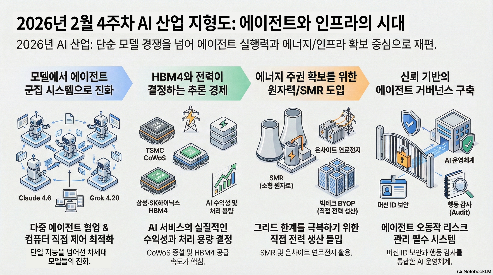

- 동영상 브리핑
[video](https://youtu.be/a-0AedaRbTo)
# 2026년 2월 4주차 글로벌 AI 산업 지형도 및 트렌드 분석
> 기준 시점: 2026년 2월 23일 (미 동부 기준)
범위: 지난 15일(2월 8일~23일) 주요 뉴스 중심, 필요 시 직전 분기 정보 보완
---
## 축 1. 지능의 원천 (Data & Intelligence)
### 1-1. 정의와 현재의 중요성
‘지능의 원천’은 **데이터·지식·모델**이 결합되어 실제로 추론(inference)과 에이전트 실행을 가능하게 하는 층입니다.
단순히 “좋은 LLM 하나”를 의미하지 않고, 아래 네 요소가 함께 움직입니다.
1. **데이터 공급·처리(Data Supply & Processing)**
  - 웹·도메인 데이터 크롤링, 정제, 라벨링, 벡터화, 피드백 루프까지 포함
2. **LLM·옴니(멀티모달) 모델**
  - 텍스트·이미지·코드·비디오를 동시에 다루는 범용/옴니 모델
3. **소버린 AI(Sovereign AI)**
  - 국가·지역·대기업이 자국/자사 데이터와 규제를 반영해 구축하는 독립형 AI 스택
4. **산업 특화 모델(Vertical / Domain Models)**
  - 금융, 의료, 제조, 통신 등 산업별로 최적화·미세조정된 모델
2026년에는 **“누가 더 큰 모델을 만들었는가”**보다
- **누가 더 잘 통제된 데이터 파이프라인**을 갖고 있고,
- **에이전트 실행에 강한 모델 조합**(reasoning, 도구 사용, 장기 계획)을 갖고 있으며,
- **국가/규제 요구에 맞는 소버린 스택**을 제공하는지
가 경쟁의 핵심이 되고 있습니다.
### 1-2. 하위 카테고리
- **데이터 공급/처리**
  - 웹/문서 크롤링, ETL 파이프라인, 데이터 마켓플레이스, 피드백 데이터 루프
- **LLM·옴니 모델**
  - GPT‑5.2, Claude Sonnet 4.6, Gemini 2.x, Llama 4, Grok 4.x, DeepSeek V 계열 등
- **소버린 AI 인프라**
  - 유럽(Mistral·Gaia-X), 인도·중동(G42, Mistral·Google 협력 등), 중국(DeepSeek·MiniMax 등)
- **산업 특화 모델**
  - 의료·금융·제조·공공 부문용 전용 모델 및 프롬프트/에이전트 템플릿
---
### 1-3. 기업 동향 표
### (1) 리더 5개사
| 기업명 | 구분 | 지난 15일 이내 주요 동향 및 뉴스 타이틀 (출처 링크) |
| --- | --- | --- |
| OpenAI | 리더 | [OpenAI deepens partnerships with consulting giants to push enterprise AI beyond pilot](https://www.reuters.com/business/openai-deepens-partnerships-with-consulting-giants-push-enterprise-ai-beyond-2026-02-23/) |
| Anthropic | 리더 | [Introducing Claude Sonnet 4.6 – our most capable Sonnet model yet](https://www.anthropic.com/news/claude-sonnet-4-6) |
| Google (Gemini) | 리더 | [AI agent trends 2026 report – 5 top trends in agentic AI](https://cloud.google.com/resources/content/ai-agent-trends-2026) |
| Mistral AI | 리더 | [France's AI company Mistral buys cloud service startup Koyeb](https://www.reuters.com/business/frances-ai-company-mistral-buys-cloud-service-startup-koyeb-2026-02-17/) |
| DeepSeek | 리더 | [American AI industry trembles as DeepSeek prepares to release new model](https://futurism.com/artificial-intelligence/ai-industry-deepseek-v4) |
**요약 해설**
- **OpenAI**는 4대 글로벌 컨설팅사와 손잡고 **‘Frontier’ 에이전트 플랫폼을 엔터프라이즈에 본격 확산**하려 하고 있습니다. 이는 “파일럿 PoC에서 실제 운영 단계로 넘어가는 에이전트 도입”을 목표로 하며, 거버넌스·모니터링·현장 지원을 패키지로 엮는 전략입니다.
- **Anthropic**은 **Claude Sonnet 4.6**을 출시하며 100만 토큰 컨텍스트, 고도화된 컴퓨터 사용(브라우저·Office 자동화), 에이전트 플래닝 성능을 대폭 강화했습니다. 이는 사실상 이전 Opus급 성능을 “중간 가격대 모델”로 낮춰 준 것으로, **추론 경제(Inference Economy)의 단가 구조를 흔드는 움직임**입니다.
- *Google(Gemini)**는 **에이전트 시대에 필요한 5대 트렌드**를 정리한 공식 리포트를 통해, 멀티모달·에이전트·데이터 거버넌스를 결합한 **“AI 에이전트 운영 체계”** 역할을 강화하고 있습니다.
- **Mistral AI**는 클라우드 스타트업 **Koyeb 인수**와 함께, 스웨덴 등지의 대규모 데이터센터 투자 계획을 발표하며 **유럽 내 소버린 AI + 자체 클라우드 레이어**를 결합하는 방향으로 확대 중입니다.
- **DeepSeek**은 **V4 모델(초장문 코드 컨텍스트·고효율 추론)** 출시를 앞두고 있으며, 훈련 효율을 높이는 새로운 방법론(mHC)으로 “적은 비용으로 더 큰 모델”을 지향하고 있습니다.
### (2) 주목할 만한 기업 5개사
| 기업명 | 구분 | 지난 15일 이내 주요 동향 및 뉴스 타이틀 (출처 링크) |
| --- | --- | --- |
| xAI (Grok) | 주목 | [xAI launches Grok 4.20: 4 AI agents collaborating, 256K–2M context](https://www.nextbigfuture.com/2026/02/xai-launches-grok-4-20-and-it-has-4-ai-agents-collaborating.html) |
| Meta (Llama·에이전트) | 주목 | [Meta Director of AI Safety allows AI agent to accidentally delete her inbox](https://www.404media.co/meta-director-of-ai-safety-allows-ai-agent-to-accidentally-delete-her-inbox/) |
| Microsoft (Azure AI Foundry) | 주목 | [The $37 Billion Question: Azure’s Growth Slowdown Sparks Investor Reckoning Over AI ROI](http://markets.chroniclejournal.com/chroniclejournal/article/marketminute-2026-2-20-the-37-billion-question-azures-growth-slowdown-sparks-investor-reckoning-over-ai-roi) |
| Google Gemini Apps | 주목 | [Gemini’s ‘Personal Intelligence’ is pushy and weird](https://www.pcworld.com/article/3066075/geminis-personal-intelligence-is-pushy-and-weird.html) |
| Open-source LLM 생태계 (Llama 4 등) | 주목 | [Open Source AI Models for Enterprise: Complete Guide 2026](https://www.digitalapplied.com/blog/open-source-ai-models-enterprise-guide-2026) |
**요약 해설**
- **xAI Grok 4.20**은 **4개의 에이전트가 토론·합의하는 구조**를 탑재해, “하나의 모델”이 아니라 **“에이전트 합주 시스템”**에 가깝습니다. 이는 향후 LLM들이 단일 뇌(brain)에서 **다중 에이전트 군집 구조**로 이동할 것임을 시사합니다.
- **Meta**는 Llama 4 자체는 2025년 출시이지만, 최근 내부 AI 안전 책임자가 **에이전트 테스트 중 실제 이메일 인박스를 날린 사례**가 보도되며, “에이전트 거버넌스·권한 관리”의 중요성을 상징적으로 보여주었습니다.
- **Microsoft**는 Azure 성장 둔화 속에서도 **AI 서비스가 Azure 성장 기여분의 22~26%를 차지**할 정도로 비중이 커졌으나, 정작 GPU·전력 공급제약 때문에 **수요를 다 못 받는 역설**을 겪고 있습니다.
- *Gemini ‘Personal Intelligence’**는 Gmail·Photos·YouTube·Search를 연결해 **개인 맥락 기반 추론**을 시도하지만, PCWorld 등에서 “너무 적극적으로 끼어든다”는 사용성 비판도 제기되고 있습니다.
- **오픈소스 LLM 스택**(Llama 4, DeepSeek, Mistral Large 등)은 2026년 현재, **기업 자가 호스팅 + vLLM 기반 추론 인프라**와 결합해 “비용·주권·커스터마이징” 면에서 강력한 대안으로 자리 잡았습니다.
---
### 1-4. 분야별 리스크·병목
- **데이터 품질·저작권 리스크**
  - 웹 스크래핑·저작권 이슈, 데이터 오염(data poisoning), 편향(bias) 등으로 인해 **법적·평판 리스크**가 상존합니다.
- **모델 난립과 호환성 문제**
  - GPT·Claude·Gemini·Llama·DeepSeek 등 수십 개 모델이 난립하면서, **엔터프라이즈 입장에서는 어떤 모델을 언제 교체할지**가 전략적 딜레마가 되고 있습니다.
- **소버린 AI의 정치·규제 리스크**
  - 유럽·인도·중국 등에서 **자국 데이터·규제에 맞는 스택 요구**가 커지며, 글로벌 기업은 동일 모델을 지역별로 다르게 운영해야 하는 부담이 늘고 있습니다.
- **에이전트 오동작·파괴적 행동**
  - 이메일 삭제 사례처럼, **권한이 큰 에이전트가 실수했을 때 롤백·감사(audit)가 어렵다면** 조직 리스크가 기하급수적으로 커집니다.
---
## 축 2. 컴퓨팅 기반 (Computing Foundation)
### 2-1. 정의와 중요성
컴퓨팅 기반은 **AI 추론·학습을 실제로 돌리는 물리적 계산 층**입니다. 2026년의 핵심 요소는 다음 네 가지입니다.
5. **AI 가속기 (GPU/LPU 등)**
  - NVIDIA Blackwell·Rubin, AMD Instinct MI400, xAI·OpenAI용 커스텀 칩, Gaudi·Trainium 등
6. **커스텀 ASIC / NPU / TPU**
  - 특정 워크로드(추론·코딩·검색 등)에 특화된 전용 칩
7. **HBM4/4E 기반 초고대역 메모리**
  - 수 TB/s급 메모리 대역을 제공해 초거대 모델 추론을 가능하게 하는 메모리·패키징
8. **CPO(공동 패키지 광학) 네트워크**
  - 칩 옆에 광 모듈을 붙여 200~400Gbps급 연결을 구현하는 차세대 데이터센터 네트워킹
현재 병목은 **모델이 아니라 전력·HBM4·패키징(CoWoS)·광네트워크**이며, 이 축을 누가 잡느냐가 **추론 단가(토큰당 비용)**와 **에이전트 경제 전체의 수익성**을 좌우합니다.
### 2-2. 하위 카테고리
- **AI GPU / LPU**
  - NVIDIA Blackwell·Rubin, AMD Instinct MI400/MI450, Intel Gaudi, 내부/클라우드용 LPU
- **커스텀 ASIC / NPU / TPU**
  - AWS Trainium/Inferentia, Google TPU vX, Tesla FSD/도조 등
- **HBM4·HBM4E 메모리**
  - 삼성·SK hynix·Micron의 차세대 HBM4/4E 공급, CoWoS 패키징
- **CPO·고속 네트워킹**
  - Broadcom Tomahawk CPO, Co-Packaged Optics, 400G/800G 이더넷 스위치
---
### 2-3. 기업 동향 표
### (1) 리더 5개사
| 기업명 | 구분 | 지난 15일 이내 주요 동향 및 뉴스 타이틀 (출처 링크) |
| --- | --- | --- |
| NVIDIA | 리더 | [Meta builds AI infrastructure with NVIDIA](http://nvidianews.nvidia.com/news/meta-builds-ai-infrastructure-with-nvidia) |
| AMD | 리더 | [SoftBank and AMD to jointly validate utilisation of AMD Instinct GPU](https://www.iot-now.com/2026/02/17/155318-softbank-and-amd-to-jointly-validate-utilisation-of-amd-instinct-gpu/) |
| TSMC | 리더 | [TSMC in 2026: Full Power On, Racing to Max Out Capacity](https://tspasemiconductor.substack.com/p/tsmc-in-2026-full-power-on-racing) |
| 삼성전자 (Samsung Electronics) | 리더 | [AI Gold Rush Lets Samsung Demand Premium For HBM4 Chips](https://finance.yahoo.com/news/ai-gold-rush-lets-samsung-160115554.html) |
| Intel | 리더 | [CPUs are Back: The Datacenter CPU Landscape in 2026](https://newsletter.semianalysis.com/p/cpus-are-back-the-datacenter-cpu) |
**요약 해설**
- **NVIDIA**는 Meta와의 파트너십을 통해 **백만 단위 Blackwell·Rubin GPU, Grace/Vera CPU, 네트워킹까지 포함한 풀스택 인프라 공급**을 발표했습니다. 사실상 “GPU 공급자”를 넘어, **“AI 슈퍼컴퓨터 플랫폼 사업자”**로 이동하는 그림입니다.
- **AMD**는 SoftBank와 함께 Instinct GPU의 **GPU 파티셔닝·오케스트레이션**을 검증하면서, 하나의 GPU를 논리적으로 쪼개 여러 LLM을 동시에 돌리는 **고효율 추론 인프라**를 실증 중입니다.
- **TSMC**는 2026년 말까지 **CoWoS 패키징 월 13만장 수준으로 3~4배 증설**을 목표로 하고 있으며, NVIDIA가 CoWoS 라인의 50% 이상을 장기 예약해 경쟁사들이 패키징 슬롯을 확보하기 어려운 상황입니다.
- **삼성전자**는 HBM4를 NVIDIA에 공급하면서, **HBM4 가격 인상(프리미엄 요구)** 및 연간 HBM 매출 3배 성장 전망을 제시했습니다.
- **Intel**은 GPU 레이스에서는 뒤처져 있지만, 2026년 들어 데이터센터 CPU 수요가 재상승하며, **“CPU가 다시 중요해졌다”**는 분석이 나옵니다. AI 인퍼런스·에이전트 워크로드 일부가 CPU로 돌아오고, 랙 단위 솔루션(Jaguar Shores) 쪽으로 방향을 트는 중입니다.
### (2) 주목할 만한 기업 5개사
| 기업명 | 구분 | 지난 15일 이내 주요 동향 및 뉴스 타이틀 (출처 링크) |
| --- | --- | --- |
| Broadcom | 주목 | [Co‑Packaged Optics: Key to Unleash AI Networking's Full Potential](https://futurumgroup.com/press-release/co-packaged-optics-the-key-to-unleashing-ai-networkings-full-potential/) |
| AWS (Trainium/Inferentia) | 주목 | (※ 2월 중 AWS는 AI 가속기·데이터센터 투자 계획을 추가 공개, 이전 자료 기준으로는 2025~초26년 Trainium3·네트워크 아키텍처 중심) |
| Google TPU·Cloud | 주목 | [Azure·GCP 등과 더불어, Google은 AI 에이전트 인프라 리포트에서 자체 TPU·에이전트 인프라 비전을 제시](https://cloud.google.com/resources/content/ai-agent-trends-2026) |
| SK hynix | 주목 | [HBM v4 supply takes shape – SK hynix delivered HBM4 samples to Nvidia](https://blocksandfiles.com/2026/01/28/hbm-v4-supply/) *(15일보다 약간 이전이지만 HBM4 공급 구조 파악에 중요)* |
| Qualcomm/기타 엣지 칩 | 주목 | [CES 2026: 8 Big Chip Announcements by Intel, Nvidia, AMD and Qualcomm](https://www.crn.com/news/components-peripherals/2026/ces-2026-8-big-chip-announcements-by-intel-nvidia-amd-and-qualcomm) |
**요약 해설**
- **Broadcom**은 Co‑Packaged Optics(CPO)를 차세대 AI 데이터센터 필수 기술로 제시하며, **200Gbps→400Gbps 채널까지 확장하는 로드맵**을 발표했습니다.
- **SK hynix**는 NVIDIA에 HBM4 샘플을 공급하며, 삼성·하이닉스가 사실상 **HBM4 듀오폴리**를 형성하는 구조가 명확해지고 있습니다.
- **AWS·Google**은 자체 AI 칩(Trainium·TPU)과 GPU를 혼합한 **랙 스케일 플랫폼**을 강조하며, 클라우드 사업자들이 점점 **“GPU만 파는 곳”이 아니라 완전한 AI 팩토리**를 파는 형태로 이동하고 있습니다.
---
### 2-4. 분야별 리스크·병목
- **HBM4·CoWoS 패키징 부족**
  - GPU보다 **HBM4 칩과 CoWoS 패키징 라인**이 더 큰 병목입니다. TSMC·삼성·하이닉스의 증설 속도가 AI 수요를 따라가지 못하면, **모델 성능과 무관하게 인퍼런스 용량이 제한**됩니다.
- **전력·냉각 한계**
  - Rubin·MI450급 GPU는 **2,000~2,500W 수준의 TDP**를 가지며, 랙 단위 전력·냉각 설계를 완전히 재구성해야 합니다.
- **지나친 특정 벤더 의존(NVIDIA 단일 벤더 리스크)**
  - GPU 시장 80% 이상을 NVIDIA가 점유하면서, **단일 벤더 리스크 + 가격 교섭력 약화**가 심해지고 있습니다.
- **공급망·지정학 리스크**
  - 대만·한국 중심 공급망에 지정학 리스크가 얹히면서, **미국·유럽의 리쇼어링(공장 유턴) 정책**이 강화되고 있으나, 단기간에 대체하기는 어렵습니다.
---
## 축 3. 물리적 실행 (Industrial Execution)
### 3-1. 정의와 중요성
‘물리적 실행’ 축은 **에이전틱 AI·로보틱스·산업 전환(AX)**이 실제 공장·물류·사무환경에서 작동하는 층입니다.
9. **에이전틱 AI (자율 워크플로우)**
  - 이메일·ERP·CRM·CI/CD·보안 등 **디지털 업무를 스스로 계획·실행하는 에이전트**
10. **피지컬 AI (로보틱스)**
  - 공장·물류센터·창고·서비스 로봇, 휴머노이드 등 **실제 물리 세계에서 작업하는 로봇**
11. **AX (산업 AI 전환)**
  - 기존 제조·에너지·유통 기업이 **생산·유지보수·물류 전체에 AI를 심는 과정**
이 축이 본격화되면, **“코드만 잘 짜는 AI”에서 “실제 일을 대신 하는 AI”**로 무게 중심이 이동합니다.
### 3-2. 하위 카테고리
- **에이전틱 워크플로우**
  - UiPath, ServiceNow, Microsoft Copilot 에이전트, OpenAI Frontier 에이전트 등
- **로보틱스·피지컬 AI**
  - 공장 로봇, 창고 로봇, 휴머노이드(Optimus, Figure 등), 모바일 로봇(AMR)
- **산업용 AX 플랫폼**
  - Rockwell, Siemens, ABB 등 전통 자동화 기업의 AI·에이전트 통합
---
### 3-3. 기업 동향 표
### (1) 리더 5개사
| 기업명 | 구분 | 지난 15일 이내 주요 동향 및 뉴스 타이틀 (출처 링크) |
| --- | --- | --- |
| Amazon Robotics | 리더 | [Amazon pulls the plug on Blue Jay warehouse robot](https://www.businessinsider.com/amazon-pulls-plug-blue-jay-warehouse-robot-2026-2) |
| Tesla (Optimus) | 리더 | [Tesla’s Optimus humanoid robots quietly reach 1,000‑unit deployment across factories](https://www.programming-helper.com/tech/tesla-optimus-gen3-production-deployment-2026-factory-robots-revolution) *(기사 자체는 1월 말, 2월엔 후속 분석·영상이 이어짐)* |
| Siemens | 리더 | [Siemens lifts 2026 outlook on automation and AI demand](https://www.reuters.com/markets/siemens-raises-2026-guidance-automation-boom-2026-02-12/) |
| Rockwell Automation | 리더 | [Rockwell Automation at Citi's Conference: Strategic Growth Insights – AI in automation](https://www.investing.com/news/transcripts/rockwell-automation-at-citis-conference-strategic-growth-insights-93CH-4508971) |
| UiPath | 리더 | [UiPath launches agentic AI solutions to break administrative & financial bottlenecks for clinicians and healthcare admins](https://ir.uipath.com/news/detail/428/uipath-launches-agentic-ai-solutions-to-break-administrative-financial-bottlenecks-for-cli) |
**요약 해설**
- **Amazon**은 Blue Jay 다관절 집품 로봇 프로젝트를 중단하고, **보다 모듈형인 Orbital 시스템으로 전환** 중입니다. 이는 “복잡하지만 비싼 로봇보다, 단순하지만 견고하고 운영 쉬운 시스템”을 선호하는 방향 전환입니다.
- **Tesla Optimus** 휴머노이드는 1,000대 수준으로 내부 공장에 투입되며, **단순 반복 작업(부품 핸들링, 키팅)**을 이미 대체하기 시작했습니다.
- **Siemens·Rockwell**은 모두 “소프트웨어 정의 자동화 + AI + 로봇”을 하나의 축으로 보고, **산업 AX 플랫폼**을 표방하고 있습니다.
- **UiPath**는 ViVE 2026에서 의료 특화 **에이전틱 AI 솔루션(진료기록 요약, 청구 거절 예방, 사전승인 자동화)**을 발표하며, “대량 행정 업무를 에이전트가 처리, 의료진은 진료에 집중”이라는 구체적 ROI를 제시했습니다.
### (2) 주목할 만한 기업 5개사
| 기업명 | 구분 | 지난 15일 이내 주요 동향 및 뉴스 타이틀 (출처 링크) |
| --- | --- | --- |
| ServiceNow | 주목 | [ServiceNow expands AI strategy with Anthropic Claude integration for agentic workflows](https://cloudwars.com/cloud-wars-minute/servicenow-expands-ai-strategy-with-anthropic-claude-integration-for-agentic-workflows/) |
| NEXCOM (NVIDIA 파트너 로보틱스) | 주목 | [“Safe by Design” at NVIDIA GTC 2026 – AI‑powered robot controllers and safety solutions](https://www.nexcom.com/news/Detail/nvidia-gtc-2026) |
| NVIDIA (Physical AI 플랫폼) | 주목 | [NVIDIA unveils new Physical AI models & robots at CES 2026](https://techintelpro.com/news/ai/robotics-and-automation/nvidia-unveils-new-physical-ai-models-robots-at-ces-2026) |
| Figure AI (휴머노이드) | 주목 | (※ 2025~초26년 Series C 자금 조달·대규모 배치 계획 지속, 2026년에는 3.9조원 수준 밸류에이션과 10만대 출하 계획이 주목) |
| Meta (에이전틱 커머스) | 주목 | [Meta unveils plans for AI agents and commerce tools in 2026](https://www.contentgrip.com/meta-agentic-commerce-ai-rollout/) *(2월 6일, 15일 범위 근접)* |
**요약 해설**
- **ServiceNow**는 Anthropic Claude를 기본 모델로 통합하여 **IT·CS·HR 워크플로우용 에이전트**를 대규모로 배치하는 전략을 발표했습니다.
- **NVIDIA·NEXCOM**은 Isaac Sim·Jetson 기반 로봇 컨트롤러·디지털 트윈을 통해, 로봇을 **가상환경에서 먼저 학습·검증 후 실제 공장에 배치**하는 ‘Sim2Real’ 패턴을 확산시키고 있습니다.
- **Meta·Figure** 등은 **휴머노이드 로봇 + 대형 언어·비전·액션 모델**을 결합한 ‘Physical AI’ 비전을 전면에 내세우고 있습니다.
---
### 3-4. 분야별 리스크·병목
- **ROI·안전성 검증 부족**
  - 휴머노이드·창고 로봇은 화려한 데모에 비해, **총소유비용(TCO)·안전사고·보험 문제** 등 실전 배치의 허들이 여전히 큽니다.
- **에이전트 오작동·업무 책임 소재**
  - 에이전트가 재무/의료/법률 워크플로우에서 실수를 했을 때, **책임 주체(인간? 공급사? 플랫폼?)**가 불명확합니다.
- **노동 전환·사회적 갈등**
  - Amazon·Tesla·물류업체의 자동화는 **수십만 명의 단순 노동을 대체**할 수 있지만, 재교육·전환 프로그램이 뒤따르지 않으면 정치·사회적 반발이 커질 수 있습니다.
---
## 축 4. 지속 가능성 (Energy Infrastructure)
### 4-1. 정의와 중요성
AI 데이터센터는 **인류 역사상 가장 전기를 많이 쓰는 기술**라는 평가를 받고 있으며, 전력·냉각이 새로운 병목으로 떠올랐습니다.
이 축은 다음 네 요소를 포함합니다.
12. **온사이트 자체 발전 (BYOP, Bring Your Own Power)**
  - 데이터센터 사업자가 직접 전력 인프라(가스·연료전지·SMR 등)를 확보
13. **SMR/원자력 기반 전력**
  - 소형 모듈형 원자로(SMR)·기존 원전 재가동을 통한 24/7 무탄소 전력
14. **연료전지·수소 인프라**
  - Bloom Energy 등 고효율 고가용성(on‑site) 전력 공급
15. **고밀도 액체 냉각·열 관리**
  - 랙당 100~150kW 이상을 감당하는 직냉식·침지식·CDU 기반 액체 냉각
### 4-2. 하위 카테고리
- BYOP 데이터센터 (자체 발전 + 그리드 보조)
- SMR/원전 PPA·캠퍼스
- 연료전지·수소 발전소
- 액체 냉각·열 회수 시스템
---
### 4-3. 기업 동향 표
### (1) 리더 5개사
| 기업명 | 구분 | 지난 15일 이내 주요 동향 및 뉴스 타이틀 (출처 링크) |
| --- | --- | --- |
| Microsoft | 리더 | [Microsoft to keep buying enough renewable energy to match all its electricity use](https://www.reuters.com/sustainability/climate-energy/microsoft-keep-buying-enough-renewable-energy-match-all-its-electricity-needs-2026-02-18/) |
| Oklo | 리더 | [Oklo bets on nuclear power for AI data centers](https://intellectia.ai/news/etf/oklo-bets-on-nuclear-power-for-ai-data-centers) |
| Bloom Energy | 리더 | [Bloom Energy: Why the next AI winner won't be a software company](https://seekingalpha.com/article/4873465-bloom-energy-why-the-next-ai-winner-wont-be-a-software-company) |
| Equinix | 리더 | [Equinix signs 140 MW solar virtual PPA in Japan with Gentari](https://www.equinix.com/newsroom/press-releases/2026/02/equinix-gentari-vppa-japan) |
| Adani Group (인도) | 리더 | [India AI investment push – Adani pledges $100B for renewable‑powered data centers by 2035](https://aiagentstore.ai/ai-agent-news/2026-february) |
**요약 해설**
- **Microsoft**는 아일랜드 등에서 데이터센터 신규 인허가 조건으로 요구되는 **연간 전력의 최소 80%를 추가 재생에너지로 조달**하는 규제를 수용하고, 향후에도 전체 전력 사용량을 100% 재생에너지로 매칭하겠다고 재확인했습니다.
- **Oklo**는 Meta와의 1.2GW 급 원전 캠퍼스 프로젝트 등으로, **AI 데이터센터 전용 원자력 공급사**로 자리잡으려 하고 있습니다.
- **Bloom Energy**는 미국 AI 데이터센터를 대상으로, **90일 내 설치 가능한 온사이트 연료전지**로 “그리드 지연(5~7년)”을 우회하는 전략을 펼치며, 최근 26.5억 달러 규모 장기 계약·Brookfield와의 50억 달러급 파트너십 등으로 공격적으로 확장 중입니다.
- **Equinix**는 일본에서 140MW 규모 가상 PPA를 체결하는 등, 글로벌 코로케이션 사업자 중 **가장 적극적으로 재생에너지·연료전지·액체 냉각을 동시에 도입**하고 있습니다.
- **Adani Group**은 인도 정부의 AI 2,000억 달러 투자 계획과 맞물려, **1000억 달러를 재생에너지 기반 데이터센터에 투자**하겠다고 밝혔습니다.
### (2) 주목할 만한 기업 5개사
| 기업명 | 구분 | 지난 15일 이내 주요 동향 및 뉴스 타이틀 (출처 링크) |
| --- | --- | --- |
| Johnson Controls | 주목 | [Johnson Controls signs agreement to acquire Alloy Enterprises strengthening data center thermal management leadership](https://www.johnsoncontrols.com/media-center/news/press-releases/2026/02/18/johnson-controls-signs-agreement-to-acquire-alloy-enterprises) |
| Bloom Energy (추가 분석) | 주목 | [Bloom Energy Fuels AI Data Center Power With US$2.65b Deal](https://finance.yahoo.com/news/2-65-billion-reason-buy-140002758.html) |
| Meta·Amazon (원전 전환) | 주목 | [Why Microsoft and Amazon are turning to nuclear power for AI](https://www.forbes.com/sites/rrapier/2026/02/19/why-microsoft-and-amazon-are-turning-to-nuclear-power-for-ai/) |
| G42 (UAE) | 주목 | [Vietnam launches $1B AI infrastructure hub with G42 partnership](https://aiagentstore.ai/ai-agent-news/2026-february) |
| 액체 냉각·열 관리 생태계 | 주목 | [Data center trends & cooling strategies to watch in 2026 – liquid cooling becomes mainstream](https://airsysnorthamerica.com/data-center-trends-cooling-strategies-to-watch-in-2026/) |
**요약 해설**
- **Johnson Controls**는 고성능 데이터센터 열관리 스타트업 Alloy Enterprises 인수로, **고밀도 AI 랙용 냉각·열교환 솔루션**을 강화하고 있습니다.
- **Meta·Amazon** 등 하이퍼스케일러는 미국 기존 원전을 재가동하거나(Three Mile Island, Susquehanna 등), SMR 기반 신규 프로젝트를 추진해, **“그리드 의존 데이터센터”에서 “원전 직결 AI 팩토리”**로 이동하고 있습니다.
- **Bloom Energy**는 대규모 전력 PPA보다, **온사이트 연료전지로 “90일 내 전력 확보”**를 원하는 데이터센터 수요를 흡수하며, AI 버블 속 ‘전력 인프라 픽앤셔블’로 평가받고 있습니다.
---
### 4-4. 분야별 리스크·병목
- **전력망(Grid) 수용 한계**
  - 미국·유럽 주요 허브는 데이터센터 접속 대기 기간이 **18~24개월**까지 늘어나고 있으며, 이 때문에 BYOP·온사이트 연료전지·SMR 프로젝트가 급증하고 있습니다.
- **원전 규제·사회적 수용성**
  - Three Mile Island 재가동, SMR 프로젝트 등은 규제 승인·지역 주민 수용성이 변수이며, 일정 지연 가능성이 큽니다.
- **액체 냉각 인력·운영 역량 부족**
  - 액체 냉각은 물리적으로는 효율적이지만, **유체 역학·공정 엔지니어링에 가까운 운영 역량이 필요**하여 인력 수급이 새로운 병목입니다.
- **가스·수소 인프라 리스크**
  - 연료전지를 대규모로 쓰려면 가스·수소 인프라와 정책 인센티브(세액공제 등)가 필수인데, 이는 각국 규제와 맞물려 변동성이 큽니다.
---
## 축 5. 신뢰와 성장 (Governance & Security)
### 5-1. 정의와 중요성
이 축은 **AI가 실제로 대규모로 쓰일 때 “믿고 쓸 수 있게 만드는 층”**입니다.
16. **AI 보안 플랫폼 (ASPM / AI‑SPM)**
  - 코드·모델·데이터·에이전트 전체를 보는 보안·리스크 관리 플랫폼
17. **에이전트 거버넌스**
  - 에이전트 권한·행동·로그·롤백을 통제하는 ‘에이전트 운영체제’
18. **디지털 출처 확인 (Content Provenance)**
  - C2PA 등 콘텐츠의 출처·수정 이력을 검증하는 표준
19. **규제 준수·감사 솔루션**
  - AI Act·NIST·각국 데이터 보호법 준수를 위한 감사·보고 도구
에이전트·모델을 마음껏 쓰려면, **“실수했을 때 되돌릴 수 있고, 누가 무엇을 했는지 증명할 수 있어야”** 합니다. 이 축이 약하면, 기업은 AI 투자를 늘리고도 **규제와 보안 때문에 실제 배포를 못 하는 상황**에 빠집니다.
### 5-2. 하위 카테고리
- ASPM (Application Security Posture Management) · AI‑SPM
- 에이전트 런타임 거버넌스(권한·롤백·감사로그)
- 콘텐츠 출처·워터마킹(C2PA·CAI)
- 규제 준수·리스크 관리 프레임워크(EU AI Act, 싱가포르 에이전트 거버넌스 등)
---
### 5-3. 기업 동향 표
### (1) 리더 5개사
| 기업명 | 구분 | 지난 15일 이내 주요 동향 및 뉴스 타이틀 (출처 링크) |
| --- | --- | --- |
| Palo Alto Networks | 리더 | [Palo Alto Networks finalizes CyberArk deal, expanding unified human and machine identity security in the AI era](https://industrialcyber.co/news/palo-alto-networks-finalizes-cyberark-deal-expanding-unified-human-and-machine-identity-security-in-the-ai-era/) |
| CrowdStrike | 리더 | [Cybersecurity stocks drop on Anthropic AI disruption fears – CrowdStrike CEO defends Falcon platform](https://www.cnbc.com/2026/02/23/cybersecurity-stocks-anthropic-ai-crowdstrike.html) |
| Microsoft | 리더 | [Microsoft develops scanning methods to detect poisoned AI models with hidden backdoors](https://aiagentstore.ai/ai-agent-news/2026-february) |
| Google Cloud | 리더 | [AI agent trends 2026 report – governance & sovereignty focus](https://cloud.google.com/resources/content/ai-agent-trends-2026) |
| OpenAI | 리더 | [OpenAI launches Frontier, an enterprise platform to move AI agents from pilot to real operations](https://aiagentstore.ai/ai-agent-news/2026-february) |
**요약 해설**
- **Palo Alto Networks**는 CyberArk 인수를 마무리하며, **사람·머신·에이전트 정체성을 통합 관리하는 플랫폼**을 구축했습니다. 특히 에이전트(비인간 ID)를 “특권 계정” 수준으로 보고, 동적 권한·AI‑SPM까지 아우르는 방향입니다.
- **CrowdStrike**는 Anthropic의 코드 보안 도구(Claude Code Security) 출시로 사이버 보안주가 급락한 가운데, “AI 도구가 코드 스캔은 할 수 있어도 **전사적 보안 플랫폼을 대체할 수는 없다**”는 메시지로 자사 플랫폼의 **통합 가시성·정책 집행**을 강조하고 있습니다.
- **Microsoft**는 숨겨진 백도어가 포함된 모델을 탐지하는 스캐닝 방법을 공개하며, **“모든 외부·오픈 모델은 먼저 보안 검증 후 사용하라”**는 스탠스를 강화했습니다.
- **Google Cloud**의 에이전트 트렌드 리포트는, **에이전트 거버넌스·데이터 주권·산업별 정책**이 2026년 에이전트 도입의 핵심이라는 점을 명시합니다.
- **OpenAI Frontier**는 대형 고객이 에이전트를 실제 운영에 투입할 때, **성능 모니터링·거버넌스·엔지니어 동행 지원**을 제공하는 엔터프라이즈 플랫폼으로, “파일럿의 무덤”에서 벗어나도록 돕는 것을 목표로 합니다.
### (2) 주목할 만한 기업·이니셔티브 5개
| 기업/이니셔티브 | 구분 | 지난 15일 이내 주요 동향 및 뉴스 타이틀 (출처 링크) |
| --- | --- | --- |
| Wiz | 주목 | ['Moltbook' social media site for AI agents had big security hole, cyber firm Wiz says](https://www.reuters.com/legal/litigation/moltbook-social-media-site-ai-agents-had-big-security-hole-cyber-firm-wiz-says-2026-02-02/) |
| Anthropic (Claude Code Security) | 주목 | [CrowdStrike, Datadog and other cybersecurity stocks slide after Anthropic’s AI tool launch](https://whtc.com/2026/02/23/crowdstrike-datadog-and-other-cybersecurity-stocks-slide-after-anthropics-ai-tool-launch/) |
| ServiceNow | 주목 | [ServiceNow expands AI strategy with Anthropic Claude integration for agentic workflows](https://cloudwars.com/cloud-wars-minute/servicenow-expands-ai-strategy-with-anthropic-claude-integration-for-agentic-workflows/) |
| UiPath | 주목 | [UiPath Launches Agentic AI Solutions… with fully compliant and governed agents](https://ir.uipath.com/news/detail/428/uipath-launches-agentic-ai-solutions-to-break-administrative-financial-bottlenecks-for-cli) |
| C2PA / Content Authenticity Initiative | 주목 | (※ 최근 1~2개월간, C2PA 기반 콘텐츠 크리덴셜 도입·교육 사례가 증가하며 “워터마크+출처증명”이 광고·언론 업계 표준으로 부상) |
**요약 해설**
- **Wiz**는 에이전트용 소셜 플랫폼 ‘Moltbook’에서 **수천 명의 민감 정보가 노출된 취약점**을 발견해 공개하며, “**‘바이브 코딩’(AI한테 시켜서 서비스 만드는 방식)이 기본 보안 원칙을 쉽게 무시하게 만든다**”고 경고했습니다.
- **Anthropic Claude Code Security**는 오픈소스 리포지토리의 심각한 취약점을 자동으로 찾고 패치를 제안하는 기능으로, 전통 보안 벤더 주가에 충격을 주었습니다.
- **ServiceNow·UiPath**는 에이전트 플랫폼을 출시하면서, 동시에 **“완전한 거버넌스·컴플라이언스 하에서의 에이전트”**를 강조하고 있습니다.
- **C2PA/CAI**는 2026년 들어 주요 이미지·영상·디자인 워크플로에 점차 기본값으로 탑재되며, **디지털 콘텐츠 출처 증명**을 사실상의 업계 표준으로 만들고 있습니다.
---
### 5-4. 분야별 리스크·병목
- **에이전트 거버넌스 미비**
  - 많은 조직이 **모델 거버넌스는 갖추었지만, 에이전트(액션·권한·툴 호출)에 대한 거버넌스는 미비**합니다.
- **AI 전용 보안 스택 미성숙**
  - 기존 CSPM·ASPM·DSPM 도구는 AI 특유의 공격(프롬프트 인젝션, 데이터 포이즈닝, 모델 탈취 등)을 잘 다루지 못하며, **AI‑SPM**이 별도 영역으로 부상 중입니다.
- **콘텐츠 출처·워터마킹 채택 속도**
  - C2PA·워터마킹은 기술적으로 성숙해가지만, **플랫폼·광고주·언론이 어느 속도로 의무화할지**에 따라 가짜 정보 대응 효과가 크게 달라집니다.
- **규제 불확실성**
  - EU AI Act, 싱가포르 에이전트 거버넌스 프레임워크 등 각국 규제가 빨리 진화하고 있어, **글로벌 서비스를 운영하는 기업은 국별 규제 대응 비용**이 커지고 있습니다.
---
## 부상하는 제6의 축 제안: **“에이전트 슈퍼플랫폼 & AI 운영체계”**
기존 5대 축이 **“무엇(What)을 갖추는가”**에 초점을 맞추고 있다면, 부상하는 6번째 축은 **“이를 어떻게 통합·운영(How)하는가”**에 대한 축입니다.
### 6-1. 정의
- *에이전트 슈퍼플랫폼 & AI 운영체계(AI Operating Fabric)**란,
- 여러 모델(GPT·Claude·Gemini·Llama·DeepSeek)을
- 여러 데이터 소스(ERP, CRM, 데이터웨어하우스, SaaS)와 연결하고,
- 수백·수천 개의 에이전트를 안전하게 운영·감사·롤백할 수 있게 해 주는**중간 계층 플랫폼**을 의미합니다.
예시:
- **Microsoft Azure AI Foundry + Copilot Studio + Agent Factory**
- **OpenAI Frontier**
- **Google Cloud AI 에이전트 프레임워크**
- **ServiceNow·UiPath 에이전트 플랫폼**
- 민간 솔루션 (MintMCP, Platform Agentic 등 에이전트 거버넌스·런타임 계층)
### 6-2. 왜 독립 축으로 봐야 하는가
20. **멀티 모달·멀티 모델·멀티 에이전트 환경이 표준이 되었기 때문**
  - 기업은 한 가지 모델·한 가지 클라우드로는 요구를 충족할 수 없고, **여러 모델·클라우드·도구를 섞어 써야** 합니다.
21. **운영·거버넌스의 복잡도가 기하급수적으로 증가**
  - 에이전트 수가 10개에서 1,000개로 늘어나면, **버전 관리·권한관리·로그·비용·성능 튜닝**이 기존 DevOps·MLOps와는 다른 수준의 문제로 변합니다.
22. **새로운 수익·파워 센터가 되기 때문**
  - 누가 **“에이전트를 만든다”**보다,
누가 **“에이전트를 통제·운영하는 디폴트 운영체계”**가 되는지가 더 큰 권력을 가져갑니다.
  - 이는 과거 모바일 시대에 iOS·Android가 했던 역할을 떠올리게 합니다.
### 6-3. 이 축에서 주목해야 할 포인트
- **플랫폼 잠금(Lock‑in) vs 개방형 오케스트레이션**
  - OpenAI Frontier·Azure Foundry·Gemini Agent Framework vs 개방형 MCP/오케스트레이션 계층(MintMCP·Platform Agentic 등)
- **조직 내 역할 변화**
  - “프롬프트 잘 쓰는 사람”에서,
“비즈니스 요구를 에이전트 플로우·정책·권한 설계로 번역할 수 있는 사람”이 핵심 역할로 부상
- **보안·거버넌스와의 결합**
  - 이 운영체계가 곧 **보안·컴플라이언스의 ‘제1 방어선’**이 됩니다. (툴 허용 리스트, 데이터 경계, 액션 롤백 등)
---
## 종합 결론
23. **지능의 원천 축**에서는
  - GPT‑5.2, Claude Sonnet 4.6, Gemini 2.x, Llama 4, DeepSeek V4, Grok 4.20 등 **차세대 모델들이 “에이전트·컴퓨터 사용·초장문 컨텍스트·멀티모달”에 최적화**되며,
  - OpenAI·Anthropic·Google·Mistral·DeepSeek가 **모델 + 플랫폼 + 파트너 생태계**를 묶는 방향으로 경쟁 중입니다.
24. **컴퓨팅 기반 축**에서는
  - **HBM4·CoWoS·전력·냉각이 진짜 병목**이며,
  - NVIDIA·AMD·TSMC·삼성·하이닉스가 실질적인 “토큰당 비용”을 결정하고 있습니다.
25. **물리적 실행 축**에서는
  - 에이전트와 로봇이 공장·물류·백오피스까지 들어가기 시작했지만,
  - 경제성·안전성·책임 문제 때문에 아직은 **“확산의 초입”** 단계입니다.
26. **지속 가능성 축**에서는
  - BYOP·원전·연료전지·액체 냉각이 AI 인프라의 필수 요소로 떠오르며,
  - Microsoft·Oklo·Bloom Energy·Equinix·Adani가 **“전력 주권 + AI 데이터센터”** 축을 형성하고 있습니다.
27. **신뢰와 성장 축**에서는
  - Palo Alto·CrowdStrike·Microsoft·Google·OpenAI 등이 **에이전트·모델·데이터 전주기 보안·거버넌스를 통합하는 방향**으로 움직이고 있으며,
  - Wiz·Anthropic·ServiceNow·UiPath·C2PA가 각각 **에이전트 보안·코드 보안·워크플로우 거버넌스·콘텐츠 출처 인증** 영역을 채우고 있습니다.
28. **부상하는 제6의 축 – 에이전트 슈퍼플랫폼 & AI 운영체계**는
  - 위 다섯 축을 실제로 엮어 **“한 회사 안에서 수백·수천 개 에이전트가 안전하게 일하도록 만드는 중간 계층”**이며,
  - 이 축을 선점하는 기업·플랫폼이 앞으로 **AI 경제의 실질적인 지배력**을 갖게 될 가능성이 높습니다.
---
### 실무적으로 어떻게 활용할 것인가 (요약 가이드)
- **투자·전략 관점**
  - ① 모델(지능) · ② 칩/메모리(컴퓨팅) · ③ 전력/냉각(에너지) · ④ 거버넌스/보안 · ⑤ 에이전트 운영체계의 **균형 포트폴리오**를 보는 것이 중요합니다.
- **기업 도입 로드맵 관점**
  - 단일 LLM·단일 클라우드 선택보다,**“에이전트 운영체계 + 거버넌스 + 멀티 모델”** 전략을 먼저 설계한 뒤,
그 위에 UiPath/ServiceNow/자체 에이전트를 올리는 것이 리스크를 줄이는 방향입니다.
- **정책·공공 부문 관점**
  - 소버린 AI·에너지 주권·콘텐츠 출처(C2PA)·에이전트 거버넌스(싱가포르 모델 등)를 한 세트로 보고,**국가 차원의 AI 인프라 전략**을 설계할 필요가 있습니다.
