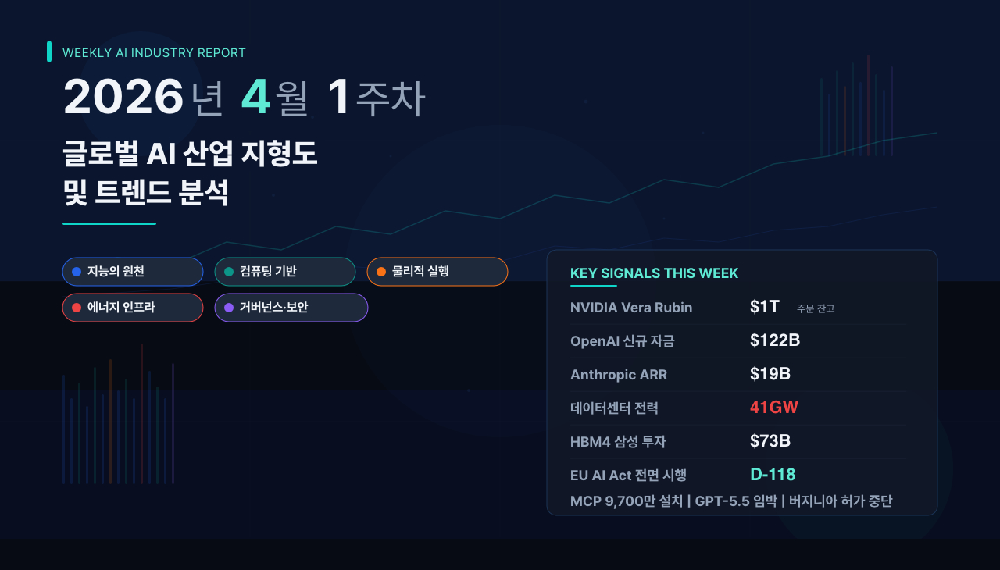

[video](https://youtu.be/VoLGlXGg4fY)
# 2026년 4월 1주차 글로벌 AI 산업 지형도 및 트렌드 분석
> 작성일: 2026년 4월 5일(일)
---
## 주간 핵심 변화 요약 (Executive Delta Brief)
🔺 **상승 신호 — 추론 인프라 전면 투자**
NVIDIA가 GTC 2026에서 차세대 플랫폼 Vera Rubin을 공개하고, 2027년까지 $1T(약 1,400조 원)의 주문 잔고를 확보했다고 발표하였습니다. 젠슨 황 CEO는 "추론의 전환점(Inflection Point of Inference)에 도달했다"고 공식 선언하였습니다. 같은 시기 OpenAI는 $122B(약 170조 원) 규모의 신규 자금 조달을 완료하였습니다. 추론 중심 인프라 투자가 학습(Training) 대비 압도적 우위를 보이고 있습니다. (축1·축2 전반 영향)
🔺 **상승 신호 — HBM4 본격 양산 시작**
삼성전자가 2월부터 HBM4(고대역폭 메모리 4세대: AI 칩 옆에 쌓아 올려 데이터를 빠르게 주고받는 초고속 메모리) 양산을 개시하였고, SK하이닉스는 3분기 양산을 예정하고 있습니다. 삼성은 반도체 사업에 $73B(약 110조 원)을 투입하는 역대 최대 투자를 발표하였습니다. 메모리 기업의 이익률이 파운드리(반도체 위탁 생산) 기업을 역전하는 '마진 플립(Margin Flip)' 현상이 가시화되고 있습니다. (축2 중심, 축4 파급)
🔄 **전환 신호 — 에이전틱 AI 산업 표준화**
NVIDIA의 NemoClaw(에이전틱 AI를 기업에서 안전하게 운영하게 해주는 소프트웨어 프레임워크)와 ServiceNow의 AI Control Tower가 결합되면서, 에이전트 거버넌스 체계가 형성되기 시작하였습니다. Anthropic의 MCP(Model Context Protocol: AI 에이전트를 외부 도구·데이터에 연결하는 표준 프로토콜)가 9,700만 설치를 돌파하며 사실상 업계 표준으로 자리 잡았습니다. AI가 '대화'에서 '실행'으로 전환하는 국면입니다. (축1 → 축3 → 축5 연쇄 영향)
🔻 **하강 신호 — AI 전력 위기 심화**
미국 데이터센터의 전력 소비가 41GW에 도달하였습니다(5년간 150% 증가). 이는 미국 전체 원자력 발전소의 총 용량과 맞먹는 수준입니다. 세계 최대 데이터센터 밀집 지역인 버지니아에서는 여러 카운티가 신규 데이터센터 허가를 중단하였습니다. SMR(소형 모듈 원자로)은 상용화까지 5~7년이 소요되어 수요-공급 시간 불일치가 심각합니다. (축4 중심, 축2·축3 제약)
🆕 **신규 관찰 — EU AI Act 전면 시행 D-118**
EU AI Act가 2026년 8월 2일 고위험 AI 시스템에 대한 전면 시행을 앞두고 있습니다. 위반 시 과징금이 최대 €35M(약 530억 원) 또는 글로벌 매출의 7%에 달합니다. 미국에서도 콜로라도 AI법, 텍사스 책임 AI 거버넌스법이 발효되었으며, 테네시주는 AI 챗봇의 정신건강 전문가 사칭을 금지하는 법안에 서명하였습니다. 규제 리스크가 실질적 사업 변수로 전환되고 있습니다. (축5 중심, 전 축 영향)
---
## 시대 키워드 유효성 검증
아래 키워드는 고정된 진리가 아니라, 매주 리서치 결과에 따라 수정·추가·삭제되는 가설입니다.
| 키워드 | 정의 | 최초 등장 | 현재 유효성 | 금주 근거 |
| --- | --- | --- | --- | --- |
| 추론 경제 (Inference Economy) | 모델 학습보다 추론 효율이 경쟁력을 좌우하는 국면 | 2025 Q3 | ✅ 유효 (강화됨) | Jensen Huang GTC 2026 '추론의 전환점' 공식 선언. Deloitte: 추론이 전체 AI 컴퓨트의 2/3 차지. 추론 전용 칩 시장 $50B+ 돌파 |
| 물리적 AI (Physical AI) | AI가 소프트웨어를 넘어 로봇·자율주행 등 물리 세계로 확장 | 2025 Q1 | ✅ 유효 (가속 중) | NVIDIA Physical AI Data Factory 블루프린트 4월 오픈소스 공개. AGIBOT 휴머노이드 10,000대 출하(업계 최초). 프로토타입→파일럿 양산 전환 |
| 에너지 주권 (Energy Sovereignty) | AI 인프라를 위한 자체 전력 확보가 전략적 과제로 부상 | 2025 Q2 | ✅ 유효 (위기 단계) | 데이터센터 전력 41GW(미국 전체 원전 용량 규모). 버지니아 허가 중단. Microsoft-Constellation 2GW 원자력 계약. Oklo-Meta 1.2GW 캠퍼스 계약 |
| 에이전틱 전환 (Agentic Shift) | AI가 '대화'에서 '자율 실행'으로 전환. 에이전트가 엔터프라이즈 소프트웨어의 새 계층으로 부상 | 2025 Q4 | ✅ 유효 (주류화) | NVIDIA NemoClaw + OpenClaw 엔터프라이즈화. Anthropic MCP 9,700만 설치. GPT-5.4 네이티브 컴퓨터 사용 API. ServiceNow AI Control Tower |
| 🆕 규제 현실화 (Regulatory Materialization) | AI 규제가 '논의'에서 '시행·과징금' 단계로 진입 | 2026 Q1 (신규) | ✅ 신규 (긴급) | EU AI Act 8/2 전면 시행 D-118. 미국 주법(콜로라도·텍사스) 발효. 테네시 챗봇 안전법 서명. 과징금 최대 €35M 또는 매출 7% |
| 🆕 AI 인프라 안보화 (AI Infra as National Security) | AI 인프라가 국가 핵심 인프라로 재분류. 군사·지정학 차원 부상 | 2026 Q1 (신규) | ⚠️ 관찰 중 (후보 축 검토) | WEF 4월 기고 '핵심 인프라 분류' 제안. 3월 이란 드론 UAE AWS 시설 공격. Anthropic DOD '공급망 리스크' 지정 |
---
## 축 1. 지능의 원천 (Data & Intelligence)
| 항목 | 내용 |
| --- | --- |
| **금주 온도** | 🔴 과열 |
| **전주 대비** | ↑ 상승 — GPT-5.5(Spud) 출시 임박, 프론티어 모델 경쟁 최고조 |
AI 모델의 지능을 만들어내는 핵심 계층입니다. 데이터를 수집·가공하고, 대규모 언어모델(LLM: 방대한 텍스트를 학습하여 언어를 이해·생성하는 AI 모델)을 학습·배포하며, 국가별 주권 AI(Sovereign AI: 자국 데이터를 자국 인프라에서 처리하는 체계) 및 산업 특화 모델을 포괄합니다. 2026년 4월 현재, OpenAI GPT-5.4, Anthropic Claude Opus 4.6, Google Gemini 3.1 Pro가 프론티어를 형성하고 있으며, 추론 효율 경쟁이 핵심 전장입니다.
### 하위 카테고리
- **LLM/옴니 모델**: GPT-5.4, Claude Opus 4.6, Gemini 3.1 Pro, Llama 4 등 프론티어 모델. 파라미터가 10조 개를 넘는 모델(Claude Mythos)이 테스트 단계에 진입하였습니다.
- **데이터 공급/처리**: 학습용 데이터 큐레이션, 합성 데이터(AI가 스스로 생성한 학습 데이터) 생성, RAG(검색 증강 생성: 외부 데이터를 검색하여 AI 응답의 정확도를 높이는 기술) 인프라.
- **소버린 AI (Sovereign AI)**: 국가별 자체 AI 인프라 구축 및 데이터 주권 확보. Mistral AI(프랑스), Sakana AI(일본) 등이 대표적입니다.
- **산업 특화 모델**: 의료·금융·법률·제조 등 버티컬(특정 산업 분야에 특화된) 모델과 코딩 에이전트(Claude Code, Codex).
### 주도 기업 (Leaders)
| 기업명 | 주요 동향 (15일 이내) | 축 간 파급 |
| --- | --- | --- |
| **OpenAI** | GPT-5.4 출시(3월) — 최초 네이티브 컴퓨터 사용 API(화면을 보고 마우스·키보드를 조작하는 기능), 272K 컨텍스트 윈도, OSWorld 75% 달성. $122B 신규 자금 조달, 연환산 매출 $25B 돌파. GPT-5.5(코드명 Spud) 사전학습 3/24 완료, 수주 내 출시 예상. (출처: [openai.com](https://openai.com/index/introducing-gpt-5-4/), [openai.com](https://openai.com/index/accelerating-the-next-phase-ai/)) | → 축2(추론 칩 수요), 축3(에이전틱 워크플로우) |
| **Anthropic** | Claude Opus 4.6 — SWE-bench 선두, 200K 컨텍스트. MCP 9,700만 설치 돌파(에이전트 연결 표준). ARR $19B 달성(3월). Claude Code $2.5B ARR. Claude Mythos(차세대 초대형 모델) 데이터 유출로 존재 확인, 얼리 액세스 테스트 중. IPO 준비(Q3-Q4 2026, $400-500B 밸류에이션). (출처: [fortune.com](https://fortune.com/2026/03/26/anthropic-says-testing-mythos-powerful-new-ai-model-after-data-leak-reveals-its-existence-step-change-in-capabilities/), [yahoo finance](https://finance.yahoo.com/news/anthropic-arr-surges-19-billion-151028403.html)) | → 축5(안전 규제), 축2(TPU 수요) |
| **Google** | Gemini 3.1 Pro 출시(4/2) — 추론 성능 대폭 향상, AI Studio·Vertex AI·Gemini CLI 배포. Gemini 3.1 Flash-Lite 초저비용 모델($0.25/M 입력 토큰). TurboQuant 알고리즘으로 KV 캐시(AI 추론 시 이전 대화를 기억하는 임시 메모리) 메모리 6배 절감(ICLR 2026 발표). Gemma 4 오픈모델 Apache 2.0 공개. (출처: [blog.google](https://blog.google/innovation-and-ai/models-and-research/gemini-models/gemini-3-1-pro/), [crescendo.ai](https://www.crescendo.ai/news/latest-ai-news-and-updates)) | → 축2(TPU v6 수요), 축4(액체냉각) |
| **Meta** | MTIA 400(Meta Training and Inference Accelerator: Meta 자체 설계 AI칩) 데이터센터 배치 시작, NVIDIA 의존도 감소 추진. Llama 생태계 오픈소스 리더십 유지. Oklo와 오하이오 1.2GW 원자력 캠퍼스 계약(1월). (출처: [devflokers.com](https://www.devflokers.com/blog/ai-news-last-24-hours-april-2026-model-releases-breakthroughs)) | → 축2(자체 ASIC), 축4(원자력) |
| **xAI** | SpaceX에 $250B 규모 인수 보도. Grok 시리즈 지속 업데이트. 멤피스 슈퍼클러스터 전력 확장. (출처: [devflokers.com](https://www.devflokers.com/blog/ai-news-last-24-hours-april-2026-model-releases-breakthroughs)) | → 축4(자체 전력) |
### 주목 기업 (Notable)
| 기업명 | 주요 동향 (15일 이내) | 비고 |
| --- | --- | --- |
| **Mistral AI** | 유럽 소버린 AI 대표 기업. EU 정부·기업 AI 도입 파트너 역할 확대 |  |
| **DeepSeek** | 중국 오픈소스 LLM 선두. Anthropic이 DeepSeek·Minimax·Moonshot의 Claude 1,600만 회 프롬프트 호출 후 증류(distillation: 대형 모델의 출력을 이용해 소형 모델을 학습시키는 기법) 사실을 공식 확인 |  |
| **Cohere** | 엔터프라이즈 RAG 특화. 다국어·산업별 임베딩 모델(텍스트를 수학적 벡터로 변환하여 검색·비교를 가능하게 하는 모델) 강점 |  |
| **Databricks** | 데이터 레이크하우스 + AI 통합 플랫폼. 엔터프라이즈 AI 파이프라인 표준화 |  |
| **Sakana AI** | 일본 소버린 AI 스타트업. 진화 알고리즘 기반 모델 최적화 연구 |  |
### 병목·리스크
| 리스크 항목 | 심각도 | 전주 대비 | 설명 |
| --- | --- | --- | --- |
| 모델 동질화(Commoditization) | 🔴 높음 | ↑ | 오픈소스 모델이 프론티어 성능의 90%에 도달. 차별화 포인트가 '모델'에서 '제품'으로 이동 |
| 학습 데이터 고갈 및 저작권 분쟁 | 🟡 중간 | → | 합성 데이터 의존도 증가. NYT vs OpenAI 소송 진행 중. EU 저작권 투명성 요구 강화 |
| 보안 사고 증가 | 🔴 높음 | ↑ | Anthropic 소스코드 유출(공개 데이터 레이크에 드래프트 블로그·내부 문서 노출). 중국 해커 Claude Code 악용 30개 기관 공격 적발. AI 모델 자체가 공격 벡터화 |
### 축 간 연결 (Cross-Axis Linkage)
- **축1 → 축2**: 프론티어 모델 파라미터 급증(Mythos 10T+) → GPU/HBM 수요 폭증, Vera Rubin 플랫폼 조기 수주
- **축1 → 축5**: 에이전틱 AI 확산(MCP 9,700만, GPT-5.4 컴퓨터 사용) → 에이전트 거버넌스·감사 추적(audit trail) 수요 급증
- **축1 → 축4**: 추론 워크로드 급증(API 토큰 처리량 분당 150억+) → 데이터센터 전력 수요 2배 증가, 에너지 주권 이슈 심화
---
## 축 2. 컴퓨팅 기반 (Computing Foundation)
| 항목 | 내용 |
| --- | --- |
| **금주 온도** | 🔴 과열 |
| **전주 대비** | ↑ 상승 — GTC 2026에서 Vera Rubin 공개, $1T 주문 잔고 확인 |
AI를 실제로 구동하는 반도체·하드웨어 인프라 계층입니다. GPU/LPU(Language Processing Unit: 언어 처리에 특화된 추론 전용 칩) 같은 AI 가속기, 기업이 자체 설계하는 커스텀 ASIC(Application-Specific Integrated Circuit: 특정 용도에 맞게 주문 제작하는 반도체), HBM4(고대역폭 메모리), 광통신(CPO: Co-Packaged Optics, 칩 패키지에 광학 소자를 통합하여 빛으로 데이터를 전송하는 기술) 네트워킹을 포괄합니다.
### 하위 카테고리
- **AI 가속기 (GPU/TPU/LPU)**: NVIDIA Vera Rubin(3nm, 336B 트랜지스터), AMD MI400, Google TPU v6, Groq LPU 3
- **커스텀 ASIC**: Broadcom(Google TPU 설계 파트너), Amazon Trainium3, Meta MTIA 400, Microsoft Maia 2
- **HBM4 메모리**: SK하이닉스(시장점유율 53%), 삼성(2월 양산 개시), Micron(최종 샘플 납품) 3사 경쟁
- **광통신(CPO) / 네트워킹**: Coherent 400Gbps 실리콘 포토닉스, NVIDIA Spectrum-X 이더넷 패브릭, BlueField-4 DPU
### 주도 기업 (Leaders)
| 기업명 | 주요 동향 (15일 이내) | 축 간 파급 |
| --- | --- | --- |
| **NVIDIA** | GTC 2026 — Vera Rubin NVL72 공개(TSMC 3nm, 336B 트랜지스터, HBM4 288GB, 22TB/s 대역폭). 전세대 Grace Blackwell 대비 전성비 10배. Groq 3 LPU 추론 가속기 발표($20B Groq 인수 기반). Dynamo 1.0 오픈소스 추론 OS 공개. 2027년 $1T 매출 전망. Feynman(2028) 로드맵: 새 GPU + Rosa CPU + BlueField-5 + 구리/CPO 스케일업. (출처: [cnbc.com](https://www.cnbc.com/2026/03/16/nvidia-gtc-2026-ceo-jensen-huang-keynote-blackwell-vera-rubin.html), [tomshardware.com](https://www.tomshardware.com/news/live/nvidia-gtc-2026-keynote-live-blog-jensen-huang)) | → 축4(전력), 축3(Jetson Thor), 축1(추론 비용) |
| **TSMC** | 3nm(N3P) 노드 AI칩 양산 본격화 — Vera Rubin GPU 핵심 파운드리. A16 노드 개발 진행(Feynman 대응). SK하이닉스와 HBM4 로직 다이 협업(12nm, 향후 3nm). 글로벌 파운드리 시장점유율 69.9%. (출처: [trendforce.com](https://www.trendforce.com/news/2026/02/25/news-nvidia-gtc-2026-in-focus-feynman-reportedly-on-tsmc-a16-samsung-sk-hynix-to-showcase-hbm4/)) | → 축4(칩 전력밀도), 축1(모델 성능) |
| **SK하이닉스** | HBM4 16층 48GB CES 2026 공개, Q3 양산 예정. TSMC 12nm 로직 다이 채택. 차세대 HBM4E에 TSMC 3nm 로직 다이 검토. 글로벌 HBM 시장점유율 53%. MR-MUF(Mass Reflow Molded Underfill) 기술로 30μm 초박형 웨이퍼 적층. (출처: [eetimes.com](https://www.eetimes.com/the-state-of-hbm4-chronicled-at-ces-2026/), [trendforce.com](https://www.trendforce.com/news/2026/03/20/news-sk-hynix-reportedly-weighs-tsmc-3nm-for-hbm4e-logic-dies-to-gain-edge-over-samsung/)) | → 축1(모델 학습/추론), 축4(전력 효율) |
| **삼성전자** | HBM4 2월 양산 시작, 2026년 전량 매진. 반도체 사업 $73B(110조 원) 역대 최대 투자 발표(전년 대비 128% 증가). 4nm 로직 다이 자체 파운드리 제조. Broadcom 테스트 '기대 이상' 평가 — Google TPU 공급 유력. 테일러 텍사스 팹 2026년 말 가동 목표. (출처: [tech-insider.org](https://tech-insider.org/samsung-73-billion-semiconductor-investment-2026/), [sammobile.com](https://www.sammobile.com/news/samsung-is-back-hail-semiconductor-chip-clients/)) | → 축1(TPU 메모리), 축4(팹 전력) |
| **Broadcom** | Google TPU용 커스텀 ASIC 설계 리더. Anthropic $21B TPU 주문 매개. 삼성 HBM4 테스트에서 긍정 평가. AI 추론 전용 ASIC 시장에서 NVIDIA 대안 포지셔닝. (출처: [yahoo finance](https://finance.yahoo.com/news/prediction-ai-inference-era-crown-203000745.html)) | → 축1(추론 비용 절감) |
### 주목 기업 (Notable)
| 기업명 | 주요 동향 (15일 이내) | 비고 |
| --- | --- | --- |
| **AMD** | MI400 시리즈 로드맵 공개. MI325X에 HBM3e 288GB 탑재하여 메모리 밀도 경쟁. 오픈소스 생태계(ROCm) 강화 |  |
| **Intel** | NVIDIA Feynman I/O 다이 위탁 생산 논의(18A/14A 공정). NVIDIA로부터 $5B 지분 투자. 파운드리 사업 부활의 전략적 기회 |  |
| **Micron** | HBM4 최종 샘플 NVIDIA 납품 완료. 2026년 말까지 월 15,000 웨이퍼 HBM4 전용 라인 목표. TSMC에 HBM4E 로직 다이 위탁(2027 양산) |  |
| **Coherent** | NVIDIA에 400Gbps 실리콘 포토닉스 공급 계약 확대. 데이터센터 내부 광통신 핵심 부품 공급사 |  |
| **Groq** | NVIDIA에 $20B 대부분 자산 인수. LPU 3 추론 전용 칩 Q3 출하 예정. Google TPU 설계자들이 창업한 회사 |  |
### 병목·리스크
| 리스크 항목 | 심각도 | 전주 대비 | 설명 |
| --- | --- | --- | --- |
| TSMC 단일 의존 리스크 | 🔴 높음 | → | 첨단 AI칩 생산의 80%+ TSMC 집중. 대만 해협 지정학적 리스크 지속 |
| HBM4 수율·공급 병목 | 🟡 중간 | ↑ | 16층 스태킹 기술 난도 극고(30μm 초박형 웨이퍼). 수요 > 공급 상태 지속 |
| 전력 밀도 한계 | 🟡 중간 | ↑ | Vera Rubin NVL72 랙 하나가 소도시급 전력 소비. 냉각·전력 인프라가 칩 성능의 실질적 병목 |
### 축 간 연결 (Cross-Axis Linkage)
- **축2 → 축4**: Vera Rubin 전성비 10배 개선에도 절대 전력량은 증가 → 액체냉각·SMR 수요 가속
- **축2 → 축1**: Dynamo 1.0 추론 OS + Groq LPU 3 → 추론 비용 하락 → 에이전틱 AI 대규모 배포 가능
- **축2 → 축3**: Jetson Thor 로보틱스 컴퓨터 출하 → 물리적 AI 개발 가속, 휴머노이드 온디바이스 AI 실현
---
## 축 3. 물리적 실행 (Industrial Execution)
| 항목 | 내용 |
| --- | --- |
| **금주 온도** | 🟠 활발 |
| **전주 대비** | ↑ 상승 — NVIDIA Physical AI 블루프린트 공개, 휴머노이드 파일럿→양산 전환 |
AI가 소프트웨어를 넘어 물리 세계에서 실제로 '일'하는 계층입니다. 에이전틱 AI(Agentic AI: 사람의 지시 없이 자율적으로 여러 단계의 작업을 수행하는 AI 시스템), 피지컬 AI(로보틱스·자율주행), AX(AI Transformation: 기존 산업의 AI 기반 전환)를 포괄합니다. 2026년은 휴머노이드 로봇이 프로토타입에서 파일럿 양산으로 전환하는 원년입니다.
### 하위 카테고리
- **에이전틱 AI**: 자율 워크플로우, 멀티스텝 작업 수행, 도구 사용 AI 에이전트. NemoClaw, OpenClaw, MCP 기반 생태계.
- **피지컬 AI / 로보틱스**: 휴머노이드 로봇(Tesla Optimus, Figure 03, AGIBOT), 산업용 로봇, 자율주행(NVIDIA-Uber 28개 도시), 드론.
- **AX (산업 AI 전환)**: 제조·물류·의료 등 기존 산업의 AI 기반 혁신. Nestlé-IBM AI 파일럿(데이터 갱신 15분→3분).
- **디지털 트윈 / 시뮬레이션**: NVIDIA Omniverse, Cosmos 월드 모델(현실 세계를 이해하는 AI 모델), GR00T N1.6 로봇 파운데이션 모델.
### 주도 기업 (Leaders)
| 기업명 | 주요 동향 (15일 이내) | 축 간 파급 |
| --- | --- | --- |
| **NVIDIA** | Physical AI Data Factory 블루프린트 4월 GitHub 오픈소스 공개. NemoClaw 에이전틱 프레임워크 + OpenClaw 엔터프라이즈화. Cosmos 월드 모델, GR00T N1.6 로봇 파운데이션 모델. Uber 28개 도시/4개 대륙 자율주행 파트너십(2028년까지). Hugging Face와 LeRobot 통합. (출처: [nvidianews.nvidia.com](https://nvidianews.nvidia.com/news/nvidia-announces-open-physical-ai-data-factory-blueprint-to-accelerate-robotics-vision-ai-agents-and-autonomous-vehicle-development), [akkodis.com](https://www.akkodis.com/en/blog/articles/nvidia-gtc-2026-digital-engineering)) | → 축2(Jetson Thor), 축1(합성 데이터) |
| **Tesla** | Optimus Gen 2 — 산업·가정용 범용 휴머노이드. BYD와 함께 2026년 20,000대 양산 목표. AI5/AI6 프로세서 삼성 위탁생산. (출처: [humanoidroboticstechnology.com](https://humanoidroboticstechnology.com/articles/top-12-humanoid-robots-of-2026/)) | → 축2(엣지 칩), 축4(공장 전력) |
| **ServiceNow** | NVIDIA GTC에서 AI Control Tower 발표 — 에이전트 행동 모니터링·거버넌스 통합 플랫폼. Nemotron 모델 + Blackwell 인프라 기반 장기 실행 에이전트. Knowledge 2026(5월) 추가 발표 예고. (출처: [newsroom.servicenow.com](https://newsroom.servicenow.com/press-releases/details/2026/NVIDIA-GTC-2026-Governing-the-Autonomous-Workforce/default.aspx)) | → 축5(에이전트 거버넌스) |
| **Figure AI** | Figure 03 대량 생산용 설계 완료. $1B 자금 조달. 웨어하우스·물류 센터 파일럿 진행 중. (출처: [theinnovationmode.com](https://theinnovationmode.com/the-innovation-blog/2026-innovation-trends)) | → 축2(온디바이스 AI칩) |
| **Boston Dynamics** | CES 2026 전기식 Atlas 공개. 산업용 자재 핸들링·주문 처리 특화. 2026-2028 상업 출시 계획. (출처: [humanoidroboticstechnology.com](https://humanoidroboticstechnology.com/articles/top-12-humanoid-robots-of-2026/)) | → 축2(모터·센서) |
### 주목 기업 (Notable)
| 기업명 | 주요 동향 (15일 이내) | 비고 |
| --- | --- | --- |
| **1X (NEO)** | 가정용 휴머노이드 NEO 2026년 첫 고객 배송 시작. 텔레오퍼레이션→자율 학습 방식 |  |
| **AGIBOT** | 휴머노이드 로봇 10,000대 출하 달성 — 업계 최초 대규모 생산 이정표 |  |
| **Unitree** | G1 휴머노이드 $16,000(약 2,200만 원) — 연구자·중소기업 접근성 혁신 |  |
| **Skild AI** | NVIDIA Physical AI 블루프린트 얼리 유저. 범용 로봇 두뇌 플랫폼 |  |
| **Apptronik (Apollo)** | 산업용 휴머노이드 — 중량물 처리 및 정밀 작업 특화 |  |
### 병목·리스크
| 리스크 항목 | 심각도 | 전주 대비 | 설명 |
| --- | --- | --- | --- |
| 휴머노이드 배터리 수명 한계 | 🟡 중간 | → | 대부분 플랫폼 연속 작동 3~4시간. 산업 현장 교대 근무(8시간) 대응 불가 |
| 에이전틱 AI 실패 패턴 가시화 | 🔴 높음 | 🆕 신규 | 실환경 배포 후 '청크 스킵핑(장기 계획 중 중간 단계를 건너뛰는 오류)', 도구 호출 오류 등 통제된 테스트에서 미발견 장애 발생 |
| 규제 분절화 | 🟡 중간 | → | EU AI Act 자율 시스템 투명성 요구 vs 미국·중국 혁신 우선 정책. 글로벌 표준 부재 |
### 축 간 연결 (Cross-Axis Linkage)
- **축3 → 축2**: 휴머노이드 양산 확대 → Jetson Thor·엣지 AI 칩 수요 증가
- **축3 → 축5**: 에이전틱 AI 실패 사례 축적 → 에이전트 거버넌스·안전 프레임워크 수요 급증
- **축3 → 축1**: NVIDIA Cosmos 월드 모델 확산 → 합성 학습 데이터 파이프라인 수요 증가
---
## 축 4. 지속 가능성 (Energy Infrastructure)
| 항목 | 내용 |
| --- | --- |
| **금주 온도** | 🔴 과열 |
| **전주 대비** | ↑ 상승 — 데이터센터 전력 41GW 돌파, 버지니아 신규 허가 중단 사태 |
AI 인프라를 구동하는 전력·냉각 계층입니다. 데이터센터 전력 수요가 미국 전체 원자력 발전 용량에 맞먹는 41GW에 도달하면서, 에너지는 AI 산업 성장의 가장 직접적 병목이 되었습니다. IEA는 2026년 전 세계 데이터센터 전력 소비가 1,100TWh(일본 전체 전력 소비량 규모)에 달할 것으로 전망하였습니다.
### 하위 카테고리
- **온사이트 발전 (BYOP: Bring Your Own Power)**: 데이터센터 자체 발전소 건설, 가스터빈, 연료전지 직접 전력 공급
- **SMR / 원자력**: 소형 모듈 원자로(Small Modular Reactor: 기존 대형 원전보다 작고 공장에서 모듈식으로 제작하여 현장 조립하는 원자로), 기존 원전 재가동, 마이크로리액터
- **액체냉각 기술**: 고밀도 AI 랙을 위한 직접 액체냉각(DLC: Direct Liquid Cooling), 침지냉각
- **재생에너지 + 배터리**: 대규모 태양광·풍력 전력구매계약(PPA), 그리드 스케일 배터리 저장
### 주도 기업 (Leaders)
| 기업명 | 주요 동향 (15일 이내) | 축 간 파급 |
| --- | --- | --- |
| **Constellation Energy** | 스리마일 아일랜드(TMI) 원전 재가동 $1.6B 투자, 2027 완료로 가속. Microsoft와 20년 2GW 원자력 계약 — 역대 최대 기업 원자력 계약. Calpine 인수로 미국 최대 발전사 등극. (출처: [tech-insider.org](https://tech-insider.org/ai-data-center-power-crisis-2026/)) | → 축2(데이터센터 전력), 축1(클라우드 AI) |
| **Microsoft** | Constellation 2GW 원자력 계약 2040년까지. Azure Local 소버린 AI 환경에서 NVIDIA RTX PRO 6000 Blackwell 지원. 전력 확보가 Azure AI 확장의 핵심 전략. (출처: [blogs.nvidia.com](https://blogs.nvidia.com/blog/gtc-2026-news/)) | → 축1(Azure AI), 축5(소버린 AI) |
| **Amazon** | X-energy SMR 5GW 배포 지원(2039년까지). 텍사스 1.5GW 태양광. Talen Energy와 1,920MW 원자력 PPA(2042년까지). 서스케하나 원전 직결 1,200에이커 데이터센터 캠퍼스. (출처: [datacenterworld.com](https://datacenterworld.com/powering-future/)) | → 축2(Trainium 인프라), 축1(Bedrock) |
| **Google** | TPU v6 클러스터 액체냉각 적용, 전력 오버헤드 30% 절감 달성. 원자력 탐색 지속. Alphabet 차원 클린에너지 전략 강화. 24/7 무탄소 에너지(CFE) 목표 추진. (출처: [cloud.google.com](https://cloud.google.com/blog/products/compute/google-cloud-ai-infrastructure-at-nvidia-gtc-2026)) | → 축2(TPU 효율), 축1(Gemini 추론 비용) |
| **NuScale Power** | 미국 유일 NRC(원자력규제위원회) 인증 SMR 설계 보유. ENTRA1 Energy와 TVA(테네시밸리공사) 6GW 프로그램. 상용 매출은 PPA 체결 후 본격화. (출처: [yahoo finance](https://finance.yahoo.com/news/ai-data-center-demand-drive-142500974.html)) | → 축2(데이터센터 전력) |
### 주목 기업 (Notable)
| 기업명 | 주요 동향 (15일 이내) | 비고 |
| --- | --- | --- |
| **Oklo** | Meta와 오하이오 1.2GW 원자력 캠퍼스 계약(1월). 2026년 초기 부지 작업 시작, 2030년 1단계 발전 목표 |  |
| **Deep Atomic** | 미국 최초 원자력-AI 데이터센터 통합 캠퍼스 제안(아이다호 국립연구소). MK60 SMR: 60MW 전기 + 60MW 냉각 동시 제공 |  |
| **GE Vernova** | BWRX-300 SMR 캐나다 2029년 상업운전 예정. 핀란드·스웨덴·UAE·영국 배치 MOU 체결. GE Hitachi Nuclear Energy JV(60년 경험) |  |
| **Bloom Energy** | 고체산화물 연료전지(SOFC: 수소·천연가스를 전기로 직접 변환하는 연료전지) 데이터센터 배치 확대. BYOP 즉시 배치 가능 솔루션 |  |
| **Vertiv** | 고밀도 AI 랙 액체냉각 솔루션 시장 리더. 100+ GPU/랙 냉각 대응 |  |
### 병목·리스크
| 리스크 항목 | 심각도 | 전주 대비 | 설명 |
| --- | --- | --- | --- |
| 전력 수요-공급 시간 불일치 | 🔴 높음 | ↑ | 데이터센터는 '지금' 전력 필요, SMR은 5~7년 소요. 천연가스가 간극 충당 → 빅테크 탄소 중립 목표 훼손 |
| 전기요금 전가 리스크 | 🔴 높음 | ↑ | Brookings: 2019 이후 전기요금 42% 상승. 데이터센터 전력 비용이 일반 소비자에게 전가되는 구조 |
| SMR 비용 초과·일정 지연 | 🟡 중간 | → | NuScale 비용 초과 이력. 상용 SMR 미국 내 가동 사례 0. 중국 Linglong One이 세계 최초 상업 육상 SMR 가동 유력(2026 H1) |
### 축 간 연결 (Cross-Axis Linkage)
- **축4 → 축2**: 전력 제약 → NVIDIA Vera Rubin 10배 전성비 강조의 배경. 칩 효율이 곧 에너지 전략
- **축4 → 축3**: 에이전틱 AI 24/7 운영 → 추론 인프라 상시 전력 → 에너지 수요 기저부하(baseload)화
- **축4 → 축5**: 버지니아 허가 중단 → 데이터센터 입지 규제가 사업 리스크로 직결
---
## 축 5. 신뢰와 성장 (Governance & Security)
| 항목 | 내용 |
| --- | --- |
| **금주 온도** | 🟠 활발 |
| **전주 대비** | ↑ 상승 — EU AI Act 8월 전면 시행 임박(D-118), 미국 주 단위 법률 발효 |
AI 시스템의 안전성·투명성·책임성을 보장하는 거버넌스·보안 계층입니다. AI가 '실험'에서 '운영'으로 전환되면서, 규제 준수(Compliance)는 선택이 아닌 생존 요건이 되었습니다.
### 하위 카테고리
- **AI 보안 플랫폼 (ASPM: Application Security Posture Management)**: AI 모델 취약점 관리, 공급망 보안, 적대적 공격 방어
- **에이전트 거버넌스**: 자율 AI 에이전트의 행동 감시·제어·감사 추적(audit trail). ServiceNow AI Control Tower 선두.
- **디지털 출처 확인 (Provenance)**: AI 생성 콘텐츠 워터마킹, 딥페이크 탐지, C2PA(Coalition for Content Provenance and Authenticity) 표준
- **규제 준수 솔루션**: EU AI Act, 미국 주법(콜로라도, 텍사스), ISO/IEC 42001 대응 컴플라이언스 플랫폼
### 주도 기업 (Leaders)
| 기업명 | 주요 동향 (15일 이내) | 축 간 파급 |
| --- | --- | --- |
| **ServiceNow** | NVIDIA GTC에서 AI Control Tower 발표 — 에이전트 행동 모니터링·거버넌스 통합. Nemotron + Blackwell 기반. Knowledge 2026(5월) 추가 발표 예고. (출처: [newsroom.servicenow.com](https://newsroom.servicenow.com/press-releases/details/2026/NVIDIA-GTC-2026-Governing-the-Autonomous-Workforce/default.aspx)) | → 축3(에이전트 운영) |
| **OneTrust** | AI 거버넌스 2026 글로벌 가이드 발간. EU AI Act + GDPR 통합 컴플라이언스 플랫폼. 프라이버시·AI 규제 교차점 선점. (출처: [onetrust.com](https://www.onetrust.com/blog/where-ai-regulation-is-heading-in-2026-a-global-outlook/)) | → 전 축(규제 대응) |
| **Anthropic** | Constitutional AI 프레임워크 선두. DOD AI 무기 활용 제한 입장 → 국방장관이 '공급망 리스크' 지정(보통 적대국 기업 대상 조치). AI 안전과 상업화 균형의 시험대. (출처: [yahoo finance](https://finance.yahoo.com/news/anthropic-arr-surges-19-billion-151028403.html)) | → 축1(안전 평가), 부상 관찰(안보화) |
| **Securiti** | EU AI Act 전면 시행 대비 컴플라이언스 가이드 발간. 데이터 계보(lineage) 추적·위험 분류 자동화 플랫폼. (출처: [securiti.ai](https://securiti.ai/whitepapers/eu-ai-act-what-changes-now-what-waits-2026/)) | → 전 축(데이터 거버넌스) |
| **Coder** | KKR 주도 $90M 시리즈 C 완료. 안전한 엔터프라이즈 AI 개발 환경 플랫폼. (출처: [radicaldatascience.wordpress.com](https://radicaldatascience.wordpress.com/2026/04/03/ai-news-briefs-bulletin-board-for-april-2026/)) | → 축1(AI 개발 보안) |
### 주목 기업 (Notable)
| 기업명 | 주요 동향 (15일 이내) | 비고 |
| --- | --- | --- |
| **Enclave** | $6M 스텔스 탈출. AI 시대 소프트웨어 개발 독립 보안 감시 플랫폼 | 🆕 신규 진입 |
| **Transparency Coalition** | 미국 AI 입법 동향 주간 추적. 테네시 챗봇 안전법 통과, 네브래스카 AI 챗봇 안전법 진행 모니터링 |  |
| **Wiz** | 클라우드 AI 보안 통합. AI 워크로드 보안 자동화·가시화 |  |
| **Palo Alto Networks** | AI 기반 사이버 보안 + AI 시스템 보호 양방향 전략. Cortex XSIAM AI 보안 운영 센터 |  |
| **IBM** | watsonx.governance AI 거버넌스. GTC에서 Nestlé AI 파일럿(데이터 갱신 15분→3분). IBM Cloud에 Blackwell Ultra GPU Q2 추가 예정. (출처: [techrepublic.com](https://www.techrepublic.com/article/news-nvidia-gtc-2026-live-updates/)) |  |
### 병목·리스크
| 리스크 항목 | 심각도 | 전주 대비 | 설명 |
| --- | --- | --- | --- |
| EU AI Act 준비 부족 | 🔴 높음 | ↑ | 기업 절반 이상 AI 인벤토리 미보유. 8월 전면 시행 시 과징금 최대 €35M 또는 매출 7% |
| 규제 분절화 | 🟡 중간 | → | EU·미국·중국 각기 다른 AI 규제 체계. 글로벌 기업 복수 규제 동시 대응 비용 급증 |
| 에이전트 거버넌스 프레임워크 미성숙 | 🟡 중간 | 🆕 신규 | 자율 에이전트 책임 소재, 감사 추적, 실시간 모니터링 표준이 기술 발전 속도 미추적 |
### 축 간 연결 (Cross-Axis Linkage)
- **축5 → 축1**: AI 안전 규제 강화 → 모델 배포 전 안전 평가 의무화 → 출시 일정 지연 가능성
- **축5 → 축3**: 에이전틱 AI 거버넌스 부재 → 기업의 에이전트 도입 속도 제동
- **축5 → 축4**: 데이터센터 환경·입지 규제(버지니아 사례) → 에너지 인프라 확장 제약
---
## 부상 관찰 (Emerging Signals)
### 🌳 후보 축: AI 인프라 ↔ 국가 안보 융합
- **근거**: WEF가 4월 기고문에서 AI 인프라를 전력·수도와 동일한 국가 핵심 인프라로 분류할 것을 제안하였습니다. 3월 이란 드론이 UAE의 Amazon AWS 시설을 공격하여 물리적 인프라가 손상되고 클라우드 서비스가 중단되었습니다. Anthropic은 AI 무기 활용에 제한을 걸었다가 미국 국방부로부터 '공급망 리스크'로 지정당하였습니다.
- **현재 위치**: 축4(에너지 인프라)와 축5(거버넌스) 교차 영역에서 독립 축 분리 검토 단계
- **제안**: 다음 분기 내 독립 축 분리 여부 결정 필요. 군사·지정학적 차원의 AI 인프라 보호가 별도 분석 프레임을 요구하는 수준에 도달
### 🌿 새싹: AI 코딩 에이전트 생태계
- **근거**: Claude Code $2.5B ARR(Anthropic 전체 매출의 13%+), Codex 200만 주간 사용자, GPT-5.4 최초 네이티브 컴퓨터 사용 API. '코딩'이 축1(모델)의 하위 카테고리가 아니라 독립적 제품 시장으로 성장 중.
- **현재 위치**: 축1(지능의 원천)에서 분화 가능성 관찰
### 🌿 새싹: AI 고용 시장 구조 변화
- **근거**: 3월 미국 감원 통계에서 AI가 핵심 요인으로 부상(Inman 보도). 'AI로 인한 일자리 대체'가 공식 통계에 잡히기 시작. AI 기반 가상 피팅 등 새로운 일자리와 기존 일자리 대체가 동시 진행.
- **현재 위치**: 기술 트렌드를 넘어 사회·경제적 구조 변화 신호. 향후 노동 정책·사회 안전망 관련 별도 관찰 축으로 발전 가능
### 🌱 씨앗: 양자-AI 하이브리드 컴퓨팅
- **근거**: Google AlphaEvolve가 양자 컴퓨팅 기반 수치 확인을 수행하고, ChatGPT가 수학 증명을 생성하는 협업 사례 발표(수학자 Terence Tao 논문). IBM·Microsoft 양자-클래식 하이브리드 로드맵 지속.
- **현재 위치**: 축2(컴퓨팅 기반) 내 초기 관찰 단계. 아직 학술 단계이나 2028년 상용화 가능성 관찰
---
## 종합 결론 1: 이번 주 핵심 구조적 변화
### 1. '추론의 전환점(Inflection Point of Inference)'이 공식 선언되었습니다
Jensen Huang은 GTC 2026 키노트에서 "AI가 실제 생산적 작업을 수행하는 추론의 전환점에 도달했다"고 선언하였습니다. NVIDIA 엔지니어 100%가 AI 코딩 어시스턴트(Claude Code, Codex 등)를 사용 중이며, Fortune 500 기업들이 에이전틱 AI를 '실험'이 아닌 '운영'으로 전환하고 있습니다. 이는 AI 산업의 수익 모델이 '학습 인프라 판매(Training Capex)'에서 '추론 인프라 운영(Inference Opex)'으로 전환됨을 의미합니다. Deloitte에 따르면 추론이 전체 AI 컴퓨트의 3분의 2를 차지하며, 추론 전용 칩 시장이 $50B을 돌파하였습니다.
### 2. AI 빅3의 매출 경쟁이 본격화되었습니다
OpenAI $25B, Anthropic $19B, Google Gemini(비공개) ARR. Q1 2026 AI 벤처 투자가 $267.2B로 전분기 대비 2배 이상 증가하였습니다. OpenAI $122B, Anthropic $30B의 메가 라운드가 이어지면서, 이 자본이 추론 인프라로 집중 투입되고 있습니다. 이는 반도체 수요(축2)와 전력 수요(축4)를 동시에 폭발적으로 견인하는 구조입니다.
---
## 종합 결론 2: 향후 2~4주 관찰 포인트
| 시점 | 이벤트 | 예상 파급 |
| --- | --- | --- |
| 4월 중 | OpenAI GPT-5.5(Spud) 출시 여부 | 프론티어 모델 세대 교체 촉발. 벤치마크 판도 재편 가능. 사전학습 3/24 완료, CEO "수주 내" 발언 |
| 4월 중 | Anthropic Claude Mythos 공식 발표 | Opus 4.6 상위 티어 '카피바라' 모델. "역대 최강" 내부 평가. 사이버보안 이중 용도 논란 예상 |
| Q2 | NVIDIA Blackwell Ultra GPU IBM Cloud 배치 | 클라우드 AI 추론 인프라 세대 교체. 가격·성능 경쟁 심화 |
| H1 2026 | 중국 Linglong One SMR 상업 운전 개시 | 세계 최초 상업용 육상 SMR. 미국 SMR 개발에 대한 경쟁 압박 가속 |
| 8월 2일 | EU AI Act 고위험 AI 시스템 의무 전면 시행 | 고위험 AI 시스템 운영 기업 전수 영향. 과징금 최대 €35M 또는 매출 7% |
| Q3-Q4 | Anthropic IPO 추진 | $400-500B 밸류에이션, $60B 규모. AI 업계 두 번째 대형 IPO. 시장 심리 지표 |
---
## 투자·정책·사업 전략 수립 시 제언
1. **추론 인프라에 집중 투자하십시오.** 학습(Training) 단계를 지나 추론(Inference)이 수익을 만드는 시대입니다. NVIDIA Vera Rubin, AMD MI400 등 추론 최적화 칩과 Dynamo 같은 추론 전용 OS에 주목하십시오.
2. **에너지 전략 없는 AI 전략은 미완성입니다.** 데이터센터 전력 41GW 시대에 에너지 확보는 AI 사업의 전제 조건입니다. BYOP, 원자력 PPA, 액체냉각 등 다각화된 에너지 포트폴리오를 수립하십시오.
3. **EU AI Act 8월 시행 대비를 서두르십시오.** AI 인벤토리 구축, 위험 분류, 기술 문서화, 적합성 평가를 4월 내 착수해야 합니다. 과징금 €35M 또는 매출 7%는 사업 존폐 수준입니다.
4. **멀티모델·멀티클라우드 전략을 채택하십시오.** GPT-5.4, Claude Opus 4.6, Gemini 3.1 Pro가 용도별 강점이 다릅니다. 단일 벤더 의존 대신 워크로드별 최적 모델을 조합하는 전략이 비용과 성능 모두에서 유리합니다.
5. **에이전트 거버넌스를 지금 설계하십시오.** 에이전틱 AI 도입 속도가 거버넌스 프레임워크를 앞지르고 있습니다. ServiceNow AI Control Tower, MCP 기반 감사 추적 등 에이전트 관리 체계를 선제적으로 구축하십시오.
---
> **면책 고지**: 이 보고서는 공개된 뉴스와 리서치 자료를 기반으로 작성된 분석이며, 투자 권유를 목적으로 하지 않습니다. 모든 투자 및 사업 의사결정은 전문가와 상의하여 독자적으로 판단하시기 바랍니다.
