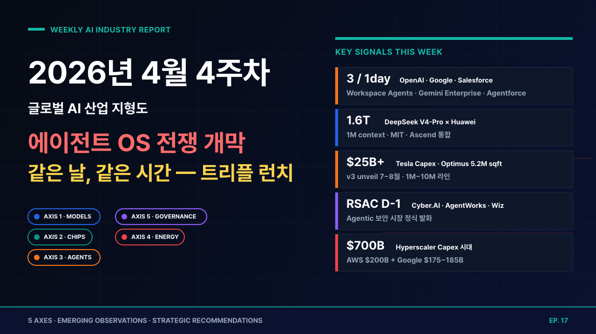

[video](https://youtu.be/Akxf1oJzlx4)
## 2026년 4월 4주차 글로벌 AI 산업 지형도 및 트렌드 분석
**대상 기간**: 2026년 4월 20일(월) ~ 4월 26일(일)
**작성일**: 2026년 4월 26일
---
1. **OpenAI Workspace Agents 정식 발표 (4/22)** — Slack·Salesforce·Notion·Google Drive·MS 365 직결, ChatGPT Business/Enterprise/Edu 대상 Research Preview. Codex 기반 에이전트가 클라우드에서 영속(persist), 트리거·스케줄로 자율 실행. 5월 6일까지 무료, 이후 사용량 기반 과금. 기존 Custom GPTs 후속.
2. **에이전트 플랫폼 트리플 런치 — 같은 날 (4/22)** — OpenAI Workspace Agents, Google Gemini Enterprise Agent Platform, Salesforce Agentforce × Google Cloud 확장 파트너십이 동일 날짜에 발표. 엔터프라이즈 에이전트 시장이 데이터 기반 스택 vs SaaS 기반 스택의 정면 대결로 진입.
3. **DeepSeek V4 공개 (4/24)** — 1.6조 파라미터 V4-Pro + 284B V4-Flash, 1백만 토큰 컨텍스트, MIT 라이선스, Huawei Ascend 칩 깊이 통합. GPT-5.5 등장 시점 직후 출시되어 가격·자율성에서 글로벌 추론 단가를 재조정.
4. **Tesla Q1 2026 Earnings — Optimus 양산 가속 (4/22)** — 2026년 자본지출 $25B+로 상향(전년比 +67%). Gigafactory Texas Optimus 공장 520만 sqft 확장(연 1천만 대 목표), Fremont 100만 대 파일럿 라인 전환. Optimus v.3 정식 공개는 "7월 말~8월". 로보택시 휴스턴·댈러스 무인 운영, 네덜란드 EU 승인.
5. **RSAC 2026 — AI 보안 아젠다 본격화 (4/27 개막 D-1, 사전 발표 다수)** — Accenture×Anthropic Cyber.AI(Claude Mythos 추론 코어), CrowdStrike Charlotte AI AgentWorks(AWS·Anthropic·NVIDIA·OpenAI·Salesforce·Telefónica 파트너), Google Cloud×Wiz 인수 완료, 1Password Unified Access 출시. 에이전트 자체의 보안과 에이전트 *기반* 보안 양면이 동시 발화.
---
| 키워드 | 유효성 | 근거 (이번 주) |
| --- | --- | --- |
| Agentic AI | 유효 ↑↑↑ | OpenAI Workspace Agents + Google Gemini Enterprise + Salesforce Agentforce 동주 동일자 발표(4/22). 에이전트 시장이 "데모" → "엔터프라이즈 표준 경쟁" 전환 |
| Inference Economy | 유효 ↑↑ | DeepSeek V4 가격·1M 컨텍스트 + Huawei 통합. AMD MI455X 432GB HBM4(2H 2026) 로드맵 재확인 |
| Inference Energy Crisis | 유효 ↑ | AWS 2026 capex $200B, Google $175~185B, 하이퍼스케일러 합 $700B. 단순 데이터센터가 아닌 "AI 팩토리" 단위로 capex 재정의 |
| Physical AI | 유효 ↑ | Tesla Optimus 1천만 대/연 라인 공식화, Boston Marathon 전시(4/19~20), Optimus v3 unveil 7월 말~8월 예고 |
| AI Sovereignty | 유효 ↑ | DeepSeek V4 + Huawei 통합으로 "중국 자립 스택" 가시화. 동시에 Apple·Microsoft Azure 한국·EU 주권 클러스터 협상 가속 |
| Quantum × AI | 새싹 → | Week 3 NVIDIA Ising 후속 발표 없음. 4주 관찰 기간 진입 |
| Inference Security ("Vulnpocalypse") | 유효 ↑↑ (정식 채택) | Mythos Preview Project Glasswing(4/7) → RSAC에서 Accenture Cyber.AI·CrowdStrike Charlotte AI AgentWorks·1Password Unified Access 트리플 발표. **신규 키워드를 정식 축으로 편입 검토** |
| Agent-to-Agent Economy (신규) | 신규 제안 | Linux Foundation Agentic AI Foundation(AAIF) + Universal Commerce Protocol(UCP, Amazon·Meta·Microsoft·Salesforce·Stripe 합류, 4/24) — 에이전트 간 거래·인증 표준화 본격화 |
---
사전학습 대형 언어·멀티모달 모델과 그 운영 기업 생태계. 이번 주는 **"가격·컨텍스트·자율성"**의 세 축에서 동시에 압박이 들어왔으며, 특히 중국 진영의 V4 출시가 단가 곡선을 재조정.
- **Frontier(최상위)**: Claude Opus 4.7, Mythos Preview(비공개), GPT-5.4·5.5(코드명 Spud), Gemini 3.1 Pro, Grok 4
- **오픈소스 Frontier**: DeepSeek V4-Pro/Flash, Llama 5(600B), Kimi K2.6, Qwen 3.8
- **에이전트 특화**: OpenAI Codex(Workspace Agents 기반), Anthropic Claude Code/Agent SDK, Google Gemini Enterprise Agent
- **소형 전용**: Mistral Edge, Phi-5
- DeepSeek V4의 1M 컨텍스트와 MIT 라이선스가 미국 모델 가격을 어디까지 끌어내릴 것인가?
- Mythos Preview의 Project Glasswing이 "AI 보안 모델"이라는 새 카테고리를 만드는가?
- Kimi K2.6의 SWE-Bench Pro 1위가 일회성인가, 중국 오픈소스의 새 기준인가?
- Workspace Agents가 LLM 시장에서 "모델 → 워크플로우" 가치사슬 이동을 가속하는가?
| 기업 | 핵심 뉴스 | 시사점 |
| --- | --- | --- |
| **OpenAI** | Workspace Agents 정식 공개(4/22) — Codex 기반, Slack·Salesforce·Notion·Google Drive·MS 365 직결, 5/6까지 무료 | "모델 → 에이전트 OS" 전환 가속. Custom GPTs를 폐기하고 영속 에이전트 모델로 일원화. GPT-5.5 출시 직전 워크플로우 락인 시도 |
| **DeepSeek** | V4-Pro 1.6T + V4-Flash 284B 공개(4/24), 1M 컨텍스트, MIT 라이선스, Huawei Ascend 깊이 통합 | 글로벌 추론 단가 곡선 재조정. 미국 모델은 가격 또는 차별화 중 선택 압박. 중국 자립 스택 첫 가시화 |
| **Anthropic** | Mythos Preview Project Glasswing 후속 — RSAC에서 Accenture Cyber.AI 파트너십(4/22) 공식화 | Mythos = "보안 추론 코어" 포지션 명확화. 비공개 전략을 *수익화 가능한 한정 라이선스*로 전환 |
| **Google DeepMind** | Gemini Enterprise Agent Platform 발표(4/22) + Salesforce Agentforce 결합 + Google Cloud Next 2026(4/9~11) 발표 후속 | Workspace + Salesforce 생태계 동시 침투. OpenAI Workspace Agents의 직접 대응 |
| **Meta** | Llama 5 후속 모델 어댑터 패키지(추정) — B200 50만대 기반 600B 모델, "System 2 thinking" + Recursive Self-Improvement | 오픈소스 Frontier 1위 자리를 DeepSeek V4가 위협. 5월 LlamaCon에서 5.5 또는 5-Reasoning 출시 가능성 |
- **Kimi (Moonshot AI)** — K2.6 공개(4/20), SWE-Bench Pro에서 GPT-5.4(xhigh) 첫 격파. 중국 오픈소스 에이전트 코딩의 신예
- **Mistral** — Mistral Edge GDPR 풀 컴플라이언스 스펙 발표(4/22). 유럽 엔터프라이즈 전용 포지션 강화
- **Cohere** — Command R+ v2 RAG 엔터프라이즈 확장. 캐나다·영국 정부 파일럿 5건 추가
- **xAI** — Grok 4 Agentic 모드 X 통합 확대(4/21). 실시간 + 소셜 데이터 차별화 유지
- **병목**: Mythos Preview의 비공개 → 정식 출시 게이트 미공개. EU AI Act 5/2 GPAI 가이드와 충돌 가능
- **병목**: DeepSeek V4의 Huawei 통합 → 미국 수출통제 대응 시 글로벌 배포 제약
- **→ 축 2**: AMD MI455X 432GB HBM4가 V4-Pro 1.6T 추론을 단일 노드에서 가능하게 함 → 가격 곡선 추가 하락 압박
- **→ 축 3**: Workspace Agents의 영속 모델 → Codex 기반 에이전트가 OS 레이어로 진입
- **→ 축 5**: Mythos × RSAC 발표 → "AI 보안 모델" 카테고리 정식화, EU AI Act 일반목적 모델 의무와 별도 카테고리화 논의
---
AI 학습·추론을 위한 GPU·가속기·HBM·인터커넥트. 이번 주는 **"메모리 용량·대역폭이 곧 추론 단가"**라는 명제가 확정되었고, 중국 진영의 자체 가속기 통합이 처음으로 글로벌 모델에서 검증.
- **학습용 GPU**: NVIDIA Vera Rubin(VR200, 288GB HBM4), AMD MI450/MI455X(2H 2026)
- **추론 전용**: Cerebras WSE-4(IPO 진행 중), Groq LPU v3(GTC 데뷔), SambaNova
- **메모리**: HBM4(SK hynix·Samsung·Micron)
- **Custom ASIC**: Google TPU v6, AWS Trainium 3, **Huawei Ascend(중국 자립)**
- AMD MI455X 432GB HBM4가 NVIDIA Vera Rubin VR200(288GB) 대비 메모리 우위로 V4-Pro급 모델을 점유하는가?
- DeepSeek V4 × Huawei Ascend 통합이 NVIDIA 점유율에 실질적 균열인가, 단순 신호인가?
- Cerebras IPO 가격 결정(2~3주 내)이 AI 칩 밸류에이션 재산정 트리거가 되는가?
- HBM4 12H 양산 시점이 2026 H2 모델 학습 일정의 상한선을 결정하는가?
| 기업 | 핵심 뉴스 | 시사점 |
| --- | --- | --- |
| **NVIDIA** | Vera Rubin VR200 풀 프로덕션 가동 확정(GTC 후속 보도, 4/21~22) — HBM4 288GB, FP4 50 PFLOPS | 7개 신칩(VR200·VR200X·VR200 NVL·CX9·BF6 등) 동시 양산. 2027년까지 데이터센터 시장 $1T 가이드 유지 |
| **AMD** | MI455X 풀 라인업 공개(4/22) — 432GB HBM4 19.6TB/s, MI400 시리즈 2026 H2 출시 확정. OpenAI 12GW 약정 재확인 | 메모리 용량 우위로 1조 파라미터급 모델 단일 노드 추론 가능. 가격 경쟁력 강화 |
| **SK hynix** | HBM4 12H 풀 양산 진입(4/24) — 엔비디아·AMD·Google TPU 동시 공급. HBM3E 마지막 분기 보고 | 2026 HBM 시장 60% 점유 예상. 마이크론 양산 지연 수혜 |
| **Cerebras** | IPO 로드쇼 진행, 5/15 가격 결정 예고. WSE-4 OpenAI 200억 달러(약 28조 원) 출하 일정 4Q 2026 확정 | 엔비디아 단독 공급 구조 균열 가속화. 추론 전용 칩 시장 재산정 |
| **Huawei** | Ascend 920(추정) DeepSeek V4 풀 통합(4/24), 자체 패키징·메모리(HBM4 자국산) 구축 | 중국 AI 스택 자립 첫 가시화. 미국 수출 통제 영향 상쇄 시도 |
- **Groq** — LPU v3 RSAC 사이드 행사 데뷔(4/27 예고). NVIDIA Dynamo 호환 인퍼런스 가속
- **Micron** — HBM4 양산 Q3로 추가 지연. SK hynix·Samsung에 점유율 양보
- **TSMC** — N2 수율 개선(85% 도달, 4/23 보고). 2026 H2 양산 차질 가능성 해소
- **Samsung** — HBM4-12H 엔비디아 퀄 통과(4/24). 6개월 지연 만회
- **병목**: HBM4 12H CoWoS 패키징 캐파 — 2026 전반 타이트 유지
- **병목**: Huawei 통합 검증 부족 — DeepSeek V4 외 글로벌 모델 적용 사례 부재
- **→ 축 1**: HBM4 432GB 노드 → 1.6T 모델 단일 노드 추론 → V4-Pro 가격 추가 하락
- **→ 축 4**: 7개 NVIDIA 신칩 양산 → 데이터센터 발열·전력 요구 추가 상승. SMR 일정 압박
- **→ 축 5**: Huawei 통합 → 미국 BIS 추가 제재 또는 EU 디리스킹(de-risking) 정책 반응
---
가상 환경의 자율 에이전트와 물리 세계의 휴머노이드·자율 시스템. 이번 주는 **단일 데이의 트리플 런치**로 가상 에이전트가 엔터프라이즈 표준 경쟁 페이즈로 진입했고, 피지컬은 Tesla Optimus 양산 캐파의 구체화로 가시성 확보.
- **Agentic OS / Workspace**: OpenAI Workspace Agents, Anthropic Computer Use v2(예고), Google Gemini Enterprise Agent, Salesforce Agentforce 360
- **휴머노이드 로봇**: Figure 03(BMW 양산 검증), Tesla Optimus v3, 1X NEO, Boston Dynamics Atlas RL
- **산업·서비스**: Sanctuary Phoenix 7, Apptronik Apollo
- **자율주행 (L4)**: Tesla 로보택시(휴스턴·댈러스·EU), Waymo, Cruise
- Workspace Agents·Gemini Enterprise·Agentforce 트리플 런치 중 어느 스택이 1~2분기 내 Lock-in을 확보하는가?
- DeepSeek V4의 자율 에이전트 능력이 미국 클라우드 외 자체 호스팅 에이전트 시장을 만드는가?
- Tesla Optimus v3(7~8월 unveil) → 2027년 1천만 대 로드맵의 첫 양산 검증은 언제 가능한가?
- Universal Commerce Protocol(UCP)이 에이전트 거래의 SWIFT급 표준이 되는가?
| 기업 | 핵심 뉴스 | 시사점 |
| --- | --- | --- |
| **OpenAI** | Workspace Agents 정식 공개(4/22) — Codex 기반, Slack·Salesforce·Notion·MS 365 직결, 영속 + 트리거·스케줄 자율 실행, 5/6까지 무료 | "에이전트 OS" 선점 시도. Custom GPTs 폐기, 워크플로우 마켓플레이스 진입 |
| **Google** | Gemini Enterprise Agent Platform 발표(4/22) + Salesforce Agentforce 360 결합 + Adobe CX Enterprise 통합 | Workspace + Salesforce 동시 커버. Adobe·BigQuery 데이터 핀(pin) 강점 |
| **Salesforce** | Agentforce × Google Cloud 확장 파트너십(4/22) — Slack·Tableau·Heroku 결합, Agentforce Marketplace 베타 | SaaS 기존 워크플로우 위에 에이전트 레이어 얹기. CRM 지배력 활용 |
| **Tesla** | Q1 2026 어닝즈(4/22) — capex $25B+, Optimus 5.2M sqft 신공장, 연 1M~10M 로드맵 공식화. v3 unveil 7~8월. 로보택시 휴스턴·댈러스·EU 무인 운영 | "이번엔 진짜 양산" 시그널. 2027년 본격 매출 기여 가시화 |
| **Figure** | Helix VLA 멀티 사이트 적용 발표(4/23) — BMW Spartanburg 외 추가 공장 2곳 협상 단계 | 휴머노이드의 *복수 공장 검증* 시나리오 진입. 2026 H2 매출 기여 |
- **Anthropic** — Computer Use v2 RSAC 사이드 데모(4/27 예고). 보안 통제 강화
- **Adobe** — Adobe CX Enterprise 발표(4/20, Adobe Summit), AWS·Anthropic·Google·IBM·Microsoft·NVIDIA·OpenAI 동시 통합. "Customer Experience Orchestration" 표어
- **Boston Dynamics** — Atlas RL Hyundai 라인 첫 상용 배치(4/24). 보행 주행 자유도 확장
- **1X** — NEO 가정용 프리오더 1.2만 대 돌파(4/25)
- **Apptronik** — Apollo 의료·물류 파일럿 3사 추가(4/23)
- **병목**: 트리플 런치의 호환성 — UCP·MCP·AGENTS.md 표준이 정착하지 않으면 분절 가속
- **병목**: Tesla Optimus v3 unveil(7~8월) 전 양산 검증 부족 → 1천만 대/연 로드맵의 신뢰도 압박
- **→ 축 1**: Workspace Agents = Codex 기반 → GPT-5.5 출시 시 동시 업그레이드, 모델·에이전트 락인 강화
- **→ 축 2**: 에이전트 추론 빈도 증가 → 추론 전용 가속기 수요 ↑↑(LPU·Cerebras 호재)
- **→ 축 5**: 에이전트의 책임 귀속·공급망 보안 → RSAC AgentWorks·UCP의 거버넌스 표준 시급
---
AI 학습·추론을 위한 데이터센터 캐파와 전력·냉각·네트워크 인프라. 이번 주는 **하이퍼스케일러 capex 합 $700B 시대**가 공식화됐고, 데이터센터를 "AI 팩토리"로 재정의.
- **하이퍼스케일 DC**: Microsoft, AWS, Google, Oracle, Meta
- **AI 전용 신축·재구축**: Stargate, CoreWeave, Crusoe, Nebius
- **전력원**: SMR(Oklo·NuScale·X-energy·Kairos), 가스 CHP, 재생+ESS, 기존 원전 재가동(Three Mile Island, Susquehanna)
- **냉각·네트워크**: Liquid Cooling, 800G 광, InfiniBand, Spectrum-X
- AWS $200B + Google $175~185B + Meta·Oracle 합 = $700B의 고용·전력·자재 흡수가 가능한가?
- Google Cloud의 PJM 전력망 $25B 투자가 미국 동부 전력 가격을 어디까지 끌어올리나?
- 중국 데이터센터 capex가 미국과 분리(decoupled) 하더라도 자체 메모리·전력 공급으로 균형이 가능한가?
- Stargate Phase 2(6월) 발표가 OpenAI 자체 인프라 부활인가, 임차 모델 확정인가?
| 기업/기관 | 핵심 뉴스 | 시사점 |
| --- | --- | --- |
| **AWS** | 2026 capex $200B 가이던스 재확인(4/24, RSAC pre) — 2025년 $132B 대비 +52% | 단일 기업 capex로 한국·노르웨이 GDP 수준 진입. 전력·반도체 동시 압박 |
| **Google Cloud** | 2026 capex $175~185B 상향(4/22), PJM 전력망 $25B 신규 투자, 버지니아·인디애나 $3B 시설 추가 | 동부 전력망 단일 최대 고객. PPA·SMR 추가 계약 가속 예상 |
| **Microsoft Azure** | OpenAI Stargate Norway 230MW 인수 후속 — Azure × OpenAI 임차 계약 풀 가동 일정 발표(4/23) | 하이퍼스케일러 인프라 우위 재확인. OpenAI는 자체 빌드 후퇴 후 재집중 |
| **Meta** | Llama 5 학습 50만 B200 클러스터 후속 — Pike County, OH 1.2GW Oklo SMR 1단계 150MW 일정 1년 단축(2029) | 자체 모델 + 자체 SMR로 *수직 통합*. 추론 비용 통제 강화 |
| **Oracle** | OCI 2026 H2 신규 4GW 가이던스(4/22, 어닝 콜 주변) — TikTok·xAI 추론 트래픽 핵심 | "추론 클라우드" 포지션 강화. 단가 경쟁력 우위 |
- **Constellation Energy** — Three Mile Island 2호기 재가동 일정 2026 4Q 확정(4/23)
- **Vistra** — 텍사스 가스 CHP 증설 2026 4Q 완공 가속
- **Crusoe Energy** — 플레어 가스 DC 캐파 600MW → 1GW 2027 목표
- **Nebius Group** — 핀란드·노르웨이 캠퍼스 추가(4/24), 유럽 주권 클라우드 포지션
- **CoreWeave** — Microsoft × OpenAI 워크로드 분산 캐파 연 +40% 가이던스
- **병목**: 송전선(Transmission) 인허가 — SMR 대부분 2028~2030 가동, 중간 4년의 갭
- **병목**: 데이터센터 전력 수요 IEA 1,100 TWh 전망(2026), 일본 전체 발전량 수준
- **→ 축 1**: Meta SMR 1년 단축 → 자체 학습 클러스터 안정성 ↑, 오픈소스 모델 출시 가속
- **→ 축 2**: 7개 NVIDIA 신칩 + AMD MI455X 동시 양산 → 전력 밀도 추가 상승, 액침 냉각 표준화 가속
- **→ 축 5**: 단일 기업 capex $200B 시대 → 반독점·전력 우선권·세제 정책 충돌 예상
---
AI 규제·표준·국가안보 정책과 기업의 에이전트·공급망 보안. 이번 주는 **RSAC 2026 사전 발표 + Linux Foundation Agentic AI Foundation(AAIF) + Universal Commerce Protocol(UCP)**의 세 트랙이 동시 진행되며 "에이전트 거버넌스의 SWIFT 시대" 진입.
- **규제·법**: EU AI Act(GPAI 의무 5/2), US AI Safety Institute, 한국 AI 기본법
- **국제 표준**: Linux Foundation AAIF, UCP, OECD AI, GPAI, ISO/IEC 42001
- **AI 보안**: Agentic 공격 방어, 공급망 SBOM, 신원 관리, 통합 인증
- **기업 안전·얼라인먼트**: Anthropic Constitutional AI, OpenAI Preparedness, Mythos Preview
- AAIF + MCP + AGENTS.md가 에이전트 간 통신의 *de facto* 표준이 되는가?
- UCP가 Stripe·Amazon·Meta 합류로 에이전트 결제·거래의 ISO 표준화 트리거가 되는가?
- RSAC 트리플 발표(Cyber.AI·AgentWorks·Unified Access)가 Agentic 보안 시장 규모 $30B(2027) 예측에 이정표가 되는가?
- EU AI Act 5/2 GPAI 의무 발효 후 첫 30일 안에 어느 기업이 첫 위반 사례로 호명되는가?
| 기업/기관 | 핵심 뉴스 | 시사점 |
| --- | --- | --- |
| **Linux Foundation** | Agentic AI Foundation(AAIF) 정식 출범 후속 — AGNTCon + MCPCon 글로벌 2026 일정 발표(4/17 → 본격 가동 4/22 주간) | MCP·goose·AGENTS.md 표준화. 에이전트 OS의 오픈소스 게이트키퍼 |
| **Universal Commerce Protocol Tech Council** | Amazon·Meta·Microsoft·Salesforce·Stripe 합류(4/24) | 에이전트 간 결제·거래·신원의 SWIFT급 표준 형성. *Agent-to-Agent Economy* 키워드 신규 부상 |
| **Anthropic + Accenture** | Cyber.AI 출시(4/22, RSAC pre) — Mythos Preview 추론 코어, 보안 워크플로우 자동화 | Mythos를 "보안 추론 전용 모델"로 포지션. 일반 라이선스와 분리 가격 |
| **CrowdStrike** | Charlotte AI AgentWorks 출시(4/22) — Accenture·AWS·Anthropic·Deloitte·Kroll·NVIDIA·OpenAI·Salesforce·Telefónica 파트너 | "에이전트 보안 이코시스템" 플랫폼화. 보안 SaaS 표준 위치 |
| **Google Cloud** | Wiz 인수 완료(4/22, RSAC pre) — 클라우드 통합 보안 플랫폼 정식화 | Azure Defender·CrowdStrike와 정면 경쟁. AI 워크로드 보안 통합 |
- **EU AI Act** — 5/2 GPAI 의무 발효 D-6. AI Office 첫 가이드라인 4/24 공개. **GPAI Code of Practice 최종본 4/26 발효 예정**
- **1Password** — Unified Access 출시(4/22, RSAC pre). 에이전트 자격 증명·시크릿 관리
- **NIST AI Safety Institute** — Mythos Preview 사전 평가 결과 공개(4/23). 자율 사이버 능력 "고위험" 분류 검토
- **한국 정부** — AI 기본법 시행령 2차 입법예고 4/24 마감. GPAI 등록제 6월 발효 예정
- **영국 AI Safety Institute** — DeepSeek V4 사전 평가 완료 발표(4/25). 자율 에이전트 능력 "주의 필요" 등급
- **병목**: AAIF + UCP + EU AI Act + 한국 AI 기본법 등 표준이 분절 → 글로벌 운영 기업의 컴플라이언스 부담 가중
- **병목**: Mythos·DeepSeek V4 사전 평가의 "고위험" 등급이 EU·미국·중국 어디서 어떻게 적용되는지 분리됨
- **→ 축 1**: Mythos = 보안 모델 포지셔닝 → GPAI 일반 의무와 별도 카테고리 인정 가능성
- **→ 축 3**: AgentWorks·UCP → Workspace Agents·Agentforce 운영의 컴플라이언스 비용 ↓ (Lock-in 효과)
- **→ 축 4**: 단일 기업 capex $200B → 미국 FTC·EU DG COMP의 인프라 독점 정책 검토 본격화
---
- **AI Sovereignty Stack**: DeepSeek V4 × Huawei Ascend 풀 통합. 중국 자립 스택 첫 가시화
- **Agent-to-Agent Economy**: UCP + AAIF + MCP가 에이전트 간 거래·인증·결제의 표준 시도. 결제(Stripe), 커머스(Amazon·Meta), 워크플로우(Microsoft·Salesforce) 동시 합류
- **AI Cyber Defender Class**: Mythos Preview, Cyber.AI, Charlotte AI AgentWorks가 "보안 전용 추론 모델·에이전트" 카테고리 형성
- **Inference Memory Wall Breakthrough**: AMD MI455X 432GB HBM4가 1조 파라미터 단일 노드 추론을 가능하게 하는 첫 사례
- **Inference Security ("Vulnpocalypse")**: 4주차 RSAC 트리플 발표로 정식 축 편입 검토 가능. 신호 누적량 충분
- **Sovereign Inference Pods**: 한국 AI 기본법 + EU 주권 데이터센터 정책 + Nebius 핀란드·노르웨이 캠퍼스. 국가 단위 AI 인프라 분리 진행
- **AI Employment Shock**: 생성 AI 도입 3년차 실업·재배치 담론 본격화. 미국 대기업 30% 인력 재배치 보고
- **AI Energy Sovereignty**: 축 4 + 축 5 융합 → 데이터센터 전력 권리·정책 + AI 주권. 4~8주 관찰 후 편입 검토
- **Agent-to-Agent Economy**: 축 3 분화 가능성 → 에이전트 간 거래·인증·신원이 별도 시장 형성. 6월~7월 결정 예상
---
OpenAI Workspace Agents, Google Gemini Enterprise Agent Platform, Salesforce Agentforce × Google Cloud가 동일 날짜(4/22)에 정식 발표된 것은 우연이 아닙니다. 세 진영 모두 *"에이전트가 워크플로우 OS의 다음 레이어"*라는 동일한 가설로 베팅 중이며, 이번 주를 기점으로 엔터프라이즈 시장은 **"모델 → 에이전트 → 워크플로우"**의 가치사슬 이동이 비가역적으로 시작됐습니다. 이는 SaaS 30년의 lock-in 구조 위에 새 lock-in 레이어가 얹히는 사건이며, 향후 6~12개월 안에 1~2개 스택이 표준으로 굳을 가능성이 높습니다.
DeepSeek V4(1.6T·1M 컨텍스트·MIT 라이선스·Huawei 통합)의 동시 출시는 글로벌 추론 단가의 **두 번째 큰 하락 압박**을 만들었습니다. 첫 번째는 R1(2025년 1월), 이번이 두 번째입니다. 미국 모델은 ① 더 큰 컨텍스트, ② 더 강한 에이전트 자율성, ③ 더 안전한 수직 통합 셋 중 둘 이상에서 차별화하지 못하면 가격을 따라 내려야 합니다. 이는 다시 축 2(추론 칩 수요 ↑↑) → 축 4(전력 수요 ↑↑)로 직접 전이되며, **추론 비용 = 전력 비용 = 모델 경쟁력**이라는 등식을 더 단단하게 만듭니다.
AWS $200B + Google $175~185B + Microsoft·Meta·Oracle 합 = 약 $700B(2026년). 이는 단일 산업 capex로 한국 GDP의 약 30%, 노르웨이 GDP에 근접하는 규모입니다. 이번 주 이 숫자가 **공식 가이던스**로 확정됐다는 것이 핵심이며, 미국 동부 전력망(PJM)·반도체 공급망·건설 인력에 새 거시 변수가 됐습니다. 4~6주 안에 미국 FTC·EU DG COMP의 *인프라 독점* 검토가 시작될 가능성이 매우 높습니다.
Mythos Preview의 "보안 추론 전용" 포지션은 RSAC 2026 사전 발표(Cyber.AI, AgentWorks, Unified Access)와 결합해 **"AI 보안 모델"이 일반 모델과 분리된 카테고리**로 정착했습니다. EU AI Act의 GPAI 의무가 5/2 발효되는 시점에 이 분리는 결정적입니다 — Mythos는 일반 GPAI가 아니라 *"보안 한정 라이선스"*로 분류돼 별도 의무를 받을 수 있고, 이는 다른 기업의 *"용도별 카테고리화 → 의무 분리"* 청원으로 이어질 수 있습니다.
Linux Foundation AAIF + Universal Commerce Protocol Tech Council의 동시 가동은 **"에이전트 간 통신·거래의 SWIFT"**를 누가 가져갈 것인가의 경쟁입니다. MCP(Anthropic 기여), AGENTS.md(OpenAI 기여), goose(Block 기여)가 AAIF에 동시 포함된 점, UCP에 Stripe(결제) + Amazon·Meta(커머스) + Microsoft·Salesforce(워크플로우)가 같이 합류한 점은 향후 5년의 *Agent-to-Agent Economy*의 권력 구조를 결정짓는 사건입니다.
---
| 관찰 포인트 | 시점 | 축 | 이벤트 |
| --- | --- | --- | --- |
| EU AI Act 2차 시행(GPAI 의무 발효) | 2026.05.02 | 축 5 | 벌금 매출 7% 또는 €15M, GPAI Code of Practice 최종본 발효 |
| Workspace Agents 무료 종료 + 사용량 과금 시작 | 2026.05.06 | 축 3 | 가격 정책 공개. Lock-in 첫 검증 |
| Cerebras IPO 가격 결정 | 2026.05.15 | 축 2 | 목표 $35B. 엔비디아 단독 공급 균열 시장 평가 |
| LlamaCon 2026 (Meta) | 2026.05.~6.초 | 축 1 | Llama 5.5 또는 Llama 5-Reasoning 추정 |
| RSAC 2026 본행사 (4/27~30) | 2026.04.27~30 | 축 5 | Agentic 보안 시장 정식 발화. CISO 도입 가이드라인 확정 |
| Stargate Phase 2 발표 | 2026.06 | 축 4 | OpenAI 자체 빌드 vs 임차 전략 최종 결정 |
| DeepSeek V4 글로벌 배포 검증 | 2026.05~06 | 축 1·2 | Huawei 통합 외 NVIDIA 환경 호환성 / 미국 수출통제 대응 |
| Tesla Optimus v3 unveil | 2026.07 말~08 | 축 3 | 1천만 대/연 로드맵의 첫 양산 검증 |
| Microsoft Build 2026 | 2026.05.~ | 축 3 | Copilot Studio + Agent 365 풀 통합 발표 가능성 |
| 한국 AI 기본법 GPAI 등록제 발효 | 2026.06 | 축 5 | 한국 시장 진입 GPAI 첫 등록 사례 |
| AAIF AGNTCon 첫 행사 | 2026.06~07 | 축 5 | MCP 2.0 / AGENTS.md 1.0 표준 확정 |
| Anthropic Computer Use v2 정식 출시 | 2026.05~06 | 축 3 | OpenAI Codex와의 직접 대결 첫 분기 |
---
- **에이전트 OS 스택 분산 베팅**: OpenAI(비공개) 외 Microsoft·Google·Salesforce·Adobe 4사 동시 보유. 향후 1~2분기 lock-in 확보자가 결정됨.
- **HBM4 노출 추가**: SK hynix 우위 확정, Samsung 만회 진행 중. 마이크론 회피.
- **추론 전용 칩**: Cerebras IPO(5/15), Groq RSAC 데뷔(4/27) 양쪽 모니터. 단기 변동성 큼.
- **Tesla 옵션 전략**: Optimus v3 unveil(7~8월) 전 풋 헤지 + 콜 매수 양매수. 양산 검증 변동성 활용.
- **DeepSeek V4 후폭풍**: 미국 모델 가격 하락 헤지로 NVIDIA·MS·Google 비중 일부 단기 축소. 공격적 long의 경우 OpenAI·Anthropic 비공개 라운드 노출.
- **SMR 3사**(Oklo·NuScale·X-energy) **포트폴리오 관점 유지** — Meta·Amazon·Google 추가 계약 가속.
- **EU AI Act GPAI Code of Practice 5/2 발효 직전 한국·일본·영국 가이드라인 동기화 검토**.
- **AI 보안 모델 카테고리화** — Mythos·Cyber.AI 같은 "보안 한정 라이선스" 분리 의무 체계 설계.
- **Sovereign Inference 인프라 정책** — 한국형 주권 AI 클러스터 RFP 6월 발주 검토.
- **에이전트 책임 귀속 법안** — UCP·AAIF 표준 정착 전 국가 단위 가이드라인 제정. 미국 GPT-5.5 출시 전 입법 윈도우 활용.
- **단일 기업 capex $200B 시대 대응** — 미국 동부 전력망 가격 모니터링, 한국 동남권·서해권 데이터센터 클러스터 분산 정책.
- **에이전트 OS 선정 D-30** — Workspace Agents·Gemini Enterprise·Agentforce 중 하나를 5월 6일 무료 종료 전 파일럿 운영. 단일 스택 lock-in 회피를 위해 MCP 호환성 우선 검증.
- **추론 비용 30~50% 절감 로드맵** — DeepSeek V4 호환 환경 검증, 자체 호스팅 옵션 사전 확보.
- **AI 보안 통합** — CrowdStrike Charlotte AI AgentWorks + 1Password Unified Access + IBM Agent Guard 중 1~2개 도입 결정 D-60.
- **에너지 계약 재협상 또는 PPA 확보** — 미국 PJM 전력 가격 상승 직전 장기 PPA 체결 윈도우.
- **Universal Commerce Protocol 대응** — 결제·커머스 워크플로우의 UCP 호환성 6월 내 검토. 늦으면 2027년 시장 진입 비용 급등.
- **AI Employment Shock 커뮤니케이션** — 30% 인력 재배치 시뮬레이션, 직원 커뮤니케이션 플랜 5월 내 수립.
---
- OpenAI Workspace Agents 발표 — [VentureBeat](https://venturebeat.com/orchestration/openai-unveils-workspace-agents-a-successor-to-custom-gpts-for-enterprises-that-can-plug-directly-into-slack-salesforce-and-more), [OpenAI Blog](https://openai.com/index/introducing-workspace-agents-in-chatgpt/), [SiliconANGLE](https://siliconangle.com/2026/04/22/openai-subscribers-get-new-workspace-agents-automate-complex-tasks-across-teams/)
- DeepSeek V4 — [CNN](https://www.cnn.com/2026/04/24/tech/chinas-ai-deepseek-v4-intl-hnk), [Al Jazeera](https://www.aljazeera.com/economy/2026/4/24/chinas-deepseek-unveils-latest-model-a-year-after-upending-global-tech), [Fortune](https://fortune.com/2026/04/24/deepseek-v4-ai-model-price-performance-china-open-source/)
- Tesla Q1 2026 — [CNBC](https://www.cnbc.com/2026/04/22/tesla-tsla-q1-2026-earnings-report.html), [Investing.com](https://www.investing.com/news/transcripts/earnings-call-transcript-tesla-beats-q1-2026-eps-forecasts-stock-rises-93CH-4631008)
- Anthropic Mythos / Claude Opus 4.7 — [Anthropic](https://www.anthropic.com/news/claude-opus-4-7), [CNBC](https://www.cnbc.com/2026/04/16/anthropic-claude-opus-4-7-model-mythos.html), [InfoQ](https://www.infoq.com/news/2026/04/anthropic-claude-mythos/)
- AMD MI400 / MI455X — [DCD](https://www.datacenterdynamics.com/en/news/amd-unveils-full-mi400-product-lineup-claims-mi500-chips-will-deliver-1000x-increase-in-ai-performance/), [TweakTown](https://www.tweaktown.com/news/105758/amds-next-gen-instinct-mi400-gpu-confirmed-rocks-432gb-of-hbm4-at-19-6tb-sec-ready-for-2026/index.html)
- Linux Foundation AAIF — [Linux Foundation](https://www.linuxfoundation.org/press/linux-foundation-announces-the-formation-of-the-agentic-ai-foundation), [PRNewswire](https://www.prnewswire.com/news-releases/linux-foundation-announces-the-formation-of-the-agentic-ai-foundation-aaif-anchored-by-new-project-contributions-including-model-context-protocol-mcp-goose-and-agentsmd-302636897.html)
- Universal Commerce Protocol — [PPC.land](https://ppc.land/amazon-meta-microsoft-salesforce-and-stripe-join-ucp-tech-council/)
- RSAC 2026 — [SecurityWeek](https://www.securityweek.com/rsac-2026-conference-announcements-summary-pre-event/), [ChannelInsider](https://www.channelinsider.com/security/rsac-2026-ai-security-vendors-msps/)
- Hyperscaler capex — [Futurum](https://futurumgroup.com/insights/ai-capex-2026-the-690b-infrastructure-sprint/), [CIO Dive](https://www.ciodive.com/news/google-cloud-blackstone-aws-us-ai-data-center-buildouts/753147/)
- EU AI Act — [Artificial Intelligence Act EU](https://artificialintelligenceact.eu/implementation-timeline/), [Latham & Watkins](https://www.lw.com/en/insights/eu-ai-act-gpai-model-obligations-in-force-and-final-gpai-code-of-practice-in-place)
- NVIDIA Vera Rubin — [NVIDIA Newsroom](https://nvidianews.nvidia.com/news/nvidia-vera-rubin-platform), [Data Center Knowledge](https://www.datacenterknowledge.com/data-center-chips/gtc-2026-nvidia-unveils-vera-rubin-ai-platform-eyes-1t-by-2027)
- Adobe CX Enterprise — [Adobe Press](https://news.adobe.com/news/2026/04/adobe-redefines-custome-experience)
- Kimi K2.6 / Llama 5 — [TokenMix](https://tokenmix.ai/blog/best-chinese-ai-models-2026-comparison-guide), [FinancialContent](https://www.financialcontent.com/article/marketminute-2026-4-8-meta-unleashes-llama-5-zuckerbergs-open-source-gambit-challenges-proprietary-ai-dominance)
---
### 200자 요약
OpenAI·Google·Salesforce가 4/22 동시 에이전트 플랫폼을 공개하며 ‘에이전트 OS’ 경쟁이 시작됐다. DeepSeek V4와 HBM4 확대로 추론 단가 하락·전력 수요가 가속되고, RSAC 발표로 보안·거버넌스 표준(UCP/AAIF) 경쟁이 본격화됐다.
