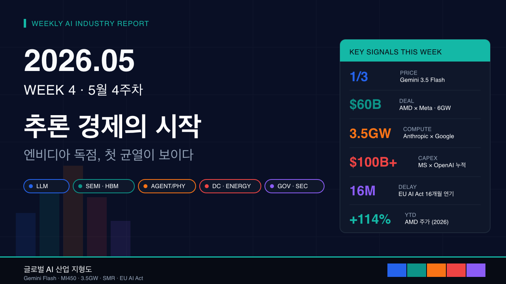

[video](https://youtu.be/dX6nGEkAc2s)
# 2026년 5월 4주차 글로벌 AI 산업 지형도 및 트렌드 분석
> **분석 기간**: 2026년 5월 11일 ~ 5월 25일 (15일)
**발행일**: 2026년 5월 25일 (월)
**버전**: v2026.05.W4
---
## Executive Delta Brief
1. **Google, Gemini Spark·Gemini 3.5 Flash 동시 공개** — Google이 5월 19일 Gemini 3.5 Flash와 범용 AI 에이전트 "Gemini Spark"를 공개. Flash는 동급 프런티어 모델 대비 가격이 1/2~1/3 수준. (출처: CNBC, 2026-05-19)
2. **OpenAI, GPT-5.5 Instant를 ChatGPT 기본 모델로 승격** — 5월 중순부터 무료 사용자까지 GPT-5.5 Instant가 기본값으로 전환. (출처: LLM-Stats, 2026-05)
3. **Microsoft, OpenAI 파트너십에 $100B 이상 누적 지출 공식 인정** — 5월 13일 Microsoft 임원이 법정에서 누적 투자가 1,000억 달러(약 138조 원)를 넘었다고 증언. (출처: Bloomberg, 2026-05-13)
4. **EU AI Act 일정 16개월 연기 합의** — 5월 7일 EU 이사회·의회가 옴니버스 합의로 고위험 AI(Annex III) 의무 시행을 2026년 8월 → 2027년 12월로 연기. (출처: Latham & Watkins, 2026-05)
5. **NANO Nuclear-Supermicro, AI 데이터센터용 마이크로 원자로 MOU** — 5월 중 NANO Nuclear와 Super Micro Computer가 AI 데이터센터 전용 advanced nuclear microreactor 공급 협력 체결. (출처: NANO Nuclear, 2026-05)
---
## 시대 키워드 유효성 검증
| 키워드 | 유효성 | 근거 (이번 주) | 변경 제안 |
| --- | --- | --- | --- |
| Agentic AI | 유효 ↑ | Google Gemini Spark 출시, Haiqu Agentic Quantum OS 공개 | 유지 |
| Physical AI | 유효 ↑ | JAL Haneda 휴머노이드 배치, Doozy Robotics Q3 양산 예고 | 유지 |
| Inference Economy | 유효 ↑ | Gemini 3.5 Flash 1/3 가격, GPT-5.5 Instant 기본화 | 유지 |
| Compute Sovereignty | 유효 ↑ | Anthropic-Google-Broadcom 3.5GW, AMD-Meta 6GW 계약 | 유지 |
| AI Sovereignty | 유효 → | India AI Impact Summit 후속, France Mistral 점유율 안정 | 유지 |
| Edge AI | 유효 ↓ | 이번 주 굵직한 신규 발표 부재 | 2주 뒤 재평가 |
| Inference-Native Hardware | 신규 제안 ↑ | AMD MI450, Broadcom 커스텀 TPU 등 추론 전용 칩 집중 | 신규 추가 검토 |
---
## 축 1: 파운데이션 모델 & LLM
### 개요
- **정의**: 거대언어모델, 멀티모달 프런티어 모델, 추론 모델 등 AI 산업의 "두뇌" 계층.
- **하위 카테고리**: 추론 모델, 멀티모달 프런티어, 경량·고속 모델, 오픈웨이트 모델, 에이전트 통합 모델.
- **이번 주 온도**: 🔥 뜨거움 (↑ 전주 대비)
### 주도 기업
| 기업 | 이번 주 핵심 뉴스 | 시사점 | 출처 |
| --- | --- | --- | --- |
| Google | 5월 19일 Gemini 3.5 Flash + Gemini Spark 에이전트 공개. 가격 1/2~1/3. | 프런티어 가격경쟁의 본격화. 추론 경제 진입 신호. | [CNBC](https://www.cnbc.com/2026/05/19/google-ai-ultra-gemini-spark-omni.html) |
| OpenAI | GPT-5.5 Instant를 ChatGPT 기본 모델로 승격. Microsoft 매출 캡 38B 합의. | 분기 매출 의존도 정리 + 사용자 트래픽 추론 비용 압박 대응. | [llm-stats](https://llm-stats.com/llm-updates), [CNBC](https://www.cnbc.com/2026/04/27/openai-microsoft-partnership-revenue-cap.html) |
| Anthropic | Google-Broadcom과 3.5GW 컴퓨트 확장 발표. 연환산 매출 $30B 돌파. | 인프라 종속 분산 + 매출 가속 (전년말 $9B → 현 $30B). | [Anthropic](https://www.anthropic.com/news/google-broadcom-partnership-compute) |
| Microsoft | OpenAI 파트너십 누적 지출 $100B 초과 증언 (5월 13일). | 빅테크 AI CapEx 회수 압박 본격화. | [Bloomberg](https://www.bloomberg.com/news/articles/2026-05-13/microsoft-spent-over-100-billion-on-openai-partnership-to-date) |
| Meta | AMD와 6GW·$60B 5년 칩 계약 확정 (MI450 + Venice EPYC). | NVIDIA 의존 분산, 자체 AI 인프라 가속. | [AMD-Meta](https://theoutpost.ai/news-story/meta-locks-in-100-b-ai-chips-deal-with-amd-secures-option-for-10-stake-to-fuel-ai-ambitions-24076/) |
### 주목 기업
| 기업 | 이번 주 핵심 뉴스 | 시사점 | 출처 |
| --- | --- | --- | --- |
| Mistral | France 내 Le Chat 점유율 유지, AI sovereignty 핵심 사례. | EU 주권 AI 트랙의 대표 기업으로 정착. | [TechPolicy.Press](https://www.techpolicy.press/rethinking-sovereign-ai-as-strategy/) |
| Alibaba (Qwen) | 오픈웨이트 진영 비중 확대, 다국어 평가에서 격차 축소. | 중국발 오픈 모델 생태계의 글로벌 영향력 증가. | [WhatLLM](https://whatllm.org/blog/new-ai-models-may-2026) |
| DeepSeek | R 계열 추론 모델 비용 효율로 enterprise 채택 확산. | "값싼 추론" 트렌드의 압박원으로 작용. | [llm-stats](https://llm-stats.com/ai-news) |
| xAI (Grok) | 컴퓨트 확장 지속, 멀티모달 기능 보강. | 5강 구도(OAI/Anthropic/Google/Meta/xAI) 재고정. | [llm-stats](https://llm-stats.com/llm-updates) |
### 병목·리스크 + 축 간 연결 (Cross-Axis Linkage)
- **병목**: HBM4 공급(축 2)이 모델 학습/추론 인프라 일정의 결정 인자.
- **리스크**: 매출 폭증(Anthropic $30B run-rate)에도 컴퓨트 비용으로 영업 적자 지속 가능성.
- **축 간 연결**:
  - → 축 2: AMD-Meta MI450 계약이 NVIDIA 독점 구도 균열, HBM4 수요 분산.
  - → 축 4: Anthropic 3.5GW 컴퓨트는 2027년 가동 → 신규 데이터센터 부지·전력 확보 압박.
  - → 축 5: GPT-5.5 Instant 기본화로 EU AI Act 투명성 규제(워터마크) 적용 범위 확대.
---
## 축 2: 반도체 & 인프라 하드웨어
### 개요
- **정의**: GPU·ASIC·HBM·CPO 등 AI 학습·추론을 가능하게 하는 실리콘과 인터커넥트 인프라.
- **하위 카테고리**: 학습용 GPU, 추론 전용 칩(ASIC/LPU), HBM4/HBM4E, 커스텀 실리콘(TPU/Trainium), 광 인터커넥트.
- **이번 주 온도**: 🔥 뜨거움 (↑ 전주 대비)
### 주도 기업
| 기업 | 이번 주 핵심 뉴스 | 시사점 | 출처 |
| --- | --- | --- | --- |
| NVIDIA | AI 칩 시장 점유율 81% 유지, FY26 매출 $215.9B (+65%). | 독점 유지하나 빅테크 다변화로 성장률 둔화 신호. | [Fool](https://www.fool.com/investing/2026/05/13/nvidia-vs-amd-the-better-ai-chip-stock-for-2026/) |
| AMD | YTD 주가 +114%. Meta 6GW·$60B MI450 + Venice 계약 확정. | NVIDIA 독점 균열의 결정적 신호. 추론 전용 칩 경쟁력 입증. | [TradingView](https://www.tradingview.com/news/gurufocus:f54ad8dde094b:0-amd-secures-60-billion-ai-chip-deal-with-meta/) |
| SK hynix | TSMC 12nm 베이스 다이 채택, 48GB HBM4 11.7Gbps 공개. Q3 양산 예정. | HBM 리더십 강화 + TSMC 결합으로 NVIDIA·구글 TPU 동시 공급. | [Digitimes](https://www.digitimes.com/news/a20260424VL208/sk-hynix-tsmc-hbm4-dram.html), [TweakTown](https://www.tweaktown.com/news/109572/sk-hynix-showcases-next-gen-48gb-hbm4-at-11-7gbps-socamm2-lpddr6-for-ai-platforms/) |
| Samsung | HBM4E 커스텀 디자인 5~6월 완료, 4nm 로직 다이 턴키 자체 패키징. | 로직~패키징 일괄 공급 차별화. 수율 개선이 관건. | [TrendForce](https://www.trendforce.com/news/2026/01/23/news-samsungs-custom-hbm4e-design-reportedly-aimed-for-mid-2026-parallels-sk-hynix-and-micron/) |
| Broadcom | Google·Anthropic 커스텀 AI/네트워킹 칩 계약 확장. | 하이퍼스케일러 커스텀 실리콘 시대의 최대 수혜자. | [CNBC](https://www.cnbc.com/2026/04/06/broadcom-agrees-to-expanded-chip-deals-with-google-anthropic.html) |
| Micron | 16-Hi HBM4 공급 경쟁 진입. ETF 비중 상위 진입. | HBM 3강 체제 본격 형성. | [TweakTown](https://www.tweaktown.com/news/109495/sk-hynix-samsung-and-micron-fighting-for-nvidia-supply-contracts-for-new-16-hi-hbm4-orders/index.html) |
### 주목 기업
| 기업 | 이번 주 핵심 뉴스 | 시사점 | 출처 |
| --- | --- | --- | --- |
| TSMC | SK hynix HBM4 베이스 다이 12nm 위탁 생산 확대. | 메모리-로직 통합 패키징 허브로 굳히기. | [Digitimes](https://www.digitimes.com/news/a20260424VL208/sk-hynix-tsmc-hbm4-dram.html) |
| Intel | Wall Street AI 칩 베팅이 Intel·AMD·Micron으로 확산. | "포스트 NVIDIA" 분산 투자 흐름의 수혜. | [CNBC](https://www.cnbc.com/2026/05/08/wall-street-ai-chip-love-moves-from-nvidia-to-intel-amd-and-micron.html) |
| Groq | 추론 전용 LPU 수요 증가, 가격 압박 도구화. | "추론 경제"의 인프라 측 핵심 플레이어. | [Tickeron](https://tickeron.com/trading-investing-101/the-2026-semiconductor-race-report-13-trillion-already-spent-on-ai-chips--here-are-the-8-stocks-still-ahead-of-the-curve/) |
### 병목·리스크 + 축 간 연결 (Cross-Axis Linkage)
- **병목**: Samsung HBM4 수율 이슈가 NVIDIA 차세대 칩 일정 변수.
- **리스크**: 글로벌 반도체 시장 $1.3T(2026) → 과열 우려, AMD +114% 등 밸류에이션 부담.
- **축 간 연결**:
  - → 축 1: AMD MI450 = Meta·Anthropic·OpenAI 추론 비용 구조 재편.
  - → 축 4: 6GW(Meta-AMD), 3.5GW(Anthropic) 등 GW급 수요가 데이터센터·전력 인프라 동시 압박.
  - → 축 3: NVIDIA Isaac GR00T 등 휴머노이드용 칩 수요가 GPU 공급에 새 압력.
---
## 축 3: 에이전트 & 피지컬 AI
### 개요
- **정의**: 자율 에이전트, 휴머노이드 로봇, 자율주행, 산업 자동화 등 "물리 세계와 상호작용하는 AI".
- **하위 카테고리**: 휴머노이드, 산업용 협동로봇, 범용 AI 에이전트, 임바디드 AI, 자율 운영.
- **이번 주 온도**: 🔥 뜨거움 (↑ 전주 대비)
### 주도 기업
| 기업 | 이번 주 핵심 뉴스 | 시사점 | 출처 |
| --- | --- | --- | --- |
| Tesla | Optimus Gen 3 파일럿 라인 가동, Fremont S/X 라인 5월 초 종료. | EV → 휴머노이드 생산 전환의 결정적 분기점. | [Electrek](https://electrek.co/2026/04/22/tesla-optimus-production-fremont-model-sx-line/) |
| Google | Gemini Spark — 범용 AI 에이전트 공식 출시 (5월 19일). | 에이전트 시장 본격 진입. ChatGPT Agents와 정면 충돌. | [CNBC](https://www.cnbc.com/2026/05/19/google-ai-ultra-gemini-spark-omni.html) |
| NVIDIA | Isaac GR00T 오픈 모델 공개 — 자연어 지시 → 다단계 작업 수행. | 휴머노이드 SW 스택의 표준화 시도. | [NVIDIA Blog](https://blogs.nvidia.com/blog/national-robotics-week-2026/) |
| Unitree / JAL | JAL이 Haneda 공항에 Unitree 기반 휴머노이드 2대 배치 ($15.4K/대). | 항공사 레거시의 휴머노이드 채택 — 상업 도입 임계점. | [eWeek](https://www.eweek.com/news/apac-humanoid-robots-ai-hardware-race/) |
| Doozy Robotics | Industrial Super Humanoid Q3 2026 양산 발표, 글로벌 확장. | "에이전틱 산업 인력" 모델로 노동력 부족 해결 포지셔닝. | [Robotics & Automation](https://roboticsandautomationnews.com/2026/05/22/doozy-robotics-launches-global-expansion-to-scale-ai-powered-humanoid-workforce-for-factories/101803/) |
### 주목 기업
| 기업 | 이번 주 핵심 뉴스 | 시사점 | 출처 |
| --- | --- | --- | --- |
| Anthropic (Claude Computer Use) | 에이전트 컴퓨트 사용량 가속화, $30B run-rate 견인 요인. | 에이전트가 매출 폭증의 직접 원인임을 시사. | [Anthropic](https://www.anthropic.com/news/google-broadcom-partnership-compute) |
| Figure AI | Figure 03 양산 진입 단계 진행 중 — 산업/물류 PoC 확대. | 미국 휴머노이드 진영의 양산 경쟁 가속. | [KraneShares](https://kraneshares.com/humanoid-robotics-in-2026-the-race-from-pilot-to-platform/) |
| GMO AI & Robotics | JAL과 Unitree 휴머노이드 공동 배치 운영. | 일본 시장의 휴머노이드 통합 SI 모델. | [eWeek](https://www.eweek.com/news/apac-humanoid-robots-ai-hardware-race/) |
### 병목·리스크 + 축 간 연결 (Cross-Axis Linkage)
- **병목**: Tesla Musk 본인 인정 — Optimus 10,000개 신규 부품, 양산 속도 예측 불가.
- **리스크**: 휴머노이드 보안·안전 사고 단 1건이 산업 전체 도입을 둔화시킬 수 있음.
- **축 간 연결**:
  - → 축 2: NVIDIA Isaac GR00T가 휴머노이드용 GPU 수요 신규 창출.
  - → 축 5: 자율 에이전트가 "기업 내 최대 미보안 자산"으로 부상(80% 기존 보안 스택 대응 불가).
  - → 축 1: Gemini Spark, Claude Computer Use가 모델 계층의 에이전트 통합 표준화 가속.
---
## 축 4: 데이터센터 & 에너지
### 개요
- **정의**: AI 워크로드를 호스팅하는 하이퍼스케일 데이터센터와 그를 뒷받침하는 발전·송전·냉각 인프라.
- **하위 카테고리**: 하이퍼스케일 신축, SMR(소형모듈원전), 재생에너지 PPA, 액침 냉각, 광 네트워크.
- **이번 주 온도**: 🔥 뜨거움 (↑ 전주 대비)
### 주도 기업
| 기업 | 이번 주 핵심 뉴스 | 시사점 | 출처 |
| --- | --- | --- | --- |
| AWS | Mississippi 투자 $25B로 확대, 호주 재생에너지 PPA 430MW 추가(누적 990MW). | 미·호 양대 권역 인프라 동시 확장. | [DataCenterKnowledge](https://www.datacenterknowledge.com/data-center-construction/new-data-center-developments-may-2026) |
| Microsoft | 태국 $1B+ (2026-2028) 투자 발표, ASEAN 확장. | 신흥시장 AI 인프라 선점 경쟁. | [DataCenters.com](https://www.datacenters.com/news/microsoft-google-aws-who-s-building-the-next-mega-data-center) |
| Google | 인도 Andhra Pradesh $15B 데이터센터 4월 착공. | 글로벌 사우스 AI 인프라 거점화. | [DataCenterKnowledge](https://www.datacenterknowledge.com/data-center-construction/new-data-center-developments-may-2026) |
| Meta | Oklo 1.2GW 캠퍼스 (Ohio Pike) 16 Aurora 원자로 추진. | 핵발전 직접 채택 — 빅테크 에너지 자립 모델. | [iRecruit](https://www.irecruit.co/insights/smr-nuclear-powered-data-center-developments) |
| NANO Nuclear | Super Micro와 MOU — AI 데이터센터용 advanced microreactor 공급. | 마이크로 원자로 + AI 인프라의 첫 본격 상업 모델. | [NANO Nuclear](https://nanonuclearenergy.com/nano-nuclear-signs-strategic-mou-with-supermicro-to-power-the-next-generation-of-ai-data-centers-with-advanced-nuclear-energy/) |
### 주목 기업
| 기업 | 이번 주 핵심 뉴스 | 시사점 | 출처 |
| --- | --- | --- | --- |
| Oklo | Meta 1.2GW 캠퍼스 핵심 공급사. Aurora 75MW 모듈 16기. | SMR 상업화의 선도 사례. | [iRecruit](https://www.irecruit.co/insights/smr-nuclear-powered-data-center-developments) |
| Talen Energy | AWS $20B Pennsylvania 기존 원전 SMR 확장 협력. | 기존 원전 부지 활용 모델 — 빠른 인허가 경로. | [IAEA](https://www.iaea.org/bulletin/data-centres-artificial-intelligence-and-cryptocurrencies-eye-advanced-nuclear-to-meet-growing-power-needs) |
| Super Micro | NANO Nuclear MOU로 마이크로 원자로 시장 진입. | 서버 OEM의 에너지 솔루션 수직 통합. | [NANO Nuclear](https://nanonuclearenergy.com/nano-nuclear-signs-strategic-mou-with-supermicro-to-power-the-next-generation-of-ai-data-centers-with-advanced-nuclear-energy/) |
| Clayco | Idaho 국립연구소 60MW MK60 SMR 데이터센터 캠퍼스 건설 감독. | 정부 R&D 부지의 민간 AI 활용 모델. | [iRecruit](https://www.irecruit.co/insights/smr-nuclear-powered-data-center-developments) |
### 병목·리스크 + 축 간 연결 (Cross-Axis Linkage)
- **병목**: 미국 전력망 송전 용량과 원자로 인허가가 GW급 데이터센터 일정의 결정 변수.
- **리스크**: 빅테크 CapEx $600B+ (2026 예상) → 투자자 ROI 압박 가속화.
- **축 간 연결**:
  - → 축 2: 6GW(Meta-AMD), 3.5GW(Anthropic) GPU 발열·전력 → 액침 냉각·고전압 송전 신규 표준 필요.
  - → 축 1: 에너지 비용이 모델 가격(추론 비용)의 하방 한계를 형성.
  - → 축 5: AI 데이터센터의 핵에너지 의존이 새 규제·외교 이슈로 확장.
---
## 축 5: 거버넌스 & 보안
### 개요
- **정의**: AI 규제·정책·표준·사이버보안 등 AI 시스템의 책임성과 안전성을 다루는 제도와 기술.
- **하위 카테고리**: 지역 규제(EU/미/중), AI 보안(공격/방어), AI 주권, 컴플라이언스 SaaS, 모델 평가.
- **이번 주 온도**: 🌤 보통 (→ 전주 대비)
### 주도 기업/주체
| 주체 | 이번 주 핵심 뉴스 | 시사점 | 출처 |
| --- | --- | --- | --- |
| EU (Council·Parliament) | 5월 7일 옴니버스 합의: 고위험 AI 의무 2026.8 → 2027.12로 16개월 연기. | 산업계 압박 결과 — "AI Act 완화" 트렌드 가시화. | [Latham & Watkins](https://www.lw.com/en/insights/ai-act-update-eu-resolves-to-change-rules-and-extend-deadlines) |
| EU (신규 금지조항) | 비합의 친밀 콘텐츠·CSAM 생성 AI를 2026.12.2부터 금지. | 윤리·아동안전 영역은 가속화. | [Inside Privacy](https://www.insideprivacy.com/artificial-intelligence/eu-ai-act-update-timeline-relief-targeted-simplification-and-new-prohibitions/) |
| Palo Alto Networks | 5월 단일 공개에서 26 CVE(75건 이슈) — AI 코드 스캔 활용. | AI가 보안 결함 발견의 주력 도구로 전환. | [Palo Alto](https://www.paloaltonetworks.com/blog/2026/05/defenders-guide-frontier-ai-impact-cybersecurity-may-2026-update/) |
| India Government | India AI Impact Summit 후속 — 다국어·DPI 기반 주권 AI 추진. | "응용 주도형" AI 주권 모델 정착. | [Brookings](https://www.brookings.edu/articles/takeaways-from-the-india-ai-impact-summit/) |
| US Congress | 중국발 AI 모델의 핵심 인프라 도입 사이버 리스크 조사 착수. | "AI 공급망 안보" 이슈의 정치적 격상. | [Industrial Cyber](https://industrialcyber.co/ai/lawmakers-open-inquiry-into-cybersecurity-risks-posed-by-prc-origin-ai-models-deployed-in-critical-infrastructure-systems/) |
### 주목 기업/주체
| 주체 | 이번 주 핵심 뉴스 | 시사점 | 출처 |
| --- | --- | --- | --- |
| CrowdStrike | AI 에이전트 보안 컨트롤 강화 솔루션 확대. | 자율 에이전트가 신규 공격면이라는 인식 확산. | [Cranium](https://cranium.ai/resources/blog/ai-safety-and-security-in-2026-the-urgent-need-for-enterprise-cybersecurity-governance/) |
| Mistral / France | Le Chat 점유율, 규제 주도형 AI 주권 트랙 강화. | EU 내부에서 "주권 AI 기업" 표본 사례. | [TechPolicy.Press](https://www.techpolicy.press/rethinking-sovereign-ai-as-strategy/) |
| Cycode / DevSecOps 진영 | "21대 AI 보안 위협" 가이드라인 발간 등 표준화 가속. | 엔터프라이즈 AI 보안 SaaS의 본격 시장 형성. | [Cycode](https://cycode.com/blog/ai-security-vulnerabilities/) |
### 병목·리스크 + 축 간 연결 (Cross-Axis Linkage)
- **병목**: 80% 엔터프라이즈 보안 스택이 자율 AI 에이전트 위협 탐지 불가.
- **리스크**: AI 활용 공격(자율적, 실시간 익스플로잇)이 방어보다 빠르게 진화.
- **축 간 연결**:
  - → 축 1: GPT-5.5 Instant 기본화·Gemini Spark 등 에이전트 보급이 워터마크 의무 적용 범위 확대.
  - → 축 3: 휴머노이드/자율 에이전트가 물리 보안·OT 보안 영역까지 확장.
  - → 축 4: 빅테크 핵에너지 도입이 핵 안보 규제(원자력안전위·NRC) 연계.
---
## 부상 관찰 (Emerging Observations)
### 씨앗 단계 (Seed) — 개념 수준
- **광-물질 입자(Polariton) 기반 AI 컴퓨팅**: Penn 연구진이 5월 18일 빛-물질 혼합 입자로 AI 연산 속도·효율을 비약적으로 끌어올리는 하이브리드 컴퓨팅 발표. 관련 연구: University of Pennsylvania. 출처: [ScienceDaily](https://www.sciencedaily.com/releases/2026/05/260518041341.htm)
- **Post-Quantum Cryptography 표준화 가속**: NIST가 9종 양자 후 디지털 서명 후보를 3차 평가로 진행 — AI 모델의 무결성·서명 검증 인프라의 양자 안전 전환. 출처: [Quantum Computing Report](https://quantumcomputingreport.com/news/)
### 새싹 단계 (Sprout) — 초기 제품/서비스 출시
- **Agentic Quantum OS (Haiqu)**: 에이전트 + 양자 풀스택을 통합한 OS 출시 — 양자 앱 개발 자동화. 출처: [Quantum Computing Report](https://quantumcomputingreport.com/news/)
- **빅테크 핵발전 직접 채택 (Oklo·NANO Nuclear·Talen)**: 마이크로/소형 원자로의 데이터센터 직결 사례 5월 중 3건 이상 동시 진행.
- **AI 코드 스캔 보안 발견 도구**: Palo Alto가 단일 공개에서 26 CVE 발견 (기존 월 5건 미만). AI 보안 SaaS의 실증 사례.
### 후보 축 (Axis Candidate) — 3~6개월 내 6번째 축 편입 가능
- **AI Sovereignty (국가별 AI 주권)**: India·France·UAE 등 응용/규제 양 트랙으로 분화 중. 빅테크 5강과 별도로 "국가 주도 AI 인프라"가 6번째 축 후보.
- **Inference-Native Hardware (추론 전용 실리콘)**: AMD MI450, Broadcom 커스텀 TPU, Groq LPU 등이 "학습 GPU"와 다른 설계 철학으로 시장 형성 — 별도 축 분리 검토.
### 부상 신호가 중요한 이유
이번 주 신호 3가지(폴라리톤 컴퓨팅, 양자 OS, 빅테크 핵발전)는 모두 **2030년 전후 컴퓨트 한계를 우회하려는 시도**에 해당합니다. 현재 5대 축이 모두 "기존 트랜지스터 + HBM + GPU"라는 동일 패러다임 위에서 경쟁한다면, 이 부상 신호들은 그 패러다임 자체를 흔드는 시도입니다. AI Sovereignty와 Inference-Native Hardware는 6개월 내 6번째 축 편입 가능성이 충분하며, 폴라리톤·양자는 18~36개월의 중기 시그널입니다.
---
## 종합 결론 1: 구조적 변화
### 1. "추론 경제(Inference Economy)" 시대로의 본격 전환
세 가지 사건이 같은 방향을 가리킵니다. 첫째, Google Gemini 3.5 Flash는 동급 가격의 1/2~1/3로 출시되었습니다. 둘째, OpenAI는 GPT-5.5 Instant를 모든 ChatGPT 사용자의 기본 모델로 승격했습니다. 셋째, AMD-Meta 6GW MI450 계약과 Broadcom-Google-Anthropic 커스텀 칩 확장은 추론 워크로드 전용 인프라가 본격적으로 분리되고 있음을 보여줍니다. 학습용 GPU 경쟁이 정점이라면, 이제는 "어떻게 더 싸게, 더 많이 추론할 것인가"가 산업의 무게 중심입니다.
### 2. NVIDIA 독점 균열 + 컴퓨트 다극화
AMD가 YTD +114%, Meta로부터 단일 계약 $60B(약 83조 원)을 따내면서, NVIDIA 81% 점유율 구도에 처음으로 균열이 발생했습니다. Anthropic이 Google TPU·Broadcom 커스텀 칩으로 3.5GW를 확보한 것 또한 같은 맥락입니다. 동시에 빅테크가 핵발전(Oklo, NANO Nuclear, Talen)을 직접 채택하며 "칩-에너지-DC"가 통합된 수직 스택으로 진화하고 있습니다. 컴퓨트의 다극화는 단순한 공급사 다변화가 아니라 인프라 주권의 재편입니다.
### 3. 규제 압박 완화와 윤리 영역 가속의 이분화
EU AI Act 옴니버스 합의로 고위험 AI 시스템 의무는 16개월 연기됐지만(2027년 12월로), 동시에 비합의 친밀 콘텐츠·CSAM 생성 AI는 2026년 12월부터 즉시 금지됩니다. "산업 규제는 풀어주되, 윤리·안전 영역은 빠르게 좁힌다" — 이 이분화가 향후 글로벌 규제의 표준 모델이 될 가능성이 높습니다.
---
## 종합 결론 2: 향후 관찰 포인트
| 시점 | 이벤트 | 축 | 관찰 포인트 |
| --- | --- | --- | --- |
| +1주 | CVPR 2026 (6/3~6/7, Denver) | 축 3 | 임바디드 AI/자율시스템 100+ 기업 신기술 공개 |
| +1~2주 | Samsung HBM4E 설계 완료 (5~6월) | 축 2 | 수율·납기 — NVIDIA 차세대 GPU 일정 영향 |
| +2~4주 | EU AI Act 옴니버스 형식 채택 (7월 예정) | 축 5 | 산업계 로비 결과 + 정식 발효 일정 |
| +4주 | NVIDIA 분기 실적 발표 | 축 2 | AMD-Meta 계약 후 첫 코멘트 + Vera Rubin 일정 |
| +4~8주 | Tesla Optimus V3 공개 (7~8월) | 축 3 | 양산 신뢰성, 단가, 첫 외부 고객 발표 여부 |
| +6주 | Anthropic 차기 프런티어 모델 가능성 | 축 1 | Opus 4.7 이후 새 세대 — 컴퓨팅 도구 통합 정도 |
---
## 투자·정책·사업 전략 제언
### 투자자 관점
- **추론 경제 수혜주 비중 확대**: AMD, Broadcom, Groq, SK hynix(HBM4), Micron 등 추론 인프라 직접 노출 종목 비중 확대 검토. 단 AMD YTD +114% 등 밸류에이션 리스크 동반.
- **빅테크 CapEx 회수 리스크 모니터**: Microsoft OpenAI 누적 $100B+, 빅테크 합산 CapEx $600B+(2026) — 향후 4~6분기 ROI 압박이 주가 변동성으로 전이될 가능성.
- **SMR/원자력 밸류체인 노출**: Oklo, NANO Nuclear, Talen, NuScale 및 우라늄 공급망 종목 — AI 인프라 다음 단계 수혜.
### 정책 관점
- **AI 보안 거버넌스 표준화 시급**: 80% 엔터프라이즈 보안 스택이 자율 AI 에이전트 위협 탐지 불가 — NIST·KISA 등 표준기관이 자율 에이전트 보안 가이드라인 제정 시급.
- **국가 AI 주권 전략 명확화**: "응용 주도(India)"와 "규제 주도(EU·France)" 사이에서 한국형 모델 정립 필요. 데이터·언어·인프라 3축 우선순위 결정.
- **빅테크 핵에너지 채택 대응**: 빅테크의 직접 SMR 채택은 향후 원자력 안전 규제 우회 논쟁을 동반 — 사전 가이드라인 마련.
### 사업자 관점
- **추론 비용 압박 대응**: Gemini Flash 1/3 가격은 동급 API 가격 전반의 하방 압박 — 자사 AI 서비스 가격 모델 재검토 권장.
- **에이전트 보안 신규 시장**: Claude Computer Use, Gemini Spark 보급으로 에이전트 보안 SaaS·관제 서비스 수요 폭증 예상. 6~12개월 내 시장 형성.
- **휴머노이드 산업 PoC 시작 시점**: JAL·Doozy 사례처럼 "일부 라인 부분 도입"이 임계점 — 제조·물류·서비스업의 24~36개월 PoC 로드맵 수립 권고.
---
## 출처 종합
전체 인용 출처 URL 목록 (본문 내 인라인 링크 참조):
- llm-stats.com, evertune.ai, CNBC, Anthropic, TechCrunch, Bloomberg, Latham & Watkins, Inside Privacy, ScienceDaily, NVIDIA Blog, eWeek, Robotics & Automation News, KraneShares, Electrek, The Robot Report, Palo Alto Networks, Cranium, Industrial Cyber, Brookings, TechPolicy.Press, Tickeron, Fool, TradingView, Digitimes, TweakTown, TrendForce, DataCenterKnowledge, DataCenters.com, IAEA, iRecruit, NANO Nuclear, Quantum Computing Report.
---
*본 보고서는 2026년 5월 11일~25일(15일) 발생한 글로벌 AI 산업 뉴스를 5대 축으로 분석한 주간 지형도입니다. 다음 호는 2026년 6월 1일(월)에 발행됩니다.*
