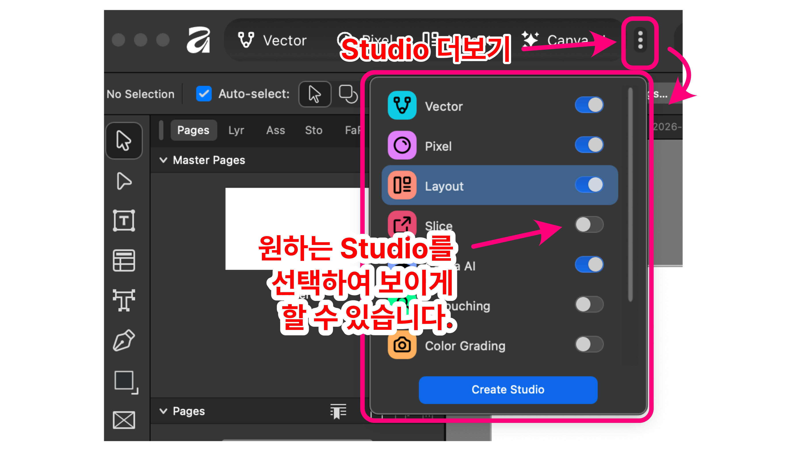
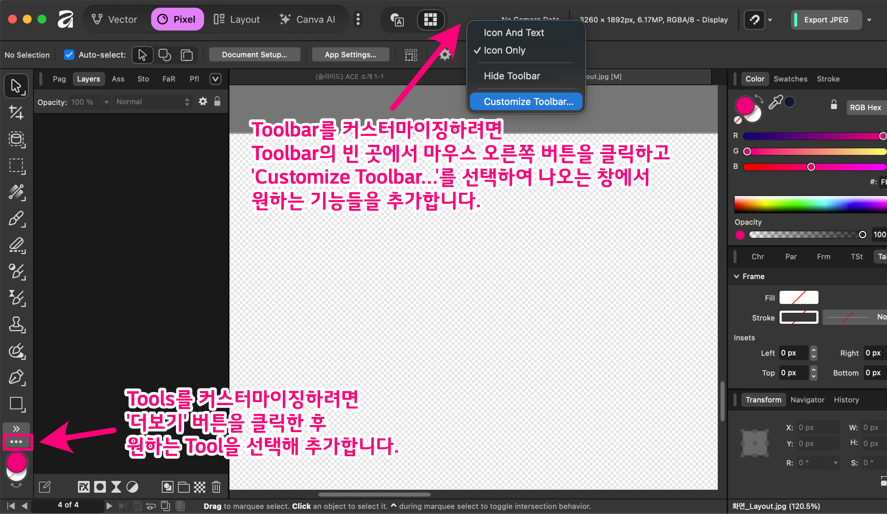

> 🧭 아래 캡쳐는 Affinity Studio v3의 기본 작업 화면입니다. 한 장의 화면 안에 **도구(툴)**, **캔버스**, **패널(Studio Panels)** 이 역할별로 배치되어 있어, 익숙해지면 작업 속도가 크게 빨라집니다.

## 04-1. Affinity Studio UI 한눈에 보기

Affinity Studio 화면은 크게 **왼쪽(도구, Tool)**, **가운데(작업 영역)**, **왼쪽과 오른쪽(패널, Panel)**, 그리고 **상단(컨텍스트/메뉴 영역)** 으로 나뉩니다. 처음에는 복잡해 보이지만, 각 영역이 담당하는 일이 분명해서 흐름만 잡으면 금방 적응할 수 있습니다.

- **왼쪽: Tools(도구 막대)**
  선택/이동, 브러시, 도형, 텍스트 같은 *실제 편집 행동*을 담당합니다. 자주 쓰는 도구는 여기에서 바로 꺼내 쓰고, 세부 옵션은 상황에 따라 상단 컨텍스트 바에서 조절하는 구조입니다.
- **가운데: Canvas(캔버스) + 문서 보기**
  편집 결과가 바로 보이는 핵심 공간입니다. 확대/축소, 화면 이동, 그리드/가이드 확인 같은 “보기 작업”이 이 영역을 중심으로 일어납니다.
- **왼쪽과 오른쪽: Studio Panels(패널 영역)**
  Layers, Color, Brushes, Effects 같은 패널이 모여 *설정과 관리*를 담당합니다. 작업 흐름에 따라 패널을 접거나(탭으로 묶기), 도킹해서 “내 레이아웃”으로 구성할 수 있습니다. 작업 공간이 부족하면 왼쪽이나 오른쪽 한 곳으로 패널을 몰아서 관리할 수도 있습니다.
- **상단: 메뉴/컨텍스트(상황별 옵션)**
  현재 선택한 도구나 오브젝트에 맞춰 옵션이 바뀌는 영역입니다. 예를 들어 텍스트 도구를 잡으면 폰트/자간 옵션이, 브러시를 잡으면 크기/경도 같은 옵션이 자연스럽게 나타납니다.

### 이 화면 구성이 좋은 이유 (초보자 관점)

- **도구는 왼쪽, 결과는 가운데, 관리는 오른쪽**이라 역할이 헷갈리지 않습니다.
- 패널을 *필요한 것만* 남겨두면, 화면이 훨씬 단순해집니다.
- 내가 자주 하는 작업에 맞춰 배치를 저장해두면, 그 자체가 “**나만의 작업 모드(Studio)**”가 됩니다.

---

## 04-2. ‘Studio’ 개념 이해하기

### 1) Affinity Studio v3에서 말하는 ‘Studio’란?

Affinity Studio v3에서 **Studio는 “특정 작업 목적(디자인/사진/출판/AI)에 맞게 미리 구성된 작업 공간(Workspace)”** 개념입니다.

이전 Affinity 제품군에서 **Persona(페르소나)** 라고 부르던 것을, v3 통합 앱에서는 **Studio(스튜디오)** 로 재정의한 형태입니다.

Studio를 바꾸면 주로 아래가 함께 바뀝니다.

- 상단/좌측의 **도구(툴) 구성**
- 우측/좌측에 배치된 **패널(Studio Panels) 구성**
- 작업 흐름에 맞춘 **기본 UI 레이아웃**

즉, “필요한 기능을 한 화면에 배치해 둔 **작업 모드 + 화면 구성 프리셋**”이라고 이해하면 정확합니다.

---

### 2) 기본 제공되는 주요 Studio 4가지

공식 도움말 기준으로 기본 Studio는 다음 4가지입니다.

1. **Vector Studio**: 벡터 그래픽/일러스트/로고 등 그래픽 디자인용
2. **Pixel Studio**: 사진 편집, 래스터 기반 페인팅/합성용
3. **Layout Studio**: 페이지 레이아웃, 출판, 문서 편집용
4. **Canva AI Studio**: AI/머신러닝 도구 모음(플랜/권한에 따라 잠금 해제 범위가 달라질 수 있음) - 유료 기능

---

### 3) 기본 4개 외에 “추가 Studio”를 보는 법 (Export / Retouching / Color Grading 등)

공식 도움말에 따르면, 기본 4개 외에도 **Exporting(내보내기), Retouching(리터칭), Color Grading(색보정)** 같은 “추가 Studio”를 **켜서(Enable)** 사용할 수 있습니다.

다만, 이 “추가 Studio”는 앱 버전/OS/빌드에 따라 메뉴 이름이 조금씩 다르게 보일 수 있어서, 아래처럼 **2단계로 찾는 방식**이 가장 확실합니다.

### A. Studio 전환 메뉴에서 찾기 (가장 먼저 확인)

- 상단의 **Studio 전환 영역(Studio Switcher / Studio 탭)** 을 열고,
- 목록에 **Export / Retouching / Color Grading** 같은 항목이 있는지 확인합니다.

만약 목록에 없다면, 보통은 “숨김/비활성화 상태”일 가능성이 큽니다.

### B. 환경설정(Preferences/Settings)에서 “추가 Studio 활성화” 옵션 찾기

- 앱 **Settings(환경설정)** 안에서 Studio 관련 옵션(예: Studio 표시, Studio 관리, 또는 기능/작업공간 관련 항목)을 찾아
- 추가 Studio를 **On(활성화)** 합니다.

내부 문서에도 환경설정에 “파일 형식에 따라 스튜디오 자동 전환” 같은 Studio 관련 옵션이 언급되어 있어, Studio 동작이 Settings에서 제어되는 흐름과 잘 맞습니다.

> 핵심은 “추가 Studio는 기본 탑재되어 있어도, *표시/사용이 켜져 있어야 목록에 나타날 수 있다*”는 점입니다.

---

### 4) ‘Studio’와 ‘Studio Panel(패널)’은 다릅니다 (헷갈리기 쉬운 포인트)

Affinity 계열에서는 예전부터 **Studio Panel**이라는 표현이 따로 있었습니다.

- **Studio(스튜디오)**: 작업공간 프리셋(모드/레이아웃 단위)
- **Studio Panels(스튜디오 패널)**: Color, Layers, Brushes 같은 **개별 패널 UI**(창/패널 단위)

즉, **Studio는 “패널 배치까지 포함한 세트”**, 패널은 “그 세트를 구성하는 부품”에 가깝습니다.

이 구분이 중요한 이유는, “나만의 Studio 만들기”는 결국 아래 작업을 의미하기 때문입니다.

- 패널(Studio Panels)을 내 작업 방식대로 배치/추가/삭제하고
- 그 레이아웃을 **프리셋으로 저장**
- 필요할 때 불러와서 **Studio처럼 사용**

---

### 5) 나만의 Studio(커스텀 Studio) 만들어 쓰는 방법 (실전 절차)

공식/내부 자료에서 공통으로 강조하는 방향은 **“완전 커스터마이징 가능한 워크스페이스”** 입니다.

아래 순서로 하면 시행착오가 적습니다.

### 1) 기준 Studio를 하나 고릅니다

예:

- 사진/합성 위주면 **Pixel Studio**
- 인쇄물/주보/책자 위주면 **Layout Studio**
- 로고/도형/아이콘 위주면 **Vector Studio**

커스텀은 “완전히 새로”라기보다, 보통 **기본 Studio를 출발점으로 튜닝**하는 게 안정적입니다.

### 2) 패널을 내 작업 흐름대로 재배치합니다

- 자주 쓰는 패널은 **도킹(dock)** 해서 고정
- 덜 쓰는 패널은 닫거나, 접어두거나, 다른 그룹에 탭으로 합칩니다
- 필요한 패널이 안 보이면 보통 **Window 메뉴에서 패널 표시/숨김**을 관리합니다

### 3) 툴바/도구 구성도 함께 정리합니다 (선택이지만 효과 큼)

내부 문서에 툴바 커스터마이징(자주 쓰는 버튼을 툴바에 넣는 방식)이 따로 정리되어 있는 것처럼,

Studio를 “진짜 내 것”으로 만들려면 **툴바까지 같이 정리**하는 편이 좋습니다.

### 4) 현재 레이아웃을 “프리셋/워크스페이스”로 저장합니다

공식 홈페이지도 “여러 세팅을 저장해 두고 클릭 한 번에 전환, 공유까지 가능”하다고 명시합니다.

저장 메뉴의 정확한 문구는 OS/버전에 따라 다를 수 있지만, 일반적으로는 다음 중 하나 흐름으로 존재합니다.

- **Window → Studio(또는 Workspace) → Save/Save Preset**
- **Settings/Preferences → Workspace/Studio → Save/Export**

저장 후에는 “커스텀 Studio 목록(또는 Workspace 목록)”에서 불러와 전환하게 됩니다.

### 5) (선택) 공유/백업

공식 안내대로라면 커스텀 세팅은 **공유하거나 다른 사람의 것을 다운로드해서 적용**할 수 있습니다.

따라서 중요한 커스텀 Studio는 파일로 **Export/백업**해두는 습관이 좋습니다.

---
